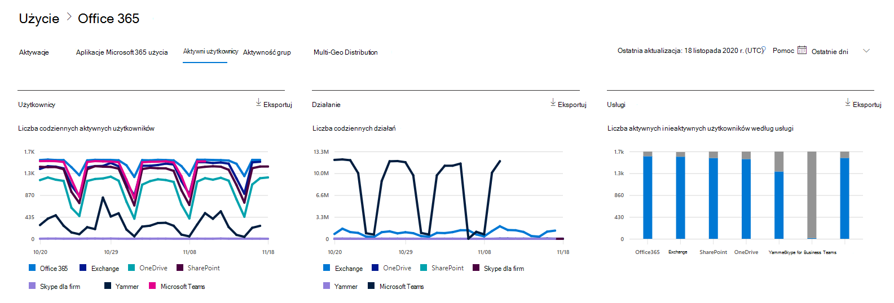

# Ocena raportu Microsoft 365 Aktywni użytkownicy

Na pulpicie nawigacyjnym raportów Microsoft 365 przedstawiono omówienie działań w produktach w organizacji. Przechodząc do poziomu raportów dotyczących poszczególnych produktów, możesz uzyskać bardziej szczegółowe informacje o aktywności w poszczególnych produktach. Zobacz [temat zawierający omówienie pulpitu nawigacyjnego Raporty](activity-reports.md).
  
Na przykład za pomocą raportu **Aktywni użytkownicy** można ustalić, ile licencji produktu jest używanych przez osoby w organizacji, oraz przechodzić do szczegółowych informacji o tym, którzy użytkownicy korzystają z jakich produktów. Ten raport może ułatwić administratorom zidentyfikowanie niewystarczająco wykorzystanych produktów lub użytkowników, którzy mogą wymagać dodatkowego szkolenia bądź dodatkowych informacji. 

## Wyświetlanie raportu Aktywni użytkownicy

1. W centrum administracyjnym przejdź do strony **Raporty** \> <a href="https://go.microsoft.com/fwlink/p/?linkid=2074756" target="_blank">Użycie</a>. 
2. Na stronie głównej pulpitu nawigacyjnego kliknij przycisk **Wyświetl więcej** na karcie Aktywni użytkownicy — Microsoft 365 Services.

## Interpretowanie raportu Aktywni użytkownicy

Możesz wyświetlić aktywnych użytkowników w raporcie Office 365, wybierając kartę **Aktywni użytkownicy**. 

- W raporcie Aktywni użytkownicy można przeglądać trendy z ostatnich 7, 30, 90 lub 180 dni. Jeśli jednak wyświetlisz określony dzień w raporcie, w tabeli będą wyświetlane dane przez maksymalnie 28 dni od bieżącej daty (a nie daty wygenerowania raportu).

- Dane w każdym raporcie zwykle obejmują do ostatnich 24 do 48 godzin.

- Wykres Użytkownicy przedstawia codziennie aktywnych użytkowników w okresie raportowania oddzielonym produktem.
Na wykresie Działania przedstawiono dzienną liczbę aktywności w okresie raportowania oddzielonym produktem.
Na wykresie Usługi jest wyświetlana liczba użytkowników według typu aktywności i usługi.

- Na wykresie Użytkownicy oś x pokazuje wybrany okres raportowania, a oś y wyświetla codziennie aktywnych użytkowników rozdzielonych i zakodowanych kolorami według typu licencji.
Na wykresie Aktywność oś x pokazuje wybrany okres raportowania, a oś y wyświetla dzienną liczbę działań rozdzieloną i kolor zakodowany według typu licencji.
Na wykresie aktywności Usługi oś X reprezentuje poszczególne usługi udostępnione dla użytkowników w podanym okresie, a oś Y odzwierciedla liczbę użytkowników według stanu aktywności oznaczonych różnymi kolorami.

- Możesz filtrować serie widoczne na wykresie, wybierając element w legendzie. Zmiana ta nie ma wpływu na informacje w siatce tabeli.

- Możesz również wyeksportować dane raportu do pliku Excel .csv, wybierając link Eksportuj. Powoduje to wyeksportowanie danych wszystkich użytkowników oraz umożliwia wykonywanie prostego sortowania i filtrowania w celu dalszej analizy. Jeśli masz mniej niż 2000 użytkowników, możesz sortować i filtrować dane wewnątrz tabeli raportu. Jeśli masz więcej niż 2000 użytkowników, w celu filtrowania i sortowania należy wyeksportować dane.

- Za pomocą kontrolek kolumn można zmieniać informacje wyświetlane w siatce tabeli.
Jeśli Twoja subskrypcja jest obsługiwana przez firmę 21Vianet, nie zobaczysz Yammer.

Jeśli zasady organizacji nie pozwalają na wyświetlanie raportów zawierających identyfikowalne dane użytkowników, możesz zmienić ustawienie prywatności dla wszystkich tych raportów. Zapoznaj się z **sekcją Jak mogę ukrywania szczegółów na poziomie użytkownika?** w obszarze [Raporty aktywności w Centrum administracyjne platformy Microsoft 365](activity-reports.md).  
