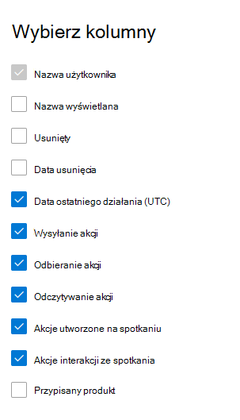

# Microsoft 365 w centrum administracyjnym — Aktywność poczty e-mail

Pulpit Microsoft 365 pulpitu nawigacyjnego Raporty zawiera informacje o aktywności dotyczącej wszystkich produktów w organizacji. Przechodząc do poziomu raportów dotyczących poszczególnych produktów, możesz uzyskać bardziej szczegółowe informacje o aktywności w poszczególnych produktach. Zobacz [temat zawierający omówienie pulpitu nawigacyjnego Raporty](activity-reports.md).
  
Na przykład możesz uzyskać ogólne informacje dotyczące ruchu związanego z pocztą e-mail w organizacji, korzystając ze strony Raporty, a następnie przejść do szczegółów w widżecie Aktywność poczty e-mail, aby zrozumieć trendy i aktywność poszczególnych użytkowników związaną z pocztą e-mail w organizacji.

## Jak przejść do raportu dotyczącego aktywności poczty e-mail

1. W centrum administracyjnym przejdź do strony **Raporty** \> <a href="https://go.microsoft.com/fwlink/p/?linkid=2074756" target="_blank">Użycie</a>.
2. Wybierz pozycję **Wyświetl więcej w** obszarze **Aktywność poczty e-mail**. 
3. Z listy **rozwijanej** Aktywność poczty e-mail wybierz pozycję aktywność **Exchange** \> **e-mail**.
  
## Interpretacja raportu dotyczącego aktywności poczty e-mail

Wykresy **Aktywność** i **Użytkownicy** umożliwiają zapoznanie się z aktywnością użytkowników związaną z pocztą e-mail. 
  

  
|Element|Opis|
|:-----|:-----|
|1.    |W raporcie **Aktywność poczty e-mail** można przeglądać trendy z ostatnich 7, 30, 90 lub 180 dni. Jeśli jednak wybierzesz określony dzień w raporcie, tabela będzie zawierała dane dla do 28 dni od bieżącej daty (nie daty wygenerowania raportu).    |
|2.    |Dane w poszczególnych raportach zazwyczaj obejmują od 24 do 48 godzin.    |
|3.    |Wykres **Aktywność** umożliwia zrozumienie trendu intensywności aktywności poczty e-mail w organizacji. Można zrozumieć podział na działania w zakresie wysyłania, czytania, odsyłania, odsyłania, tworzenia spotkań i interakcji na spotkaniach.    |
|4.    |Wykres **Użytkownicy** umożliwia zrozumienie trendu liczby unikatowych użytkowników generujących aktywność poczty e-mail. Można podejrzeć trend użytkowników wysyłających i odczytujących wiadomości e-mail, odbierających wiadomości e-mail, tworzących spotkania lub interacyjnie korzystających ze spotkań.    |
|5.    | Oś Y  na wykresie Aktywność przedstawia liczbę wysłanych, odebranych, odebranych wiadomości e-mail, odczytanych wiadomości e-mail, utworzonych spotkań i interakcji podczas spotkania.     Oś Y  na wykresie aktywności Użytkownicy przedstawia aktywność użytkowników w zakresie typu wysłanych, odebranych, odczytanych wiadomości e-mail, utworzonych spotkań lub interakcji na spotkaniu.     Oś X na obu wykresach przedstawia wybrany w raporcie przedział czasu.    |
|6.    |Serie, które są na wykresie, można filtrować, zaznaczając je w legendzie.    |
|7.    | W tabeli przedstawiono zestawienie aktywności poczty e-mail na poziomie poszczególnych użytkowników. Jest to lista wszystkich użytkowników, do których przypisano produkt Exchange, i wykonywanych przez nich operacji związanych z pocztą e-mail.     **Nazwa użytkownika** to adres e-mail użytkownika.    **Nazwa wyświetlana** to pełna nazwa, jeśli użytkownik.    Stan **Usunięte** oznacza użytkownika, który został usunięty, ale był aktywny przez pewną część okresu raportowania dla tego raportu.    **Data usunięcia** to data usunięcia użytkownika.    **Data ostatniego działania** to data ostatniego odczytania lub wysłania wiadomości e-mail przez użytkownika.    **Akcje wysłania** to liczba zarejestrowanych akcji wysyłania wiadomości e-mail przez użytkownika.    **Akcje odebrania** to liczba zarejestrowanych akcji odbierania wiadomości e-mail przez użytkownika.    **Akcje przeczytania** to liczba zarejestrowanych akcji czytania wiadomości e-mail przez użytkownika.    **Akcje utworzone na spotkaniu** to liczba zarejestrowanych akcji wysyłania żądań spotkania przez użytkownika.    **Akcje interakcji ze spotkania** to liczba zarejestrowanych akcji zaakceptowania, wstępnie zaakceptowania, odrzucenia lub anulowania spotkania przez użytkownika.    **Przypisany produkt** to produkty przypisane do tego użytkownika.     Jeśli zasady organizacji nie pozwalają na wyświetlanie raportów zawierających identyfikowalne dane użytkowników, możesz zmienić ustawienie prywatności dla wszystkich tych raportów. Zobacz sekcję **Ukrywanie szczegółów na poziomie użytkownika w** sekcji [Raporty aktywności w centrum administracyjne platformy Microsoft 365](activity-reports.md).    |
|8.    |Wybierz **pozycję Wybierz kolumny** , aby dodać lub usunąć kolumny z raportu.    |
|9.    |Dane raportu można również wyeksportować do pliku Excel .csv, wybierając link **Eksportuj**. Powoduje to wyeksportowanie danych wszystkich użytkowników oraz umożliwia wykonywanie prostego sortowania i filtrowania w celu dalszej analizy. Jeśli masz mniej niż 2000 użytkowników, możesz sortować i filtrować dane wewnątrz tabeli raportu. Jeśli masz więcej niż 2000 użytkowników, w celu filtrowania i sortowania należy wyeksportować dane.    |
|||
   
> [!NOTE]
> Raport Aktywność poczty e-mail jest dostępny tylko dla skrzynek pocztowych skojarzonych z użytkownikami, którzy mają licencje.
