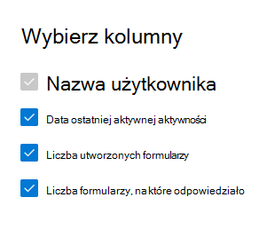

# Microsoft 365 raportów w centrum administracyjnym — działanie formularzy

Na pulpicie nawigacyjnym raportów Microsoft 365 przedstawiono omówienie działań w produktach w organizacji. Przechodząc do poziomu raportów dotyczących poszczególnych produktów, możesz uzyskać bardziej szczegółowe informacje o aktywności w poszczególnych produktach. Zobacz [temat zawierający omówienie pulpitu nawigacyjnego Raporty](activity-reports.md).
  
Na przykład możesz zrozumieć działanie każdego użytkownika licencjonowanego do używania Microsoft Forms, przyglądając się jego interakcji z formularzami. Pomaga to również zrozumieć poziom współpracy, sprawdzając liczbę utworzonych formularzy i formularzy, na które użytkownik odpowiedział.
  
## Jak przejść do raportu aktywności Formularze

1. W centrum administracyjnym przejdź do strony **Raporty** \> <a href="https://go.microsoft.com/fwlink/p/?linkid=2074756" target="_blank">Użycie</a>. 
2. Na stronie głównej pulpitu nawigacyjnego kliknij przycisk **Wyświetl więcej** na karcie Formularze.
  
## Interpretowanie raportu aktywności Formularze

Możesz wyświetlić działania w raporcie Formularze, wybierając kartę **Działanie** . 

Wybierz pozycję **Wybierz kolumny** , aby dodać lub usunąć kolumny z raportu.    

Możesz również wyeksportować dane raportu do pliku Excel .csv, wybierając link **Eksportuj**. Powoduje to wyeksportowanie danych wszystkich użytkowników oraz umożliwia wykonywanie prostego sortowania i filtrowania w celu dalszej analizy. Jeśli masz mniej niż 2000 użytkowników, możesz sortować i filtrować dane wewnątrz tabeli raportu. Jeśli masz więcej niż 2000 użytkowników, w celu filtrowania i sortowania należy wyeksportować dane. 

Raport **aktywności Formularze** można wyświetlić dla trendów z ostatnich 7 dni, 30 dni, 90 dni lub 180 dni. Jeśli jednak wybierzesz konkretny dzień w raporcie, w tabeli będą wyświetlane dane przez maksymalnie 28 dni od bieżącej daty (a nie daty wygenerowania raportu).
  
|Element|Opis|
|:-----|:-----|
|**Metrycznych**|**Definicja**|
|Nazwa użytkownika    |Adres e-mail użytkownika, który wykonał działanie na Microsoft Forms.    |
|Data ostatniego działania (UTC)    |Ostatnia data wykonania działania formularza przez użytkownika dla wybranego zakresu dat. Aby zobaczyć działanie, które wystąpiło w konkretnym dniu, wybierz datę bezpośrednio na wykresie.  Spowoduje to przefiltrowanie tabeli w celu wyświetlenia danych aktywności pliku tylko dla użytkowników, którzy wykonali działanie w danym dniu.    |
|Liczba utworzonych formularzy    |Liczba formularzy utworzonych przez użytkownika.     |
|Liczba formularzy, na które udzielono odpowiedzi    |Liczba formularzy, na które użytkownik przesłał odpowiedzi.|
|||
