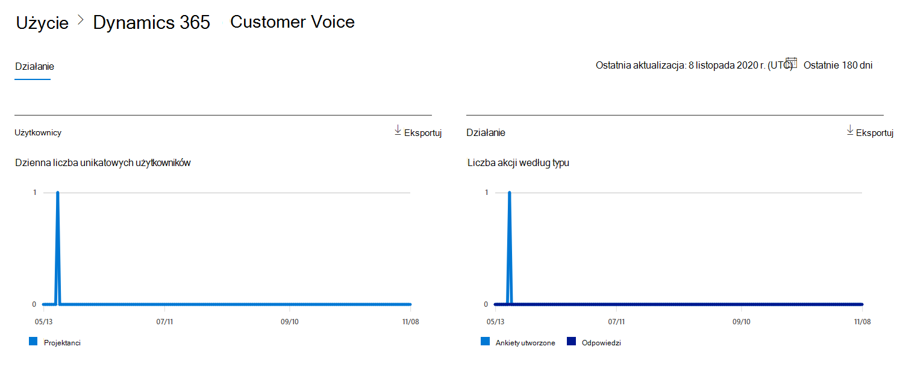
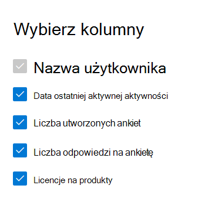

# Microsoft 365 raporty w centrum administracyjnym — Aktywność komunikacji głosowej klienta usługi Dynamics 365

Pulpit Microsoft 365 pulpitu nawigacyjnego Raporty zawiera informacje o aktywności dotyczącej wszystkich produktów w organizacji. Przechodząc do poziomu raportów dotyczących poszczególnych produktów, możesz uzyskać bardziej szczegółowe informacje o aktywności w poszczególnych produktach. Zobacz [temat zawierający omówienie pulpitu nawigacyjnego Raporty](activity-reports.md).
  
Możesz na przykład zrozumieć działanie każdego użytkownika z licencją na korzystanie z funkcji Customer Voice usługi Microsoft Dynamics 365, patrząc na interakcje z obsługą funkcji Customer Voice usługi Dynamics 365. Ułatwia to również zrozumienie poziomu współpracy dzięki liczbie utworzonych ankiet Pro ankiet i ankiet Pro, na które użytkownicy odpowiedzieli. 
  
## Jak uzyskać dostęp do raportu aktywności klientów usługi Dynamics 365 Customer Voice

1. W centrum administracyjnym przejdź do strony **Raporty** \> <a href="https://go.microsoft.com/fwlink/p/?linkid=2074756" target="_blank">Użycie</a>. 
2. Na stronie głównej pulpitu nawigacyjnego kliknij przycisk **Wyświetl więcej** na karcie Dynamics 365 Customer Voice.
  
## Interpretowanie raportu aktywności klienta usługi Dynamics 365 Customer Voice

Możesz wyświetlić działania w raporcie Customer Voice usługi Dynamics 365, wybierając **kartę** Działanie. 

Wybierz **pozycję Wybierz kolumny** , aby dodać lub usunąć kolumny z raportu.    

Dane raportu można również wyeksportować do pliku Excel .csv, wybierając link **Eksportuj**. Powoduje to wyeksportowanie danych wszystkich użytkowników oraz umożliwia wykonywanie prostego sortowania i filtrowania w celu dalszej analizy. Jeśli masz mniej niż 2000 użytkowników, możesz sortować i filtrować dane wewnątrz tabeli raportu. Jeśli masz więcej niż 2000 użytkowników, w celu filtrowania i sortowania należy wyeksportować dane. 

W **raporcie Aktywność klienta usługi Dynamics 365 można** przeglądać trendy z ostatnich 7, 30, 90 lub 180 dni. Jeśli jednak wybierzesz określony dzień w raporcie, tabela będzie zawierała dane dla do 28 dni od bieżącej daty (nie daty wygenerowania raportu).
  
|Element|Opis|
|:-----|:-----|
|**Metryczny**|**Definicja**|
|Nazwa użytkownika    |Adres e-mail użytkownika, który wykonał działanie w aplikacji Microsoft Forms.    |
|Data ostatniego działania (UTC)    |Najpóźniejsza data działania formularza wykonanego przez użytkownika w wybranym zakresie dat. Aby zobaczyć działanie, które wystąpiło w konkretnym dniu, wybierz datę bezpośrednio na wykresie. Spowoduje to filtrowanie tabeli w celu wyświetlenia danych dotyczących aktywności tylko tych użytkowników, którzy wykonywali działania w danym dniu.    |
|Liczba utworzonych ankiet    |Liczba ankiet utworzonych przez użytkownika.     |
|Liczba odpowiedzi na ankietę    |Liczba odpowiedzi od osób, którym ankieta została rozpowszechniona.|
|||