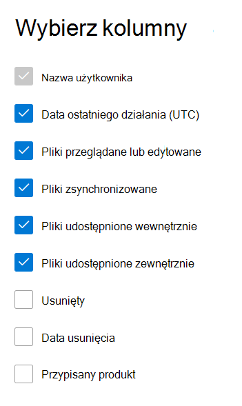

# Microsoft 365 Raporty w centrum administracyjnym — działanie OneDrive dla Firm

Na pulpicie nawigacyjnym raportów Microsoft 365 przedstawiono omówienie działań w produktach w organizacji. Przechodząc do poziomu raportów dotyczących poszczególnych produktów, możesz uzyskać bardziej szczegółowe informacje o aktywności w poszczególnych produktach. Zobacz [temat zawierający omówienie pulpitu nawigacyjnego Raporty](activity-reports.md).
  
Możesz na przykład zrozumieć działania wszystkich użytkowników z licencjami na używanie usługi OneDrive przez wyświetlanie ich interakcji z plikami w usłudze OneDrive. Ułatwia to także zrozumienie poziomu współpracy dzięki wyświetlaniu liczby udostępnionych plików.

## Jak przejść do raportu aktywności usługi OneDrive?

1. W centrum administracyjnym przejdź do strony **Raporty** \> <a href="https://go.microsoft.com/fwlink/p/?linkid=2074756" target="_blank">Użycie</a>. 
2. Na stronie głównej pulpitu nawigacyjnego kliknij przycisk **Wyświetl więcej** na karcie OneDrive.
  
## Interpretowanie raportu aktywności usługi OneDrive dla Firm

Możesz wyświetlić działania w raporcie OneDrive, wybierając kartę **Działanie**. 

Wybierz pozycję **Wybierz kolumny** , aby dodać lub usunąć kolumny z raportu.    

Możesz również wyeksportować dane raportu do pliku Excel .csv, wybierając link **Eksportuj**. Powoduje to wyeksportowanie danych wszystkich użytkowników oraz umożliwia wykonywanie prostego sortowania i filtrowania w celu dalszej analizy. Jeśli masz mniej niż 2000 użytkowników, możesz sortować i filtrować dane wewnątrz tabeli raportu. Jeśli masz więcej niż 2000 użytkowników, w celu filtrowania i sortowania należy wyeksportować dane.

W raporcie **Aktywność usługi OneDrive dla Firm** można przeglądać trendy z ostatnich 7, 30, 90 lub 180 dni. Jeśli jednak wybierzesz konkretny dzień w raporcie, w tabeli będą wyświetlane dane przez maksymalnie 28 dni od bieżącej daty (a nie daty wygenerowania raportu).
  
|Element|Opis|
|:-----|:-----|
|**Metrycznych**|**Definicja**|
|Nazwa użytkownika    |Nazwa użytkownika właściciela konta OneDrive.    |
|Data ostatniego działania (UTC)    |Ostatnia data wykonania działania pliku na koncie OneDrive dla wybranego zakresu dat. . Aby zobaczyć działanie, które wystąpiło w konkretnym dniu, wybierz datę bezpośrednio na wykresie.    |
|Pliki wyświetlane lub edytowane    |Liczba plików przekazanych, pobranych, zmodyfikowanych lub wyświetlonych przez użytkownika.     |
|Zsynchronizowane pliki    |Liczba plików, które zostały zsynchronizowane z urządzenia lokalnego użytkownika z kontem OneDrive.   |
|Pliki udostępnione wewnętrznie    | Liczba plików, które zostały udostępnione użytkownikom w organizacji lub użytkownikom w grupach (które mogą obejmować użytkowników zewnętrznych).    |
|Pliki udostępnione zewnętrznie    |Liczba plików, które zostały udostępnione użytkownikom spoza organizacji.  |
|Deleted    | Oznacza to, że licencja użytkownika została usunięta.    UWAGA: Działanie dla usuniętego użytkownika będzie nadal wyświetlane w raporcie, o ile w wybranym okresie licencja została licencjonowana. Kolumna **Usunięte** pozwala łatwo zauważyć użytkowników, którzy od dłuższego czasu nie byli aktywni, ale jednak ich dane zostały uwzględnione w raporcie.    |
|Data usunięcia    |Data usunięcia licencji użytkownika.  |
|Przypisany produkt    |Microsoft 365 produkty, które są licencjonowane dla użytkownika.|
|||