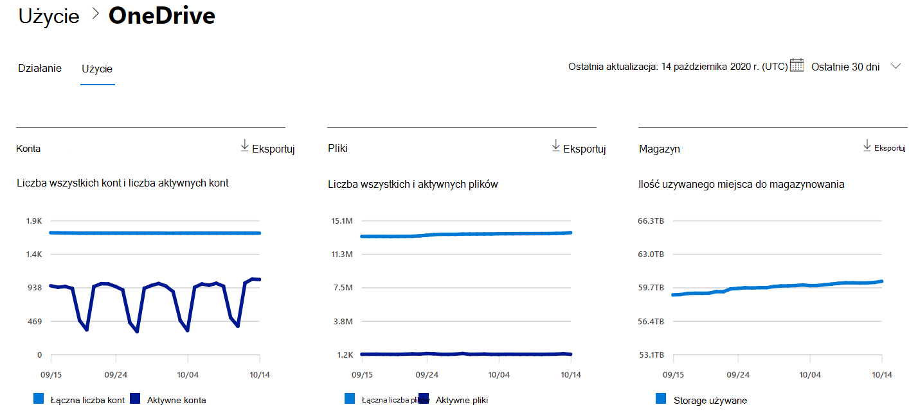

# Microsoft 365 raporty w centrum administracyjnym — informacje OneDrive dla Firm użycia

Pulpit Microsoft 365 pulpitu nawigacyjnego Raporty zawiera informacje o aktywności dotyczącej wszystkich produktów w organizacji. Przechodząc do poziomu raportów dotyczących poszczególnych produktów, możesz uzyskać bardziej szczegółowe informacje o aktywności w poszczególnych produktach. Zobacz [temat zawierający omówienie pulpitu nawigacyjnego Raporty](activity-reports.md).
  
Na przykład karta OneDrive na pulpicie nawigacyjnym zapewnia ogólny widok wartości uzyskiwanych z usługi OneDrive dla Firm dotyczących łącznej liczby plików i ilości przestrzeni dyskowej używanych w organizacji. Następnie można przejść do szczegółów, aby zrozumieć trendy dotyczące aktywnych kont usługi OneDrive, liczby plików, z którymi pracują użytkownicy oraz użytej przestrzeni dyskowej. Ten widok zawiera również szczegółowe informacje o koncie usługi OneDrive każdego użytkownika.

## Jak uzyskać dostęp do raportu OneDrive użycia?

1. W centrum administracyjnym przejdź do strony **Raporty** \> <a href="https://go.microsoft.com/fwlink/p/?linkid=2074756" target="_blank">Użycie</a>. 
2. Na stronie głównej pulpitu nawigacyjnego kliknij przycisk **Wyświetl więcej** na karcie OneDrive głównej.
  
## Interpretowanie raportu użycia usługi OneDrive

Użycie możesz wyświetlić w raporcie OneDrive, wybierając **kartę** Użycie. 

Wybierz **pozycję Wybierz kolumny** , aby dodać lub usunąć kolumny z raportu.    

Dane raportu można również wyeksportować do pliku Excel .csv, wybierając link **Eksportuj**. Powoduje to wyeksportowanie danych wszystkich użytkowników oraz umożliwia wykonywanie prostego sortowania i filtrowania w celu dalszej analizy. Jeśli masz mniej niż 2000 użytkowników, możesz sortować i filtrować dane wewnątrz tabeli raportu. Jeśli masz więcej niż 2000 użytkowników, w celu filtrowania i sortowania należy wyeksportować dane. 

W **OneDrive dla Firm użycia** można przeglądać trendy z ostatnich 7, 30, 90 lub 180 dni. Jeśli jednak wybierzesz określony dzień w raporcie, tabela będzie zawierała dane dla do 28 dni od bieżącej daty (nie daty wygenerowania raportu).
  
|Element|Opis|
|:-----|:-----|
|**Metryczny**|**Definicja**|
|ADRES URL    |Adres internetowy strony OneDrive.   |
|Deleted    |Stan usunięcia OneDrive. Oznaczanie kont jako usunięte trwa co najmniej 7 dni.    |
|Właściciel    |Nazwa użytkownika administratora podstawowego OneDrive.     |
|Główna nazwa właściciela    |Adres e-mail właściciela OneDrive.   |
|Data ostatniego działania (UTC)    | Najpóźniejsza data aktywności dotyczącej plików w OneDrive. Jeśli w usłudze OneDrive nie było aktywności dotyczących plików, pole wartości będzie puste.    |
|Pliki    |Liczba plików w OneDrive.  |
|Aktywne pliki    | Liczba aktywnych plików w tym okresie.  UWAGA: Jeśli pliki zostały usunięte w przedziale czasu określonym dla raportu, liczba aktywnych plików wyświetlana w raporcie może być większa niż bieżąca liczba plików w OneDrive. >  Usunięci użytkownicy będą pokazywani w raportach przez 180 dni.    |
|Storage (MB)    |Ilość miejsca do magazynowania używanego OneDrive MB. |
|||
   
> [!NOTE]
> Raport obejmuje tylko użytkowników, którzy mają ważne OneDrive dla Firm licencji.
