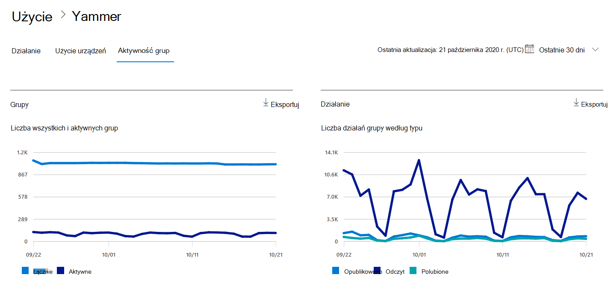
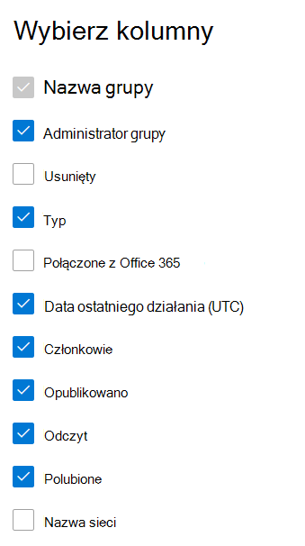

# Microsoft 365 raporty w centrum administracyjnym — raport Yammer aktywności grup

Pulpit Microsoft 365 pulpitu nawigacyjnego Raporty zawiera informacje o aktywności dotyczącej wszystkich produktów w organizacji. Przechodząc do poziomu raportów dotyczących poszczególnych produktów, możesz uzyskać bardziej szczegółowe informacje o aktywności w poszczególnych produktach. Zobacz [temat zawierający omówienie pulpitu nawigacyjnego Raporty](activity-reports.md). Raport aktywności grup usługi Yammer pozwala analizować aktywność grup usługi Yammer w organizacji oraz uzyskać informacje na temat liczby tworzonych i używanych grup.
 
## Jak uzyskać dostęp do raportu aktywności Yammer grup?

1. W centrum administracyjnym przejdź do strony **Raporty** \> <a href="https://go.microsoft.com/fwlink/p/?linkid=2074756" target="_blank">Użycie</a>. 
2. Na stronie głównej pulpitu nawigacyjnego kliknij przycisk **Wyświetl więcej** na karcie Yammer głównej.
  
## Interpretowanie raportu aktywności grup usługi Yammer

Działania grup można wyświetlać w raporcie Yammer, wybierając **kartę Aktywność** grup. 

Wybierz **pozycję Wybierz kolumny** , aby dodać lub usunąć kolumny z raportu.    

Dane raportu można również wyeksportować do pliku Excel .csv, wybierając link **Eksportuj**. Powoduje to wyeksportowanie danych wszystkich użytkowników oraz umożliwia wykonywanie prostego sortowania i filtrowania w celu dalszej analizy. Jeśli masz mniej niż 2000 użytkowników, możesz sortować i filtrować dane wewnątrz tabeli raportu. Jeśli masz więcej niż 2000 użytkowników, w celu filtrowania i sortowania należy wyeksportować dane. 

W raporcie **Aktywność grup w usłudze Yammer** można przeglądać trendy z ostatnich 7, 30, 90 lub 180 dni. Jeśli jednak wybierzesz określony dzień w raporcie, tabela będzie zawierała dane dla do 28 dni od bieżącej daty (nie daty wygenerowania raportu).
  
|Element|Opis|
|:-----|:-----|
|**Metryczny**|**Definicja**|
|Nazwa grupy    |Nazwa grupy.   |
|Administrator grupy    |Nazwa administratora lub właściciela grupy.    |
|Deleted    |Liczba usuniętych Yammer grupy. Jeśli grupa została usunięta, ale w okresie raportowania nastąpiła w niej aktywność, grupa ta pojawi się na siatce z flagą ustawioną na wartość Prawda.    |
|Wpisać    |Typ grupy: publiczna lub prywatna.   |
|Połączone z Office 365    |Wskazuje, czy Yammer jest także grupą Microsoft 365 grupy.   |
|Data ostatniego działania (UTC)    | Najpóźniejsza data przeczytania, publikacji lub polubiono wiadomość przez grupę.    |
|Członkowie    | Liczba członków grupy.    |
|Opublikowano    |Liczba wiadomości opublikowanych w grupie Yammer okresie raportowania.  |
|Czytanie    |Liczba konwersacji przeczytanych w grupie Yammer okresie raportowania.    |
|Polubione    |Liczba wiadomości polubiona w grupie Yammer okresie raportowania.  |
|Nazwa sieci    |Pełna nazwa sieci, do której należy grupa. |
|||