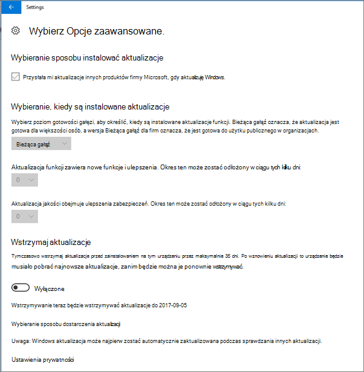

# Sprawdzanie poprawności ustawień ochrony urządzeń dla Windows 10 PC

## Sprawdzanie, Windows 10 urządzenia są ustawione

Po [skonfigurowaniu zasad urządzeń](protection-settings-for-windows-10-pcs.md) może upłynieć kilka godzin, aż te zasady zajdą w życie na urządzeniach użytkowników. Aby potwierdzić, że zasady te obowiązywały, możesz Windows Ustawienia ekranów na urządzeniach użytkowników. Ponieważ użytkownicy nie będą mogli modyfikować ustawień aktualizacji Windows i Program antywirusowy Windows Defender na swoich urządzeniach Windows 10, wiele opcji zostanie wyszarowanych.
  
1. Przejdź do **Ustawienia** \> **Opcje &amp; ponownego** \> **uruchamiania Windows** \> aktualizacji i upewnij się, że wszystkie ustawienia są wyszarowane. 
    
    
  
2. Przejdź do **Ustawienia** \> **Opcje &amp;** **aktualizacji Windows** \> \> Zaawansowane i upewnij się, że wszystkie ustawienia są wyszarowane. 
    
    
  
3. Przejdź do **Ustawienia** \> **Opcje &amp;** **zaawansowane aktualizacji Windows** \> \> Opcje **aktualizacji** \> Wybierz **sposób dostarczenia aktualizacji**.
    
    Upewnij się, że widzisz komunikat (kolor czerwony), że niektóre ustawienia są ukryte lub zarządzane przez Twoją organizację, a wszystkie opcje są wyszarowane.
    
    
  
4. Aby otworzyć Centrum zabezpieczeń Windows Defender, przejdź do Ustawienia aktualizacji zabezpieczeń i  \> **&amp;** \> **Windows Defender** \> pozycję Otwórz Windows Defender **Ochronę** \> **&amp;** \> **&amp; wątku wirusów ustawieniami ochrony przed zagrożeniami antywirusowymi**. 
    
5. Sprawdź, czy wszystkie opcje są wyszarowane. 
    
    
  
## Zawartość pokrewna

[Microsoft 365 i zasoby dla firm](/admin)\
[Konfigurowanie komputerów PC z systemem Windows 10](protection-settings-for-windows-10-pcs.md)
