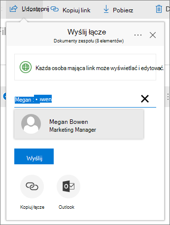
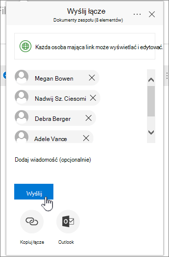

# Konfigurowanie przechowywania i udostępniania plików w aplikacji Microsoft 365

Jednym z najlepszych sposobów na skonfigurowanie przechowywania i udostępniania plików dla firmy jest wspólne OneDrive witryny zespołu. To rozwiązanie jest idealne w przypadku małej firmy zatrudniającej kilku pracowników.

## Obejrzyj: Gdzie można przechowywać pliki w Office 365

> [!VIDEO https://www.microsoft.com/videoplayer/embed/RE1FTHX] 

Jeśli ten klip wideo okazał się przydatny, poznaj [kompletną serię szkoleń dla małych firm i nowych użytkowników usługi Microsoft 365](../../business-video/index.yml).

## Microsoft 365 przechowywania i zarządzania dokumentami

- OneDrive jest przeznaczona do użytku indywidualnego i do okazjonalnych udostępniania plików.

- Witryna zespołu jest przeznaczona do regularnego udostępniania plików i wspólnej pracy nad plikami. Witryna zespołu idealnie nadaje się do przechowywania plików, które są wspólną własnością kilku osób i nad którymi może współpracować. Utwórz zespół Microsoft, aby dodać witrynę zespołu. [Aby dowiedzieć się więcej, zobacz Tworzenie zespołu w aplikacji Teams](https://support.microsoft.com/office/174adf5f-846b-4780-b765-de1a0a737e2b).

Zarówno OneDrive jak i witryny  zespołu zapewniają Ci dostęp z dowolnego miejsca dla Ciebie i Twoich pracowników.
  

  
Poniżej znajdują się zalecenia dotyczące tego, co należy przechowywać w poszczególnych lokalizacjach podczas OneDrive witryn  zespołowych: 

  
|Lokalizacja przechowywania|Do czego to jest|Pliki, które należy przechowywać w tym miejscu|
|:-----|:-----|:-----|
|**OneDrive** |Przechowywanie zawartości w OneDrive przypomina przechowywanie plików na komputerze; inne osoby nie mogą łatwo uzyskać do nich dostępu.  Aby uzyskać więcej informacji, [zobacz Co to jest OneDrive dla Firm?](https://support.microsoft.com/office/187f90af-056f-47c0-9656-cc0ddca7fdc2)   |Pliki firmowe, nad którymi pozostali członkowie zespołu nie muszą współpracować lub do których nie muszą mieć regularnie dostępu.  |
|**SharePoint witryn zespołu**   |Współpraca. Podczas tworzenia grupy Microsoft 365 (na przykład w centrum administracyjne platformy Microsoft 365, w programie Outlook lub przez utworzenie zespołu w programie Microsoft Teams) dla tej grupy jest tworzona witryna SharePoint zespołu. Podobnie po utworzeniu nowej witryny zespołu SharePoint na stronie głównej programu SharePoint lub w nowym centrum administracyjnym programu SharePoint zostanie również Microsoft 365 grupa użytkowników. Aby uzyskać więcej informacji, zobacz [Co to jest witryna SharePoint zespołu?](https://support.microsoft.com/office/75545757-36c3-46a7-beed-0aaa74f0401e) [i Tworzenie witryny](https://support.microsoft.com/office/ef10c1e7-15f3-42a3-98aa-b5972711777d) zespołu w SharePoint Online.    |Pliki, które mają własność udostępnioną. Zalecamy osobne witryny zespołu dla każdej jednostki pracy w organizacji. Aby na przykład chronić prywatne dokumenty pracowników i dokumenty finansowe dla małego zespołu, utwórz osobną witrynę zespołu.    |

> [!NOTE]
> SharePoint także inne typy witryn, których możesz używać w swojej firmie. Za pomocą witryn [do komunikacji w](https://support.microsoft.com/office/7fb44b20-a72f-4d2c-9173-fc8f59ba50eb) intranecie można publikować informacje dla szerokiego grona odbiorców. Możesz też łączyć witryny [w intranecie](https://support.microsoft.com/office/fe26ae84-14b7-45b6-a6d1-948b3966427f) za pomocą witryn centrum.
  
## Rozpoczynanie korzystania OneDrive z witryną zespołu

### Członkowie zespołu mogą przechowywać swoje własne pliki w OneDrive

Każda osoba w firmie, która ma przypisaną licencję usługi Microsoft 365 (i SharePoint online), otrzymuje dostęp do OneDrive w chmurze. Mogą tam przechowywać pliki związane z firmą, aby uzyskać do nich dostęp z dowolnego urządzenia i są dostępne tylko dla tego użytkownika. Na przykład mogą przechowywać w nim wersje robocze ofert, notatki ze spotkań lub skrypty pokazów, które zamierzają przeprowadzić.
  
Pracownicy mogą także OneDrive pliki i foldery. Jeśli pracownik jest z dala od firmy lub odchodzi z firmy, inne osoby mogą uzyskać dostęp do udostępnionych plików przechowywanych w OneDrive (OneDrive udostępniania folderu zespołu).
  
Poniżej opisano, jak każda osoba w Twoim zespole może skonfigurować OneDrive udostępniać pliki.

1. Przejdź do <a href="https://admin.microsoft.com/ " target="_blank">centrum administracyjne platformy Microsoft 365</a> i zaloguj się przy użyciu swojej nazwy użytkownika i hasła.

2. W ikony Uruchamianie aplikacji wybierz pozycję **OneDrive**.

3. W OneDrive zespołu mogą przechowywać własne pliki firmowe. Możesz udostępnić pojedyncze pliki lub cały folder. Wybierz plik lub folder, kliknij prawym przyciskiem myszy, a następnie wybierz polecenie **Udostępnij**.

    
  
4. Na stronie **Wysyłanie linku** pozostaw domyślną opcję Każda osoba z **linkiem może wyświetlać i edytować**.

    Wpisz nazwy lub adresy e-mail członków zespołu, którzy mają mieć dostęp do folderu, i dodaj opcjonalną wiadomość.

    Jeśli chcesz mieć własną kopię wysyłanych wiadomości e-mail, dodaj do listy swój adres e-mail.

    
  
5. Po wpisaniu, komu chcesz udostępnić, wybierz pozycję **Wyślij**. Wiadomość e-mail zostanie natychmiast wysyłana do zaproszonych osób.

    
  
6. Oto jak wygląda ta wiadomość e-mail. 

    
  
### Upload plików do witryny zespołu w celu współpracy online

Witryny zespołu mają miejsce do przechowywania plików nazywane biblioteką dokumentów.  
  
Oto procedura dodawania plików:
  
1. Na stronie głównej witryny zespołu wybierz pozycję **Dokumenty z menu** nawigacji po lewej stronie. Spowoduje to przejście do **biblioteki Dokumenty**.
  
2. Po zalogowaniu się do usługi Microsoft 365 otwórz Eksploratora Windows plików z paska zadań lub innej lokalizacji. Przejdź do plików, które chcesz przekazać do witryny zespołu.

3. Zaznacz pliki, które chcesz przekazać do witryny zespołu, a następnie przeciągnij je do **biblioteki dokumentów**.
  
4. Po wykonaniu tej czynności pliki będą przechowywane zarówno w witrynie zespołu, jak i na Twoim komputerze.
  
5. Możesz usunąć pliki z komputera. W następnym kroku, [Synchronizowanie plików online](#sync-online-files-with-your-pc-or-mac) z komputerem PC lub Mac, utworzysz nową lokalizację dla tych plików na komputerze.

    Jeśli masz wiele plików lub duże pliki do przekazania do witryny zespołu, przeczytaj te porady dotyczące przekazywania dużych lub [wielu plików do biblioteki](https://support.microsoft.com/office/da549fb1-1fcb-4167-87d0-4693e93cb7a0#__toc384119242).

    Jeśli potrzebujesz więcej miejsca do magazynowania, zobacz [Zmienianie ilości miejsca do magazynowania dla subskrypcji](../../commerce/add-storage-space.md).

### Synchronizowanie plików online z komputerem PC lub Mac

Teraz, gdy masz już pliki w witrynie zespołu, możesz skonfigurować je tak, aby były synchronizowane z komputerem PC lub Mac. Dzięki temu możesz pracować nad plikami z komputera PC lub Mac, zamiast pracować w Microsoft Edge, Chrome lub innej przeglądarce. Pliki zsynchronizowane na komputerze przydają się także w sytuacji, gdy musisz skorzystać z pliku, a nie masz dostępu do Internetu.
  
Po skonfigurowaniu synchronizowania plików z komputerem, gdy masz połączenie z Internetem, zostaną one zsynchronizowane automatycznie.
  
Poniżej przedstawiono sposób synchronizowania plików w witrynie zespołu z komputerem:
  
1. Na stronie głównej witryny zespołu wybierz pozycję **Dokumenty z menu** nawigacji po lewej stronie. To umożliwia dostęp do biblioteki Dokumenty.

    > [!TIP]
    > Podczas synchronizowania plików w witrynie zespołu synchronizujesz każdą bibliotekę plików w witrynie, a nie całą witrynę.
  
2. Wybierz **pozycję Synchronizuj** , aby zsynchronizować wszystkie pliki. Możesz też przejść do określonego folderu, który chcesz zsynchronizować.

3. Jeśli zostanie wyświetlony monit o przełączenie aplikacji, wybierz pozycję **Tak**. OneDrive jest procesem wykonującym synchronizację.
  
4. Jeśli następnie zostanie wyświetlony monit **o skonfigurowanie OneDrive**, zaloguj się za pomocą konta służbowego.

    
  
5. Jeśli Twoje konto nie zostało jeszcze zsynchronizowane OneDrive może zostać wyświetlony ekran To **jest OneDrive folderze**. Sprawdź ścieżkę w **obszarze OneDrive folderze Znajduje się tutaj**. Wybierz **pozycję Zmień lokalizację** , jeśli chcesz użyć innej ścieżki, a następnie wybierz pozycję **Dalej**.

    
  
6. Pliki w witrynach zespołu zostaną wyświetlone w lewym okienku Eksploratora plików pod nazwą Twojej organizacji. Pliki w folderze OneDrive w obszarze "OneDrive - \<Name of Organization\>"

    
  
7. Przetestuj synchronizację, otwierając plik w folderze zespołu na komputerze. Wprowadź zmianę, a następnie wybierz polecenie **Zapisz**.

## Najważniejsze wskazówki dotyczące przechowywania i udostępniania plików

Oto kilka porad dotyczących  największego OneDrive pracy z SharePoint zespołu.
  
### Zalecenia dotyczące przechowywania plików i współpracy nad nimi w przypadku innych rodzajów małych firm

- **Firmy jednoosobowe**. Korzystaj z OneDrive, aby przechowywać własne pliki i udostępniać je klientom w zależności od sytuacji.

- **Współwłaścicieli**: Obaj właściciele używają OneDrive i udostępniać pliki tam i z powrotem.

- **Firmy z klientami zewnętrznymi lub partnerami**, którzy potrzebują dostępu do plików: Utwórz nową witrynę zespołu w celu przechowywania i udostępniania dokumentów przeznaczonych dla określonego klienta. Skonfiguruj witrynę tak, aby zezwalała na dostęp tylko do tego klienta. Nie musisz martwić się, że jeden klient przypadkowo uzyskaje dostęp do informacji przeznaczonych dla innego klienta.

### Zachowywanie prywatności plików osobistych

Jeśli przechowujesz plik w OneDrive jest on dostępny tylko dla Ciebie, chyba że udostępnisz go innym osobom. Gdy udostępniasz pliki, możesz utworzyć link, który może być przesyłany dalej, lub udostępnić go tylko określonym osobom. Można również tworzyć oddzielne foldery w OneDrive do różnych celów, takich jak publiczne, osobiste lub dla poszczególnych projektów. Każdy folder można udostępnić innej osobie lub grupie albo nikomu innemu.
  
Aby uzyskać więcej informacji na temat udostępniania, zobacz też Udostępnianie [plików i folderów za pomocą Microsoft 365](https://support.microsoft.com/office/72f26d6c-bf9e-432c-8b96-e3c2437f5b65).
  
### Śledzenie pozostałej ilości miejsca

Aby sprawdzić, ile miejsca do magazynowania pozostało w OneDrive, zobacz Zarządzanie [OneDrive dla Firm magazynu](https://support.microsoft.com/office/31519161-059C-4764-B6F8-F5CD29F7FE68).
  
### Jakie pliki można przechowywać w OneDrive witrynie zespołu?

Możesz przekazywać pliki niemal wszystkich typów, jednak niektóre nazwy plików i znaki w nazwach plików są niedozwolone. Aby uzyskać więcej informacji, zobacz [Nieprawidłowe znaki i typy plików w](https://support.microsoft.com/office/64883A5D-228E-48F5-B3D2-EB39E07630FA) OneDrive dla Firm.
  
### Włączanie lub wyłączanie usług magazynowania innych firm

Możesz włączyć dla użytkowników usługi magazynowania innych firm w programie Microsoft 365, aby umożliwić im przechowywanie i udostępnianie dokumentów za pomocą usług, takich jak Dropbox, OneDrive i witryn  zespołu. Może to być doskonałym sposobem na udostępnienie użytkownikom już używanych lub preferowanych usług do projektów biznesowych. Jeśli nie chcesz, aby osoby w Twojej organizacji otwierały pliki Office w usłudze innej firmy, wykonaj poniższe czynności, aby je wyłączyć.
  
> [!IMPORTANT]
> Magazynowanie innych firm jest domyślnie włączone, więc jeśli nie chcesz, aby były dostępne dla użytkowników, wykonaj te czynności od razu.
  
1. Zaloguj się do <a href="https://go.microsoft.com/fwlink/p/?linkid=2024339" target="_blank">centrum administracyjnego</a>.

2. Przejdź do strony **Ustawienia** \> <a href="https://go.microsoft.com/fwlink/p/?linkid=2053743" target="_blank">**ustawienia organizacji**</a>.

3. Na karcie **Usługi** wybierz pozycję **Office w sieci Web**.

4. Zaznacz lub usuń zaznaczenie pola wyboru, aby włączyć lub wyłączyć usługę magazynowania innych firm, a następnie wybierz pozycję **Zapisz zmiany**.

## Następne kroki

- [Dostosuj witrynę zespołu pod celu przechowywania i udostępniania plików](customize-team-site.md). W tym samouczku krok po kroku pokazano, jak korzystać z dodatkowych funkcji przechowywania i współpracy.

- **Skonfiguruj aplikacje pakietu Office na tabletach i telefonach**. Musisz to zrobić, aby edytować pliki,  które są przechowywane w aplikacji OneDrive i w witrynach zespołu, za pomocą tabletu lub telefonu. Jeśli aplikacje pakietu Office dla Office telefonu lub tabletu nie zostaną zainstalowane, będzie można wyświetlać pliki, ale nie będzie można ich edytować.

  - [Instalowanie i konfigurowanie aplikacji Office na urządzeniu z systemem Android z systemem Microsoft 365](https://support.microsoft.com/office/cafe9d6f-8b0c-4b03-b20a-12438a82a22d)

  - [Instalowanie i konfigurowanie Office na iPhone lub iPad u Microsoft 365](https://support.microsoft.com/office/9df6d10c-7281-4671-8666-6ca8e339b628)

  - [Konfigurowanie Office na Windows Phone z Microsoft 365](https://support.microsoft.com/office/2b7c1b51-a717-45d6-90c9-ee1c1c5ee0b7)

## Zawartość pokrewna

[Dodawanie miejsca do magazynowania dla subskrypcji](../../commerce/add-storage-space.md) (artykuł)\
[Udostępnianie plików i folderów w u Microsoft 365 Business](https://support.microsoft.com/office/share-files-and-folders-with-microsoft-365-business-72f26d6c-bf9e-432c-8b96-e3c2437f5b65) (wideo)\
[Dostosowywanie witryny zespołu pod celu przechowywania i udostępniania plików](customize-team-site.md) (artykuł)
