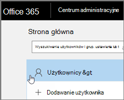

# <a name="delete-a-booking-calendar-in-bookings"></a>Usuwanie kalendarza rezerwacji w Bookings

> [!NOTE]
> Ten artykuł ułatwia interakcję z najnowszą wersją Microsoft Bookings. Poprzednie wersje zostaną wycofane w najbliższych miesiącach.

W tym artykule wyjaśniono, jak usunąć niechciany kalendarz rezerwacji. Możesz usunąć kalendarz rezerwacji w Centrum administracyjne platformy Microsoft 365 lub użyć programu PowerShell. Kalendarz Bookings jest skrzynką pocztową w Exchange Online więc usuń odpowiednie konto użytkownika, aby usunąć kalendarz rezerwacji.

> [!IMPORTANT]
> Wszystkie kalendarze rezerwacji utworzone w 2017 r. lub wcześniej muszą zostać usunięte przy użyciu instrukcji programu PowerShell w tym temacie. Wszystkie kalendarze rezerwacji utworzone w 2018 r. lub później można usunąć w Centrum administracyjne platformy Microsoft 365.

Kalendarz rezerwacji to miejsce przechowywania wszystkich istotnych informacji o tym kalendarzu i danych rezerwacji, w tym:

- Informacje biznesowe, logo i godziny pracy dodane podczas tworzenia kalendarza rezerwacji
- Odpowiedni personel i usługi dodane podczas tworzenia kalendarza rezerwacji
- Wszystkie rezerwacje i terminy wolne od czasu dodane do kalendarza rezerwacji po jego utworzeniu.

> [!WARNING]
> Po usunięciu kalendarza rezerwacji te dodatkowe informacje również zostaną trwale usunięte i nie można ich odzyskać.

## <a name="delete-a-booking-calendar-in-the-microsoft-365-admin-center"></a>Usuwanie kalendarza rezerwacji w Centrum administracyjne platformy Microsoft 365

1. Przejdź do Centrum administracyjnego platformy Microsoft 365.

1. W centrum administracyjnym wybierz pozycję **Użytkownicy**.

   

1. Na stronie **Aktywni użytkownicy** wybierz nazwy użytkowników, których chcesz usunąć, a następnie wybierz pozycję **Usuń użytkownika**.

   

## <a name="delete-a-booking-calendar-using-exchange-online-powershell"></a>Usuwanie kalendarza rezerwacji przy użyciu programu Exchange Online PowerShell

Zobacz [Połączenie do Exchange Online programu PowerShell, aby](/powershell/exchange/exchange-online-powershell-v2) uzyskać wymagania wstępne i wskazówki dotyczące nawiązywania połączenia z programem Exchange Online programu PowerShell.

Aby wykonać te kroki, musisz użyć aktywnego okna poleceń programu Microsoft PowerShell, które zostało uruchomione, wybierając opcję "Uruchom jako administrator".

1. W oknie programu PowerShell załaduj moduł EXO V2, uruchamiając następujące polecenie:

   ```powershell
   Import-Module ExchangeOnlineManagement
   ```

   > [!NOTE]
   > Jeśli moduł [EXO v2 został już zainstalowany](/powershell/exchange/exchange-online-powershell-v2#install-and-maintain-the-exo-v2-module), poprzednie polecenie będzie działać zgodnie z zapisem.
   
2. Polecenie, które należy uruchomić, używa następującej składni:

   ```powershell
   Connect-ExchangeOnline -UserPrincipalName <UPN> 
   ```

   - _\<UPN\>_ to twoje konto w formacie głównej nazwy użytkownika (na przykład `john@contoso.com`).

3. Po wyświetleniu monitu zaloguj się przy użyciu poświadczeń administratora dzierżawy do dzierżawy Microsoft 365, która hostuje kalendarz rezerwacji, który chcesz trwale usunąć.

4. Po zakończeniu przetwarzania tego polecenia wprowadź następujące polecenie, aby uzyskać listę skrzynek pocztowych rezerwacji w dzierżawie:

   ```powershell
   Get-EXOMailbox -RecipientTypeDetails SchedulingMailbox
   ```

5. Wpisz następujące polecenie:

   ```powershell
   remove-mailbox [BookingCalendarToDelete]
   ```

   > [!IMPORTANT]
   > Należy zachować ostrożność, aby wpisać dokładną nazwę aliasu skrzynki pocztowej rezerwacji, który chcesz trwale usunąć.

6. Aby sprawdzić, czy kalendarz został usunięty, wprowadź następujące polecenie:

   ```powershell
    Get-EXOMailbox -RecipientTypeDetails SchedulingMailbox
   ```

   Usunięty kalendarz nie pojawi się w danych wyjściowych.
