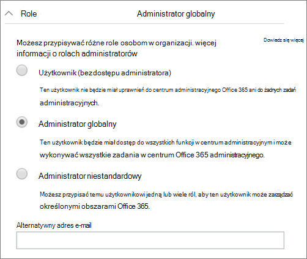
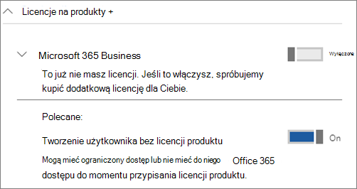

# Ochrona kont administratora

Konta administratora mają podwyższony poziom uprawnień, dlatego są to cenne cele dla hakerów i cyberprzestępczych. W tym artykule opisano:

- Jak skonfigurować dodatkowe konto administratora do wyjechań w nagłych wą w sytuacjach awaryjnych.
- Jak chronić te konta.

Gdy tworzysz konto w Microsoft 365 i wprowadzasz informacje, automatycznie stajesz się administratorem globalnym. Administrator globalny ma pełną kontrolę nad kontami użytkowników i wszystkimi innymi ustawieniami w centrum administracyjnym firmy Microsoft, ale istnieje wiele różnych rodzajów kont administratora o różnych stopniach dostępu. Aby [uzyskać informacje na](/office365/admin/add-users/about-admin-roles) temat poszczególnych poziomów dostępu dla poszczególnych rodzajów roli administratora, zobacz Role administratora.

## Tworzenie dodatkowych kont administratora

Konta administratora należy używać tylko do administrowania. Administratorzy powinni mieć osobne konto użytkownika do regularnego korzystania z aplikacji pakietu Office i używać swoich kont administracyjnych tylko wtedy, gdy jest to konieczne do zarządzania kontami i urządzeniami oraz podczas pracy nad innymi funkcjami administratora. Warto również usunąć licencję usługi Microsoft 365 z kont administratora, aby nie trzeba za nie płacić.

Musisz skonfigurować co najmniej jedno dodatkowe konto administratora globalnego, aby dać administratorowi dostęp innego zaufanego pracownika. Możesz również utworzyć osobne konta administratora do zarządzania użytkownikami (ta rola jest nazywana **Administratorem zarządzania użytkownikami**). Aby uzyskać więcej informacji, zobacz [Role administratora](/office365/admin/add-users/about-admin-roles).

Aby utworzyć dodatkowe konta administratora:

 1. Przejdź do centrum <a href="https://go.microsoft.com/fwlink/p/?linkid=837890" target="_blank">administracyjnego,</a> a następnie wybierz pozycję **Aktywni** \> **użytkownicy użytkownicy** w lewym okienku narracji.

    

 2. Na stronie **Aktywni** użytkownicy wybierz pozycję Dodaj użytkownika w górnej części strony, **a** następnie **w panelu** Nowy użytkownik wprowadź nazwę i inne informacje.
 3. Rozwiń **sekcję Role** i wybierz pozycję **Administrator globalny** , aby nadać temu użytkownikowi dostęp administratora globalnego. Możesz również wybrać pozycję **Administrator niestandardowy** i wybrać dowolną z wyświetlanych ról.

    Wprowadź alternatywny adres e-mail w **polu tekstowym Alternatywny adres e-mail** . Możesz użyć tego adresu, aby odzyskać informacje o hasłach, jeśli je zablokowano. Na ten adres zostanie również wysłane zestawienie rozliczeniowe dla administratorów globalnych.

    

 4. W sekcji **Licencje na produkty** przenieś selektor licencji usługi **Microsoft 365 firm** do opcji Wyłączone, a  pole Utwórz użytkownika bez licencji **produktu** na **pozycję Wł**.

    

## Tworzenie konta administratora alarmowego

Należy również utworzyć konto kopii zapasowej, które nie jest ustawione przy użyciu uwierzytelniania wieloskładnikowego, aby nie zablokować się przypadkowo (na przykład w przypadku utraty telefonu, który jest przez Ciebie drugim formularzem weryfikacji). Upewnij się, że hasło do tego konta jest frazą lub ma co najmniej 16 znaków. Jest to często nazywane "kontem typu "break-glass".

## Tworzenie konta użytkownika dla siebie

Użyj swojego konta użytkownika, aby uczestniczyć we współpracy z Twoją organizacją, w tym sprawdzać pocztę. Oznacza to, że poświadczenia administratora mogą być podobne do poświadczeń  *alice.Chavez @Contoso.org* , a zwykłe konto użytkownika może przypominać adres *Alice @Contoso.com*.

Aby utworzyć nowe konto użytkownika:

1. Przejdź do centrum <a href="https://go.microsoft.com/fwlink/p/?linkid=837890" target="_blank">administracyjnego,</a> a następnie wybierz pozycję **Aktywni** \> **użytkownicy użytkownicy** w lewym okienku narracji.
2. Na stronie **Aktywni** użytkownicy wybierz pozycję Dodaj użytkownika w górnej części strony, **a** następnie **w panelu** Nowy użytkownik wprowadź nazwę i inne informacje.
3. Rozwiń **sekcję Role** i wybierz pozycję **Użytkownik (bez dostępu administracyjnego).**.
4. W sekcji **Licencje na produkty** przenieś selektor licencji dla usługi **Microsoft 365 Firm** do sekcji **Wł**.

## Włączanie domyślnych ustawień zabezpieczeń

Wartości domyślne zabezpieczeń pomagają chronić twoją organizację przed atakami związanymi z tożsamością, udostępniając wstępnie skonfigurowane ustawienia zabezpieczeń, które firma Microsoft zarządza w imieniu Twojej organizacji. Te ustawienia obejmują włączanie uwierzytelniania wieloskładnikowego (MFA) dla wszystkich administratorów i kont użytkowników. Aby uzyskać więcej informacji na temat domyślnych ustawień zabezpieczeń i sposobu ich włączania, zobacz [Włączanie domyślnych ustawień zabezpieczeń](m365-campaigns-conditional-access.md).

## Dodatkowe zalecenia

- Przed użyciem kont administratora zamknij wszystkie niepowiązane sesje przeglądarki i aplikacje, w tym osobiste konta e-mail. Możesz także używać w oknach prywatnych lub incognito przeglądarki.
- Po wykonaniu zadań administracyjnych wyloguj się z sesji przeglądarki.
