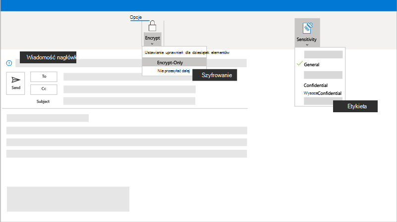

# Szyfrowanie lub oznaczanie poufnych wiadomości e-mail

Dane i informacje dotyczące kampanii są ważne i często poufne. Chroń te poufne informacje za pomocą szyfrowania i etykiet wrażliwości, aby Ty i adresaci wiadomości e-mail traktować te informacje z ich wymaganą wrażliwością.

## Najważniejsze wskazówki

Przed wysłaniem wiadomości e-mail z informacjami poufnymi lub poufnymi rozważ włączenie:

- **Szyfrowanie:** Możesz zaszyfrować wiadomości e-mail, aby chronić prywatność informacji w wiadomości e-mail. Zaszyfrowana wiadomość e-mail jest konwertowana z czytelnego zwykłego tekstu na zaszyfrowany tekst. Tylko adresat, który ma klucz prywatny, który jest taki, jak klucz publiczny użyty do zaszyfrowania wiadomości, może odczytać wiadomość do odczytania. Jednak każdy adresat bez odpowiadającego mu klucza prywatnego widzi tekst, który nie można odczytać. Administrator może zdefiniować reguły, aby automatycznie szyfrować wiadomości spełniające określone kryteria. Administrator może na przykład utworzyć regułę szyfrowania wszystkich wiadomości wysyłanych spoza organizacji lub wszystkich wiadomości, w których wspomniano o określonych wyrazach lub frazach. Wszelkie reguły szyfrowania zostaną zastosowane automatycznie.
- **Etykiety wrażliwości:** W ramach kampanii można również skonfigurować etykiety wrażliwości, które można zastosować do plików i wiadomości e-mail w celu zachowania ich zgodności z zasadami ochrony informacji z kampanii. Etykieta ustawiona jest nadal razem z wiadomością e-mail, nawet gdy jest wysyłana — na przykład przez oznaczenie jej nagłówka.

## Konfigurowanie

Jeśli chcesz zaszyfrować wiadomość, która nie jest zdefiniowana przez wstępnie zdefiniowaną regułę, lub gdy administrator nie sfinał żadnych reguł, możesz zastosować wiele różnych reguł szyfrowania przed wysłaniem wiadomości. Aby wysłać zaszyfrowaną wiadomość z Outlook 2013 lub 2016 albo Outlook 2016 dla komputerów Mac, wybierz pozycję Opcje **> Uprawnienia**, a następnie wybierz potrzebną opcję ochrony. Możesz również wysłać zaszyfrowaną wiadomość, **wybierając przycisk Chroń** w Outlook w sieci Web. Aby uzyskać więcej informacji, zobacz Wysyłanie i wyświetlanie zaszyfrowanych wiadomości oraz odpowiadanie na nie [Outlook komputera PC](https://support.microsoft.com/en-us/office/send-view-and-reply-to-encrypted-messages-in-outlook-for-pc-eaa43495-9bbb-4fca-922a-df90dee51980).

## Ustawienia administratora

Wszystkie informacje o konfigurowaniu szyfrowania poczty e-mail znajdziesz w tece [Szyfrowanie wiadomości e-mail w Microsoft 365](../compliance/email-encryption.md).

### Automatyczne szyfrowanie wiadomości e-mail

Administratorzy mogą tworzyć reguły przepływu poczty e-mail, aby automatycznie chronić wiadomości e-mail wysyłane i odbierane w ramach kampanii. Skonfiguruj reguły w celu szyfrowania wszystkich wychodzących wiadomości e-mail oraz usuń szyfrowanie zaszyfrowanych wiadomości pochodzących z wewnątrz organizacji lub z odpowiedzi na zaszyfrowane wiadomości wysłane z organizacji.

Tworzysz reguły przepływu poczty e-mail, aby szyfrować wiadomości e-mail przy użyciu Szyfrowanie wiadomości usługi Office 365 OME. Zdefiniuj reguły przepływu poczty e-mail wyzwalające szyfrowanie wiadomości za pomocą nowych funkcji usługi OME za Exchange <a href="https://go.microsoft.com/fwlink/p/?linkid=2059104" target="_blank">administracyjnego</a>. 

1. Zaloguj się w przeglądarce internetowej przy użyciu konta służbowego, które otrzymało uprawnienia administratora globalnego.
2. Wybierz kafelek Administrator.
3. W centrum administracyjnym wybierz pozycję **Centra administracyjne > Exchange**.

Aby uzyskać więcej informacji, zobacz [Definiowanie reguł przepływu poczty e-mail w celu szyfrowania wiadomości e-mail](../compliance/define-mail-flow-rules-to-encrypt-email.md).

### Mark your encryption messages

Możesz również zastosować znakowanie kampanii, aby dostosować wygląd i tekst w wiadomościach e-mail. Aby uzyskać więcej informacji, [zobacz Dodawanie marki organizacji do zaszyfrowanych wiadomości](../compliance/email-encryption.md).