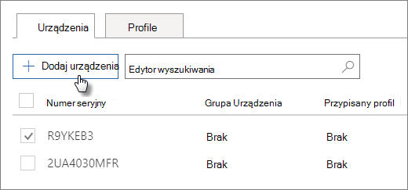

# Tworzenie i edytowanie urządzeń rozwiązania AutoPilotCreate and edit AutoPilot devices

## Przekazywanie listy urządzeńUpload a list of devices

Aby przekazać [urządzenia,](add-autopilot-devices-and-profile.md) możesz skorzystać z przewodnika krok po kroku, ale możesz również przekazać urządzenia na **karcie** Urządzenia.You can use the [Step-by-step guide](add-autopilot-devices-and-profile.md) to upload devices, but you can also upload devices in the **Devices** tab. 
  
Urządzenia muszą spełniać następujące wymagania:Devices must meet these requirements:
  
- Windows 10 w wersji 1703 lub nowszejWindows 10, version 1703 or later
    
- Nowe urządzenia, które nie są już w stanie obsługi klienta systemu WindowsNew devices that haven't been through Windows out-of-box experience

1. W centrum administracyjnym platformy Microsoft 365 wybierz pozycję **Devices** \> **AutoPilot (Rozwiązania rozwiązania Devices AutoPilot).**In the Microsoft 365 admin center, choose **Devices** \> **AutoPilot**.
  
2. Na stronie **AutoPilot** wybierz kartę **Urządzenia** Dodaj \> **urządzenia.**On the **AutoPilot** page, choose the **Devices** tab \> **Add devices**.
    
    
  
3. W **panelu Dodaj urządzenia** przejdź do przygotowanego przez Ciebie pliku [CSV](../admin/misc/device-list.md) z listą urządzeń i zapisz \>  \> **zamknij.**On the **Add devices** panel, browse to a [Device list CSV file](../admin/misc/device-list.md) that you prepared \> **Save** \> **Close**.
    
    Możesz uzyskać te informacje od producenta sprzętu lub wygenerować plik CSV za pomocą skryptu programu [PowerShell Get-WindowsAutoPilotInfo.](https://www.powershellgallery.com/packages/Get-WindowsAutoPilotInfo)You can get this information from your hardware vendor, or you can use the [Get-WindowsAutoPilotInfo PowerShell script](https://www.powershellgallery.com/packages/Get-WindowsAutoPilotInfo) to generate a CSV file. 
    
## Przypisywanie profilu do urządzenia lub grupy urządzeńAssign a profile to a device or a group of devices

1. Na stronie **Przygotowywanie systemu Windows** wybierz **kartę** Urządzenia, a następnie zaznacz pole wyboru obok jednego lub większej liczby urządzeń.On the **Prepare Windows** page, choose the **Devices** tab, and select the check box next to one or more devices. 
    
2. W panelu **Urządzenie** wybierz profil z listy rozwijanej **Przypisany profil**.On the **Device** panel, select a profile from the **Assigned profile** drop-down. 
    
    Jeśli nie masz jeszcze żadnych profilów, odpowiednie instrukcje znajdziesz w temacie [Tworzenie i edytowanie profilów rozwiązania AutoPilot](create-and-edit-autopilot-profiles.md).If you don't have any profiles yet, see [Create and edit AutoPilot profiles](create-and-edit-autopilot-profiles.md) for instructions. 
