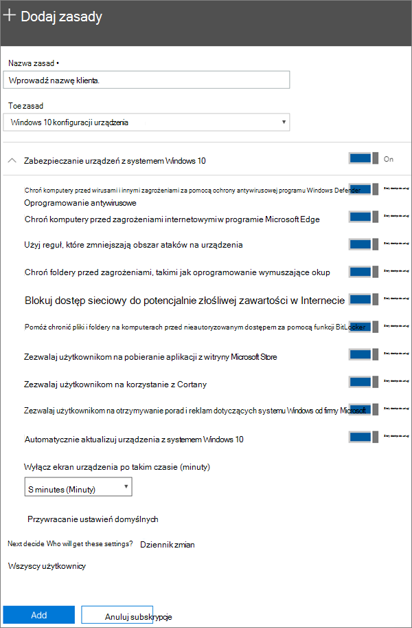

# Konfigurowanie ustawień ochrony urządzeń dla komputerów z systemem Windows 10

## Zabezpieczanie urządzeń z systemem Windows 10

Zobacz klip wideo dotyczący zabezpieczania urządzeń z systemem Windows 10 za pomocą usługi Microsoft 365 dla firm:
  
> [!VIDEO https://www.microsoft.com/videoplayer/embed/a5734146-620a-4cec-8618-536b3ca37972?autoplay=false]
  
1. Przejdź do centrum <a href="https://go.microsoft.com/fwlink/p/?linkid=837890" target="_blank">https://admin.microsoft.com</a>administracyjnego w . 
    
2. Po lewej stronie urządzenia wybierz pozycję Dodawanie **zasad** \> **urządzeń** \> **.**
  
3. W okienku **Dodawanie zasad** wprowadź unikatową nazwę dla zasad. 
    
4. W sekcji **Typ zasad** wybierz opcję **Konfiguracja urządzeń z systemem Windows 10**.
    
5. Expand **Secure Windows 10 Devices** \> configure the settings how you would like. Aby uzyskać więcej informacji, zobacz [Dostępne ustawienia](#available-settings). 
    
    Aby zresetować ustawienia do wartości domyślnych, w dowolnej chwili możesz użyć linku **Resetuj ustawienia domyślne**. 
    
    
  
6. Next decide **Who will get these settings?** If you don't want to use the default **All users** security group, Choose **Change**, search for the security group who will get these settings \> **Select**.
    
7. Na koniec wybierz przycisk **Gotowe**, aby zapisać zasady i zastosować je na urządzeniach. 
    
## Dostępne ustawienia

Domyślnie wszystkie ustawienia są **Włączone**. Dostępne są następujące ustawienia.
  
Aby uzyskać więcej informacji, zobacz [Jak funkcje ochrony w usłudze Microsoft 365 Premium mapują ustawienia usługi Intune](map-protection-features-to-intune-settings.md). 
  
|||
|:-----|:-----|
|Ustawienie    |Opis    |
|Chroń komputery przed wirusami i innymi zagrożeniami za pomocą ochrony antywirusowej programu Windows Defender    |Wymaga włączenia programu antywirusowego Windows Defender w celu ochrony komputerów przed zagrożeniami związanymi z połączeniem z Internetem.    |
|Chroń komputery przed zagrożeniami internetowymi w programie Microsoft Edge    |Włącza w programie Microsoft Edge ustawienia ułatwiające ochronę użytkowników przed złośliwymi witrynami i złośliwą zawartością do pobrania.    |
|Użyj reguł, które zmniejszają obszar ataków na urządzenia    |Gdy zmniejszanie obszaru ataków jest włączone, pomaga blokować akcje i aplikacje zwykle używane przez złośliwe oprogramowanie do infekowania urządzeń. To ustawienie jest dostępne tylko wtedy, gdy jest włączona ochrona antywirusowa programu Windows Defender. Zobacz [Zmniejszanie obszarów ataków](https://docs.microsoft.com/windows/security/threat-protection/microsoft-defender-atp/exploit-protection), aby dowiedzieć się więcej.    |
|Chroń foldery przed zagrożeniami, takimi jak oprogramowanie wymuszające okup    |To ustawienie używa kontrolowanego dostępu do folderów w celu ochrony danych firmy przed modyfikacją przez podejrzane lub złośliwe aplikacje, takie jak oprogramowanie wymuszające okup. Tego typu aplikacje mają zablokowaną możliwość wprowadzania zmian w chronionych folderach. To ustawienie jest dostępne tylko wtedy, gdy jest włączona ochrona antywirusowa programu Windows Defender. Aby dowiedzieć się więcej, zobacz [Ochrona folderów z kontrolowanym dostępem](https://docs.microsoft.com/mem/configmgr/protect/deploy-use/create-deploy-exploit-guard-policy#bkmk_CFA) do folderów.    |
|Blokuj dostęp sieciowy do potencjalnie złośliwej zawartości w Internecie    |To ustawienie służy do blokowania wychodzących połączeń użytkowników z lokalizacjami internetowymi o niskiej reputacji, które mogą obsługiwać wyłudzanie informacji, exploity lub inne złośliwe treści. To ustawienie jest dostępne tylko wtedy, gdy program antywirusowy usługi Windows Defender jest ustawiony **na Włączone**. Aby uzyskać więcej informacji, zobacz [Ochrona sieci](https://docs.microsoft.com/windows/security/threat-protection/windows-defender-antivirus/configure-real-time-protection-windows-defender-antivirus).    |
|Pomóż chronić pliki i foldery na komputerach przed nieautoryzowanym dostępem za pomocą funkcji BitLocker    |Funkcja BitLocker chroni dane przez zaszyfrowanie dysków twardych komputera i zapewnianie ochrony przed ujawnieniem danych w razie zagubienia lub kradzieży komputera. Aby uzyskać więcej informacji, zobacz [Często zadawane pytania dotyczące funkcji bitlocker](https://go.microsoft.com/fwlink/?linkid=871000).    |
|Zezwalaj użytkownikom na pobieranie aplikacji z witryny Microsoft Store    |Pozwala użytkownikom pobierać i instalować aplikacje z witryny Microsoft Store. Do aplikacji tych należą zarówno gry, jak i narzędzia biurowe, więc zostawiamy to ustawienie **włączone**, ale możesz je wyłączyć w celu dodatkowego zwiększenia bezpieczeństwa.    |
|Zezwalaj użytkownikom na korzystanie z Cortany    |Cortana może być bardzo pomocna. Cortana może włączyć lub wyłączyć ustawienia, udzielić wskazówek dojazdu i upewnić się, że jesteś na czas na spotkania, więc domyślnie zachowujemy to ustawienie **Włączone.**    |
|Zezwalaj użytkownikom na otrzymywanie porad i reklam dotyczących systemu Windows od firmy Microsoft    |Porady dotyczące systemu Windows mogą być przydatne i ułatwiać użytkownikom zapoznawanie się nowymi funkcjami.    |
|Automatycznie aktualizuj urządzenia z systemem Windows 10    |Zapewnia, że urządzenia z systemem Windows 10 automatycznie otrzymują najnowsze aktualizacje.    |
|Wyłącz ekran urządzenia po takim czasie bezczynności    |Zapewnia bezpieczeństwo danych firmowych podczas bezczynności użytkownika. Jeśli użytkownik pracuje w miejscu publicznym, na przykład kawiarni, i odejdzie na chwilę od urządzenia lub skupi uwagę na czymś innym, przypadkowe osoby mogą obejrzeć zawartość ekranu. To ustawienie pozwala kontrolować czas bezczynności użytkownika, po którym ekran zostanie wyłączony.    |
