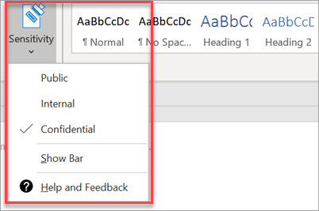

# Konfigurowanie funkcji zgodności

Program Microsoft 365 Business Premium zawiera funkcje chroniące dane i urządzenia, a ponadto ułatwia ochronę danych poufnych przez klientów.

## Konfigurowanie funkcji DLP

Zobacz [Tworzenie zasad DLP na podstawie szablonu](https://docs.microsoft.com/microsoft-365/compliance/create-a-dlp-policy-from-a-template) , aby zapoznać się z przykładem konfigurowania zasad w celu ochrony przed utratą danych osobowych. 
  
W ramach DLP jest dostępnych wiele gotowych szablonów zasad dla wielu różnych ustawień regionalnych. Na przykład dane finansowe Australii, stan danych osobowych w Kanadzie, dane finansowe USA itd. Zobacz [, co zawiera szablon zasady DLP,](https://docs.microsoft.com/microsoft-365/compliance/what-the-dlp-policy-templates-include) Aby uzyskać pełną listę. Wszystkie te szablony można włączyć podobnie jak w przypadku szablonu dane OSOBowe. 
  
## Konfigurowanie przechowywania poczty e-mail przy użyciu aplikacji Exchange Online Archiwizuj

 Funkcje licencji **usługi Exchange Online do archiwizacji** ułatwiają zachowanie zgodności i standardów normatywnych przez zachowywanie zawartości wiadomości E-mail dla zbierania elektronicznych materiałów dowodowych. Pomaga to w ograniczeniu ryzyka, jeśli istnieje sprawność, a także umożliwia odzyskanie danych po naruszeniu zabezpieczeń lub w przypadku konieczności odzyskania elementów usuniętych. W celu zachowania całej zawartości użytkownika lub użycia zasad przechowywania w celu dostosowania tego, co chcesz zachować, można użyć funkcji wstrzymania płatności sądowych.
  
**Przechowywanie sporów sądowych:** Całą zawartość skrzynki pocztowej, w tym usunięte elementy, można zachować, umieszczając całą skrzynkę pocztową użytkownika w ramach blokady sądowej. 
    
Aby umieścić skrzynkę pocztową w ramach blokady sądowej, w centrum administracyjnym:
    
1. W lewym okienku nawigacji przejdź do obszaru **Użytkownicy** \> **aktywni** użytkownicy.
    
2. Wybierz użytkownika, którego skrzynkę pocztową chcesz umieścić w ramach blokady sądowej. W okienku użytkownika rozwiń pozycję **Ustawienia poczty** i obok pozycji **więcej ustawień** wybierz pozycję **Edytuj właściwości serwera Exchange**.
    
3. Na stronie Skrzynka pocztowa użytkownika wybierz pozycję * * Funkcje skrzynki pocztowej * * w lewym obszarze nawigacyjnym, a następnie wybierz link **Włącz** w obszarze **powstrzymywania sporu**.
    
4. W oknie dialogowym **zawieszanie sporu** możesz określić czas trwania zadania sądowego w polu **czas trwania blokady sądowej** . Pozostaw pole puste, jeśli chcesz zawiesić blokadę. Możesz również dodać notatki i skierować właściciela skrzynki pocztowej do witryny sieci Web, aby dowiedzieć się więcej o zawieszeniu sporu. \>**Zapisz**.
    
**Zachowanie:** Możesz włączyć niestandardowe zasady przechowywania, na przykład w celu zachowania określonej ilości czasu lub trwałego usunięcia zawartości na końcu okresu przechowywania. Aby dowiedzieć się więcej, zobacz [Omówienie zasad przechowywania](https://docs.microsoft.com/microsoft-365/compliance/retention-policies).

## Konfigurowanie etykiet czułości

Etykiety wrażliwości są dostarczane z planem (dla Europy) usługi Azure Information Protection (dla Europy) i pomagają w klasyfikowaniu, a opcjonalnie chronić dokumenty i wiadomości e-mail, stosując etykiety. Etykiety mogą być stosowane automatycznie przez administratorów, którzy definiują reguły i warunki, ręcznie przez użytkowników lub za pomocą kombinacji, w której użytkownicy otrzymują rekomendacje.

Aby skonfigurować etykiety czułości, zobacz [Tworzenie i zarządzanie etykietami czułości](https://support.microsoft.com/office/2fb96b54-7dd2-4f0c-ac8d-170790d4b8b9) .

### Ręczne instalowanie klienta usługi Azure Information Protection

Aby ręcznie zainstalować klienta w instalacji:

1. Pobierz **AzinfoProtection_UL.exe** z [Centrum pobierania Microsoft](https://www.microsoft.com/download/details.aspx?id=53018).
 
2. Możesz sprawdzić, czy instalacja działała, wyświetlając dokument programu Word i upewniając się, że opcja **czułość** jest dostępna na karcie **Narzędzia główne** .
 

Aby uzyskać więcej informacji, zobacz [Instalowanie klienta](https://docs.microsoft.com/azure/information-protection/infoprotect-tutorial-step3).
