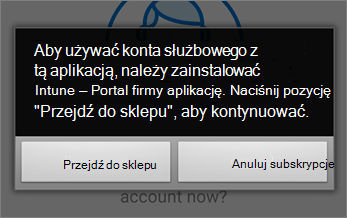

# Konfigurowanie urządzeń przenośnych dla Microsoft 365 dla użytkowników biznesowych

Postępuj zgodnie z instrukcjami na kartach, aby zainstalować pakiet Office na telefonie iPhone lub telefonie z systemem Android. Po zakończeniu tych czynności pliki służbowe utworzone w Office będą chronione przez usługę Microsoft 365 dla firm.

Przykład dotyczy programu Outlook, ale procedura ma zastosowanie do wszystkich innych aplikacji pakietu Office, które także chcesz zainstalować.
  
## Konfigurowanie urządzeń przenośnych

## [iPhone](#tab/iPhone)
  
Obejrzyj krótki klip wideo, aby dowiedzieć się, jak skonfigurować aplikacje Office na urządzeniach z systemem iOS Microsoft 365 dla firm.  

> [!VIDEO https://www.microsoft.com/videoplayer/embed/RWee2n] 

Jeśli ten klip wideo okazał się przydatny, poznaj [kompletną serię szkoleń dla małych firm i nowych użytkowników usługi Microsoft 365](../business-video/index.yml).

Przejdź do sklepu **App Store**, a następnie w polu wyszukiwania wpisz Microsoft Outlook.
  

  
Naciśnij ikonę chmury, aby zainstalować program Outlook.
  

  
Po zakończeniu instalacji naciśnij przycisk **Otwórz**, aby otworzyć aplikację Outlook, a następnie naciśnij pozycję **Rozpocznij**.
  

  
Wprowadź służbowy adres  e-mail na ekranie Dodawanie konta e-mail Dodaj konto, a następnie wprowadź poświadczenia usługi \> Microsoft 365 dla \> **firm.**
  

  
Jeśli Twoja organizacja chroni pliki w aplikacjach, zostanie wyświetlone okno dialogowe z informacją, że twoja organizacja chroni teraz dane w aplikacji i musisz ponownie uruchomić aplikację, aby nadal jej używać. Naciśnij przycisk **OK** i zamknij aplikację Outlook. 
  

  
Znajdź aplikację Outlook na telefonie iPhone i uruchom ją ponownie. Po wyświetleniu monitu wprowadź numer PIN i zweryfikuj go. Aplikacja Outlook w telefonie iPhone jest teraz gotowa do użycia.
  

  
## [Android](#tab/Android)
  
Obejrzyj klip wideo o instalowaniu aplikacji Outlook i Office urządzeniach z systemem Android.  

> [!VIDEO https://www.microsoft.com/videoplayer/embed/ecc2e9c0-bc7e-4f26-8b14-91d84dbcfef0] 

Jeśli ten klip wideo okazał się przydatny, poznaj [kompletną serię szkoleń dla małych firm i nowych użytkowników usługi Microsoft 365](../business-video/index.yml).

Aby rozpocząć konfigurację na telefonie z systemem Android, przejdź do sklepu Play.
  

  
Wprowadź microsoft Outlook w polu wyszukiwania Sklepu Google Play i naciśnij pozycję **Zainstaluj**. Po Outlook zakończeniu instalacji naciśnij pozycję **Otwórz**.
  

  
W aplikacji Outlook naciśnij pozycję **Wprowadzenie**, a następnie dodaj konto e-mail Microsoft 365 dla firm Kontynuuj i zaloguj się przy użyciu \> poświadczeń organizacji.
  

  
W oknie dialogowym z informacją o konieczności zainstalowania aplikacji portalu firmy Intune naciśnij pozycję **Przejdź do sklepu**.
  

  
W Sklepie Play zainstaluj aplikację Intune — Portal firmy.
  

  
Otwórz ponownie aplikację Outlook, a następnie wprowadź i potwierdź numer PIN. Aplikacja Outlook jest teraz gotowa do użycia.
  

## Zobacz też

[Microsoft 365 szkoleniowe klipy wideo dla firm](../business-video/index.yml)

---
