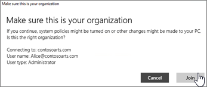

# Konfigurowanie Windows dla Microsoft 365 Business Premium użytkowników

## Przed rozpoczęciem

Zanim będzie można skonfigurować Windows dla użytkowników Microsoft 365 Business Premium, upewnij się, że na wszystkich Windows działa wersja Windows 10 Pro 1703 (aktualizacja dla twórców). Windows 10 Pro stanowi wymaganie wstępne przy wdrażaniu usługi Windows 10 Business, która jest zestawem usług w chmurze i funkcji zarządzania urządzeniami, który uzupełnia program Windows 10 Pro i włącza mechanizmy scentralizowanego zarządzania i zabezpieczeń Microsoft 365 Business Premium.
  
Jeśli masz Windows z systemem Windows Pro, Windows 8 Pro lub Windows 8.1 Pro, subskrypcja Microsoft 365 Business Premium uprawnia do uaktualnienia Windows 10.
  
Aby uzyskać więcej informacji na temat uaktualniania urządzeń z systemem Windows do systemu Windows 10 Pro (aktualizacja dla twórców), wykonaj czynności opisane w tym temacie: [Uaktualnianie urządzeń z systemem Windows do systemu Windows Pro (aktualizacja dla twórców)](upgrade-to-windows-pro-creators-update.md).
  
Zobacz [Sprawdzanie, czy urządzenie zostało połączone z](#verify-the-device-is-connected-to-azure-ad) usługą Azure AD, aby sprawdzić, czy masz uaktualnienie, lub aby się upewnić, że uaktualnienie się nie posunie.

## Obejrzyj: Połączenie komputera do Microsoft 365 Firm

> [!VIDEO https://www.microsoft.com/videoplayer/embed/RE3yXh3] 

Jeśli ten klip wideo okazał się przydatny, poznaj [kompletną serię szkoleń dla małych firm i nowych użytkowników usługi Microsoft 365](../business-video/index.yml).
  
## Dołączanie urządzeń z systemem Windows 10 do usługi Azure AD organizacji

Jeśli wszystkie Windows w organizacji zostały uaktualnione do usługi Windows 10 Pro Creators Update lub są już uruchomione w aktualizacji dla twórców programu Windows 10 Pro, możesz dołączyć te urządzenia do programu Azure Active Directory organizacji. Po dołączeniu urządzeń zostaną one automatycznie uaktualnione do Windows 10 Business, co stanowi część Microsoft 365 Business Premium subskrypcji.
  
### Całkowicie nowe lub nowo uaktualnione urządzenie z systemem Windows 10 Pro

W przypadku całkowicie nowego urządzenia z systemem Windows 10 Pro (aktualizacja dla twórców) lub w przypadku urządzenia, które zostało uaktualnione do systemu Windows 10 Pro (aktualizacja dla twórców), ale nie przeszło konfiguracji urządzenia z systemem Windows 10, wykonaj poniższe czynności.
  
1. Postępuj zgodnie z instrukcjami konfiguracji urządzenia z systemem Windows 10 do momentu przejścia do strony **Jak chcesz skonfigurować?**. 
    
    
  
2. W tym miejscu **wybierz pozycję Skonfiguruj dla organizacji, a** następnie wprowadź nazwę użytkownika i hasło dla Microsoft 365 Business Premium. 
    
3. Dokończ konfigurację urządzenia z systemem Windows 10.
    
   Gdy to zrobisz, użytkownik będzie połączony z usługą Azure AD organizacji. Zobacz [Sprawdzanie, czy urządzenie zostało połączone z usługą Azure AD](#verify-the-device-is-connected-to-azure-ad), aby się upewnić. 
  
### Urządzenie już skonfigurowane z uruchomionym systemem Windows 10 Pro

 **Połącz użytkowników z usługą Azure AD:**
  
1. Na komputerze PC użytkownika z systemem Windows 10 Pro w wersji 1703 z aktualizacją dla twórców (zobacz [wymagania wstępne](pre-requisites-for-data-protection.md)) kliknij logo systemu Windows i wybierz ikonę Ustawienia.
  
   
  
2. W oknie **Ustawienia** wybierz opcję **Konta**.
  
   
  
3. Na stronie **Twoje informacje** kliknij pozycję **Uzyskaj dostęp do miejsca pracy lub nauki** \> **Połącz**.
  
   
  
4. W oknie dialogowym **Konfigurowanie konta służbowego** w sekcji **Alternatywne działania** wybierz pozycję **Dołącz to urządzenie do usługi Azure Active Directory**.
  
   
  
5. On the **Let's get you signed in** page, enter your work or school account \> **Next**.
  
   On the **Enter password** page, enter your password \> **Sign in**.
  
   
  
6. Na stronie **Upewnij się, że** to Twoja organizacja sprawdź poprawność informacji i wybierz pozycję **Dołącz**.
  
   Na **ekranie Wszystko jest już ustawione!** strona, chosse **Done .**
  
   
  
Jeśli masz pliki przesłane do usługi OneDrive dla Firm, zsynchronizuj je z powrotem. Jeśli profil i pliki zostały przeniesione za pomocą narzędzia innej firmy, zsynchronizuj też te dane z nowym profilem.
  
## Sprawdzanie, czy urządzenie zostało połączone z usługą Azure AD

Aby sprawdzić stan synchronizacji,  na stronie Uzyskaj dostęp do pracy  lub nauki w programie **Ustawienia** wybierz obszar Połączono z _ w celu udostępnienia przycisków Informacje i \<organization name\> Rozłącz.   Wybierz **pozycję Informacje,** aby uzyskać stan synchronizacji. 
  
Na stronie **Stan synchronizacji** wybierz pozycję Synchronizuj, aby pobrać na komputer PC najnowsze zasady zarządzania urządzeniami przenośnymi. 
  
Aby rozpocząć korzystanie z konta Microsoft 365 Business Premium, przejdź do przycisku **Start** Windows, kliknij prawym przyciskiem myszy bieżący obraz konta, a następnie wybierz **pozycję Przełącz konto.** Zaloguj się przy użyciu adresu e-mail i hasła organizacji.
  

  
## Sprawdzanie, czy komputer został uaktualniony do Windows 10 Business

Upewnij się, że urządzenia dołączane do Windows 10 Azure AD są uaktualnione Windows 10 Business w ramach twojej subskrypcji Microsoft 365 Business Premium usługi Azure AD.
  
1. Wybierz pozycję **Ustawienia** \> **System** \> **Informacje**.
    
2. Potwierdź, że w polu **Wersja** jest wskazywany system **Windows 10 Business**.
    
    
  
## Następne kroki

Aby skonfigurować urządzenia przenośne, zobacz Konfigurowanie urządzeń przenośnych dla użytkowników usługi [Microsoft 365 Business Premium](set-up-mobile-devices.md). Aby skonfigurować zasady ochrony urządzeń lub ochrony aplikacji, zobacz Zarządzanie usługą [Microsoft 365 dla firm.](manage.md)
  
## Zawartość pokrewna

[Microsoft 365 szkoleniowe klipy wideo dla firm](../business-video/index.yml) (strona linku)
