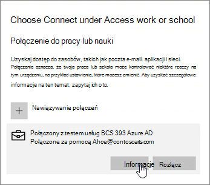

# Konfigurowanie urządzeń z systemem Windows dla użytkowników programu Microsoft 365 Business Premium

## Wymagania wstępne dotyczące konfigurowania urządzeń z systemem Windows dla programu Microsoft 365 Business Premium

Przed skonfigurowaniem urządzeń z systemem Windows dla programu Microsoft 365 Business Premium upewnij się, że na wszystkich urządzeniach z systemem Windows jest zainstalowany system Windows 10 Pro, wersja 1703 (aktualizacja twórców). System Windows 10 Pro jest warunkiem wstępnym wdrożenia systemu Windows 10 Business, który jest zestawem usług w chmurze i funkcjami zarządzania urządzeniami, które uzupełniają system Windows 10 Pro i umożliwiają scentralizowane mechanizmy kontroli nad zarządzaniem i zabezpieczeniami w witrynie Microsoft 365 Business Premium.
  
Jeśli masz urządzenia z systemem Windows z systemem Windows 7 Pro, Windows 8 Pro lub Windows 8,1 Pro, Twoja subskrypcja usługi Microsoft 365 Business Premium uprawnia do uaktualnienia systemu Windows 10.
  
Aby uzyskać więcej informacji na temat uaktualniania urządzeń z systemem Windows do systemu Windows 10 Pro (aktualizacja dla twórców), wykonaj czynności opisane w tym temacie: [Uaktualnianie urządzeń z systemem Windows do systemu Windows Pro (aktualizacja dla twórców)](upgrade-to-windows-pro-creators-update.md).
  
Zobacz [Weryfikowanie, czy urządzenie jest połączone z usługą Azure AD](#verify-the-device-is-connected-to-azure-ad) , aby sprawdzić, czy masz uaktualnienie, lub aby upewnić się, że uaktualnienie działało.

Obejrzyj krótki klip wideo o łączeniu systemu Windows z systemem Microsoft 365.  

> [!VIDEO https://www.microsoft.com/videoplayer/embed/RE3yXh3] 

Jeśli ten klip wideo okazał się przydatny, poznaj [kompletną serię szkoleń dla małych firm i nowych użytkowników usługi Microsoft 365](https://support.microsoft.com/office/6ab4bbcd-79cf-4000-a0bd-d42ce4d12816).
  
## Dołączanie urządzeń z systemem Windows 10 do usługi Azure AD organizacji

Jeśli wszystkie urządzenia z systemem Windows w organizacji zostały uaktualnione do aktualizacji dla twórców systemu Windows 10 Pro lub są już uruchomione aktualizacje dla twórców systemu Windows 10 Pro, możesz przyłączyć te urządzenia do usługi Azure Active Directory organizacji. Po dołączeniu urządzeń zostaną one automatycznie uaktualnione do systemu Windows 10 Business, który jest częścią abonamentu Microsoft 365 Business Premium.
  
### Całkowicie nowe lub nowo uaktualnione urządzenie z systemem Windows 10 Pro

W przypadku całkowicie nowego urządzenia z systemem Windows 10 Pro (aktualizacja dla twórców) lub w przypadku urządzenia, które zostało uaktualnione do systemu Windows 10 Pro (aktualizacja dla twórców), ale nie przeszło konfiguracji urządzenia z systemem Windows 10, wykonaj poniższe czynności.
  
1. Postępuj zgodnie z instrukcjami konfiguracji urządzenia z systemem Windows 10 do momentu przejścia do strony **Jak chcesz skonfigurować?**. 
    
    
  
2. W tym miejscu wybierz pozycję **Konfiguracja dla organizacji** , a następnie wprowadź nazwę użytkownika i hasło do usługi Microsoft 365 Business Premium. 
    
3. Dokończ konfigurację urządzenia z systemem Windows 10.
    
   Gdy to zrobisz, użytkownik będzie połączony z usługą Azure AD organizacji. Zobacz [Sprawdzanie, czy urządzenie zostało połączone z usługą Azure AD](#verify-the-device-is-connected-to-azure-ad), aby się upewnić. 
  
### Urządzenie już skonfigurowane z uruchomionym systemem Windows 10 Pro

 **Połącz użytkowników z usługą Azure AD:**
  
1. Na komputerze PC użytkownika z systemem Windows 10 Pro w wersji 1703 z aktualizacją dla twórców (zobacz [wymagania wstępne](pre-requisites-for-data-protection.md)) kliknij logo systemu Windows i wybierz ikonę Ustawienia.
  
   
  
2. W oknie **Ustawienia** wybierz opcję **Konta**.
  
   
  
3. Na stronie **Twoje informacje** kliknij pozycję **Uzyskaj dostęp do miejsca pracy lub nauki** \> **Połącz**.
  
   
  
4. W oknie dialogowym **Konfigurowanie konta służbowego** w sekcji **Alternatywne działania** wybierz pozycję **Dołącz to urządzenie do usługi Azure Active Directory**.
  
   
  
5. On the **Let's get you signed in** page, enter your work or school account \> **Next**.
  
   On the **Enter password** page, enter your password \> **Sign in**.
  
   
  
6. Na stronie upewnij się, że to **jest Twoja strona organizacji** , sprawdź, czy informacje są właściwe, a następnie wybierz pozycję **Dołącz**.
  
   **Wszystko gotowe!** Strona **chosse.**
  
   
  
Jeśli masz pliki przesłane do usługi OneDrive dla Firm, zsynchronizuj je z powrotem. Jeśli do migrowania profilu i plików użyto narzędzia innej firmy, zsynchronizuj je również z nowym profilem.
  
## Sprawdzanie, czy urządzenie zostało połączone z usługą Azure AD

Aby zweryfikować stan synchronizacji, na stronie **służbowe lub szkolne** w obszarze **Ustawienia** wybierz pozycję **połączony z** \<organization name\> obszarem _, aby uwidocznić przycisk **informacje** i **Rozłącz**. Wybierz pozycję **informacje** , aby uzyskać stan synchronizacji. 
  
Na stronie **stan synchronizacji** wybierz pozycję **Synchronizuj** , aby uzyskać najnowsze zasady zarządzania urządzeniami przenośnymi na komputerze.
  
Aby rozpocząć korzystanie z konta Microsoft 365 Business Premium, przejdź do przycisku **Start** systemu Windows, kliknij prawym przyciskiem myszy bieżący obraz konta, a następnie **Przełącz konto**. Zaloguj się przy użyciu adresu e-mail i hasła organizacji.
  

  
## Sprawdzanie, czy komputer jest uaktualniony do wersji Windows 10 Business

Upewnij się, że Twoje urządzenia z systemem Windows 10 dołączone do usługi Azure AD są uaktualnione do systemu Windows 10 Business w ramach abonamentu Microsoft 365 Business Premium.
  
1. Wybierz pozycję **Ustawienia** \> **System** \> **Informacje**.
    
2. Potwierdź, że w polu **Wersja** jest wskazywany system **Windows 10 Business**.
    
    
  
## Następne czynności

Aby skonfigurować urządzenia przenośne, zobacz [Konfigurowanie urządzeń przenośnych dla użytkowników programu Microsoft 365 Business Premium](set-up-mobile-devices.md), aby ustawić ochronę urządzeń lub zasady ochrony aplikacji, zobacz [zarządzanie systemem Microsoft 365 dla firm](manage.md).
  
## Aby uzyskać więcej informacji na temat konfigurowania i korzystania z aplikacji Microsoft 365 Business Premium

[Szkolenia wideo dotyczące programu Microsoft 365 dla firm](https://support.microsoft.com/office/6ab4bbcd-79cf-4000-a0bd-d42ce4d12816)
