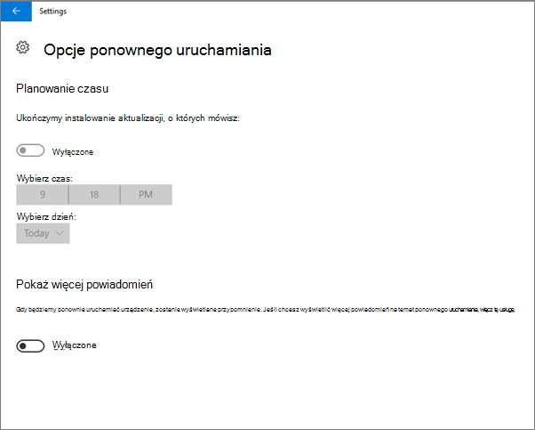
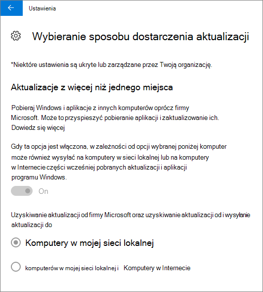

# Sprawdzanie poprawności ustawień ochrony urządzenia na komputerach z systemem Windows 10

## Sprawdzanie, czy ustawiono zasady urządzeń systemu Windows 10

Po [skonfigurowaniu zasad dotyczących urządzeń](protection-settings-for-windows-10-pcs.md)może upłynąć nawet kilka godzin, aby zasady mogły zostać wprowadzone na urządzeniach użytkowników. Można potwierdzić, że zasady weszły w życie, patrząc na różne ekrany ustawień systemu Windows na urządzeniach użytkowników. Ponieważ użytkownicy nie będą mogli modyfikować ustawień windows update i windows defender na swoich urządzeniach z systemem Windows 10, wiele opcji będzie wyszarzonych.
  
1. Przejdź do opcji aktualizacji **ustawień** \> ** &amp; aktualizacji** \> **systemu Windows Update** \> **Uruchom ponownie** i upewnij się, że wszystkie ustawienia są wyszarzone. 
    
    
  
2. Przejdź do **opcji Windows** \> Update ** &amp; zabezpieczeń** \> Windows **Update** \> **Zaawansowane opcje** i upewnij się, że wszystkie ustawienia są wyszarzone. 
    
    
  
3. Przejdź do **pozycji Ustawienia** \> **Aktualizacja &amp; zabezpieczeń** \> **Windows Update** \> **Opcje** \> zaawansowane **Wybierz sposób dostarczania aktualizacji**.
    
    Upewnij się, że możesz zobaczyć komunikat (na czerwono), że niektóre ustawienia są ukryte lub zarządzane przez organizację, a wszystkie opcje są wyszarzone.
    
    
  
4. Aby otworzyć Centrum zabezpieczeń usługi Windows Defender, przejdź do **sekcji Ustawienia** \> **aktualizacji &amp; zabezpieczeń** \> **Usługi Windows Defender** \> kliknij pozycję **Otwórz usługę Windows Defender Security Center** \> **Ochrona &amp; wątków** \> **Ustawienia ochrony przed zagrożeniami przed wirusami &amp; **. 
    
5. Sprawdź, czy wszystkie opcje są wyszarzone. 
    
    
  
## Tematy pokrewne

[Microsoft 365 dla dokumentacji biznesowej i zasobów](https://go.microsoft.com/fwlink/p/?linkid=853701)
  
[Wprowadzenie do usługi Microsoft 365 dla firm](microsoft-365-business-overview.md)
  
[Zarządzanie programem Microsoft 365 dla firm](manage.md)
  
[Konfigurowanie komputerów PC z systemem Windows 10](protection-settings-for-windows-10-pcs.md)
  

