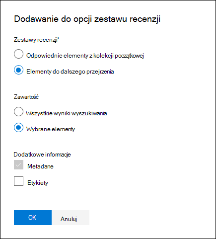

# Dodawanie danych do zestawu przeglądów z innego zestawu przeglądów

W niektórych przypadkach może być konieczne wybranie dokumentów z jednego zestawu przeglądów i praca z nimi indywidualnie w innym zestawie przeglądów. Jest to szczególnie przydatne, jeśli zawartość została ubita w zestawie przeglądów i chcesz uruchomić analizę na podzbiorze danych.

Postępuj zgodnie z przepływem pracy w tym artykule, aby dodać zawartość z jednego zestawu przeglądów do innego.

## Tworzenie zestawu przeglądów

Przed rozpoczęciem należy utworzyć zestaw przeglądów, do którego będą dodawane dane.  Nowy zestaw przeglądów można dodać na karcie **Zestawy przeglądów** sprawy. Aby uzyskać więcej informacji, zobacz [Tworzenie zestawu przeglądów](managing-review-sets.md#create-a-review-set).

## Krok 1. Identyfikowanie zawartości do dodania do innego zestawu przeglądów

Możesz dodać zawartość z jednego zestawu przeglądów do innego, wybierając określone dokumenty w zestawie przeglądu źródłowego lub wybierając wszystkie elementy zwrócone przez zapytanie zestawu przeglądów. Jeśli dodajesz wybrane elementy, wybierz elementy, wybierz pozycję **Akcja**, a następnie wybierz pozycję **Dodaj do innego zestawu przeglądów**.

## Krok 2. Określanie opcji dodawania do innego zestawu przeglądów

Na stronie wysuwanej **Dodaj do innego zestawu przeglądów** wybierz zestaw przeglądów, do którym chcesz dodać elementy. Określ, czy chcesz dodać **wszystkie wyniki wyszukiwania** , czy **wybrane elementy**.  **Dodatkowe informacje** zawierają opcje dołączania wszystkich metadanych z elementów oraz tego, czy mają zostać uwzględnione tagi (zaznaczając pole wyboru **Etykiety** ) z zestawu przeglądu źródłowego, gdy dokumenty zostaną dodane do nowego zestawu przeglądów.  

Po kliknięciu przycisku **OK** zostanie utworzone nowe zadanie (o nazwie **Dodawanie danych do innego zestawu przeglądów**) w celu dodania zawartości do innego zestawu przeglądów. Możesz przejść do karty **Zadania** i monitorować postęp tego zadania. Aby uzyskać więcej informacji, zobacz [Zarządzanie zadaniami](managing-jobs-ediscovery20.md).
