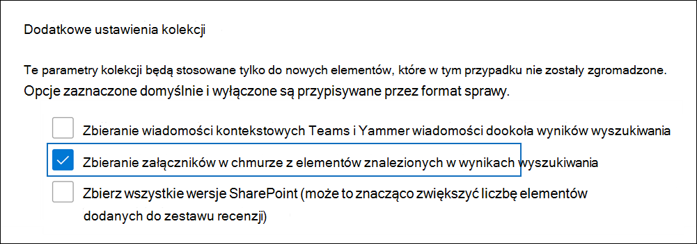

# Zbieranie załączników w chmurze w usłudze Microsoft Purview eDiscovery (Premium) (wersja zapoznawcza)

Załączniki w chmurze to linki do dokumentów, które są zwykle przechowywane w SharePoint lokacji i OneDrive. Dlatego zamiast dołączać rzeczywistą kopię dokumentu w wiadomości e-mail lub Teams konwersacji na czacie, masz możliwość udostępnienia linku do pliku. Załączniki w chmurze to skuteczny sposób udostępniania dokumentów i współpracy z innymi osobami w organizacji. Jednak załączniki w chmurze stanowią wyzwanie podczas przepływu pracy zbierania elektronicznych materiałów dowodowych, ponieważ tylko link załącznika w chmurze, a nie rzeczywista zawartość w dokumencie udostępnionym, są zwracane w wyszukiwaniu zbierania elektronicznych materiałów dowodowych. Aby sprostać temu wyzwaniu, usługa eDiscovery (Premium) oferuje dwa rozwiązania do zbierania załączników w chmurze:  

- Zbieranie wersji na żywo dokumentu połączonego z dokumentem w załączniku w chmurze.

- Zbieranie wersji dokumentu w momencie udostępnienia go w załączniku w chmurze.

## Zbieranie załączników w chmurze

Podczas tworzenia kolekcji roboczej, a wyniki wyszukiwania zawierają elementy zawierające załączniki w chmurze, podczas zatwierdzania wersji roboczej kolekcji do zestawu przeglądów trzeba zebrać element docelowy załącznika w chmurze. Po wybraniu tej opcji funkcja eDiscovery (Premium) dodaje dokumenty połączone z załącznikiem w chmurze do zestawu przeglądów. Dzięki temu możesz przejrzeć dokumenty docelowe i określić, czy dokument jest odpowiedni dla Twojej sprawy czy dochodzenia.

Poniższy zrzut ekranu przedstawia opcję uwzględnienia elementów docelowych załączników w chmurze podczas zatwierdzania kolekcji w zestawie przeglądów.

> [!NOTE]
>- Jeśli używasz [nowego formatu przypadku](advanced-ediscovery-new-case-format.md) zbierania elektronicznych materiałów dowodowych (Premium), opcja dołączenia załączników w chmurze do zestawu przeglądów jest domyślnie zaznaczona i nie można jej wybrać. 
>- Masz również możliwość uwzględnienia wszystkich wersji (oprócz wersji udostępnionej) załączników w chmurze w zestawie przeglądów.  
Aby uzyskać instrukcje dotyczące zatwierdzania kolekcji w zestawie przeglądów, zobacz [Commit a draft collection to a review set (Zatwierdzanie kolekcji roboczej w zestawie przeglądów](commit-draft-collection.md)).

## Zbieranie wersji udostępnionej w załączniku w chmurze

Przepływ pracy zbierania elektronicznych materiałów dowodowych (Premium) do zbierania załączników w chmurze obejmuje tylko dodanie najnowszej wersji załącznika chmury do zestawu przeglądów. Oznacza to, że wersja, która jest zbierana i dodawana do zestawu przeglądów, może być inna niż wersja, która została pierwotnie udostępniona w załączniku chmury. Możliwe więc, że zawartość, która była obecna w załączniku w chmurze w momencie jej udostępnienia, mogła zostać usunięta i nie istnieje w bieżącej wersji, która została dodana do zestawu przeglądów.

Organizacje mają teraz możliwość używania etykiet przechowywania Microsoft 365 w celu zachowania wersji dokumentu w czasie, gdy był on udostępniany jako załącznik w chmurze. W tym celu organizacja może utworzyć etykietę przechowywania, wybrać opcję zastosuj etykietę do załączników w chmurze, a następnie automatycznie zastosować etykietę do dokumentów przechowywanych w SharePoint i OneDrive. Po skonfigurowaniu tej konfiguracji kopia dokumentu jest tworzona w momencie udostępnienia pliku. Ponadto jeśli dokument zostanie zmodyfikowany i ponownie udostępniony jako załącznik w chmurze, zmodyfikowana wersja zostanie również zachowana. Jeśli plik zostanie ponownie zmodyfikowany i udostępniony, zostanie zachowana nowa kopia pliku jako nowej wersji.

Zachowanie udostępnionych wersji załączników w chmurze może pomóc organizacji w określeniu zakresu przechowywania i zbierania potencjalnie istotnej zawartości do określonej wersji dokumentu, który został udostępniony, a nie bieżącej wersji na żywo. Po zaimplementowaniu tego rozwiązania przechowywania zarówno bieżąca aktywna wersja załącznika w chmurze, jak i wersja udostępniona w załączniku chmury są zbierane i dodawane do zestawu przeglądów.

Aby uzyskać instrukcje dotyczące konfigurowania etykiety przechowywania i automatycznego stosowania jej do załączników w chmurze, zobacz [Automatyczne stosowanie etykiet do załączników w chmurze](apply-retention-labels-automatically.md#auto-apply-labels-to-cloud-attachments).

Poniższy zrzut ekranu przedstawia dokument załącznika w chmurze o nazwie *XYZ Research.docx*, który został dodany do zestawu przeglądów. Dokument został udostępniony jako załącznik w chmurze w Teams konwersacji na czacie. Zestaw przeglądów zawiera również wersję, która została pierwotnie udostępniona w załączniku w chmurze. Zwróć uwagę, że nazwa tej wersji załącznika w chmurze jest generowana przez system, a autor jest identyfikowany jako **SharePoint**.

Ponadto bieżąca wersja na żywo i udostępniona wersja mają tę samą wartość właściwości **FamilyId**, która jest taka sama jak **identyfikator FamilyId** obiektu nadrzędnego (na przykład wiadomość e-mail lub Teams konwersacji na czacie). Dzięki temu można grupować załączniki w chmurze przy użyciu elementu, w którym zostały udostępnione.

Po zaimplementowaniu etykiety przechowywania i automatycznym zastosowaniu etykiety do SharePoint dokumentów nadal wybierasz opcję zbierania załączników w chmurze podczas zatwierdzania kolekcji roboczej w zestawie przeglądów. Po zebraniu załączników w chmurze zarówno bieżąca wersja na żywo, jak i wersja, która została pierwotnie udostępniona, zostaną dodane do zestawu przeglądów.
