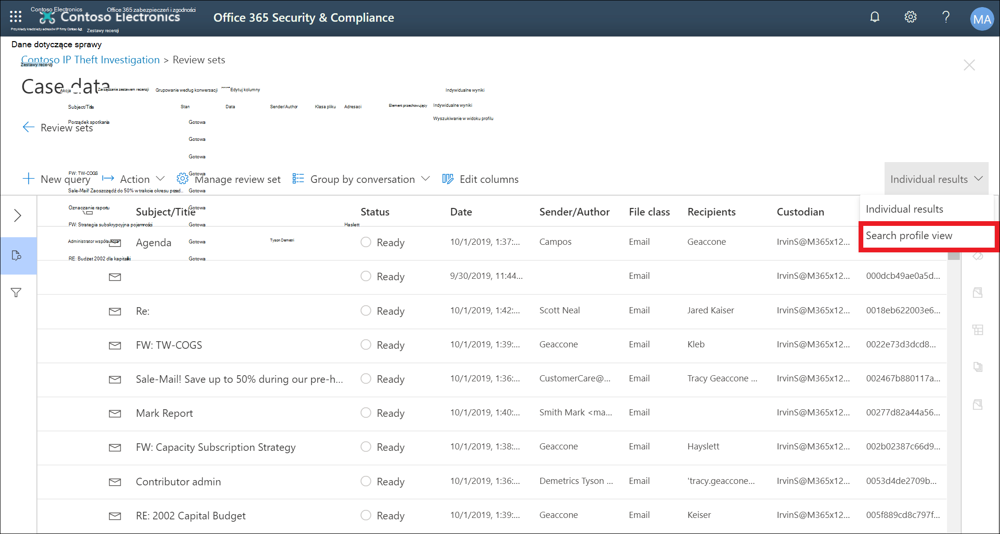

# Advanced eDiscovery pulpitu nawigacyjnego dla zestawów recenzji

W niektórych przypadkach w Advanced eDiscovery może być duża liczba dokumentów i wiadomości e-mail do przejrzenia. Przed rozpoczęciem procesu przeglądu można szybko przeanalizować swoje dane w celu zidentyfikowania trendów lub kluczowych statystyk, które pomogą w opracowywania strategii przeglądu. W tym celu można szybko analizować swój zestaw Advanced eDiscovery pulpitu nawigacyjnego.

## Krok 1. Tworzenie widżetu na pulpicie nawigacyjnym zestawu recenzji

1. W Centrum zgodności platformy Microsoft 365 przejdź do tematu Zbierania elektronicznych materiałów dowodowych **> Advanced eDiscovery** aby wyświetlić listę spraw w organizacji.
  
2. Zaznacz istniejącą sprawę.
  
3. Kliknij **kartę Zestaw recenzji** , a następnie wybierz zestaw recenzji.
  
4. Na liście **rozwijanej Poszczególne** wyniki kliknij pozycję **Wyszukaj w widoku profilu**. 

   

   Zostanie **wyświetlona strona Wyszukaj w** widoku profilu. Podczas wyświetlania tej strony po raz pierwszy wyświetlane są trzy domyślne widżety.

   
  
5. Kliknij widżet **Nowy** , a następnie wybierz jeden z następujących elementów:

   

   - **Wybierz z biblioteki:** Wyświetla domyślną bibliotekę widżetów. Kliknij widżet, a następnie kliknij pozycję **Dodaj** , aby dodać go do widżetów na stronie **Przeszukaj widok profilu** .
  
   - **Tworzenie niestandardowego widżetu:** Wyświetla wysuwną stronę, za pomocą których można skonfigurować niestandardowy widżet. 

6. Aby utworzyć niestandardowy widżet, na stronie wysuwu dodaj **widżet** wykonaj następujące czynności:

   

    a. Wpisz nazwę widżetu, który będzie wyświetlany na pasku tytułu widżetu. Nazwa widżetu jest wymagana, ale warto zidentyfikować dane widżetu.

    b. Z listy rozwijanej **Wybierz tabelę** przestawną wybierz właściwość, która będzie używana dla danych widżetów. Elementy na tej liście są właściwościami, które można przeszukiwać dla elementów w zestawie recenzji. Aby uzyskać opis tych właściwości, zobacz [Pola metadanych dokumentu Advanced eDiscovery](document-metadata-fields-in-Advanced-eDiscovery.md). Opcje przestawne widżetu są wymienione w kolumnie Nazwa pola z **możliwością wyszukiwania** w tym temacie.

    c. Wybierz typ wykresu, aby wyświetlić dane z wybranej właściwości przestawnej.

  6. Kliknij **pozycję Dodaj** , aby utworzyć niestandardowy widżet i wyświetlić go na **stronie Przeszukaj widok profilu** .

## Krok 2. Tworzenie kwerendy wyszukiwania zestawu recenzji

1. Kliknij **pozycję ...** na pasku tytułu widżetu, a następnie kliknij pozycję **Zastosuj warunek**.

   

2. Na stronie wysuwu kliknij element na klawiszu widżetu lub wykresie widżetu, aby utworzyć filtr.

   

3. Powtórz kroki 1–2 dla innych widżetów. 

4. Gdy to zrobisz, kliknij pozycję **Zapisz jako zapytanie** , aby zapisać warunki jako nowe zapytanie wyszukiwania dla zestawu recenzji.

   

5. Zamknij widok **profilu wyszukiwania,** aby powrócić do widoku wyników wyszukiwania.

   Jeśli utworzono jakiekolwiek filtry wizualne, wynikowe zapytanie zostanie zastosowane do wyświetlanych wyników wyszukiwania, a zapytanie wyszukiwania zapisane w kroku 4 zostanie wyświetlone w obszarze Zapisane **zapytania**. Aby uzyskać więcej informacji na temat zapytań zestawu recenzji, zobacz [Kwerenda danych w zestawie recenzji](review-set-search.md).
