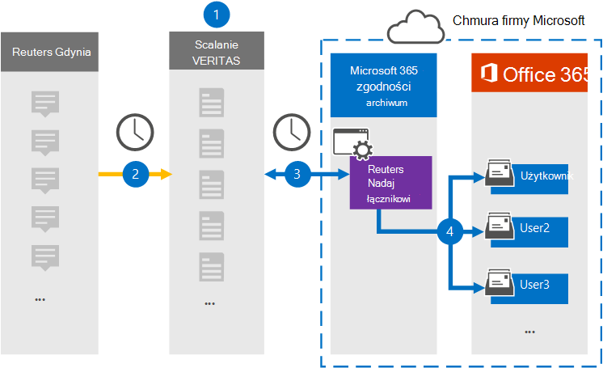

# Konfigurowanie łącznika do archiwizowania danych Reuters Eikon

[!include[Purview banner](../includes/purview-rebrand-banner.md)]

Użyj łącznika Veritas w portalu zgodności usługi Microsoft Purview, aby zaimportować i zarchiwizować dane z platformy Reuters Eikon do skrzynek pocztowych użytkowników w organizacji Microsoft 365. Usługa Veritas udostępnia łącznik [Reuters Eikon](https://globanet.com/eikon/), który jest skonfigurowany do przechwytywania elementów ze źródła danych innych firm (regularnie) i importowania tych elementów do Microsoft 365. Łącznik konwertuje zawartość, taką jak wiadomości typu osoba-osoba, czaty grupowe, załączniki i zastrzeżenia z konta reutersa użytkownika na format wiadomości e-mail, a następnie importuje te elementy do skrzynki pocztowej użytkownika w Microsoft 365.

Po przechowywaniu danych Reuters Eikon w skrzynkach pocztowych użytkowników można zastosować funkcje usługi Microsoft Purview, takie jak blokada postępowania sądowego, zbieranie elektronicznych materiałów dowodowych, zasady przechowywania i etykiety przechowywania oraz zgodność z komunikacją. Importowanie i archiwizowanie danych w Microsoft 365 przy użyciu łącznika Reuters Eikon może pomóc twojej organizacji zachować zgodność z zasadami rządowymi i regulacyjnymi.

## Omówienie archiwizacji danych Reuters Eikon

W poniższym omówieniu wyjaśniono proces używania łącznika do archiwizowania danych Reuters Eikon w Microsoft 365.

1. Twoja organizacja współpracuje z agencją Reuters Eikon w celu skonfigurowania i skonfigurowania witryny Reuters Eikon.

2. Raz na 24 godziny elementy Reuters Eikon są kopiowane do witryny Veritas Merge1. Łącznik konwertuje również elementy Reuters Eikon na format wiadomości e-mail.

3. Łącznik Reuters Eikon tworzony w portalu zgodności codziennie łączy się z witryną Veritas Merge1 i przesyła zawartość do bezpiecznej lokalizacji Storage platformy Azure w chmurze firmy Microsoft.

4. Łącznik importuje elementy do skrzynek pocztowych określonych użytkowników przy użyciu wartości właściwości *Poczta e-mail* automatycznego mapowania użytkownika zgodnie z opisem w [kroku 3](#step-3-map-users-and-complete-the-connector-setup). Podfolder w folderze Skrzynka odbiorcza o nazwie **Reuters Eikon** jest tworzony w skrzynkach pocztowych użytkownika, a elementy są importowane do tego folderu. Łącznik określa skrzynkę pocztową do zaimportowania elementów przy użyciu wartości właściwości *Poczta e-mail* . Każdy element Reuters Eikon zawiera tę właściwość, która jest wypełniana adresem e-mail każdego uczestnika elementu.

## Przed rozpoczęciem

- Utwórz konto veritas merge1 dla łączników firmy Microsoft. Aby utworzyć konto, skontaktuj się z [pomocą techniczną veritas](https://globanet.com/ms-connectors-contact). Zalogujesz się do tego konta podczas tworzenia łącznika w kroku 1.

- Użytkownik, który tworzy łącznik Reuters Eikon w kroku 1 (i kończy go w kroku 3) musi mieć przypisaną rolę administratora łącznika danych. Ta rola jest wymagana do dodawania łączników na stronie **Łączniki danych** w portalu zgodności. Ta rola jest domyślnie dodawana do wielu grup ról. Aby uzyskać listę tych grup ról, zobacz sekcję "Role w centrach zabezpieczeń i zgodności" w obszarze [Uprawnienia w Centrum zgodności & zabezpieczeń](../security/office-365-security/permissions-in-the-security-and-compliance-center.md#roles-in-the-security--compliance-center). Alternatywnie administrator w organizacji może utworzyć niestandardową grupę ról, przypisać rolę administratora łącznika danych, a następnie dodać odpowiednich użytkowników jako członków. Aby uzyskać instrukcje, zobacz sekcję "Tworzenie niestandardowej grupy ról" w obszarze [Uprawnienia w portalu zgodności usługi Microsoft Purview](microsoft-365-compliance-center-permissions.md#create-a-custom-role-group).

- Ten łącznik danych Veritas jest w publicznej wersji zapoznawczej w środowiskach GCC w chmurze Microsoft 365 us Government. Aplikacje i usługi innych firm mogą obejmować przechowywanie, przesyłanie i przetwarzanie danych klientów organizacji w systemach innych firm, które znajdują się poza infrastrukturą Microsoft 365 i dlatego nie są objęte zobowiązaniami dotyczącymi usługi Microsoft Purview i ochrony danych. Firma Microsoft nie przedstawia żadnej reprezentacji, że użycie tego produktu do łączenia się z aplikacjami innych firm oznacza, że te aplikacje innych firm są zgodne z fedrampem.

## Krok 1. Konfigurowanie łącznika Reuters Eikon

Pierwszym krokiem jest dostęp do strony **Łączniki danych** w portalu zgodności i utworzenie łącznika dla danych Reuters Eikon.

1. Przejdź do obszaru [https://compliance.microsoft.com](https://compliance.microsoft.com/) , a następnie kliknij pozycję **Łączniki** >  **danychReuters Eikon**.

2. Na stronie Opis produktu **Reuters Eikon** kliknij pozycję **Dodaj łącznik**.

3. Na stronie **Warunki korzystania z usługi** kliknij pozycję **Akceptuj**.

4. Wprowadź unikatową nazwę identyfikującą łącznik, a następnie kliknij przycisk **Dalej**.

5. Zaloguj się do konta merge1, aby skonfigurować łącznik.

## Krok 2. Konfigurowanie łącznika Reuters Eikon w witrynie Veritas Merge1

Drugim krokiem jest skonfigurowanie łącznika Reuters Eikon w witrynie Merge1. Aby uzyskać informacje na temat konfigurowania łącznika Reuters Eikon w witrynie Veritas Merge1, zobacz [Merge1 Third-Party Connectors User Guide (Scal1 łączniki innych firm](https://docs.ms.merge1.globanetportal.com/Merge1%20Third-Party%20Connectors%20Reuters%20Eikon%20User%20Guide%20.pdf)).

Po kliknięciu **przycisku Zapisz & Zakończ** zostanie wyświetlona strona **Mapowanie użytkownika** w kreatorze łącznika w portalu zgodności.

## Krok 3. Mapowanie użytkowników i ukończenie konfiguracji łącznika

Aby zamapować użytkowników i ukończyć konfigurację łącznika w portalu zgodności, wykonaj następujące kroki:

1. Na stronie **Mapowanie użytkowników zewnętrznych na Microsoft 365 użytkowników** włącz automatyczne mapowanie użytkowników. Elementy Reuters Eikon obejmują właściwość o nazwie *Email*, która zawiera adresy e-mail dla użytkowników w organizacji. Jeśli łącznik może skojarzyć ten adres z użytkownikiem Microsoft 365, elementy zostaną zaimportowane do skrzynki pocztowej tego użytkownika.

2. Kliknij **przycisk Dalej**, przejrzyj ustawienia, a następnie przejdź do strony **Łączniki danych** , aby zobaczyć postęp procesu importowania nowego łącznika.

## Krok 4. Monitorowanie łącznika Reuters Eikon

Po utworzeniu łącznika Reuters Eikon możesz wyświetlić stan łącznika w portalu zgodności.

1. Przejdź do strony [https://compliance.microsoft.com](https://compliance.microsoft.com) i kliknij pozycję **Łączniki danych** w lewym pasku nawigacyjnym.

2. Kliknij kartę **Łączniki** , a następnie wybierz łącznik **Reuters Eikon** , aby wyświetlić stronę wysuwaną. Ta strona zawiera właściwości i informacje o łączniku.

3. W obszarze **Stan łącznika ze źródłem** kliknij link **Pobierz dziennik** , aby otworzyć (lub zapisać) dziennik stanu łącznika. Ten dziennik zawiera informacje o danych zaimportowanych do chmury firmy Microsoft.

## Znane problemy

- Obecnie nie obsługujemy importowania załączników ani elementów o rozmiarze większym niż 10 MB. Obsługa większych elementów będzie dostępna w późniejszym terminie.