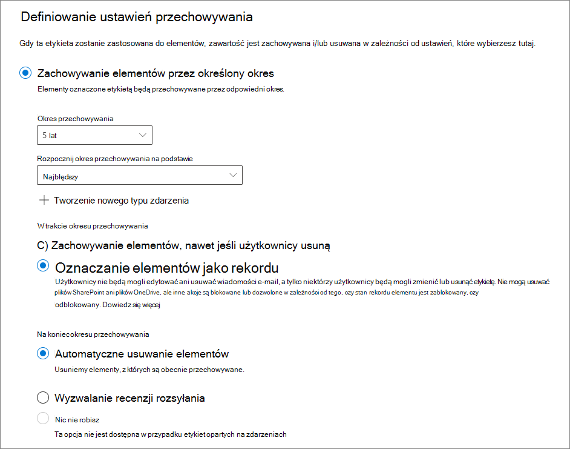
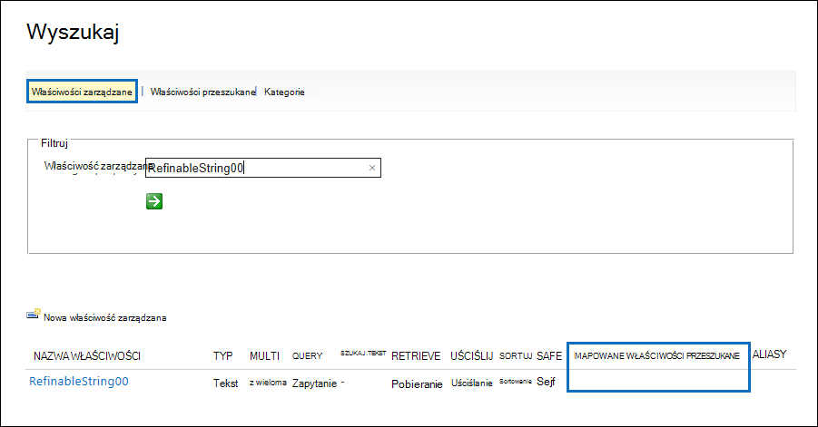
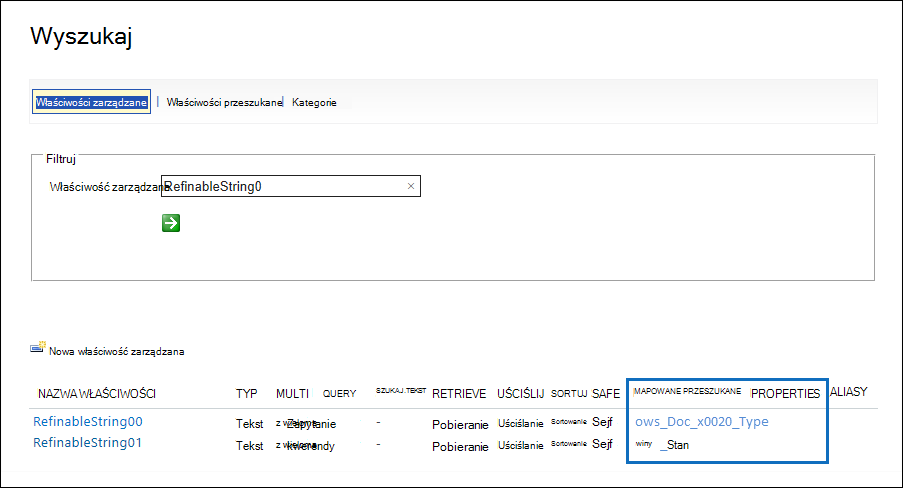
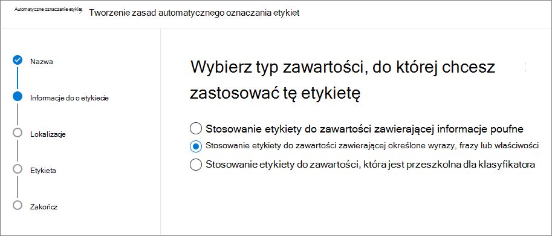
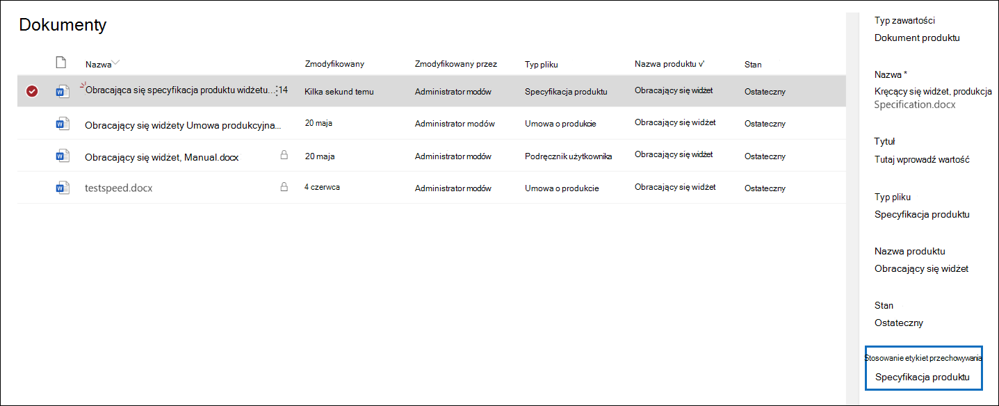

# <a name="use-retention-labels-to-manage-the-lifecycle-of-documents-stored-in-sharepoint"></a>Używanie etykiet przechowywania do zarządzania cyklem życia dokumentów przechowywanych w SharePoint

>*[Microsoft 365 licencjonowania w zakresie zabezpieczeń & zgodności](/office365/servicedescriptions/microsoft-365-service-descriptions/microsoft-365-tenantlevel-services-licensing-guidance/microsoft-365-security-compliance-licensing-guidance).*

W tym artykule opisano, jak zarządzać cyklem życia dokumentów przechowywanych w aplikacji SharePoint przy użyciu automatycznie zastosowanych etykiet przechowywania i przechowywania opartych na zdarzeniach.

Funkcja automatycznego stosowania używa SharePoint klasyfikacji dokumentu. Przykład w tym artykule dotyczy dokumentów związanych z produktem, ale tych samych pojęć można używać w innych scenariuszach. Na przykład w branży produkcyjnej i produkcyjnej możesz użyć jej do zarządzania cyklem życia dokumentów dotyczących fizycznych środków trwałych, takich jak platformy produkcyjne, dzienniki oraz licencje produkcyjne. W branży usług finansowych można zarządzać dokumentami konta bankowego, kredytu hipotecznego lub kontraktu ubezpieczeniowych. W sektorach publicznych możesz zarządzać zezwoleniami na budowa lub formularzami podatkowymi.

W tym artykule przyjrzymy się architekturze i definicji etykiet przechowywania informacji. Następnie będziemy klasyfikować dokumenty, automatycznie stosując etykiety. Na koniec wygenerują zdarzenia, które inicjują okres przechowywania.

## <a name="information-architecture"></a>Architektura informacji

Nasz scenariusz to firma produkcyjna, która używa SharePoint do przechowywania wszystkich dokumentów dotyczących produktów, które opracowuje ta firma. Te dokumenty obejmują specyfikacje produktów, umowy z dostawcami i podręczniki użytkownika. Gdy te dokumenty są przechowywane w SharePoint za pośrednictwem Enterprise zarządzania zawartością, definiowane są metadane dokumentów, które służą do ich klasyfikowania. Każdy dokument ma następujące właściwości metadanych:

- **Typ pliku** (na przykład specyfikacja produktu, umowa lub podręcznik użytkownika)

- **Nazwa produktu**

- **Stan** (wersja robocza lub wersja ostateczna)

Te metadane są podstawą typu zawartości o nazwie *Dokument produkcyjny dla* wszystkich dokumentów.


> [!NOTE]
> Właściwości **Typ dokumentu i** Stan są używane **przez** zasady przechowywania w dalszej części tego scenariusza w celu klasyfikowania i automatycznego stosowania etykiet przechowywania.

Możemy mieć kilka typów zawartości reprezentujących różne typy dokumentów, ale skoncentrujmy się na dokumentacji produktu.

W tym scenariuszu usługa zarządzanych metadanych i magazyn terminów tworzą zestawy terminów dla typu dokumentu, a innego dla *nazwy produktu*. Dla każdego zestawu terminów tworzymy terminy dla każdej wartości. W Twojej organizacji może on wyglądać podobnie do tego w magazynie SharePoint terminach:


*Za pomocą* Centrum typów zawartości można tworzyć i publikować [typy zawartości](https://support.office.com/article/manage-content-type-publishing-06f39ac0-5576-4b68-abbc-82b68334889b). Typ zawartości można również utworzyć i opublikować za pomocą narzędzi do inicjowania obsługi witryn, takich jak schemat [JSON](/sharepoint/dev/declarative-customization/site-design-json-schema#define-a-new-content-type) lub struktury inicjowania obsługi [PnP](/sharepoint/dev/solution-guidance/pnp-provisioning-framework).

Każdy produkt ma dedykowaną SharePoint, która zawiera jedną bibliotekę dokumentów z włączonymi właściwymi typami zawartości. Wszystkie dokumenty są przechowywane w tej bibliotece dokumentów.

[ ](../media/SPRetention3.png#lightbox)

> [!NOTE]
> Zamiast mieć witrynę SharePoint na produkt, firma produkcyjna w tym scenariuszu mogłaby użyć aplikacji Microsoft Team na produkt w celu obsługi współpracy między członkami zespołu, na przykład za pośrednictwem rozmowy trwałej, i użyć  karty Pliki w programie Teams do zarządzania dokumentami. W tym artykule skupimy się tylko na dokumentach, więc będziemy używać tylko witryny.

Oto widok biblioteki dokumentów dla produktu Obracający się widżet:

[ ](../media/SPRetention4.png#lightbox)

Teraz, gdy mamy podstawową architekturę informacji w miejscu do zarządzania dokumentami, przyjrzyjmy się strategii przechowywania i usuwania dokumentów, które korzystają z metadanych, i sklasyfikujmy te dokumenty.

## <a name="retention-and-disposition"></a>Przechowywanie i rozsyłanie

Zasady firmy produkcyjnej dotyczące zarządzania zgodnością i danymi określają sposób zachowywania i usuwania danych. Dokumenty związane z produktem muszą być przechowywane przez cały czas produkcji i przez pewien dodatkowy okres. Dodatkowy okres różni się w przypadku specyfikacji produktu, umów i instrukcji użytkownika. W poniższej tabeli podano wymagania dotyczące przechowywania i przechowywania:

|   Typ dokumentu            |   Przechowywanie                            |   Disposition                                |
| -------------------------- | -------------------------------------- | -------------------------------------------- |
| Specyfikacje produktów      | 5 lat po zatrzymaniu produkcji  | Usuń                                       |
| Umowy dotyczące produktów          | 10 lat po zatrzymaniu produkcji | Recenzja                                       |
| Podręczniki użytkownika                | 5 lat po zatrzymaniu produkcji  | Usuń                                       |
| Wszystkie inne typy dokumentów | Nieuzysłyszaj aktywnie  | Usuwanie dokumentu starszego niż 3 lata <br /><br /> Dokument jest uznawany za starszy niż 3 lata, jeśli nie został zmodyfikowany w ciągu ostatnich 3 lat. |
|||

Za pomocą tej Centrum zgodności platformy Microsoft 365 tworzyć następujące [etykiety przechowywania](retention.md#retention-labels):

  - Specyfikacja produktu

  - Umowa o produkcie

  - Podręcznik użytkownika

W tym artykule pokażemy tylko, jak utworzyć i automatycznie zastosować etykietę przechowywania Specyfikacji produktu. Aby zaimplementować pełny scenariusz, należy również utworzyć i automatycznie zastosować etykiety przechowywania dla pozostałych dwóch typów dokumentów.

### <a name="settings-for-the-product-specification-retention-label"></a>Ustawienia etykiety przechowywania Specyfikacji produktu

Oto plan przechowywania [specyfikacji](file-plan-manager.md) produktu:

- **Nazwa:** Specyfikacja produktu

- **Opis dla użytkowników:** Zachowaj przez 5 lat od zatrzymania produkcji.

- **Opis dla administratorów:** Zachowaj przez 5 lat od zatrzymania produkcji, automatycznego usunięcia, przechowywania opartego na zdarzeniach, typ zdarzenia to *Typ produktu*.

- **Akcja przechowywania:** Zachowywanie i usuwanie.

- **Czas trwania przechowywania:** 5 lat (1825 dni).

- **Etykieta rekordu**: Skonfiguruj etykietę przechowywania, aby oznaczała elementy jako [rekord, co](records-management.md#records) oznacza, że dokumenty oznaczone etykietą nie mogą być następnie modyfikowane ani usuwane przez użytkowników.

- **Deskryptory planu plików:** Aby uprościć ten scenariusz, nie są udostępniane żadne opcjonalne deskryptory plików.

Poniższy zrzut ekranu przedstawia ustawienia podczas tworzenia etykiety przechowywania Specyfikacji produktu w Centrum zgodności platformy Microsoft 365. Podczas tworzenia *etykiety* przechowywania można utworzyć typ zdarzenia Poniesienie produktu. Zapoznaj się z procedurą podaną w następnej sekcji.



> [!NOTE]
> Aby uniknąć 5-letniego oczekiwania na usunięcie dokumentu, jeśli ponownie tworzesz ten scenariusz w środowisku testowym, ustaw czas przechowywania na ***1*** dzień.

### <a name="create-an-event-type-when-you-create-a-retention-label"></a>Tworzenie typu zdarzenia podczas tworzenia etykiety przechowywania

1. Na stronie **Definiowanie ustawień przechowywania** w kreatorze Tworzenie etykiet przechowywania po wybraniu opcji Rozpocznij okres przechowywania na podstawie wybierz **pozycję Utwórz nowy typ zdarzenia**:

    

3. Na stronie **Nadaj typowi zdarzenia nazwę** i opcjonalnie wprowadź **opis produktu** . Następnie wybierz **pozycję Dalej**, **Prześlij** i **Gotowe**.

4. Z powrotem na **stronie Definiowanie ustawień przechowywania** w polu Rozpocznij okres przechowywania na podstawie wybierz utworzony typ zdarzenia Pochłoń produktu  z listy rozwijanej.

    Etykieta przechowywania specyfikacji produktu wygląda tak:

   

6. Wybierz **pozycję** Utwórz etykietę i na następnej stronie po wyświetleniu opcji publikowania etykiety, automatycznego stosowania etykiety lub po prostu zapisania etykiety: Wybierz pozycję Po prostu zapisz na razie etykietę **, a** następnie wybierz pozycję **Gotowe**.

    > [!TIP]
    > Aby uzyskać bardziej szczegółowe instrukcje, [zobacz Tworzenie etykiety, której okres przechowywania jest oparty na zdarzeniu](event-driven-retention.md#step-1-create-a-label-whose-retention-period-is-based-on-an-event).

Teraz przyjrzymy się, jak automatycznie zastosujemy etykietę przechowywania do zawartości specyfikacji produktu.

## <a name="auto-apply-retention-labels-to-documents"></a>Automatyczne stosowanie etykiet przechowywania do dokumentów

Użyjemy języka Keyword Query Language (KQL), aby [automatycznie zastosować](apply-retention-labels-automatically.md) utworzone etykiety przechowywania. KQL to język używany do tworzenia zapytań wyszukiwania. W językach KQL można wyszukiwać przy użyciu słów kluczowych lub właściwości zarządzanych. Aby uzyskać więcej informacji, zobacz Informacje dotyczące składni w języku słowa kluczowego [(KQL](/sharepoint/dev/general-development/keyword-query-language-kql-syntax-reference)).

Po prostu chcemy poinformować Microsoft 365" o "zastosowaniu etykiety przechowywania Specyfikacja produktu do  wszystkich dokumentów, które mają stan wersji ostatecznej i typ  dokumentu specyfikacji  **produktu**". **Przypomnijmy,** że **typy stanów** i dokumentów to kolumny witryny zdefiniowane dla typu zawartości Dokumentacja produktu w sekcji [Architektura](#information-architecture) informacji. W tym celu musimy skonfigurować schemat wyszukiwania.

Gdy SharePoint indeksuje zawartość, automatycznie generuje właściwości przeszukane dla każdej kolumny witryny. W tym scenariuszu interesujemy się właściwościami **Typ** dokumentu i **Stan** . Do utworzenia właściwości przeszukanych potrzebne są dokumenty z biblioteki, które są odpowiednim typem zawartości i mają kolumny witryny wypełnione na potrzeby wyszukiwania.

W centrum <a href="https://go.microsoft.com/fwlink/?linkid=2185219" target="_blank">SharePoint otwórz</a> konfigurację wyszukiwania i wybierz pozycję Zarządzaj schematem wyszukiwania,  aby wyświetlić i skonfigurować właściwości przeszukane.


Jeśli wpiszemy ***status** _ w polu _ *Właściwości* przeszukane* i wybierzemy zieloną strzałkę, rezultat powinien być podobny do tego:


Właściwość **owsStatus\_\_** (zwróć uwagę na podwójne podkreślenie) jest tym, co nas interesuje. Jest ona mapowa **na właściwość Stan** typu zawartości Dokument produkcyjny.

Teraz, jeśli wpiszemy ***owsdoc\_*** i wybierzemy zieloną strzałkę, powinien on wyglądać podobnie do tego:


Właściwość **owsDocx0020Type\_\_\_** jest drugą, zainteresowaną dla nas właściwością. Jest ona mapowa **na właściwość Typ** dokumentu dla typu zawartości Dokument produkcyjny.

> [!TIP]
> Aby określić nazwę właściwości przeszukanej w tym scenariuszu, przejdź do biblioteki dokumentów zawierającej dokumenty produkcyjne. Następnie przejdź do ustawień biblioteki. W **przypadku** opcji Kolumny wybierz nazwę kolumny (na przykład **Stan** **lub Typ** tekstu), aby otworzyć stronę kolumny witryny. Parametr *Field* w adresie URL tej strony zawiera nazwę pola. Nazwa tego pola, poprzedzona ows_", jest nazwą właściwości przeszukanych. Na przykład adres URL `https://tenantname.sharepoint.com/sites/SpinningWidget/_layouts/15/FldEdit.aspx?List=%7BC38C2F45-3BD6-4C3B-AA3B-EF5DF6B3D172%7D&Field=_Status` odpowiada właściwości *przeszukanej owsStatus\_\_*.

Jeśli szukane właściwości przeszukane nie są widoczne w sekcji Zarządzanie schematem wyszukiwania w programie SharePoint administracyjnego:

- Być może dokumenty nie zostały zindeksowane. Możesz wymusić ponowne indeksowanie biblioteki,  >  przechodząc do ustawienia biblioteki **dokumentówDvanced Ustawienia**.

- Jeśli biblioteka dokumentów znajduje się w nowoczesnej witrynie, upewnij się, że administrator SharePoint także administratorem zbioru witryn.

Aby uzyskać więcej informacji o właściwościach przeszukanych i zarządzanych, zobacz [Automatycznie tworzone właściwości zarządzane w SharePoint Server](/sharepoint/technical-reference/automatically-created-managed-properties-in-sharepoint).

### <a name="map-crawled-properties-to-pre-defined-managed-properties"></a>Mapowanie właściwości przeszukanych na wstępnie zdefiniowane właściwości zarządzane

W programie KQL nie można używać właściwości przeszukanych w zapytaniach wyszukiwania. Musi ona używać właściwości zarządzanej. W typowym scenariuszu wyszukiwania tworzymy właściwość zarządzaną i mapuje ją na potrzebną właściwość przeszukaną. Jednak w celu automatycznego stosowania etykiet przechowywania można określić tylko wstępnie zdefiniowane właściwości zarządzane w pliku KQL, a nie niestandardowe właściwości zarządzane. Istnieje zestaw wstępnie zdefiniowanych właściwości zarządzanych w systemie dla ciągu *RefinableString00* do *RefinableString199* , który można użyć. Aby uzyskać pełną listę, zobacz [Domyślne nieużywane właściwości zarządzane](/sharepoint/manage-search-schema#default-unused-managed-properties). Te domyślne właściwości zarządzane są zwykle używane do definiowania funkcji uściślijących wyszukiwanie.

Jeśli zapytanie KQL ma automatycznie stosować poprawną etykietę przechowywania do zawartości dokumentu produktu, mapowane są właściwości przeszukane **owsDocx0020Type\_\_ i owsStatus\_* *\_\_** na dwie zarządzane właściwości, które można uściślić. W naszym środowisku testowym dla tego scenariusza **refinableString00** i **RefinableString01** nie są używane. Ustaliliśmy to, patrząc na pozycję **Właściwości zarządzane w** **oknie Zarządzanie schematem** wyszukiwania w centrum <a href="https://go.microsoft.com/fwlink/?linkid=2185219" target="_blank">SharePoint administracyjnego</a>.

[ ](../media/SPRetention12.png#lightbox)

Zauważ, że **kolumna Mapowane właściwości przeszukane** na poprzednim zrzucie ekranu jest pusta.

Aby zamapować **właściwość przeszukaną owsDocx0020Type\_\_\_**, wykonaj następujące czynności:

1. W polu **Filtr właściwości** zarządzanej wpisz **_nazwę RefinableString00_** i wybierz zieloną strzałkę.

2. Na liście wyników wybierz link **RefinableString00** , a następnie przewiń w dół do sekcji **Mapowania na właściwości przeszukane** .

3. Wybierz **pozycję Dodaj mapowanie**, a następnie wpisz **_owsDocx0020Type\_\_\__*_ w polu _* Search for a crawled property name** (Wyszukaj nazwę właściwości przeszukanych) w oknie wyboru **właściwości przeszukanych**. Wybierz **pozycję Znajdź**.

4. Na liście wyników wybierz pozycję **owsDocx0020Type\_\_\_**, a następnie wybierz przycisk **OK**.

   W sekcji **Mapowane właściwości przeszukane** powinien zostać wyświetlony obraz podobny do tego zrzutu ekranu:

   [ ](../media/SPRetention13.png#lightbox)


5. Przewiń do dołu strony i wybierz przycisk **OK** , aby zapisać mapowanie.

Powtórz te czynności, aby **zamapować wartości RefinableString01** **i owsStatus\_\_**.

Teraz dwie właściwości zarządzane powinny zostać zamapowane na dwie właściwości przeszukane:

[ ](../media/SPRetention14.png#lightbox)

Sprawdźmy, czy konfiguracja jest poprawna, uruchamiając wyszukiwanie w przedsiębiorstwie. W przeglądarce przejdź do strony *https://\<your_tenant>.sharepoint.com/search*. W polu wyszukiwania wpisz ***RefinableString00:"Product Specification"** _ i naciśnij klawisz Enter. To wyszukiwanie powinno zwracać wszystkie dokumenty, które mają parametr _ *Specyfikacja* produktu* **_typu dokumentu_**.

Teraz w polu wyszukiwania wpisz **refinableString00:"Product Specification" AND RefinableString01:Final** i naciśnij klawisz Enter. Powinno to zwrócić wszystkie dokumenty ze **specyfikacją** produktu **_typu_ *dokumentu_ i argumentem _* Stan** **_finalu_**.

### <a name="create-auto-apply-label-policies"></a>Tworzenie zasad automatycznego stosowania etykiet

Po sprawdzeniu, że zapytanie KQL działa, utwórzmy zasady automatycznego stosowania etykiet, które za pomocą zapytania KQL automatycznie zastosują etykietę przechowywania Specyfikacji produktu do odpowiednich dokumentów.

1. W <a href="https://go.microsoft.com/fwlink/p/?linkid=2077149" target="_blank">Centrum zgodności platformy Microsoft 365 przejdź</a> do tematu **Zasady zarządzania** >  **rekordamiZasuń** >  zasady **etykietAutomatyczne stosowanie etykiety**.

   [ ](../media/SPRetention16.png#lightbox)

2. W kreatorze Tworzenie zasad auto etykiet na stronie Nadaj zasady **auto** etykietom wprowadź nazwę, na przykład Etykieta Specyfikacji produktu, i opcjonalny opis. Następnie wybierz pozycję **Dalej**.

3. Na **stronie Wybierz typ** zawartości, do której chcesz zastosować tę etykietę, wybierz pozycję Zastosuj etykietę do zawartości zawierającej określone wyrazy, frazy **lub** właściwości, a następnie wybierz przycisk **Dalej**.

   [ ](../media/SPRetention17.png#lightbox)

   Ta opcja umożliwia nam zapewnienie tego samego zapytania wyszukiwania WKQL, które zostało sprawdzone w poprzedniej sekcji. Zapytanie zwraca wszystkie dokumenty specyfikacji produktu, których stan to *Final*. Gdy użyjemy tego samego zapytania w zasadach automatycznego stosowania etykiet, etykieta przechowywania Specyfikacja produktu zostanie automatycznie zastosowana do wszystkich dokumentów, które ją pasują.

4. Na stronie **Zastosuj etykietę do zawartości** pasującej do tego zapytania wpisz **refinableString00:"Product Specification" AND RefinableString01:Final**, a następnie wybierz pozycję **Dalej**.

   

5. Na **stronie Wybierz lokalizacje do zastosowania** zasad wybierz lokalizacje zawartości, do których chcesz zastosować zasady. W tym scenariuszu zasady są stosowane tylko do lokalizacji SharePoint, ponieważ wszystkie dokumenty produkcyjne są przechowywane SharePoint bibliotekach dokumentów. Przełącz stan dla poczty **e-Exchange,** **OneDrive konta i** grup Microsoft 365 **do** **wyłączone**. Przed wybraniem przycisku Dalej upewnij się, że dla witryn SharePoint jest  ustawiony stan **Wł.**:

    

   > [!TIP]
   > Zamiast stosować zasady do wszystkich SharePoint witryny, możesz wybrać pozycję Wybierz witrynę i dodać  adresy URL dla określonych witryn SharePoint witryny.

6. Na **stronie Wybierz etykietę do automatycznego zastosowania** wybierz pozycję **Dodaj etykietę**.

7. Z listy etykiet przechowywania wybierz pozycję **Specyfikacja produktu**. Następnie wybierz **pozycję Dodaj** i **dalej**.

8. Przejrzyj ustawienia:

    

9. Wybierz **pozycję Prześlij** , aby utworzyć zasady automatycznego stosowania etykiet.

   > [!NOTE]
   > Automatyczne zastosowanie etykiety Specyfikacja produktu do wszystkich dokumentów, które są zgodne z zapytaniem wyszukiwania KQL, trwa do 7 dni.

### <a name="verify-that-the-retention-label-was-automatically-applied"></a>Sprawdzanie, czy etykieta przechowywania została automatycznie zastosowana

Po 7 dniach użyj Eksploratora aktywności w Centrum zgodności, aby sprawdzić, czy utworzone przez nas zasady automatycznego stosowania etykiet automatycznie zastosują etykiety przechowywania do dokumentów produktu.[](data-classification-activity-explorer.md)

Sprawdź też właściwości dokumentów w bibliotece dokumentów. W panelu informacji widać, że etykieta przechowywania zostanie zastosowana do wybranego dokumentu.

[ ](../media/SPRetention21.png#lightbox)

Ponieważ etykiety przechowywania zostały automatycznie zastosowane do dokumentów, są one chronione przed usunięciem, ponieważ etykieta przechowywania została skonfigurowana do deklarowania dokumentów jako *rekordów*. W przykładzie tej ochrony podczas próby usunięcia jednego z tych dokumentów jest wyświetlany następujący komunikat o błędzie:

[ ](../media/SPRetention22.png#lightbox)

## <a name="generate-the-event-that-triggers-the-retention-period"></a>Generowanie zdarzenia wywołującego okres przechowywania

Teraz, gdy etykiety przechowywania zostaną zastosowane, skoncentrujmy się na zdarzeniu, które będzie wskazywać koniec produkcji dla określonego produktu. To zdarzenie wyzwala początek okresu przechowywania zdefiniowanego w etykietach przechowywania. Na przykład w przypadku dokumentów specyfikacji produktu 5-letni okres przechowywania rozpoczyna się po wyzwoleniu zdarzenia "koniec produkcji".

Możesz ręcznie utworzyć zdarzenie w tabeli, Centrum zgodności platformy Microsoft 365 do zdarzenia **Zarządzanie rekordami** > . Możesz wybrać typ zdarzenia, ustawić poprawne identyfikatory zasobów i wprowadzić datę zdarzenia. Aby uzyskać więcej informacji, zobacz [Rozpoczynanie przechowywania w przypadku wystąpienia zdarzenia](event-driven-retention.md).

Jednak w tym scenariuszu wydarzenie zostanie wygenerowane automatycznie z zewnętrznego systemu produkcyjnego. System jest prostą listą SharePoint, która wskazuje, czy produkt jest w produkcji. Przepływ [Power Automate](/power-automate/getting-started), który jest skojarzony z listą, wyzwala zdarzenie. W scenariuszu rzeczywistym można było wygenerować zdarzenie za pomocą różnych systemów, takich jak system HR lub CRM. Power Automate zawiera wiele gotowych do użycia interakcji i bloków obliczeniowych dla obciążeń pracą usługi Microsoft 365, takich jak usługi Microsoft Exchange, SharePoint, Teams i Dynamics 365, a także aplikacje innych firm, takie jak Twitter, Box, Salesforce i Workdays. Ta funkcja ułatwia integrację Power Automate z różnymi systemami. Aby uzyskać więcej informacji, zobacz [Automatyzowanie przechowywania opartego na zdarzeniach](./event-driven-retention.md#automate-events-by-using-a-rest-api).

Poniższy zrzut ekranu przedstawia listę SharePoint, która będzie używana jako wyzwalacz zdarzenia:

[ ](../media/SPRetention23.png#lightbox)

Obecnie w produkcji istnieją dwa produkty, o których informuje ***Tak** _ w kolumnie _ *In Production**. Gdy w tej kolumnie dla produktu ustawiono wartość **_Nie_** , przepływ skojarzony z listą automatycznie wygeneruje zdarzenie. Zdarzenie wyzwala początek okresu przechowywania etykiety przechowywania, który został automatycznie zastosowany do odpowiednich dokumentów produktu.

W tym scenariuszu w celu wyzwolenia zdarzenia użyjemy następującego przepływu:

[ ](../media/SPRetention24.png#lightbox)

Aby utworzyć ten przepływ, zacznij od łącznika SharePoint i wybierz wyzwalacz Kiedy **jest tworzony lub modyfikowany** element. Określ adres witryny i nazwę listy. Następnie dodaj warunek na podstawie tego, że wartość kolumny **w kolumnie W** produkcji jest ustawiona na wartość **_Nie_* _ (lub równą _false* na karcie warunku). Następnie dodaj akcję na podstawie wbudowanego szablonu HTTP. Użyj wartości z poniższej sekcji, aby skonfigurować akcję HTTP. Możesz skopiować wartości dla właściwości **URI** i **Body** z poniższej sekcji i wkleić je do szablonu.

- **Metoda**: POST
- **URI**: `https://ps.compliance.protection.outlook.com/psws/service.svc/ComplianceRetentionEvent`
- **Nagłówki**: Key = Content-Type, Value = application/atom+xml
- **Treść**:

    ```xml
    <?xml version='1.0' encoding='utf-8' standalone='yes'>
    <entry xmlns:d='http://schemas.microsoft.com/ado/2007/08/dataservices' xmlns:m='http://schemas.microsoft.com/ado/2007/08/dataservices/metadata' xmlns='https://www.w3.org/2005/Atom'>
    <category scheme='http://schemas.microsoft.com/ado/2007/08/dataservices/scheme' term='Exchange.ComplianceRetentionEvent'>
    <updated>9/9/2017 10:50:00 PM</updated>
    <content type='application/xml'>
    <m:properties>
    <d:Name>Cessation Production @{triggerBody()?['Product_x0020_Name']?['Value']}</d:Name>
    <d:EventType>Product Cessation&lt;</d:EventType>
    <d:SharePointAssetIdQuery>ProductName:&quot;@{triggerBody()?['Product_x0020_Name']?['Value']}<d:SharePointAssetIdQuery>
    <d:EventDateTime>@{formatDateTime(utcNow(),'yyyy-MM-dd')}</d:EventDateTime>
    </m:properties>
    </content&gt>
    </entry>
    ```

Ta lista zawiera opis parametrów we właściwości **Treść** akcji, które muszą zostać skonfigurowane w tym scenariuszu:

- **Nazwa**: ten parametr określa nazwę zdarzenia, które zostanie utworzone w Centrum zgodności platformy Microsoft 365. W tym scenariuszu nazwa to "Production 2016 *xxx*", gdzie *xxx* to wartość utworzonej wcześniej właściwości zarządzanej **ProductName** .
- **EventType**: Wartość tego parametru odpowiada typowi zdarzenia, do jakiego będzie stosowane utworzone zdarzenie. Ten typ zdarzenia został zdefiniowany podczas tworzenia etykiety przechowywania. W tym scenariuszu typem zdarzenia jest "Klucz produktu".
- **SharePointAssetIdQuery**: Ten parametr definiuje identyfikator zasobu dla zdarzenia. Przechowywanie oparte na zdarzeniach wymaga identyfikator unikatowy dla dokumentu. Identyfikatory elementów zawartości mogą być stosowane do identyfikowania dokumentów, których dotyczy dane zdarzenie, lub, tak jak w tym scenariuszu, kolumny metadanych **Nazwa produktu**. W tym celu musimy utworzyć nową właściwość zarządzaną **ProductName** , która może być używana w zapytaniu KQL. (Alternatywnie można użyć funkcji **RefinableString00** zamiast tworzenia nowej właściwości zarządzanej). Musimy także zamapować tę nową właściwość zarządzaną **na ows_Product_x0020_Name** przeszukaną. Oto zrzut ekranu przedstawiający tę właściwość zarządzaną.

    [ ](../media/SPRetention25.png#lightbox)

- **EventDateTime**: Ten parametr definiuje datę wystąpienia zdarzenia. Użyj bieżącego formatu daty:<br/><br/>*formatDateTime(utcNow(),'yyyy-MM-dd'*)

### <a name="putting-it-all-together"></a>Wszystko razem

Teraz etykieta przechowywania jest tworzona i stosowana automatycznie, a przepływ jest konfigurowany i tworzony. Gdy wartość w kolumnie W  produkcji dla produktu Obracający się widżet na liście Produktów zmieni się z **_Tak_*_ na _*_Nie_ _, zostanie wyzwolona przepływ w celu *utworzenia zdarzenia. Aby wyświetlić to zdarzenie w centrum zgodności, przejdź do tematu _* Zarządzanie rekordami** >  **Zdarzenia**.

[ ](../media/SPRetention28.png#lightbox)

Wybierz zdarzenie, aby wyświetlić szczegóły na wysuwanych stronie. Zauważ, że mimo utworzenia zdarzenia stan zdarzenia wskazuje, SharePoint nie zostały przetworzone żadne witryny ani dokumenty.


Jednak po opóźnieniu stan zdarzenia wskazuje, że SharePoint sieci Web i dokument SharePoint został przetworzony.


Oznacza to, że okres przechowywania etykiety zastosowanej do dokumentu produktu Obracający się widżet został zainicjowany na podstawie daty zdarzenia zdarzenia 2016 -02-457-977-9777. Jeśli scenariusz został zaimplementowany w środowisku testowym przez skonfigurowanie 1-dniowego okresu przechowywania, można przejść do biblioteki dokumentów dla dokumentów produktu kilka dni po utworzeniu zdarzenia i sprawdzić, czy dokument został usunięty (po uruchomieniu zadania usuwania w programie SharePoint).

### <a name="more-about-asset-ids"></a>Więcej informacji o identyfikatorach środków trwałych

Jak [wyjaśniono](event-driven-retention.md) w artykule Rozpoczynanie przechowywania w przypadku wystąpienia zdarzenia, ważne jest zrozumienie relacji między typami zdarzeń, etykietami przechowywania, zdarzeniami i identyfikatorami elementów zawartości. Identyfikator zasobu to po prostu właściwość dokumentu w SharePoint i OneDrive. Ułatwia to zidentyfikowanie dokumentów, w których okres przechowywania zostanie wyzwolony przez zdarzenie. Domyślnie SharePoint ma właściwość Identyfikator zasobu, która może  być włączona do przechowywania sterowanego zdarzeniami:


Jak pokazano na poniższym zrzucie ekranu, właściwość zarządzana identyfikatora zasobu nosi nazwę **ComplianceAssetId**.

[ ](../media/SPRetention27.png#lightbox)

Zamiast używać domyślnej właściwości **Identyfikator** zasobu tak jak w tym scenariuszu, możesz użyć innej właściwości. Należy jednak pamiętać, że jeśli nie określisz identyfikatora zasobu lub słów kluczowych dla zdarzenia, cała zawartość, która ma etykietę tego typu zdarzenia, zostanie wyzwolona przez okres przechowywania.

### <a name="using-advanced-search-in-sharepoint"></a>Korzystanie z wyszukiwania zaawansowanego w programie SharePoint

Na poprzednim zrzucie ekranu widać, że istnieje inna właściwość zarządzana związana z etykietami przechowywania o nazwie **Tag** zgodności, która jest zamapowana na właściwość przeszukaną. Właściwość **zarządzana ComplianceAssetId** jest również mapowana na właściwość przeszukaną. Oznacza to, że możesz używać tych właściwości zarządzanych w wyszukiwaniu zaawansowanym, aby pobrać wszystkie dokumenty, które zostały oznakowane etykietą przechowywania.