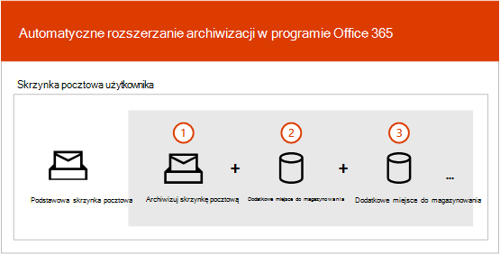
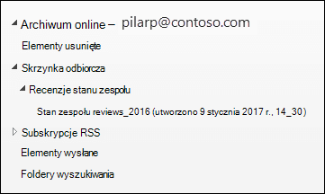

# Informacje o automatycznym rozwijaniu archiwizacji

W Office 365 archiwalne skrzynki pocztowe zapewniają użytkownikom dodatkowe miejsce do magazynowania. Po włączeniu archiwaowej skrzynki pocztowej użytkownika dostępnych jest maksymalnie 100 GB dodatkowej przestrzeni dyskowej. W przeszłości po osiągnięciu limitu 100 GB przestrzeni dyskowej organizacje musiały skontaktować się z firmą Microsoft w celu zażądania dodatkowego miejsca do magazynowania dla archiwaowej skrzynki pocztowej. Na tym nie koniec.

Funkcja archiwizacji w programie Microsoft 365 (nazywana archiwizacją autowyszerzania *) zapewnia* do 1,5 TB dodatkowej przestrzeni dyskowej w archiwalnych skrzynkach pocztowych. Po osiągnięciu przydziału miejsca do magazynowania w archiwaowej skrzynce pocztowej program Microsoft 365 automatycznie (i stopniowo) zwiększa rozmiar archiwum, aż archiwalne skrzynka pocztowa osiągnie rozmiar 1,5 TB.

Aby uzyskać instrukcje krok po kroku dotyczące włączania automatycznego rozszerzania archiwizacji, zobacz [Włączanie automatycznego rozwijania archiwizacji](enable-autoexpanding-archiving.md).

> [!NOTE]
> Automatyczne rozszerzanie archiwizacji obsługuje również udostępnione skrzynki pocztowe. Aby włączyć archiwum dla udostępnionej skrzynki pocztowej, wymagana jest licencja usługi Exchange Online Plan 2 lub Exchange Online Plan 1 z licencją Exchange Online — archiwum e-mail.

## Jak działa automatyczne rozszerzanie archiwum

Jak wyjaśniono wcześniej, dodatkowe miejsce do magazynowania skrzynki pocztowej jest tworzone, gdy jest włączona archiwalne skrzynka pocztowa użytkownika. Gdy jest włączone automatyczne rozszerzanie archiwizacji, Microsoft 365 sprawdza okresowo rozmiar archiwalnej skrzynki pocztowej. Gdy archiwalne skrzynki pocztowe zbliżą się do limitu magazynowania, Microsoft 365 automatycznie tworzy dodatkowe miejsce do magazynowania dla archiwum. Jeśli zabraknie dodatkowego miejsca do magazynowania dla użytkownika, Microsoft 365 więcej miejsca do archiwum użytkownika. Ten proces trwa do momentu, aż archiwum użytkownika osiągnie rozmiar 1,5 TB. Ten proces odbywa się automatycznie, co oznacza, że administratorzy nie muszą prosić o dodatkowe archiwum ani zarządzać automatycznym rozszerzaniem archiwizacji.

Oto krótki przegląd tego procesu.

1. Archiwizacja jest włączona dla skrzynki pocztowej użytkownika lub udostępnionej skrzynki pocztowej. Zostanie utworzona archiwalne skrzynka pocztowa z 100 GB miejsca do magazynowania, a przydział ostrzeżenia dla archiwaowej skrzynki pocztowej zostanie ustawiony na 90 GB.

2. Administrator umożliwia automatyczne archiwizowanie dla skrzynki pocztowej. Gdy archiwalna skrzynka pocztowa (w tym folder Elementy do odzyskania) osiągnie 90 GB, zostanie ona przekonwertowana na archiwum automatycznie rozszerzające się, a program Microsoft 365 dodaje do archiwum miejsce do magazynowania, aż osiągnie maksymalny rozmiar 1,5 TB. Może upłynieć do 30 dni, aż zostanie aprowowana dodatkowa przestrzeń dyskowa.

   > [!NOTE]
   > Jeśli skrzynka pocztowa została umieszczona w archiwum lub przypisana do zasad przechowywania, po włączeniu automatycznego archiwizowania przydział magazynowania dla archiwalnej skrzynki pocztowej zostanie zwiększony do 110 GB. Podobnie przydział z ostrzeżeniem archiwizacji został zwiększony do 100 GB.

3. Microsoft 365 automatycznie dodaje miejsce do magazynowania, jeśli jest to konieczne.

> [!IMPORTANT]
> Automatyczne rozszerzanie archiwizacji jest obsługiwane tylko w przypadku skrzynek pocztowych używanych przez poszczególnych użytkowników (lub udostępnione skrzynki pocztowe) z przyrostem, który nie przekracza 1 GB na dzień. Archiwalne skrzynki pocztowe użytkowników są przeznaczone tylko dla tego użytkownika. Używanie reguł dziennika, transportu lub reguł automatycznego przesyłania dalej w celu kopiowania wiadomości do archiwaowej skrzynki pocztowej nie jest dozwolone. Firma Microsoft zastrzega sobie prawo do zablokowania dodatkowego archiwizowania w przypadkach, gdy archiwizowa skrzynka pocztowa użytkownika jest używana do przechowywania danych archiwum dla innych użytkowników lub w innych przypadkach nieodpowiedniego użycia.

## Co zostanie przeniesione do dodatkowego miejsca do magazynowania archiwum?

Aby efektywnie korzystać z automatycznego rozszerzania magazynu archiwum, foldery mogą zostać przeniesione. Microsoft 365 określa, które foldery są przenoszone po dodaniu do archiwum dodatkowego miejsca do magazynowania. Czasami po przeniesieniu folderu jest tworzony automatycznie jeden lub więcej podfolderów, a elementy z oryginalnego folderu są rozpowszechniane do tych folderów w celu ułatwienia procesu przenoszenia. Podczas wyświetlania archiwalnej części listy folderów w folderze Outlook podfoldery te są wyświetlane w oryginalnym folderze. Konwencją nazewnictwa używaną przez program Microsoft 365 do nazywania tych podfolderów jest _yyyy (Utworzono w **formacie dd mmm, yyyy h_mm), gdzie:\<folder name\>**

- **yyyy jest** rokiem, w którym odebrano wiadomości w folderze.

- **dd mmm, yyyy h_m** to data i godzina utworzenia podfolderu w formacie UTC przez firmę Office 365 na podstawie strefy czasowej i ustawień regionalnych użytkownika w Outlook.

Na poniższych zrzutach ekranu przedstawiono listę folderów przed i po tym, jak wiadomości są przenoszone do archiwum rozszerzonego automatycznie.

 **Przed dodaniu dodatkowego miejsca do magazynowania**

 **Po dodaniu dodatkowej przestrzeni dyskowej**

> [!NOTE]
> Jak opisano wcześniej, Microsoft 365 elementy do podfolderów (i nazywa je za pomocą opisanej powyżej konwencji nazewnictwa), aby ułatwić rozpowszechnianie zawartości do archiwum. Jednak przenoszenie elementów do podfolderów nie zawsze jest tak. Czasami cały folder może zostać przeniesiony do archiwum archiwum archiwum archiwum archiwum archiwum. W takim przypadku folder zachowa pierwotną nazwę.  Nie wiadomo na liście folderów w programie Outlook, że folder został przeniesiony do archiwum archiwum archiwum prywatnego.

## Outlook uzyskiwania dostępu do elementów w archiwum rozwiniętym automatycznie

Aby uzyskać dostęp do wiadomości przechowywanych w archiwum rozszerzonym automatycznie, użytkownicy muszą korzystać z jednego z następujących klientów Outlook klientów:

- Outlook 2016 lub Outlook 2019 dla Windows

- Outlook on the web

- Outlook 2016 lub Outlook 2019 dla komputerów Mac

Podczas korzystania z funkcji Outlook lub Outlook w sieci Web w celu uzyskiwania dostępu do wiadomości przechowywanych w automatycznie rozwiniętym archiwum należy uwzględnić kilka rzeczy.

- Możesz uzyskać dostęp do dowolnego folderu w archiwaowej skrzynce pocztowej, łącznie z folderami, które zostały przeniesione do obszaru automatycznego rozszerzania magazynu.

- Jeśli archiwalne skrzynki pocztowe mają co najmniej jeden automatycznie rozwinięty obszar przechowywania, nie można usunąć folderu z archiwaowej skrzynki pocztowej ani z archiwum. Innymi słowy, po automatycznej rozbudowaniu obszaru magazynu nie można usunąć żadnych folderów z archiwum.

- Możesz usuwać elementy z automatycznie rozwiniętego obszaru przechowywania. Nie można jednak użyć funkcji Odzyskiwanie elementów usuniętych, aby odzyskać element po włączeniu automatycznego archiwizowania dla skrzynki pocztowej.

- Funkcja automatycznego rozszerzania archiwizacji jest dostępna w programie Outlook dla sieci Web (OWA). Podobnie jak w przypadku archiwum online możesz wyszukiwać elementy, które zostały przeniesione do dodatkowego obszaru przechowywania. Po wybraniu zakresu wyszukiwania w programie OWA jako zakresu wyszukiwania zostaną przeszukane wszystkie archiwa (w tym archiwa rozszerzone automatycznie) i odpowiadające im podfoldery. Zwróć uwagę, że wyszukiwanie nie jest obsługiwane w przypadku funkcji archiwum rozszerzonego automatycznie w sytuacji archiwizacji dostępnej tylko w chmurze (podstawowa skrzynka pocztowa nadal jest lokalna).

- Automatyczne rozszerzanie wyszukiwania archiwum jest dostępne w programie Outlook dla Windows w miesięcznym Enterprise kanale. W ramach tej aktualizacji dostępny jest zakres Bieżąca skrzynka pocztowa, dzięki czemu można przeszukiwać archiwum rozszerzone automatycznie. Zwróć uwagę, że wyszukiwanie nie jest obsługiwane w przypadku funkcji archiwum rozszerzonego automatycznie w sytuacji archiwizacji dostępnej tylko w chmurze (podstawowa skrzynka pocztowa nadal jest lokalna). Aby uzyskać więcej informacji na temat tego Microsoft Search i innych funkcji pomocy technicznej, zobacz Outlook aplikacji Windows [połączonej](https://techcommunity.microsoft.com/t5/outlook-global-customer-service/how-outlook-for-windows-connected-to-exchange-online-utilizes/ba-p/1715045) z Exchange Online używa Microsoft Search. 

- Liczba elementów w Outlook oraz Liczba elementów przeczytanych/nieprzeczytanych (w Outlook i Outlook w sieci Web) w archiwum rozwiniętym automatycznie może nie być dokładna.

## Automatyczne rozszerzanie funkcji archiwizacji i innych funkcji zgodności

W tej sekcji wyjaśniono funkcje autoarchiwizowania oraz inne funkcje zgodności i zarządzania danymi.

- **Zbierania elektronicznych materiałów dowodowych:** Podczas korzystania z narzędzia zbierania elektronicznych materiałów dowodowych, takiego jak przeszukiwanie zawartości lub zbierania elektronicznych materiałów dowodowych In-Place, przeszukiwane są również dodatkowe obszary magazynu w archiwum rozszerzonym automatycznie.

- **Przechowywanie:** Po umieszczeniu skrzynki pocztowej w archiwum przy użyciu narzędzi, takich jak Archiwizacja w związku z postępowaniem sądowym w programie Exchange Online lub Archiwizacja podczas zbierania elektronicznych materiałów dowodowych i zasady przechowywania w centrum zabezpieczeń i zgodności, zawartość znajdująca się w archiwum rozszerzonym automatycznie jest także umieszczana w archiwum.

- **Zarządzanie rekordami wiadomości (MRM):** Jeśli używasz zasad usuwania MRM w programie Exchange Online, aby trwale usuwać wygasłe elementy skrzynki pocztowej, elementy wygasłe znajdujące się w archiwum rozszerzonym automatycznie również zostaną usunięte.

- **Usługa importowania:** Aby zaimportować pliki PST Office 365 do automatycznego archiwum użytkownika, możesz użyć usługi importowania plików PST. Do archiwaowej skrzynki pocztowej użytkownika można zaimportować maksymalnie 100 GB danych z plików PST.

## Następne kroki

Aby uzyskać więcej szczegółowych informacji technicznych na temat automatycznego rozszerzania archiwizacji, zobacz Microsoft 365[: automatyczne rozwijanie archiwów — często zadawane pytania](https://techcommunity.microsoft.com/t5/exchange-team-blog/office-365-auto-expanding-archives-faq/ba-p/607784).

Jeśli możesz już włączyć automatyczne rozszerzanie archiwizacji, zobacz [Włączanie automatycznego rozwijania archiwizacji](enable-autoexpanding-archiving.md).
