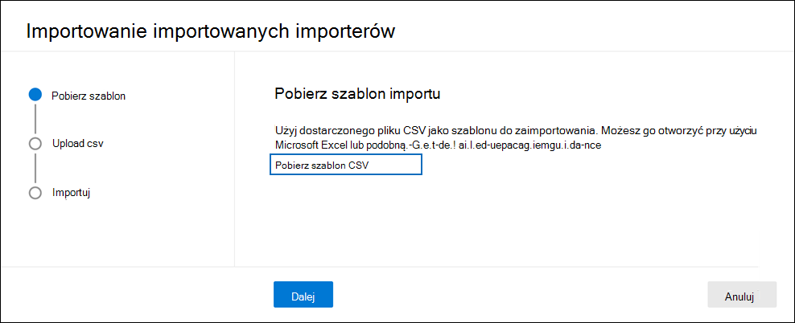

# Importowanie importowanych Advanced eDiscovery przypadku

W Advanced eDiscovery przypadków, w których znajduje się wiele elementów przechowaczy, można zaimportować wiele elementów przechowywczych jednocześnie przy użyciu pliku CSV zawierającego informacje niezbędne do dodania ich do sprawy. Narzędzie do importowania potwierdźy także plik CSV przed utworzeniem zadania importu. Oznacza to, że można naprawić błędy w pliku CSV zamiast czekać na ukończenie zadania importowania przed dodaniem do sprawy błędów uniemożliwiających dodanie do sprawy opiekuna.

## Zanim zaimportujesz importowanie danych

- W jednym pliku CSV można zaimportować maksymalnie 1000 osób-zatrzymaczy (wierszy).

- Dla każdego współpracownika możesz skojarzyć maksymalnie 500 źródeł danych.  

- Zaimportować można tylko zatrzymacze, które są częścią Azure Active Directory.

- Każdy wołodresowy musi mieć unikatowy adres e-mail.

- Aby zaimportować nieaktywną skrzynkę pocztową jako opiekuna lub skojarzyć nieaktywną skrzynkę pocztową z innym opiekunem, dodaj prefiks "." do adresu e-mail nieaktywnej skrzynki pocztowej (na przykład sarad@contoso.onmmicrosoft.com).

## Importowanie importowanych importerów

1. Otwórz kartę Advanced eDiscovery i wybierz **kartę Źródła** danych.

2. Kliknij **pozycję Dodaj źródło** **danychImportuj** >  opiekunów.

3. Na stronie **Kreatora pobierz szablon** kliknij pozycję **Pobierz szablon CSV** , aby pobrać plik CSV z szablonem do przechyłki.

   

4. Dodaj informacje typu poszukasz w pliku CSV i zapisz go na komputerze lokalnym. Szczegółowe informacje [o wymaganych](#custodian-csv-file) właściwościach pliku CSV można znaleźć w sekcji Wiad.

5. Po przygotowaniu pliku CSV  >  z informacjami o kopiach wróć na kartę Źródła danych i  ponownie kliknij pozycję Dodaj źródło **danychImportuj pliki przechowywania**.

6. Na stronie **Upload pliku CSV** kliknij pozycję **Upload csv, a** następnie przekaż plik CSV zawierający informacje o przechowaniu.

   Po przesłaniu pliku CSV kreator importu zweryfikuje plik CSV. Jeśli wystąpią jakiekolwiek błędy sprawdzania poprawności, kreator wyświetli transparent z linkiem do wyświetlania błędów.

   

   Informacje o błędzie identyfikują wiersz i kolumnę komórki zawierającej błąd, a także sugeruje działanie naprawcze. Należy naprawić błędy sprawdzania poprawności, a następnie ponownie pobrać stały plik CSV. Przed utworzeniem zadania importowania i importowania należy pomyślnie sprawdzić poprawność pliku CSV.

7. Po pomyślnym weryfikacji pliku CSV kliknij przycisk **Dalej** , a następnie kliknij pozycję **Importuj** , aby uruchomić zadanie importu.

Po uruchomieniu zadania importu można Advanced eDiscovery czynności:

- Tworzy zadanie o nazwie **BulkAddCustodian** na **karcie Zadania** sprawy.

- Wykonuje indeksowanie zaawansowane wszystkich źródeł danych dla każdego opiekuna.

- Umieszcza wszystkie źródła danych w miejscu przechowywania (jeśli dla właściwości **Is OnHold** w pliku CSV ustawiono wartość TRUE)

Po zakończeniu zadania przetwarzania pliku importowego do strony Źródła danych sprawy są dodawane do źródła danych osób,  które przechowają dane i skojarzone z nimi źródła danych.

## Szybki plik CSV

Po pobraniu szablonu wtłaczanego pliku CSV możesz dodać osób- i ich źródła danych w każdym wierszu. Nie zmieniaj nazw kolumn w wierszu nagłówka. Kolumny lokalizacji typu obciążenia i obciążenia pracą można skojarzyć z innymi źródłami danych.

| Nazwa kolumny|Opis|
|:------- |:------------------------------------------------------------|
|**Wybłędy kontaktoweEmail**     |Adres e-mail upn użytkownika w uchocie Na przykład: sarad@contoso.onmicrosoft.com.           |
|**Exchange włączone** | Wartość PRAWDA/FAŁSZ uwzględnia skrzynkę pocztową użytkownika- lub nie.      |
|**OneDrive włączone** | Wartość PRAWDA/FAŁSZ, która uwzględnia lub nie uwzględnia konta OneDrive dla Firm klienta. |
|**Is OnHold**        | Wartość PRAWDA/FAŁSZ wskazująca, czy należy umieścić wstrzymywanie źródeł danych w danych do przechowywania. 1     |
|**Workload1 Type**         |Wartość ciągu wskazująca typ źródła danych, które ma skojarzyć ze współpracownikiem. Możliwe wartości:  - ExchangeMailbox  - SharePointSite - TeamsMailbox2 — YammerMailbox2. W poprzednich wartościach tych typów obciążenia jest wielkość liter. Plik CSV zawiera kolumny dla trzech typów obciążenia pracą i odpowiadających im lokalizacji obciążenia pracą. Możesz dodać łącznie 500 typów i lokalizacji obciążenia pracą.|
|**Lokalizacja obciążenia pracą1**     | W zależności od typu obciążenia pracą będzie to lokalizacja źródła danych. Może to być na przykład adres e-mail Exchange skrzynki pocztowej lub adres URL SharePoint pocztowej. |
|||

> [!NOTE]
> 1 Jeśli w razie potrzeby wstrzymasz więcej niż 1000 skrzynek pocztowych lub 100 witryn, system automatycznie przeskaluje hold usługi zbierania elektronicznych materiałów dowodowych zgodnie z potrzebami. Oznacza to, że system automatycznie dodaje lokalizacje danych do wielu zasad przechowywania, zamiast dodawać je do jednej zasady. Nadal jednak obowiązuje limit 10 000 zasad przechowywania przypadków na organizację. Aby uzyskać więcej informacji na temat limitów blokowania, [zobacz Limity w Advanced eDiscovery](limits-ediscovery20.md#hold-limits).
 
> 2 Jeśli dołączysz obciążenia usługi TeamsMailbox i YammerMailbox do pliku CSV, witryna grupy (TeamSite i YammerSite) zostanie domyślnie dodana automatycznie. Nie musisz osobno określać w pliku CSV teamssite i yammersite.

Oto przykładowy plik CSV z informacjami o użytkownikach:  

|Wybłędy kontaktoweEmail      | Exchange włączone | OneDrive włączone | Is OnHold | Workload1 Type | Lokalizacja obciążenia pracą1             |
| ----------------- | ---------------- | ---------------- | --------- | -------------- | ------------------------------ |
|robinc@contoso.onmicrosoft.com | TRUE (PRAWDA)             | TRUE (PRAWDA)             | TRUE (PRAWDA)      | SharePointSite | https://contoso.sharepoint.com |
|pillarp@contoso.onmicrosoft.com | TRUE (PRAWDA)             | TRUE (PRAWDA)             | TRUE (PRAWDA)      | |  |
|johnj@contoso.onmicrosoft.com|TRUE (PRAWDA)|TRUE (PRAWDA)|TRUE (PRAWDA)||
|sarad@contoso.onmicrosoft.com|TRUE (PRAWDA)|TRUE (PRAWDA)|TRUE (PRAWDA)|ExchangeMailbox|saradavis@contoso.onmicrosoft.com
||||||

> [!NOTE]
> Jak wyjaśniono wcześniej, dodaj prefiks "." do adresu UPN nieaktywnej skrzynki pocztowej, aby zaimportować nieaktywną skrzynkę pocztową jako współpracownika lub skojarzyć nieaktywną skrzynkę pocztową z innym adresatem.
