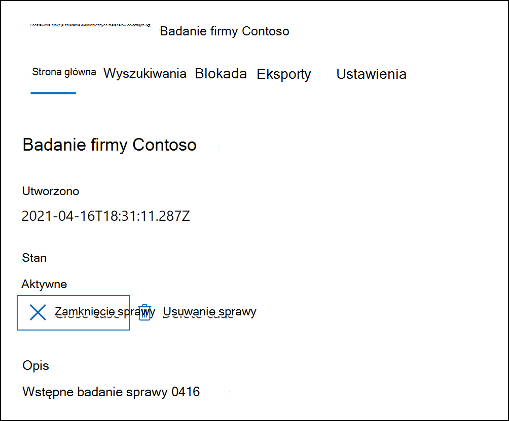

# Zamykanie, ponowne otwieranie i usuwanie podstawowej sprawy zbierania elektronicznych materiałów dowodowych

W tym artykule opisano, jak zamykać, ponownie otwierać i usuwać podstawowe sprawy zbierania elektronicznych materiałów dowodowych w Microsoft 365.

## Zamykanie sprawy

Po zakończeniu postępowania sądowego lub dochodzenia obsługiwanego przez podstawową sprawę zbierania elektronicznych materiałów dowodowych możesz ją zamknąć. Oto co się dzieje po zamknięciu sprawy:
  
- Jeśli sprawa zawiera jakiekolwiek zbierania elektronicznych materiałów dowodowych, zostaną one wyłączone. Po zakończeniu stosowania blokowania do lokalizacji zawartości, które były wstrzymywane, jest stosowany 30-dniowy okres prolongaty (nazywany opóźnieniem). Pomaga to zapobiec natychmiastowemu usunięciu zawartości i daje administratorom możliwość wyszukania i przywrócenia zawartości przed jej trwałym usunięciem po wygaśnięciu okresu opóźnienia. Aby uzyskać więcej informacji, [zobacz Usuwanie lokalizacji zawartości z zawieszonego zbierania elektronicznych materiałów dowodowych](create-ediscovery-holds.md#removing-content-locations-from-an-ediscovery-hold).

- Zamknięcie sprawy powoduje tylko wyłączenie zarchiwów, które są skojarzone z tą sprawą. Jeśli w lokalizacji zawartości są umieszczone inne blokady (na przykład w związku z postępowaniem sądowym, zasady przechowywania lub blokady z innej podstawowej sprawy zbierania elektronicznych materiałów dowodowych), te blokady nadal będą zachowywane.

- Sprawa nadal będzie wymieniona na stronie Podstawowe zbierania elektronicznych materiałów dowodowych w Centrum zgodności platformy Microsoft 365. Szczegóły, blokady, wyszukiwania i członkowie zamkniętej sprawy zostaną zachowane.

- Możesz edytować sprawę po jej zamknięciu. Możesz na przykład dodawać lub usuwać członków, tworzyć wyszukiwania i eksportować wyniki wyszukiwania. Podstawową różnicą między aktywnymi a zamkniętymi sprawami jest wyłączenie zbierania elektronicznych materiałów dowodowych po zamknięciu sprawy.

Aby zamknąć sprawę:
  
1. W Centrum zgodności platformy Microsoft 365 **eDiscoveryCore** > , aby wyświetlić listę podstawowych spraw zbierania elektronicznych materiałów dowodowych w organizacji.

2. Kliknij nazwę sprawy, którą chcesz zamknąć.

   

3. Na stronie głównej w obszarze **Stan** kliknij pozycję **Zamknij sprawę**.

    Zostanie wyświetlone ostrzeżenie z informacją, że blokady skojarzone ze sprawą zostaną wyłączone.

4. Kliknij **przycisk Tak,** aby zamknąć sprawę.

    Stan na stronie głównej sprawy zmienia się z Aktywny na  **Zamykający**.

5. Na stronie **Podstawowe zbierania elektronicznych materiałów dowodowych** **kliknij pozycję Odśwież** , aby zaktualizować stan zamkniętej sprawy. Ukończenie procesu zamykania może potrwać do 60 minut.

    Po zakończeniu procesu stan sprawy zmienia się na **Zamknięty na stronie** Podstawowe **zbierania** elektronicznych materiałów dowodowych.

## Ponowne otwieranie zamkniętej sprawy

Po ponownym otwarciu sprawy wszelkie blokady zbierania elektronicznych materiałów dowodowych, które miały miejsce po zamknięciu sprawy, nie zostaną automatycznie przywrócone. Po ponownym otwarciu sprawy musisz przejść na stronę Z **blokady i** włączyć poprzednie blokady. Aby włączyć wstrzymaj, wybierz ją, aby wyświetlić stronę wysuwaną, a następnie ustaw przełącznik **Status** na **Wł**.
  
1. W Centrum zgodności platformy Microsoft 365 **eDiscoveryCore** > , aby wyświetlić listę podstawowych spraw zbierania elektronicznych materiałów dowodowych w organizacji.

2. Kliknij nazwę sprawy, którą chcesz otworzyć ponownie.

   

3. Na stronie głównej w obszarze **Stan** kliknij pozycję **Otwórz ponownie sprawę**.

    Zostanie wyświetlone ostrzeżenie z informacją, że blokady, które były skojarzone ze sprawą w momencie jej zamknięcia, nie zostaną włączone automatycznie.

4. Kliknij **przycisk Tak,** aby ponownie otworzyć sprawę.

    Stan strony wysuwanego strony głównej sprawy zostanie zmieniony z Zamknięte **na** **Aktywne**.

5. Na stronie **Podstawowe zbierania elektronicznych materiałów dowodowych** **kliknij pozycję Odśwież** , aby zaktualizować stan ponownej sprawy. Ponowne otwarcie może potrwać do 60 minut. 

    Po zakończeniu procesu stan sprawy zmienia się na **Aktywny na stronie** Podstawowe zbierania elektronicznych materiałów **dowodowych** .

6. (Opcjonalnie) Aby włączyć wszelkie blokady skojarzone z ponownie otwarta sprawą, przejdź do karty  Zarchiwniaki, wybierz hold, a następnie zaznacz pole wyboru w obszarze **Stan** na wysuwanych stronie hold.
  
## Usuwanie sprawy

Możesz również usuwać aktywne i zamknięte sprawy zbierania elektronicznych materiałów dowodowych. Usunięcie sprawy powoduje usunięcie wszystkich wyszukiwań i eksportów w tym przypadku, a sprawa zostanie usunięta z listy spraw na stronie Podstawowe sprawy zbierania elektronicznych  materiałów dowodowych w Centrum zgodności platformy Microsoft 365. Usuniętej sprawy nie można otworzyć ponownie.

Przed usunięciem sprawy (aktywnej lub zamkniętej) należy najpierw usunąć wszystkie zbierania elektronicznych materiałów  dowodowych skojarzone ze sprawą. Obejmuje to usuwanie blokady ze stanem **Wyłączone**. 

Aby usunąć hold zbierania elektronicznych materiałów dowodowych:

1. Przejdź na **kartę Z blokady** w przypadku, gdy chcesz usunąć.

2. Zaznacz wstrzymaj, który chcesz usunąć.

3. Na stronie wysuwu kliknij pozycję **Usuń**.

      

Aby usunąć sprawę:

1. W Centrum zgodności platformy Microsoft 365 **eDiscoveryCore** > , aby wyświetlić listę podstawowych spraw zbierania elektronicznych materiałów dowodowych w organizacji.

2. Kliknij nazwę sprawy, którą chcesz usunąć.

3. Na stronie głównej sprawy w obszarze **Stan** kliknij pozycję **Usuń sprawę**.

      

Jeśli sprawa, która próbujesz usunąć, nadal zawiera blokady zbierania elektronicznych materiałów dowodowych, zostanie wyświetlony komunikat o błędzie. Musisz usunąć wszystkie blokady skojarzone ze sprawą, a następnie spróbować ponownie usunąć sprawę.
