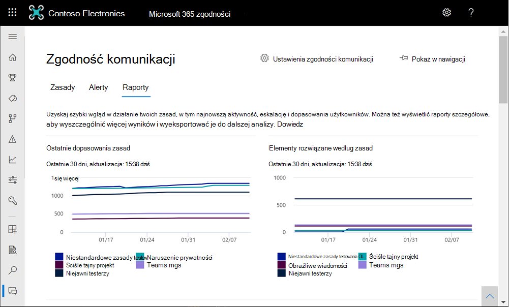
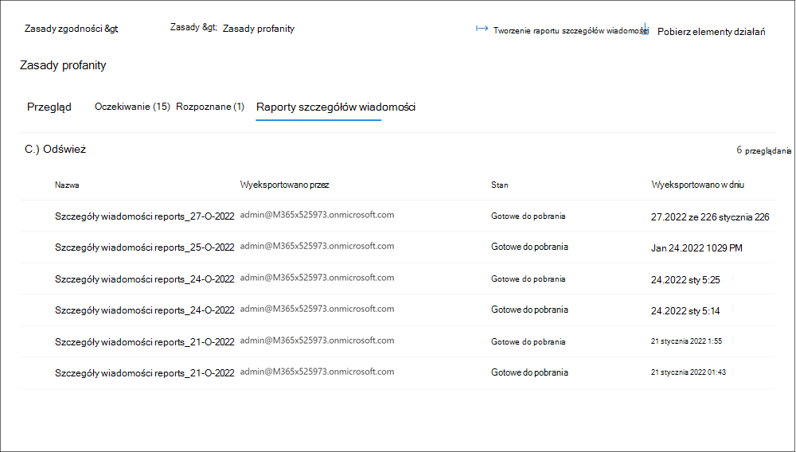

# <a name="use-communication-compliance-reports-and-audits"></a>Korzystanie z raportów dotyczących zgodności komunikacji i inspekcji

## <a name="reports"></a>Raporty

Nowy pulpit **nawigacyjny Raporty** jest centralną lokalizacją przeglądania wszystkich raportów zgodności komunikacji. Widżety raportów zapewniają szybki podgląd najczęściej potrzebnych informacji do ogólnej oceny stanu działań dotyczących zgodności komunikacji. Informacji zawartych w widżetach raportów nie można eksportować. Raporty szczegółowe zawierają szczegółowe informacje dotyczące określonych obszarów zgodności komunikacji oraz zapewniają możliwości filtrowania, grupowania, sortowania i eksportowania informacji podczas przeglądania. 

W przypadku filtru zakresu dat data i godzina zdarzeń są podane w uniwersalnym czasie koordynowanej (UTC). Podczas filtrowania wiadomości dla raportów lokalna data/godzina użytkownika żądającego określa wyniki na podstawie konwersji lokalnej daty/czasu użytkownika na czas UTC. Jeśli na przykład użytkownik w czasie pacyficznego czasu letniego (PDT) filtruje raport od 2021-08-30 do 2021-08-31 o 00:00, raport będzie zawierał wiadomości od 2021-08-30 07:00 czasu UTC do 2021-08-31 07:00. Jeśli ten sam użytkownik był w czasie wschodnioletniego (EDT) podczas filtrowania o godzinie 00:00, raport będzie zawierał wiadomości z dnia 2021-08-30 w godzinach 04:00 czasu UTC do godziny 2021-08-31 04:00 czasu UTC.



Pulpit **nawigacyjny Raporty** zawiera następujące widżety raportów i linki do szczegółowych raportów:

### <a name="report-widgets"></a>Widżety raportów

- **Ostatnie dopasowania zasad**: wyświetla liczbę dopasowania według aktywnych zasad w czasie.
- **Rozwiązano elementy według zasad**: wyświetla liczbę alertów o dopasowaniach zasad rozwiązanych przez zasady w czasie.
- **Użytkownicy, których zasady są najbardziej** zgodne: wyświetla użytkowników (lub zanonimizowane nazwy użytkowników) oraz liczbę dopasowań zasad dla danego okresu.
- **Zasady z największą liczbą dopasowania**: wyświetla zasady i liczbę dopasowania dla danego okresu w klasyfikacji od największej do najmniejszej w przypadku dopasowania.
- **Eskalacji według zasad**: wyświetla liczbę eskalacji na zasady w danym czasie.

### <a name="detailed-reports"></a>Raporty szczegółowe

Użyj opcji *Eksportuj* , aby utworzyć plik .csv zawierający szczegóły raportu dla dowolnego raportu szczegółowego.

- **Ustawienia i stan** zasad: umożliwia szczegółowe spojrzenie na konfigurację i ustawienia zasad, a także ogólny stan każdej zasady (dopasowania i akcje) w wiadomościach. Zawiera informacje o zasadach oraz skojarzyć zasady z użytkownikami i grupami, lokalizacje, przeglądanie wartości procentowych, recenzentów, stan i czas ostatniej modyfikacji zasad. Użyj opcji *Eksportuj* , aby utworzyć plik .csv zawierający szczegóły raportu.
- **Elementy i akcje według zasad**: Przeglądanie i eksportowanie pasujących elementów oraz działań naprawczych dla per zasad. Zawiera informacje o zasadach i skojarzona z nimi zasady:

    - Elementy dopasowane
    - Eskalacji elementów
    - Rozpoznane elementy
    - Otagowane jako zgodne
    - Otagowane jako niezgodne
    - Otagowane jako znak zapytania
    - Elementy oczekujące na recenzję
    - Użytkownik został powiadomiony
    - Utworzono sprawę

- **Element i akcje dla lokalizacji**: Przejrzyj i wyeksportuj pasujące elementy oraz akcje naprawcze na Microsoft 365 lokalizacji. Zawiera informacje o skojarzona z nią platformach obciążeń:

    - Elementy dopasowane
    - Eskalacji elementów
    - Rozpoznane elementy
    - Otagowane jako zgodne
    - Otagowane jako niezgodne
    - Otagowane jako znak zapytania
    - Elementy oczekujące na recenzję
    - Użytkownik został powiadomiony
    - Utworzono sprawę

- **Aktywność według użytkownika**: Przeglądanie i eksportowanie pasujących elementów oraz akcji naprawczych dla każdego użytkownika. Zawiera informacje o skojarzona z nim skojarzona z:

    - Elementy dopasowane
    - Eskalacji elementów
    - Rozpoznane elementy
    - Otagowane jako zgodne
    - Otagowane jako niezgodne
    - Otagowane jako znak zapytania
    - Elementy oczekujące na recenzję
    - Użytkownik został powiadomiony
    - Utworzono sprawę

- **Typ informacji poufnych na lokalizację** (wersja zapoznawcza): Przeglądanie i eksportowanie informacji o wykrywaniu typów informacji poufnych i skojarzonych ze źródłami w zasadach zgodności komunikacji. Zawiera ogólną sumę oraz określony podział wystąpień typów informacji poufnych w źródłach skonfigurowanych w organizacji. Wartości dla każdego źródła innej firmy są wyświetlane w osobnych kolumnach w .csv pliku. Przykłady:

    - **Poczta e-mail**: Typy informacji poufnych wykryte w Exchange e-mail.
    - **Teams**: Typy informacji poufnych wykryte w Microsoft Teams i wiadomościach czatu.
    - **Skype dla firm**: Typy informacji poufnych wykryte w programie Skype komunikacji biznesowej.
    - **Yammer**: Typy informacji poufnych wykryte w Yammer, wpisach, czatach i odpowiedziach.
    - **Źródła innych firm: typy** informacji poufnych wykryte w przypadku działań skojarzonych z łącznikami innych firm skonfigurowanymi w organizacji. Aby wyświetlić zestawienie źródeł innych firm dla określonego typu informacji poufnych w raporcie, umieść wskaźnik myszy na wartości dla typu informacji poufnych w kolumnie Źródło innych firm.
    - **Inne**: Typy informacji poufnych używane do wewnętrznego przetwarzania systemu. Zaznaczenie lub usunięcie zaznaczenia tego źródła dla raportu nie ma wpływu na żadne wartości.

### <a name="message-details-report-preview"></a>Raport szczegółów wiadomości (wersja zapoznawcza)

Tworzenie raportów niestandardowych i przeglądanie szczegółów wiadomości zawartych w określonych zasadach na **karcie** Zasady. Te raporty mogą być używane do wszystkich przeglądów wiadomości i tworzenia migawki raportu stanu wiadomości w dostosowywalnym okresie. Po utworzeniu raportu możesz wyświetlić i pobrać raport szczegółów jako plik .csv na karcie **Raporty szczegółów** wiadomości.



Aby utworzyć raport ze szczegółami nowej wiadomości, wykonaj następujące czynności:

1. Zaloguj się do Centrum zgodności platformy Microsoft 365 za pomocą konta, które jest członkiem grupy ról Grupy członków *zgodności* komunikacji.
2. Przejdź do karty **Zasady** , wybierz zasady, a następnie wybierz pozycję **Utwórz raport szczegółów wiadomości**.
3. W **okienku Utwórz raport ze szczegółami** wiadomości wprowadź nazwę raportu w **polu Nazwa** raportu.
4. W **przycisku Wybierz zakres dat** wybierz dla raportu wartości *Data rozpoczęcia* i Data zakończenia.
5. Wybierz pozycję **Utwórz**.
6. Zostanie wyświetlone potwierdzenie utworzenia raportu.

W zależności od liczby elementów w raporcie może mi potrwać od kilku minut do godzin, zanim raport będzie gotowy do pobrania. Postęp możesz sprawdzić na karcie Raporty szczegółów wiadomości. Raport ma stan *W toku* lub *Gotowe do pobrania*. Możesz jednocześnie przetwarzać maksymalnie 15 oddzielnych raportów. Aby pobrać raport, wybierz raport w stanie *Gotowe do* pobrania, a następnie wybierz pozycję **Pobierz raport**.

> [!NOTE]
> Jeśli wybrany okres nie powoduje zwrócenia żadnych wiadomości w raporcie, oznacza to, że w wybranym okresie nie było żadnych komunikatów. Raport będzie pusty.

Raporty szczegółów wiadomości zawierają następujące informacje dla każdego elementu wiadomości w zasadach:

- **Identyfikator dopasowania**: unikatowy identyfikator wiadomości w zasadach.
- **Nadawca**: nadawca wiadomości.
- **Adresaci**: adresaci wiadomości.
- **Data wysłania**: data wysłania wiadomości.
- **Data dopasowania**: data dopasowania wiadomości do warunków zasad.
- **Temat**: temat wiadomości.
- **Zawiera załączniki**: stan wszystkich załączników wiadomości. Wartości to Tak lub Nie.
- **Nazwa zasad**: nazwa zasady skojarzonej z wiadomością. Ta wartość będzie taka sama dla wszystkich wiadomości w raporcie.
- **Stan elementu**: stan elementu wiadomości w zasadach. Wartości są oczekujące lub rozwiązane.
- **Tagi**: tagi przypisane do wiadomości. Wartości mogą być wątpliwości, zgodne lub niezgodne.
- **Dopasowania słów** kluczowych: dopasowania słów kluczowych do wiadomości.
- **Recenzentzy**: recenzentzy przypisani do wiadomości.
- **Oczekiwanie przez (dni)**: liczba dni, przez które wiadomość była w stanie oczekiwania. W przypadku rozwiązanych wiadomości wartość wynosi 0.
- **Komentarz do rozwiązania**: komentarze do wiadomości wprowadzonej podczas rozwiązania.
- **Data rozwiązania**: data i godzina rozwiązania wiadomości.
- **Ostatnia aktualizacja według**: nazwa użytkownika ostatniej aktualizacji.
- **Ostatnia aktualizacja w** dniu: data i godzina ostatniej aktualizacji wiadomości.
- **Historia komentarzy**: lista wszystkich komentarzy do alertu wiadomości, łącznie z autorem komentarza i datą/godziną komentarza.

## <a name="audit"></a>Inspekcja

W niektórych przypadkach należy udostępnić informacje audytorom wymogów prawnych lub zgodności, aby potwierdzić nadzór nad działaniami użytkowników i komunikacją. Te informacje mogą być podsumowaniem wszystkich działań skojarzonych ze zdefiniowanymi zasadami organizacji lub w dowolnym momencie, gdy zmienią się zasady zgodności komunikacji. Zasady zgodności komunikacji mają wbudowane ślady inspekcji w celu pełnej gotowości do inspekcji wewnętrznej lub zewnętrznej. Szczegółowe historie inspekcji wszystkich działań związanych z tworzeniem, edytowaniem i usuwaniem są przechwytywane przez zasady komunikacji w celu potwierdzenia procedur nadzorczych.

> [!IMPORTANT]
> Aby zdarzenia zgodności komunikacji nagrywały, inspekcja musi być włączona w organizacji. Aby włączyć inspekcję, [zobacz Włączanie dziennika inspekcji](communication-compliance-configure.md#step-2-required-enable-the-audit-log). Gdy działania powodują wyzwolenie zdarzeń rejestrowanych w dzienniku Microsoft 365 inspekcji, ich wyświetlenie w zasadach zgodności komunikacji może potrwać do 48 godzin.

Aby wyświetlić działania aktualizacji zasad zgodności komunikacji, wybierz kontrolkę aktualizacji zasad eksportu na stronie głównej dla dowolnych zasad. Aby wyeksportować działania aktualizujące *,* musisz  mieć przypisane role administratora globalnego lub administratora zgodności komunikacji. Ta akcja generuje plik inspekcji w formacie .csv zawierającym następujące informacje:

|**Pole**|**Szczegóły**|
|:-----|:-----|
| **CreationDate** | Data wykonania działania aktualizacji w zasadach. |
| **UserIds** | Użytkownik, który wykonał działanie aktualizacji w zasadach. |
| **Operacje** | Operacje aktualizacji wykonywane na zasadach. |
| **Dane inspekcji** | To pole jest głównym źródłem danych dla wszystkich działań aktualizacji zasad. Wszystkie działania aktualizacji są rejestrowane i rozdzielone przecinkami. |

Aby wyświetlić działania związane z przeglądem zgodności komunikacji dla zasad,  wybierz kontrolkę Eksportowanie działań przeglądu na stronie **Omówienie** dla określonych zasad. Aby wyeksportować działania przeglądowe *,* musisz mieć  przypisane role administratora globalnego lub administratora zgodności komunikacji. Ta akcja generuje plik inspekcji w formacie .csv zawierającym następujące informacje:

|**Pole**|**Szczegóły**|
|:-----|:-----|
| **CreationDate** | Data wykonania działania rerecenzenta w zasadach. |
| **UserIds** | Użytkownik, który wykonał działanie rerecenzenta w zasadach. |
| **Operacje** | Operacje przeglądu wykonywane na zasadach. |
| **Dane inspekcji** | To pole jest głównym źródłem danych dla wszystkich działań przeglądu zasad. Wszystkie działania przeglądowe są rejestrowane i rozdzielone przecinkami. |

Działania inspekcji można także wyświetlać w ujednoliconym dzienniku inspekcji lub za pomocą polecenia cmdlet programu PowerShell [Search-UnifiedAuditLog](/powershell/module/exchange/search-unifiedauditlog) . Aby dowiedzieć się więcej o zasadach przechowywania dziennika inspekcji, zobacz [Zarządzanie zasadami przechowywania dziennika inspekcji](audit-log-retention-policies.md).

Na przykład w poniższym przykładzie są zwracane działania ze wszystkich działań przeglądu nadzorczych (zasad i reguł):

```PowerShell
Search-UnifiedAuditLog -StartDate $startDate -EndDate $endDate -RecordType AeD -Operations SupervisoryReviewTag
```

W tym przykładzie są zwracane działania aktualizacji dla zasad zgodności komunikacji:

```PowerShell
Search-UnifiedAuditLog -StartDate $startDate -EndDate $endDate -RecordType Discovery -Operations SupervisionPolicyCreated,SupervisionPolicyUpdated,SupervisionPolicyDeleted
```

W tym przykładzie są zwracane działania zgodne z bieżącymi zasadami zgodności komunikacji:

```PowerShell
Search-UnifiedAuditLog -StartDate $startDate -EndDate $endDate -Operations SupervisionRuleMatch
```

Dopasowania do zasad zgodności komunikacji są przechowywane w skrzynkach pocztowych pod nadzorem poszczególnych zasad. W niektórych przypadkach może być konieczne sprawdzenie rozmiaru skrzynki pocztowej pod nadzorem, aby uzyskać zasady, aby upewnić się, że nie zbliża się do bieżącego limitu 100 GB przestrzeni dyskowej lub miliona wiadomości. Po osiągnięciu limitu skrzynki pocztowej dopasowania zasad nie są przechwytywane i musisz utworzyć nowe zasady (z tych samych ustawień), aby nadal przechwytywać dopasowania dla tych samych działań.

Aby sprawdzić rozmiar skrzynki pocztowej pod nadzorem dla zasad, wykonaj następujące czynności:

1. Użyj polecenia [cmdlet Połączenie-ExchangeOnline](/powershell/module/exchange/connect-exchangeonline) w module V2 programu Exchange Online PowerShell, aby połączyć się z programem Exchange Online PowerShell przy użyciu nowoczesnego uwierzytelniania.
2. Uruchom następujące polecenie w programie PowerShell:

    ```PowerShell
    ForEach ($p in Get-SupervisoryReviewPolicyV2 | Sort-Object Name)
    {
       "<Name of your communication compliance policy>: " + $p.Name
       Get-MailboxStatistics $p.ReviewMailbox | ft ItemCount,TotalItemSize
    }
    ```
