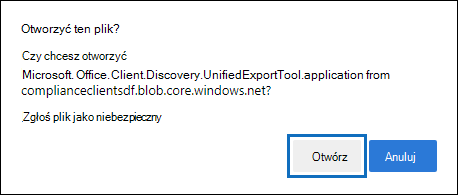
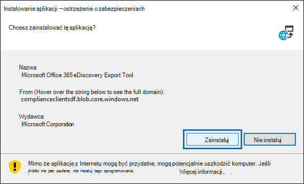

# Używanie narzędzia eDiscovery Export Tool w programie Microsoft Edge

W wyniku ostatnich zmian w najnowszej wersji pakietu Microsoft Edge obsługa ClickOnce jest już domyślnie włączona. Aby nadal pobierać wyniki wyszukiwania zawartości lub wyszukiwania zbierania elektronicznych materiałów dowodowych za pomocą narzędzia eDiscovery Export Tool, należy użyć programu [Microsoft Internet Explorer](https://support.microsoft.com/help/17621/internet-explorer-downloads) lub włączyć obsługę programu ClickOnce w najnowszej wersji programu Microsoft Edge.

## Włączanie ClickOnce technicznej w Microsoft Edge

1. W Microsoft Edge **przejdź do edge://flags/#edge-click-once**.

2. Jeśli istniejąca wartość jest ustawiona na wartość  **Domyślna** lub Wyłączona na liście rozwijanej, zmień ją na **Włączono**.

   

3. Przewiń w dół do dołu okna przeglądarki i kliknij pozycję Uruchom **ponownie, aby ponownie** uruchomić przeglądarkę Edge.

   

**Uwaga:** Organizacje mogą używać programu zasady grupy w celu wyłączenia ClickOnce technicznej. Aby sprawdzić, czy istnieją zasady organizacji dotyczące ClickOnce, przejdź do **edge://policy**. Poniższy zrzut ekranu przedstawia, ClickOnce w całej organizacji. Jeśli ta wartość zasad jest ustawiona na **fałsz**, skontaktuj się z administratorem w twojej organizacji.

## Instalowanie i uruchamianie narzędzia eDiscovery Export Tool

1. Kliknij **pozycję Pobierz wyniki** na stronie wysuwanego eksportu w przeszukiwaniu zawartości lub w przypadku sprawy zbierania elektronicznych materiałów dowodowych.

   

2. Zostanie wyświetlony monit z potwierdzeniem uruchomienia narzędzia i kliknij przycisk **Otwórz**.

   

   Jeśli narzędzie eDiscovery Export Tool nie jest zainstalowane, zostanie wyświetlony monit z ostrzeżeniem o zabezpieczeniach. 

   

3. Kliknij przycisk **Zainstaluj**. Po jej zainstalowaniu narzędzie do eksportowania zostanie automatycznie uruchomić.

Aby uzyskać więcej informacji, zobacz następujące tematy:

- [Eksportowanie wyników wyszukiwania zawartości](export-search-results.md)

- [Jak włączyć flagi eksperymentów w Microsoft Edge](https://microsoftedgesupport.microsoft.com/hc/articles/360034075294-How-to-enable-experiment-flags-in-Microsoft-Edge-Insider-channels)
