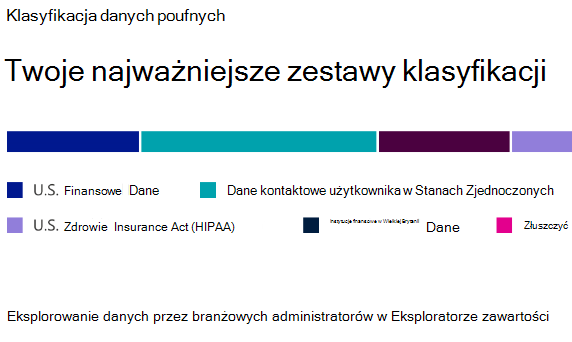
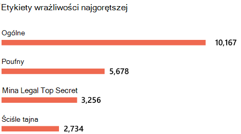
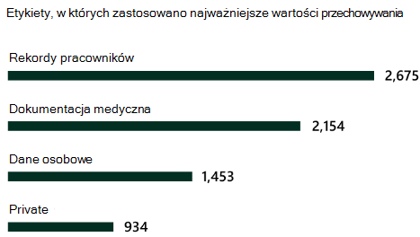

# Informacje o klasyfikacji danych

Jako administrator Microsoft 365 lub administrator zgodności, możesz oceniać zawartość organizacji, a następnie ją oznaczać, aby kontrolować, dokąd trafia, chronić ją niezależnie od tego, gdzie jest, oraz aby zapewnić zachowanie i usunięcie zawartości zgodnie z potrzebami Twojej organizacji. Można to zrobić przez stosowanie etykiet [wrażliwości, etykiet](sensitivity-labels.md) [przechowywania](retention.md#retention-labels) i klasyfikacji typu informacji poufnych. Istnieją różne sposoby odnajdowania, oceny i tagowania, ale wynikiem jest to, że może być bardzo duża liczba dokumentów i wiadomości e-mail, które są otagowane i klasyfikowane za pomocą jednej lub obu tych etykiet. Po zastosowaniu etykiet przechowywania i etykiet wrażliwości warto sprawdzić, jak etykiety są używane w całej dzierżawie i co z tymi elementami robisz. Strona klasyfikacji danych zapewnia wgląd w treść zawartości, w szczególności:

- liczba elementów, które zostały sklasyfikowane jako typ informacji poufnej i co to są te klasyfikacje
- Etykiety wrażliwości zastosowane w górnej części Microsoft 365 i w usłudze Azure Information Protection
- Etykiety przechowywania zastosowane w górnej części
- Podsumowanie działań, które użytkownicy zabierają na zawartość ważnych danych
- Lokalizacje poufnych i zachowanych danych

Możesz również zarządzać tymi funkcjami na stronie klasyfikacji danych:

- [przećwiczni klasyfikatorzy](classifier-learn-about.md)
- [typy informacji poufnych](sensitive-information-type-learn-about.md)
- [Informacje o dokładnie tych typach informacji poufnych na podstawie danych](sit-learn-about-exact-data-match-based-sits.md#learn-about-exact-data-match-based-sensitive-information-types)
- [Eksplorator zawartości](data-classification-content-explorer.md)
- [eksplorator aktywności](data-classification-activity-explorer.md)

Klasyfikację danych można znaleźć <a href="https://go.microsoft.com/fwlink/p/?linkid=2077149" target="_blank">w Centrum zgodności platformy Microsoft 365 lub</a> <a href="https://go.microsoft.com/fwlink/p/?linkid=2077139" target="_blank">Microsoft 365 Defender SklasyfikacjaData</a> >  >  **KlasyfikacjaDanych**.

Skorzystaj z przewodnika wideo po funkcjach klasyfikacji danych.

> [!VIDEO https://www.microsoft.com/videoplayer/embed/RE4vx8x]

Klasyfikacja danych przeskanuje wrażliwą zawartość i zawartość oznaczoną etykietą przed utworzeniem jakichkolwiek zasad. Jest to nazywane **zerowym zarządzaniem zmianami**. Dzięki temu można zobaczyć wpływ wszystkich etykiet przechowywania i wrażliwości na środowisko i umożliwić ocenę potrzeb w zakresie ochrony i zasad zarządzania.

## Wymagania wstępne

### Uprawnienia

 Aby uzyskać dostęp do strony klasyfikacji danych, należy przypisać członkostwo do konta w dowolnej z tych ról lub grup ról.

**Microsoft 365 grup ról**

- Administrator globalny
- Administrator zgodności
- Administrator zabezpieczeń
- Administrator danych zgodności

> [!NOTE]
> Najlepszym rozwiązaniem jest zawsze używanie roli o jak najmniejszych uprawnieniach w celu udzielania dostępu do Microsoft 365 klasyfikacji danych.

#### Role i grupy ról w wersji Preview

W wersji Preview są dostępne role i grupy ról, które możesz przetestować, aby precyzyjnie dostosować kontrolki dostępu.

Oto lista dostępnych w wersji Microsoft Information Protection (MIP), które są dostępne w wersji zapoznawczej. Aby dowiedzieć się więcej na ich temat, zobacz [Role w Centrum & zabezpieczeń](../security/office-365-security/permissions-in-the-security-and-compliance-center.md#roles-in-the-security--compliance-center)

- Administrator ochrony informacji
- Analityk ochrony informacji
- Ochrona informacji
- Czytnik ochrony informacji

Poniżej znajdziesz listę grup ról miP, które są dostępne w wersji Preview. Aby dowiedzieć się więcej na ich temat, [zobacz Grupy ról w Centrum & zabezpieczeń.](../security/office-365-security/permissions-in-the-security-and-compliance-center.md#role-groups-in-the-security--compliance-center)

- Ochrona informacji
- Administratorzy ochrony informacji
- Analitycy ochrony informacji
- Schoweki ochrony informacji
- Czytniki informacji

## Typy informacji poufnych używane najczęściej w zawartości

Microsoft 365 zawiera wiele definicji typów informacji poufnych, takich jak element zawierający numer PEP lub numer karty kredytowej. Aby uzyskać więcej informacji na temat typów informacji poufnych, zobacz [Definicje encji typu informacji poufnych](sensitive-information-type-entity-definitions.md).

Karta typu informacji poufnych zawiera najważniejsze typy informacji poufnych, które zostały znalezione i oznaczone etykietą w całej organizacji.

Aby dowiedzieć się, ile elementów znajduje się w danej kategorii klasyfikacji, umieść wskaźnik myszy na pasku tej kategorii.

> [!NOTE]
> Jeśli na karcie jest wyświetlany komunikat "Nie znaleziono danych z informacjami poufnymi", oznacza to, że w Twojej organizacji nie ma żadnych elementów sklasyfikowanych jako poufne typy informacji lub nie ma żadnych elementów, które zostały przeszukane. Aby rozpocząć pracę z etykietami, zobacz:
>- [Wprowadzenie do etykiet wrażliwości](get-started-with-sensitivity-labels.md)
>- [Wprowadzenie do zarządzania rekordami](get-started-with-records-management.md)
>- [Definicje jednostki typu informacji poufnych](sensitive-information-type-entity-definitions.md)

## Najważniejsze etykiety wrażliwości zastosowane do zawartości

Po zastosowaniu etykiety wrażliwości do elementu za pośrednictwem programu Microsoft 365 lub usługi Azure Information Protection (AIP) są stosowane dwie rzeczy:

- Tag wskazujący wartość elementu organizacji jest osadzony w dokumencie i będzie podążać za nim wszędzie, gdzie się on stanie.
- Obecność tagu umożliwia różne działania zabezpieczające, takie jak obowiązkowy znak wodny lub szyfrowanie. Gdy jest włączona ochrona punktu końcowego, możesz nawet uniemożliwić opuszczanie kontroli nad elementem organizacyjnym.

Aby uzyskać więcej informacji na temat etykiet wrażliwości, zobacz: [Informacje o etykietach wrażliwości.](sensitivity-labels.md)

Etykiety wrażliwości muszą być włączone dla plików w SharePoint i OneDrive, aby odpowiadające im dane zostały surface na stronie klasyfikacji danych. Aby uzyskać więcej informacji, zobacz [Włączanie etykiet wrażliwości Office plików w SharePoint i OneDrive](sensitivity-labels-sharepoint-onedrive-files.md).

Karta etykiety wrażliwości pokazuje liczbę elementów (wiadomości e-mail lub dokumentów) według poziomu wrażliwości.

> [!NOTE]
> Jeśli jeszcze nie utworzono ani nie opublikowano żadnych etykiet wrażliwości lub żadna zawartość nie miała zastosowanej etykiety wrażliwości, na tej karcie zostanie wyświetlony komunikat "Nie wykryto etykiet wrażliwości". Aby rozpocząć pracę z etykietami wrażliwości, zobacz:
>- [Wprowadzenie do etykiet wrażliwości lub](get-started-with-sensitivity-labels.md) usługi AIP [Konfigurowanie zasad Azure Information Protection](/azure/information-protection/configure-policy)

## Najważniejsze etykiety przechowywania zastosowane do zawartości

Etykiety przechowywania są używane do zarządzania przechowywaniem i przechowywaniem zawartości w organizacji. Po zastosowaniu można ich używać do kontrolowania, jak długo element ma być przechowywany przed usunięciem, czy powinien być sprawdzany przed usunięciem, kiedy wygasa jego okres przechowywania i czy powinien być oznaczony jako rekord. Aby uzyskać więcej informacji, zobacz [Informacje o zasadach przechowywania i etykietach przechowywania](retention.md).

Na karcie etykiet przechowywania, które zostały zastosowane w górnej części, można sprawdzić, ile elementów zawiera ta etykieta przechowywania.

> [!NOTE]
> Jeśli na tej karcie jest wyświetlany komunikat "Nie wykryto etykiet przechowywania", oznacza to, że nie utworzono ani nie opublikowano żadnych etykiet przechowywania lub do żadnej zawartości nie zastosowano etykiety przechowywania. Aby rozpocząć pracę z etykietami przechowywania, zobacz:
>- [Wprowadzenie do zarządzania informacjami](get-started-with-information-governance.md)

## Wykryte najważniejsze działania

Ta karta zawiera krótkie podsumowanie typowych akcji, które użytkownicy przejmują nad elementami oznaczonymi jako charakter. Za pomocą [Eksploratora aktywności](data-classification-activity-explorer.md) możesz przejść do szczegółów różnych działań, Microsoft 365 śledzi zawartość i zawartość oznaczoną etykietą, która znajduje się w Windows 10 punktów końcowych.

> [!NOTE]
> Jeśli na tej karcie jest wyświetlany komunikat "Nie wykryto aktywności", oznacza to, że w plikach nie było żadnych działań lub inspekcja przez tego użytkownika i administratora nie została włączona. Aby włączyć dzienniki inspekcji, zobacz:
>- [Przeszukiwanie dziennika inspekcji w centrum & zgodności](search-the-audit-log-in-security-and-compliance.md)

## Charakter i przechowywanie danych oznaczonych według lokalizacji

Punktem raportowania klasyfikacji danych jest zapewnienie wglądu w liczbę elementów, które mają etykietę, a także ich lokalizację. Dzięki tym kartom możesz sprawdzić, ile elementów oznaczonych jest w Exchange, SharePoint i OneDrive itp.

> [!NOTE]
> Jeśli na tej karcie jest wyświetlany komunikat "Nie wykryto żadnych lokalizacji, oznacza to, że nie utworzono ani nie opublikowano żadnych etykiet wrażliwości lub do żadnej zawartości nie zastosowano etykiety przechowywania. Aby rozpocząć pracę z etykietami wrażliwości, zobacz:
>- [Etykiety wrażliwości](sensitivity-labels.md)

## Publiczne informacje o wersji zapoznawczej 

> [!NOTE]
> **Exchange skrzynek** pocztowych: Podczas przechodzenia do szczegółów w skrzynce Exchange pocztowych pojawi się mała etykietka narzędzia. Należy przy tym pamiętać, że wyświetlana zagregowana liczba dla typów informacji poufnych, etykiety wrażliwości i etykiety przechowywania może nie dokładnie odpowiadać liczbie elementów, które można znaleźć w skrzynce pocztowej. Jest tak, ponieważ przechodzenie do szczegółów folderu pobiera widok na żywo zawartości, który jest klasyfikowany, podczas gdy jest obliczana zagregowana liczba. Informacje, które użytkownik powinien zauważyć, nawet jeśli

> [!NOTE]
> **Renderowanie zaszyfrowanych dokumentów**: SharePoint, Exchange i OneDrive, które są szyfrowane, nie są renderowane w Eksploratorze zawartości. Jest to poufny problem wymagający równowagi między wyświetlaniem zawartości w Eksploratorze zawartości a potrzebą jej zaszyfrowania. Po przyznaniu uprawnień przez przeglądarkę list Eksploratora zawartości i  grupy ról podglądu zawartości Eksploratora zawartości zostanie wyświetlony widok listy plików, metadane plików i link, za pomocą których można uzyskać dostęp do zawartości za pośrednictwem klienta sieci Web. Informacje, które użytkownik powinien zauważyć, nawet jeśli

> [!NOTE]
> **Znaki obsługiwane w nazwach etykiet przechowywania SharePoint wyszukiwania**: SharePoint `-`nie obsługuje nazw etykiet przechowywania za pomocą znaków lub `_` w nich. Nie są one na `Label_MIP` przykład `Label-MIP` obsługiwane. SharePoint wyszukiwanie obsługuje te znaki w nazwach etykiet wrażliwości i nazw typów informacji poufnych.

> [!NOTE]
> **OneDrive wersji Preview**: Dziękujemy za cenne opinie na temat integracji OneDrive w trakcie programu w wersji Preview. Podczas gdy pracujemy nad jej specyfiką, możesz mieć niespójne dane/przepływy. Będziemy nadal prezentować nowe OneDrive w wersji zapoznawczej, dopóki nie zostaną wprowadzono wszystkich poprawek. Będziemy wdzięczni za dalsze wsparcie.

## Zobacz też

- [Wyświetl aktywność etykiet](data-classification-activity-explorer.md)
- [Wyświetlanie zawartości oznaczonej etykietą](data-classification-content-explorer.md)
- [Dowiedz się więcej o etykietach poufności](sensitivity-labels.md)
- [Informacje o zasadach przechowywania i etykietach przechowywania](retention.md)
- [Informacje o typach informacji poufnych](sensitive-information-type-learn-about.md)
- [Definicje jednostki typu informacji poufnych](sensitive-information-type-entity-definitions.md)
- [Dowiedz się więcej o klasyfikatorach przeszkolnych (wersja zapoznawcza)](classifier-learn-about.md)

Aby dowiedzieć się, jak używać klasyfikacji danych w celu zachowania zgodności z przepisami dotyczącymi prywatności danych, zobacz Wdrażanie przepisów dotyczących ochrony danych osobowych za pomocą [Microsoft 365 (aka.ms/m365dataprivacy](../solutions/information-protection-deploy.md)).
