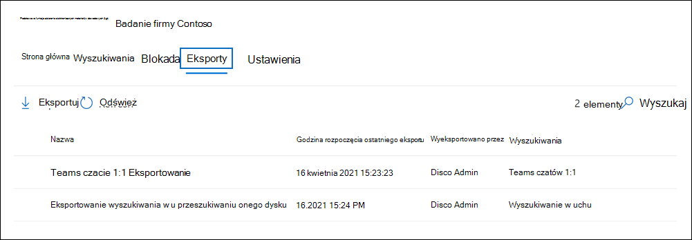

# Eksportowanie zawartości z podstawowej sprawy zbierania elektronicznych materiałów dowodowych

Po pomyślnym uruchomieniu wyszukiwania skojarzonego z podstawową sprawą zbierania elektronicznych materiałów dowodowych możesz wyeksportować wyniki wyszukiwania. Podczas eksportowania wyników wyszukiwania elementy skrzynki pocztowej są pobierane w plikach PST lub jako pojedyncze wiadomości. Podczas eksportowania zawartości z witryn SharePoint i OneDrive dla Firm są eksportowane kopie natywnych dokumentów Office i innych dokumentów. Eksportowany jest również plik Results.csv zawierający informacje o wszystkich eksportowanych elementach oraz plik manifestu (w formacie XML), który zawiera informacje o każdym wyniku wyszukiwania.
  
## Eksportowanie wyników wyszukiwania

1. Przejdź do <a href="https://go.microsoft.com/fwlink/p/?linkid=2077149" target="_blank">Centrum zgodności platformy Microsoft 365</a> i zaloguj się przy użyciu poświadczeń dla konta użytkownika, do których zostały przypisane odpowiednie uprawnienia zbierania elektronicznych materiałów dowodowych.

2. W lewym okienku nawigacji okna Centrum zgodności platformy Microsoft 365 pozycję Pokaż **wszystko**, a następnie wybierz **pozycję EDiscoveryCore** > .

3. Na **stronie Podstawowe zbierania elektronicznych materiałów dowodowych** kliknij nazwę sprawy, w której chcesz utworzyć wstrzymanie.

4. Na stronie **głównej** sprawy kliknij **kartę** Wyszukiwania.

5. W menu **Akcje** u dołu strony wysuwu kliknij polecenie **Eksportuj wyniki**.

   

   Przepływ pracy służący do eksportowania wyników wyszukiwania skojarzonego ze sprawą core eDiscovery jest taki sam jak eksportowanie wyników wyszukiwania dla wyszukiwania na **stronie Przeszukiwanie** zawartości. Aby uzyskać instrukcje krok po kroku, zobacz [Eksportowanie wyników wyszukiwania zawartości](export-search-results.md).

   > [!NOTE]
   > Podczas eksportowania wyników wyszukiwania można włączyć de duplikowanie, dzięki czemu będzie eksportowana tylko jedna kopia wiadomości e-mail, nawet jeśli w przeszukanych skrzynkach pocztowych może być kilka wystąpień tej samej wiadomości. Aby uzyskać więcej informacji na temat de duplikowania i sposobu identyfikowania zduplikowanych elementów, zobacz [Duplikowanie w wynikach wyszukiwania zbierania elektronicznych materiałów dowodowych](de-duplication-in-ediscovery-search-results.md).

   Po rozpoczęciu eksportowania wyniki wyszukiwania są przygotowane do pobrania, co oznacza, że są one przenoszone do lokalizacji w chmurze firmy Microsoft dostępnej pod Storage Azure.
  
6. Kliknij **kartę Eksporty** , aby wyświetlić listę zadań eksportu.
  
   

   Może być konieczne kliknięcie **przycisku Odśwież** w celu zaktualizowania listy zadań eksportu tak, aby wyświetlała utworzone zadanie eksportu. Zadania eksportowania mają taką samą nazwę jak odpowiadające im wyszukiwanie **z _Export** dołączona do nazwy wyszukiwania.

7. Kliknij utworzone zadanie eksportu, aby wyświetlić informacje o stanie na stronie wysuwu. Te informacje obejmują procent elementów, które zostały przeniesione do lokalizacji usługi Azure Storage lokalizacji.

8. Po przeniesieniu wszystkich elementów kliknij pozycję **Pobierz** wyniki, aby pobrać wyniki wyszukiwania na komputer lokalny. Aby uzyskać więcej informacji o pobieraniu wyników wyszukiwania, zobacz krok 2 w tece [Eksportowanie wyników wyszukiwania zawartości.](export-search-results.md#step-2-download-the-search-results)

> [!NOTE]
> Wyeksportowane wyniki wyszukiwania należy pobrać w ciągu 14 dni od utworzenia zadania eksportu.

### Więcej informacji na temat eksportowania wyszukiwań ze sprawy

- Aby uzyskać więcej informacji na temat plików eksportu uwzględnianych podczas eksportowania wyników wyszukiwania, zobacz [Eksportowanie raportu przeszukiwania zawartości](export-a-content-search-report.md#whats-included-in-the-report).

- Jeśli ponownie uruchomisz eksportowanie, wszelkie zmiany zapytań wyszukiwania, które są zadaniami eksportowania, nie będą mieć wpływu na pobierane wyniki wyszukiwania. Po ponownym uruchomieniu eksportu zostanie uruchomione to samo zadanie połączonego zapytania wyszukiwania, które zostało uruchomione podczas tworzenia zadania eksportu.

- Ponadto po ponownym uruchomieniu eksportu wyniki wyszukiwania skopiowane do lokalizacji usługi Azure Storage zastąpią poprzednie wyniki. Poprzednie skopiowane wyniki nie będą dostępne do pobrania.
