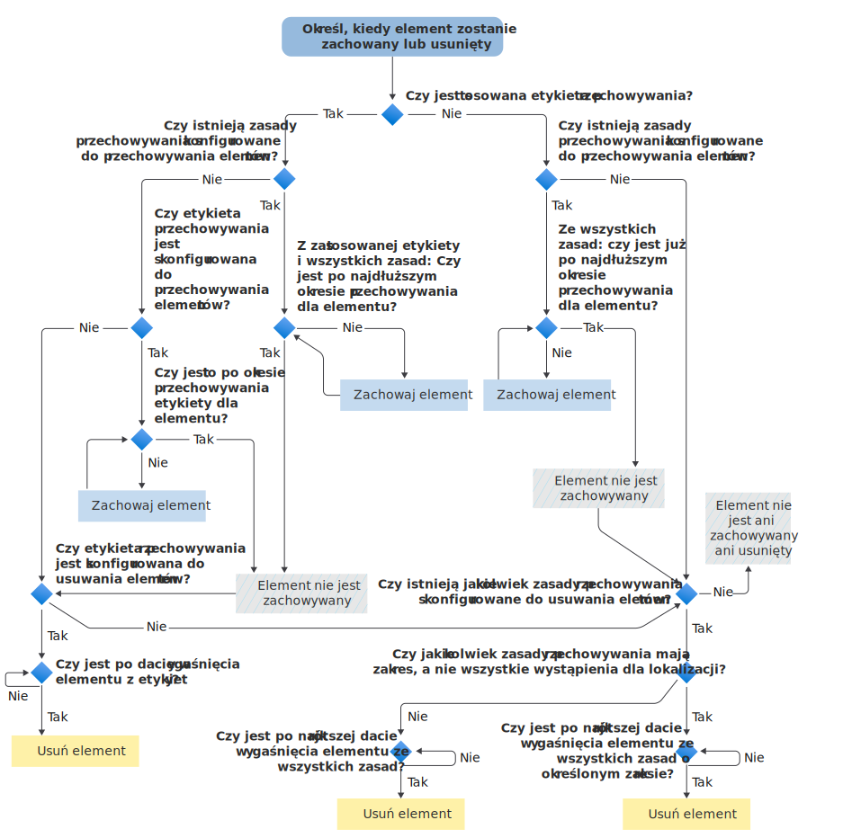

# Schemat blokowy do określania, kiedy element zostanie zachowany lub trwale usunięty

>*[Microsoft 365 licencjonowania w zakresie zabezpieczeń & zgodności](/office365/servicedescriptions/microsoft-365-service-descriptions/microsoft-365-tenantlevel-services-licensing-guidance/microsoft-365-security-compliance-licensing-guidance).*

Skorzystaj z poniższego wykresu blokowego,  aby zastosować zasady przechowywania do elementu w celu określenia, czy system zachowa go lub trwale usunie w wyniku etykiety przechowywania lub zasad przechowywania.

Ten przepływ logiki jest używany dla elementu, gdy ma zastosowanie jeden z następujących warunków:

- Zastosowano więcej niż jedną zasady przechowywania
- Etykieta przechowywania i co najmniej jedna zasady przechowywania

Jeśli element podlega zasadom zbierania elektronicznych materiałów dowodowych (lub starszym technologiom przechowywania w przypadku sporu sądowego lub In-Place), jest on zawsze zachowywany przed przepływami decyzji dotyczących zasad przechowywania i etykietą przechowywania.

Jeśli którykolwiek z terminów użytych w tym schematze blokowy nie jest dla Ciebie nieznany, zobacz Informacje o zasadach przechowywania i [etykietach przechowywania](retention.md).

   

> [!NOTE]
> Należy odróżnić najdłuższy okres przechowywania elementu od najdłuższego określonego okresu w zasadach przechowywania lub etykietach. Podobnie, między najkrótszą datą wygaśnięcia elementu a najkrótszym okresem określonym w zasadach przechowywania.
> 
> Aby uzyskać więcej informacji, zobacz objaśnienie po ilustracji w [sekcji Zasady przechowywania](retention.md#the-principles-of-retention-or-what-takes-precedence) .
