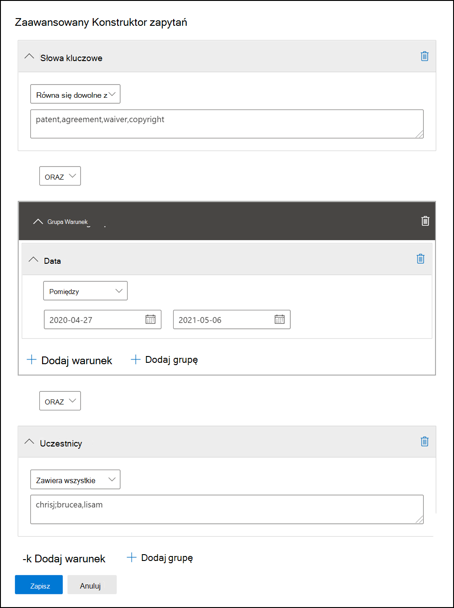

# Wykonywanie kwerend i filtrowanie zawartości w zestawie recenzji

W większości przypadków warto bardziej przećwiać zawartość zestawu recenzji i zorganizować ją w celu ułatwienia bardziej wydajnego przeglądu. Korzystanie z filtrów i zapytań w zestawie recenzji ułatwia skupienie się na podzbiorze dokumentów spełniających kryteria recenzji.

## Filtry domyślne

W zestawie recenzji istnieje pięć domyślnych filtrów wstępnie załadowanych w zestawie recenzji:

- Słowa kluczowe
- Data
- Nadawca/Autor
- Temat/tytuł
- Tagi

Kliknij każdy filtr, aby go rozwinąć i przypisać wartość. Kliknij poza filtrem, aby automatycznie zastosować filtr do zestawu recenzji. Poniższy zrzut ekranu przedstawia filtr daty skonfigurowany do pokazywania dokumentów z zakresu dat.

## Dodawanie lub usuwanie filtrów

Aby dodać lub usunąć filtry wyświetlane w zestawie recenzji, wybierz pozycję Filtry  w celu otwarcia panelu filtrów wyświetlanego na wysuwana stronie. 

Dostępne filtry są zorganizowane w czterech sekcjach:

- **Wyszukiwanie**: Filtry, które zapewniają różne funkcje wyszukiwania.

- **Analiza &** **predykcyjne** kodowanie: Umożliwia filtrowanie właściwości generowanych i dodawanych do dokumentów podczas uruchamiania zadania analitycznego usługi & poczty e-mail lub korzystania z modeli predykcyjnego kodowania.

- **Identyfikatory**: Filtry dla wszystkich właściwości identyfikatorów dokumentów.

- **Właściwości elementu**: Filtry dla właściwości dokumentu. 

Rozwiń poszczególne sekcje i zaznacz lub usuń zaznaczenie filtrów w celu dodania lub usunięcia ich w zestawie filtrów. Po dodaniu filtr jest on wyświetlany w zestawie filtrów. 

> [!NOTE]
> Po rozwinięciu sekcji w panelu filtrów zauważysz, że są zaznaczone domyślne typy filtrów. Możesz zachować te zaznaczone lub usunąć ich zaznaczenie i usunąć je z zestawu filtrów. 

## Typy filtrów

Każde pole z polem recenzji, które można wyszukiwać w zestawie recenzji, ma odpowiedni filtr, który umożliwia filtrowanie elementów według określonego pola.

Istnieje wiele typów filtrów:

- **Freetext**: Do pól tekstowych, takich jak "Temat", jest stosowany filtr freetext. Możesz utworzyć listę wielu wyszukiwanych terminów, oddzielając je przecinkami.

- **Data**: Filtr daty jest używany dla pól daty, takich jak "Data ostatniej modyfikacji".

- **Opcje wyszukiwania**: Filtr opcji wyszukiwania udostępnia listę możliwych wartości (każda wartość jest wyświetlana z polem wyboru, które można wybrać) dla poszczególnych pól w recenzji. Ten filtr jest używany dla pól, takich jak "Nadawca", gdzie w zestawie recenzji istnieje skończona liczba możliwych wartości.

- **Słowo** kluczowe: warunek słowa kluczowego to konkretne wystąpienie warunku freetext, za pomocą których można wyszukiwać terminy. W tym typie filtru można również używać języka zapytań podobnego do języka KQL. Aby uzyskać więcej informacji, zobacz sekcje Język zapytań i Zaawansowany konstruktor zapytań w tym artykule.

## Uwzględnianie i wykluczanie relacji filtru

Możesz zmienić relację dołączania i wykluczania dla określonego filtru. Na przykład w filtrze Tag możesz wykluczyć elementy otagowane określonym tagiem, wybierając pozycję **Równa** się żadna z w filtrze listy rozwijanej. 

## Zapisywanie filtrów jako zapytań

Po zakończeniu pracy z filtrami możesz zapisać ich kombinację jako zapytanie filtru. Dzięki temu można zastosować filtr w przyszłych sesjach recenzji.

Aby zapisać filtr, wybierz **pozycję Zapisz zapytanie i** nadaj jego nazwę. Recenzentzy mogą uruchamiać wcześniej zapisane zapytania filtru, wybierając  menu rozwijane Zapisane zapytania filtru i wybierając zapytanie filtru do zastosowania w celu przejrzenia zestawu dokumentów. 

Aby usunąć zapytanie filtru, otwórz panel filtrów i wybierz ikonę kosza na śmieci obok zapytania.

## Język zapytań

Oprócz używania filtrów do tworzenia zapytania wyszukiwania zestawu recenzji można także użyć języka zapytania podobnego do języka KQL w filtrze Słowa kluczowe. Język zapytań dla zapytań zestawu recenzji obsługuje standardowe operatory logiczne, takie jak **AND**, **OR**, **NOT** i **NEAR**. Obsługuje także jednoznakową symbol wieloznaczny (?) i wieloznaczny symbol wieloznaczny (*).

## Zaawansowany konstruktor zapytań

Możesz również tworzyć bardziej zaawansowane zapytania do wyszukiwania dokumentów w zestawie recenzji.

1. Otwórz panel filtrów, wybierz pozycję **Filtry** i rozwiń **sekcję** Wyszukiwanie.

  

2. Wybierz filtr **KQL** i kliknij pozycję **Otwórz konstruktora zapytań**.

   W tym panelu można tworzyć złożone zapytania KQL przy użyciu konstruktora zapytań. Można dodawać warunki lub dodawać grupy warunków, które składa się z wielu warunków, które są logicznie połączone relacjami **ORAZ** **lub LUB** .

   

## Filtrowanie elementów częściowo indeksowanych

Jeśli wybrano opcję dodawania elementów częściowo indeksowanych z dodatkowych źródeł danych po za zatwierdzonej wersji roboczej kolekcji do zestawu recenzji. Prawdopodobnie trzeba będzie zidentyfikować i wyświetlić te elementy, aby ustalić, czy element może być istotny dla prowadzonego badania, i czy trzeba naprawić błąd, który spowoduje, że element został częściowo zindeksowany.

Obecnie w zestawie recenzji nie ma opcji filtrowania służącej do wyświetlania elementów częściowo indeksowanych. Ale pracujemy nad tym. Do tego czasu oto sposób filtrowania i wyświetlania częściowo indeksowanych elementów dodanych do zestawu recenzji.

1. Utwórz kolekcję i zat zatwierdzeniu jej w nowym zestawie recenzji *bez* dodawania częściowo indeksowanych elementów z dodatkowych źródeł danych.

2. Utwórz nową kolekcję, kopiując kolekcję od kroku 1.

3. Zatwierdzenie nowej kolekcji do tego samego zestawu recenzji. Jednak tym razem dodaj elementy częściowo indeksowane z dodatkowych źródeł danych. Ponieważ elementy z kolekcji utworzonej w kroku 1 zostały już dodane do zestawu recenzji, do zestawu recenzji są już dodawane tylko częściowo indeksowane elementy z drugiej kolekcji.

4. Po dodaniu obu kolekcji do zestawu recenzji przejdź do zestawu recenzji i wybierz pozycję **Zarządzaj Zestawami** >  **ładowania**.

5. Skopiuj identyfikator ładowania drugiej kolekcji (tej utworzonej w kroku 2). Nazwa kolekcji jest identyfikowana w **kolumnie Informacje o źródle** .

6. W zestawie recenzji **kliknij pozycję** Filtruj, rozwiń **sekcję** identyfikatorów, a następnie zaznacz pole **wyboru Identyfikator** ładowania.

7. Rozwiń **filtr Load Id** (Załaduj identyfikator), a następnie zaznacz pole wyboru identyfikatora ładowania odpowiadającego drugiej kolekcji, aby wyświetlić częściowo indeksowane elementy.
