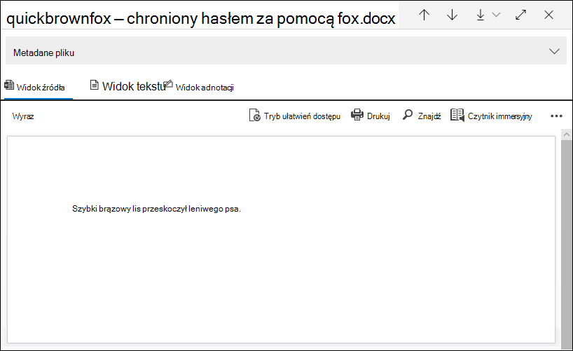

# Rozwiązywanie problemów z jednym elementem w programie Advanced eDiscovery

Rozwiązywanie problemów ze Advanced eDiscovery umożliwia użytkownikom korygowanie problemów z danymi, które uniemożliwiają Advanced eDiscovery prawidłowego przetwarzania zawartości. Na przykład pliki chronione hasłem nie mogą być przetwarzane, ponieważ są one zablokowane lub zaszyfrowane. Wcześniej za pomocą tego przepływu pracy można było zbiorczo naprawiać tylko [błędy](error-remediation-when-processing-data-in-advanced-ediscovery.md). Czasami jednak korygowanie błędów w wielu plikach nie ma sensu, gdy nie masz pewności, czy któryś z tych plików nie odpowiada badasz przypadku. Korygowanie błędów przed sprawdzeniem metadanych pliku (na przykład lokalizacji pliku lub osób, które miały dostęp) w celu podjęcia od góry decyzji dotyczących czasu reakcji może być także sensowne. Nowa funkcja o nazwie  rozwiązywanie problemów z pojedynczym elementem umożliwia menedżerom zbierania elektronicznych materiałów dowodowych wyświetlanie metadanych plików z błędem przetwarzania i, jeśli to konieczne, rozwiązywanie tego błędu bezpośrednio w zestawie recenzji. W tym artykule omówiono identyfikowanie, ignorowanie i korygowanie plików z błędami przetwarzania w zestawie recenzji.

## Identyfikowanie dokumentów z błędami

Dokumenty z błędami przetwarzania w zestawie recenzji są teraz identyfikowane (na banerze). Możesz rozwiązać ten problem lub zignorować go. Poniższy zrzut ekranu przedstawia baner błędu przetwarzania dla dokumentu programu Word w zestawie recenzji chronionym hasłem. Można również wyświetlić metadane plików dokumentów z błędami przetwarzania.

Dokumenty, w których wystąpiły błędy przetwarzania, można również wyszukiwać przy użyciu warunku **Stan** przetwarzania podczas wykonywania zapytań [dotyczących dokumentów w zestawie recenzji](review-set-search.md).

### Ignoruj błędy

Błąd przetwarzania można zignorować, klikając pozycję **Ignoruj** na banerze błędu przetwarzania. Gdy zignorujesz błąd, dokument zostanie usunięty z przepływu pracy rozwiązywania [problemów z błędami zbiorczym](error-remediation-when-processing-data-in-advanced-ediscovery.md). Gdy błąd zostanie zignorowany, baner dokumentu zmieni kolor i będzie wskazywać, że błąd przetwarzania został zignorowany. W dowolnym momencie możesz przywrócić decyzję o zignorowania błędu, klikając pozycję **Przywróć**.

Możesz również wyszukać wszystkie dokumenty, w których wystąpił błąd przetwarzania, który został zignorowany, używając warunku ignorowanych błędów przetwarzania podczas wykonywania zapytań dotyczących dokumentów w zestawie recenzji.

## Rozwiązywanie problemów z dokumentem z błędami

Czasami może być wymagane usunięcie błędu przetwarzania w dokumentach (przez usunięcie hasła, odszyfrowanie zaszyfrowanego pliku lub odzyskanie uszkodzonego dokumentu), a następnie dodanie usuniętego dokumentu do zestawu recenzji. Dzięki temu można przejrzeć i wyeksportować dokument błędu razem z innymi dokumentami w zestawie recenzji. 

Aby rozwiązać ten krok w celu rozwiązania problemów z jednym dokumentem, wykonaj następujące czynności:

1. Kliknij **pozycję** **PobierzPobierz** >  oryginał, aby pobrać kopię pliku na komputer lokalny.

   

2. Rozwiązywanie problemów z błędem w pliku w trybie offline. W przypadku zaszyfrowanych plików wymagałoby to oprogramowania do odszyfrowywania w celu usunięcia ochrony hasłem: podania hasła i zapisania pliku lub użycia pęku haseł. Po zakończeniu rozwiązywania problemów z plikiem przejdź do następnego kroku.

3. W zestawie recenzji wybierz plik z komunikatem o błędzie przetwarzania, który został zaradczy, a następnie kliknij pozycję **Działania naprawcze**.

   

4. Kliknij **przycisk** Przeglądaj, przejdź do lokalizacji pliku usuniętego na komputerze lokalnym, a następnie wybierz ten plik.

   

    Po wybraniu pliku, który został naprawiony, jest on automatycznie przekazywany do zestawu recenzji. Możesz śledzić stan przetwarzania pliku.

    

   Po zakończeniu przetwarzania możesz wyświetlić dokument zaradczy.

    

Aby uzyskać więcej informacji na temat działań naprawczych w dokumencie, zobacz Co [się dzieje w przypadku rozwiązywania problemów z plikami](error-remediation-when-processing-data-in-advanced-ediscovery.md#what-happens-when-files-are-remediated).

## Wyszukiwanie dokumentów zaradczych

Możesz wyszukać wszystkie dokumenty w zestawie recenzji, których działania naprawcze zostały rozwiązane, używając  warunku Słowa kluczowe i określając następującą parę właściwość:wartość: **IsFromErrorRemediation:true**. Ta właściwość jest również dostępna w pliku ładowania eksportu podczas eksportowania dokumentów z zestawu recenzji.
