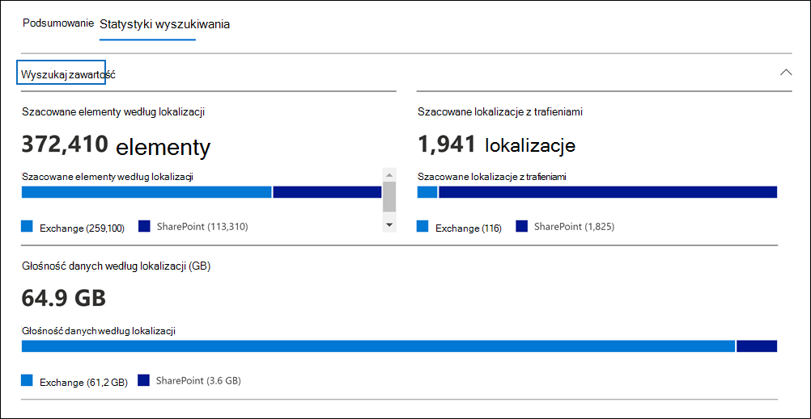
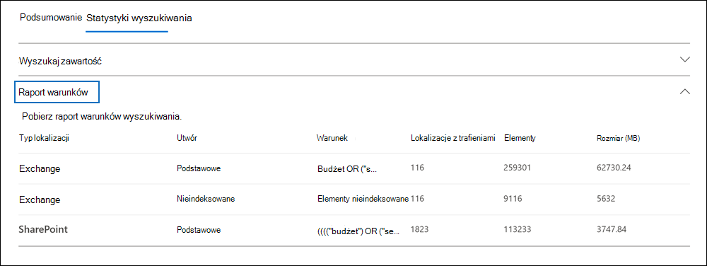

# Wyświetlanie statystyk dotyczących wyników wyszukiwania zbierania elektronicznych materiałów dowodowych

Po utworzeniu i uruchomieniu wyszukiwania zawartości lub wyszukiwania skojarzonego z podstawową sprawą zbierania elektronicznych materiałów dowodowych można wyświetlać statystyki dotyczące szacowanych wyników wyszukiwania. Obejmuje to podsumowanie wyników wyszukiwania (podobne do podsumowania szacowanych wyników wyszukiwania wyświetlanych na wysuwanych stronie wyszukiwania), statystyk kwerend, takich jak liczba lokalizacji zawartości z elementami pasującymi do zapytania wyszukiwania, oraz tożsamość lokalizacji zawartości, które zawierają najbardziej pasujące elementy.
  
Ponadto za pomocą listy słów kluczowych można skonfigurować wyszukiwanie w celu zwrócenia statystyk dotyczących poszczególnych słów kluczowych w zapytaniu wyszukiwania. Pozwala to porównać liczbę wyników zwróconych przez każde słowo kluczowe w zapytaniu.
  
Statystykę wyszukiwania możesz również pobrać do pliku CSV. Dzięki temu można porównywać wyniki za pomocą funkcji filtrowania i Excel, a także przygotowywać raporty do wyników wyszukiwania.
  
## Uzyskiwanie statystyk dotyczących wyszukiwań

Aby wyświetlić statystykę wyszukiwania zawartości lub wyszukiwania skojarzonego ze sprawą core eDiscovery:
  
1. W Centrum zgodności platformy Microsoft 365 kliknij pozycję **Pokaż wszystko**, a następnie wykonaj jedną z następujących czynności:

   - Kliknij **pozycję Wyszukiwanie** zawartości, a następnie wybierz wyszukiwanie, aby wyświetlić stronę wysuwu.

     LUB

   - Kliknij **pozycję eDiscoveryCore** > , zaznacz sprawę, a następnie wybierz wyszukiwanie na karcie Wyszukiwania, aby wyświetlić stronę wysuwu.

2. Na wysuwana strona wybranego wyszukiwania kliknij **kartę Statystyka** wyszukiwania.
  
   

Karta **Statystyka** wyszukiwania zawiera następujące sekcje zawierające różne typy statystyk dotyczących wyszukiwania.

### Wyszukiwanie zawartości

Ta sekcja zawiera graficzne podsumowanie szacowanych elementów zwróconych przez wyszukiwanie. Wskazuje liczbę elementów, które spełniają kryteria wyszukiwania. Te informacje dają wyobrażenie o szacowanej liczbie elementów zwróconych przez wyszukiwanie.

- **Szacowane elementy według lokalizacji**: łączna liczba szacowanych elementów zwróconych przez wyszukiwanie. Wyświetlana jest również konkretną liczba elementów znajdujących się w skrzynkach pocztowych i znajdujących się w witrynach.

- **Szacowane lokalizacje z liczbami trafień**: całkowita liczba lokalizacji zawartości, które zawierają elementy zwrócone przez wyszukiwanie. Wyświetlana jest również konkretną liczba lokalizacji skrzynek pocztowych i witryn.

- **Wielkość danych według lokalizacji (w MB)**: całkowity rozmiar wszystkich szacowanych elementów zwracanych przez wyszukiwanie. Wyświetlany jest również określony rozmiar elementów skrzynki pocztowej i elementów witryny.

### Raport warunków

W tej sekcji są wyświetlane statystyki dotyczące zapytania wyszukiwania oraz liczba szacowanych elementów, które pasują do różnych części zapytania wyszukiwania. Za pomocą tych statystyk można przeanalizować liczbę elementów, które pasują do każdego składnika zapytania wyszukiwania. Może to ułatwić uściślić kryteria wyszukiwania i w razie potrzeby zawęzić zakres zakresu. Możesz również pobrać kopię tego raportu w formacie CSV.

- **Typ lokalizacji**: typ lokalizacji zawartości, do których ma zastosowanie statystyka kwerendy. Wartość **Exchange wskazuje** lokalizację skrzynki pocztowej, a wartość **SharePoint lokalizacji witryny**.

- **Część**: do części zapytania wyszukiwania mają zastosowanie statystyki. **Pole Podstawowe** wskazuje całe zapytanie wyszukiwania. **Słowo** kluczowe wskazuje statystykę w wierszu dla określonego słowa kluczowego. Jeśli do wyszukiwania użyje się listy słów kluczowych, w tej tabeli zostaną uwzględnione statystyki dotyczące każdego składnika zapytania. Aby uzyskać więcej informacji, zobacz [Uzyskiwanie statystyk dotyczących słów kluczowych dotyczących wyszukiwań](#get-keyword-statistics-for-searches).

- **Warunek**: rzeczywisty składnik (słowo kluczowe lub warunek) zapytania wyszukiwania, które zwróciło statystykę wyświetlaną w odpowiednim wierszu.

- **Lokalizacje z trafieniami**: liczba lokalizacji zawartości (określonych w kolumnie Typ lokalizacji), które zawierają elementy zgodne z podstawowym lub kluczowym zapytaniem wymienionym w **kolumnie Warunek**.

- **Elementy**: liczba elementów (z określonej lokalizacji zawartości), które są zgodne z zapytaniem wymienionym w **kolumnie** Warunek. Jak wyjaśniono wcześniej, jeśli element zawiera wiele wystąpień słowa kluczowego, które jest przeszukiwane, jest on liczony tylko raz w tej kolumnie.

- **Rozmiar (MB)**: Całkowity rozmiar wszystkich elementów, które zostały znalezione (w określonej lokalizacji zawartości), które pasują do zapytania wyszukiwania w **kolumnie Warunek** .

### Najlepsze lokalizacje

W tej sekcji są wyświetlane statystyki dotyczące konkretnych lokalizacji zawartości z najwięcej elementów zwróconych przez wyszukiwanie. Zostanie wyświetlonych 1000 najwyższych lokalizacji. Możesz również pobrać kopię tego raportu w formacie CSV.

- Nazwa lokalizacji (adres e-mail skrzynek pocztowych i adres URL witryn).

- Typ lokalizacji (skrzynka pocztowa lub witryna).

- Szacowana liczba elementów w lokalizacji zawartości zwróconej przez wyszukiwanie.

- Całkowity rozmiar szacowanych elementów w poszczególnych lokalizacjach zawartości.

## Uzyskiwanie statystyk dotyczących słów kluczowych dotyczących wyszukiwania

Jak wyjaśniono wcześniej, sekcja **Raport warunków** zawiera zapytanie wyszukiwania oraz liczbę (i rozmiar) elementów, które pasują do zapytania. Jeśli podczas tworzenia lub edytowania zapytania wyszukiwania używasz listy słów kluczowych, możesz uzyskać rozszerzone statystyki, które pokazują, ile elementów pasuje do poszczególnych słów kluczowych lub fraz słów kluczowych. Dzięki temu można szybko ustalić, które części zapytania są najbardziej (i najmniej) skuteczne. Jeśli na przykład słowo kluczowe zwraca dużą liczbę elementów, możesz uściślić zapytanie słowa kluczowego, aby zawęzić wyniki wyszukiwania.

Aby utworzyć listę słów kluczowych i wyświetlić statystykę słów kluczowych dla wyszukiwania:
  
1. W Centrum zgodności platformy Microsoft 365 utwórz nowe wyszukiwanie zawartości lub wyszukiwanie skojarzone z podstawową sprawą zbierania elektronicznych materiałów dowodowych.

2. Na **stronie Warunki** kreatora wyszukiwania. zaznacz pole **wyboru Pokaż listę słów** kluczowych.

   

3. Wpisz słowo kluczowe lub fazę słowa kluczowego w wierszu tabeli słów kluczowych. Na przykład wpisz **budżet** w pierwszym wierszu, w drugim  wierszu wpisz "budżet", a w trzecim wierszu wpisz "**BUDŻET2021**".

   

   > [!NOTE]
   > Aby ograniczyć problemy powodowane przez duże listy słów kluczowych, możesz ograniczyć do maksymalnie 20 wierszy na liście słów kluczowych zapytania wyszukiwania.

4. Po dodaniu słów kluczowych do listy, dla której chcesz wyszukiwać i uzyskać statystyki, uruchom wyszukiwanie.

5. Po zakończeniu wyszukiwania wybierz go, aby wyświetlić stronę wysuwu.

6. Na karcie **Statystyka** wyszukiwania kliknij raport **Warunek** , aby wyświetlić statystykę słów kluczowych dotyczących wyszukiwania.

    
  
    Jak pokazano na poprzednim zrzucie ekranu, zostaną wyświetlone statystyki dotyczące poszczególnych słów kluczowych. obejmuje to:

    - Statystyka słów kluczowych dla każdego typu lokalizacji zawartości uwzględnionej w wyszukiwaniu.

    - Liczba nieindeksowanych elementów skrzynki pocztowej.

    - Rzeczywiste zapytanie wyszukiwania i wyniki dla każdego słowa kluczowego (wskazanego jako **Słowo** kluczowe w kolumnie Część), które zawiera wszystkie warunki z zapytania wyszukiwania.

    - Kompletne zapytanie wyszukiwania ( **wskazane jako Podstawowe** w kolumnie **Część** ) oraz statystyka dla pełnego zapytania dla każdego typu lokalizacji. Zwróć uwagę, że są to te same statystyki wyświetlane na **karcie Podsumowanie** .
