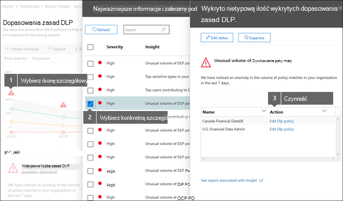

# Wyświetlanie raportów w celu ochrony przed utratą danych

Po utworzeniu zasad ochrony przed utratą danych (DLP, Data Loss Prevention), musisz upewnić się, że działają one zgodnie z twoimi zamiarami, i pomóc Ci w zachowania zgodności. Dzięki raportom ochrony przed zagrożeniami DLP w Centrum &amp; zgodności zabezpieczeń możesz szybko wyświetlić:
  
- **Dopasowania zasad DLP** Ten raport pokazuje liczbę dopasowania zasad DLP w czasie. Raport można filtrować według daty, lokalizacji, zasad lub akcji. Za pomocą tego raportu można: 
    
  - Dostosowywanie lub uściślianie zasad DLP podczas uruchamiania ich w trybie testowania. Możesz wyświetlić określoną regułę dopasowaną do zawartości.
    
  - Skoncentruj się na określonych okresach czasu i poznaj przyczyny kolekcji i trendów.
    
  - Odnajdowanie procesów biznesowych naruszających zasady ochrony przed firmami.
    
  - Dowiedz się, jakie akcje są stosowane do zawartości, aby zrozumieć skutki biznesowe zasad ochrony przed firmami.
    
  - Sprawdź zgodność z określonymi zasadami DLP, wyświetlając wszystkie dopasowania dla tych zasad.
    
  - Wyświetl listę użytkowników, którzy są najgorętsi, i powtarzaj się użytkownicy, którzy współtworują zdarzenia w organizacji.
    
  - Wyświetlanie listy najlepszych typów informacji poufnych w organizacji.
    
- **Zdarzenia DLP** W tym raporcie są również przedstawiane dopasowania zasad w czasie, na przykład raport dopasowania zasad. Jednak raport dopasowania zasad pokazuje dopasowania na poziomie reguły. Jeśli na przykład wiadomość e-mail jest dopasowana do trzech różnych reguł, raport dopasowania zasad wyświetla trzy różne elementy. Z kolei w raporcie zdarzeń dopasowania są przedstawiane na poziomie elementu. Jeśli na przykład wiadomość e-mail jest dopasowana do trzech różnych reguł, w raporcie o zdarzeniach jest przedstawiany jeden wiersz tego fragmentu zawartości. 
    
  Ze względu na to, że raporty są agregowane w inny sposób, raport dopasowania zasad jest lepszy do identyfikowania dopasowania z określonymi regułami i dostrajania zasad DLP. Raporty o incydentach są lepszym rozwiązaniem w przypadku zidentyfikowania konkretnych fragmentów zawartości, które są problematyczne w przypadku zasad DLP.
    
- **Wartości dodatnie i zasłonięcia fałszowe zasad DLP** Jeśli zasady DLP umożliwiają użytkownikom zastępowanie ich lub zgłaszanie wyników fałszywie dodatnich, ten raport pokazuje liczbę takich wystąpień w czasie. Raport można filtrować według daty, lokalizacji lub zasad. Za pomocą tego raportu można: 
    
  - Dostosowywanie lub uściślij zasady ochrony przed zasadami przez wyświetlanie, które zasady są wiąże się z dużą liczbą wyników fałszywie dodatnich.
    
  - Wyświetl justowanie przesłane przez użytkowników, gdy rozpoznają poradę o zasadach, zastępując zasady.
    
  - Dowiedz się, gdzie zasady DLP są w konflikcie z prawidłowymi procesami biznesowymi przez dużą liczbę zastępować użytkowników.
    
Wszystkie raporty DLP mogą wyświetlać dane z ostatniego czteromiesięowego okresu. Najnowsze dane mogą pojawiać się w raportach po 24 godzinach.
  
Te raporty można znaleźć na pulpicie nawigacyjnym &amp; Raporty **Centrum** \> \> **zgodności zabezpieczeń**.
  

  
## Wyświetlanie justowania przesłanego przez użytkownika w celu zastąpienia

Jeśli twoje zasady DLP umożliwiają użytkownikom zastępowanie ich, możesz użyć raportu wyników fałszywie dodatnich i zastępować, aby wyświetlić tekst przesłany przez użytkowników w poradach o zasadach.
  

  
## Działanie na temat szczegółowych informacji i zaleceń

Raporty mogą wyświetlać szczegółowe informacje i zalecenia, w których można kliknąć czerwoną ikonę ostrzeżenia, aby wyświetlić szczegółowe informacje na temat potencjalnych problemów i podjąć możliwe działania naprawcze.
  

  
## Uprawnienia do raportów DLP

Aby wyświetlać raporty ochrony przed zagrożeniami w centrum & zgodności, musisz mieć przypisane:

- **Rola czytnika** zabezpieczeń w centrum <a href="https://go.microsoft.com/fwlink/p/?linkid=2059104" target="_blank">Exchange administracyjnego</a>. Domyślnie ta rola jest przypisana do grup ról Zarządzanie organizacją i Czytnik zabezpieczeń w centrum Exchange administracyjnego.

- **Rola zarządzania zgodnością DLP tylko w** Centrum zabezpieczeń i & zgodności. Domyślnie ta rola jest przypisana do grup ról Administrator zgodności, Zarządzanie organizacją, Administrator zabezpieczeń i Czytnik zabezpieczeń w Centrum & zabezpieczeń.

- **Rola Tylko wyświetlanie adresatów** w centrum <a href="https://go.microsoft.com/fwlink/p/?linkid=2059104" target="_blank">Exchange administracyjnego</a>. Domyślnie ta rola jest przypisana do grup ról Zarządzanie zgodnością, Zarządzanie organizacją View-Only Zarządzanie organizacją w centrum administracyjnym usługi Exchange administracyjnego.

## Znajdowanie polecenia cmdlet dla raportów dotyczących zasad DLP

Aby korzystać z większości funkcji cmdlet w Centrum &amp; zgodności zabezpieczeń, należy:
  
1. [Połączenie zabezpieczeń &amp; Centrum zgodności przy użyciu zdalnej obsługi programu PowerShell](/powershell/exchange/connect-to-scc-powershell)
    
2. Użyj dowolnego z tych [cmdlet &amp; Centrum zgodności zabezpieczeń.](/powershell/exchange/exchange-online-powershell)
    
Raporty DLP wymagają jednak ściągania danych z Office 365, w tym Exchange Online. Z tego powodu polecenia cmdlet dla raportów DLP są dostępne w programie Exchange Online PowerShell, a nie w programie &amp; PowerShell Centrum zgodności zabezpieczeń. W związku z tym, aby korzystać z funkcji cmdlet na potrzeby raportów funkcji DLP, należy:
  
1. [Łączenie się z usługą Exchange Online przy użyciu zdalnej obsługi programu PowerShell](/powershell/exchange/connect-to-exchange-online-powershell)
    
2. Użyj dowolnego z tych funkcji cmdlet dla raportów funkcji DLP:
    
      - [Get-DlpDetectionsReport](/powershell/module/exchange/get-dlpdetectionsreport)
    
      - [Get-DlpDetailReport](/powershell/module/exchange/get-dlpdetailreport)
