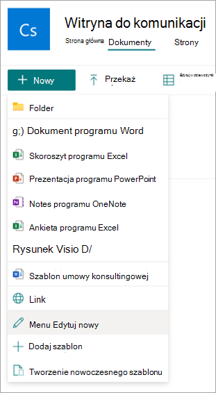
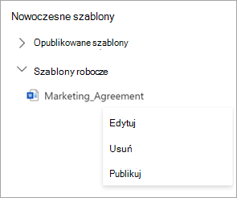

# Tworzenie dokumentów przy użyciu zestawu zawartości w aplikacji Microsoft SharePoint Syntex

Przy użyciu tego SharePoint Syntex można automatycznie generować standardowe powtarzające się dokumenty biznesowe, takie jak umowy, oświadczenia o pracy, umowy serwisowe, listy zgody, informacje o sprzedaży i korespondencja. Korzystając z zestawu zawartości w programie SharePoint Syntex, możesz zrobić to wszystko szybciej, spójniej i mniej podatnie na błędy.

Dzięki zestawowi zawartości możesz użyć istniejącego dokumentu, aby utworzyć nowoczesny *szablon, a* następnie użyć tego szablonu do automatycznego generowania nowej zawartości przy użyciu list SharePoint lub danych wejściowych użytkownika jako źródła danych.

> [!NOTE]
> Aby uzyskać dostęp do funkcji zestawu SharePoint Syntex i korzystać z tych możliwości, musisz być licencjonowanym użytkownikiem. Ponadto musisz mieć uprawnienia do zarządzania listami SharePoint listami.

## Tworzenie nowoczesnego szablonu

Wykonaj poniższe czynności, aby utworzyć nowoczesny szablon.

1. W bibliotece dokumentów programu SharePoint wybierz pozycję **NowyTworzenie** >  **nowoczesnego szablonu**. 
 
   

2. Wybierz istniejący dokument programu Word, na podstawie którego chcesz utworzyć nowoczesny szablon, a następnie wybierz pozycję **Otwórz**. 
 
   

   > [!NOTE]
   > Obecnie do tworzenia szablonów można przekazywać tylko dokumenty programu Word (.docx rozszerzenia). Upload programu Word z lokalnego magazynu lub pulpitu.

3. Po przesłaniu dokumentu dokument zostanie wyświetlony w studio szablonów, w którym możesz przekonwertować dokument na szablon.
 
   

4. W lewym górnym rogu studio szablonów wybierz nazwę szablonu. Domyślna nazwa to nazwa dokumentu użytego do utworzenia szablonu. Jeśli chcesz zmienić nazwę szablonu, wybierz nazwę domyślną lub ikonę ołówka obok nazwy, wpisz nową nazwę, a następnie naciśnij klawisz **Enter**.
 
   

5. Tworzenie symboli zastępczych dla całego tekstu dynamicznego w dokumencie, które użytkownicy mogą chcieć zmieniać z jednego dokumentu na inny. Można na przykład utworzyć symbol zastępczy dla danych wejściowych, takich jak nazwa firmy, nazwa klienta, adres, numer telefonu lub data.

    Aby utworzyć symbol zastępczy, zaznacz tekst (na przykład datę). Zostanie **otwarty panel Wszystkie** symbole zastępcze, w którym nadasz symbolowi zastępczeowi odpowiednią nazwę i wybierzesz typ danych wejściowych, które chcesz skojarzyć z symbolem zastępczym.
 
   

   Obecnie użytkownicy mogą wypełnić symbol zastępczy na dwa sposoby:

   - [Wprowadzanie tekstu lub wybieranie daty](#associate-a-placeholder-by-entering-text-or-selecting-a-date)
   - [Wybieranie jednej z opcji w kolumnie listy lub biblioteki](#associate-a-placeholder-by-selecting-from-choices-in-a-column-of-a-list-or-library)

### Kojarzenie symbolu zastępczego przez wprowadzenie tekstu lub wybranie daty 

W **panelu Wszystkie symbole** zastępcze:

1. W **polu Nazwa** wprowadź odpowiednią nazwę symbolu zastępczego.

   

2. W sekcji **Jak autorzy wypełnić ten symbol zastępczy** wybierz pozycję **Wprowadź tekst lub wybierz datę**.

3. W **polu Typ informacji** wybierz typ danych, który chcesz skojarzyć z symbolem zastępczym. Obecnie dostępnych jest sześć **opcji: Pojedynczy** wiersz **tekstu, Wiele** wierszy **tekstu, Liczba**, Data **i** **godzina, Wiadomość** e-mail i **Hiperlink**.

4. Wybierz opcję **Dodaj**.

### Kojarzenie symbolu zastępczego przez wybranie jednej z opcji w kolumnie listy lub biblioteki

W **panelu Wszystkie symbole** zastępcze:

1. W **polu Nazwa** wprowadź odpowiednią nazwę symbolu zastępczego.

   

2. W sekcji **Jak autorzy wypełnili ten** symbol zastępczy wybierz pozycję Wybierz z opcji do wyboru w kolumnie listy lub biblioteki, **a** następnie wybierz pozycję **Wybierz**.

3. Na **stronie Wybierz listę do dodawania kolumny źródłowej** wybierz listę, której chcesz użyć, a następnie wybierz pozycję **Dalej**.

   

4. Na **stronie Wybierz kolumnę źródłową** z istniejącej listy wybierz nazwę kolumny, którą chcesz skojarzyć z symbolem zastępczym, a następnie wybierz pozycję **Zapisz**. 

   

    Jeśli chcesz ponownie wyświetlić oryginalną stronę list, wybierz pozycję Przejdź do **(** nazwa listy) linku u dołu listy.

5. Gdy to zrobisz, zobaczysz, że pole listy zostało skojarzone z symbolem zastępczym.

   

6. Jeśli chcesz, aby użytkownicy mogli ręcznie dodawać dane wejściowe, oprócz wybierania z listy, wybierz pozycję Zezwalaj autorom **na dodawanie nowych opcji**. W tym przypadku domyślnym typem danych ręcznych jest *Pojedynczy wiersz tekstu*. Również wartości wprowadzane przez autorów będą używane tylko do wygenerowania dokumentu. Nie zostaną one dodane do SharePoint wiadomości.
 
Można utworzyć tyle symboli zastępczych, ile potrzeba. Po zapisaniu szablonu jako wersji roboczej lub opublikowaniu go możesz go opublikować.

   - **Zapisywanie wersji** roboczej — umożliwia zapisanie szablonu jako wersji roboczej i późniejsze uzyskanie do niego dostępu. Zapisane wersje robocze można wyświetlać, edytować lub publikować w sekcji **Nowoczesne szablony**,  >  wybierając **menu NowaEdytuj Nowy** w bibliotece dokumentów. 
   - **Publikuj** — publikuje szablon, który ma być używany przez innych użytkowników w organizacji do tworzenia dokumentów. W sekcji Nowoczesne szablony możesz wyświetlać, edytować lub cofać publikacje  szablonów, wybierając **menu NowaEdytowa**  >  Nowa z biblioteki dokumentów. 

## Edytowanie nowoczesnego szablonu

Jeśli chcesz edytować istniejący szablon albo usunąć lub cofnąć jego publikację, wykonaj poniższe czynności.

1. W bibliotece dokumentów programu SharePoint wybierz menu **NowaEdytuj** >  Nowy. 
 
   

2. W **panelu menu Edytuj nowy** w sekcji **Nowoczesne szablony** wybierz opublikowany lub wersja robocza szablonu, który chcesz edytować.
 
   

3. Aby edytować opublikowany szablon lub szablon wersji roboczej:

   - W **przypadku szablonu Opublikowane** wybierz  **pozycjęEdyt,**  aby otworzyć studio szablonów, w którym możesz edytować opublikowany szablon. Możesz również usunąć lub cofnąć publikację szablonu. 
 
      

   - W **przypadku szablonu wersji** roboczej wybierz  **pozycjęEdyt** , aby otworzyć studio szablonów, w którym możesz edytować projekt szablonu. Możesz również usunąć lub opublikować szablon.
 
      

## Tworzenie dokumentu na podstawie nowoczesnego szablonu

Możesz użyć opublikowanego *nowoczesnego* szablonu, aby szybko tworzyć podobne dokumenty bez konieczności rozpoczynania od podstaw. Aby utworzyć dokument przy użyciu opublikowanego szablonu, wykonaj następujące czynności:

1. W bibliotece dokumentów programu SharePoint wybierz pozycję **Nowy**, a następnie wybierz nowoczesny szablon, którego chcesz użyć.
 
   

2. Szablon zostanie otwarty w studio szablonów.

3. W **panelu Tworzenie dokumentu na podstawie szablonu** wprowadź odpowiednie informacje, a następnie wybierz pozycję **Utwórz dokument**.

   

   Aby skrócić czas i ograniczyć nakład pracy związany z wypełnianiem wartości symboli zastępczych, SharePoint Syntex funkcje:

      - Sugestie, które ułatwiają wybieranie wartości podczas wybierania wartości z listy.
      - Autowypełnianie wartości zastępczych, jeśli mogą jednoznacznie identyfikować rekord dla symboli zastępczych skojarzonych z tą samą listą.

> [!NOTE]
> - Obecnie tworzenie szablonu Microsoft Word obsługiwane .docx (rozszerzenie projektu). Przed przekazaniem dokumentu upewnij się, że w dokumencie programu Word nie jest **włączone śledzenie zmian** ani komentarze. Jeśli dokument zawiera symbole zastępcze tekstu dla obrazów, upewnij się, że nie są one zawinięte. Obecnie nie obsługujemy **kontrolek zawartości w** programie Word. Jeśli chcesz utworzyć szablon na podstawie dokumentu programu Word z kontrolkami zawartości, usuń je przed utworzeniem nowoczesnego szablonu.
>- Szablon i dokument są skojarzone z jedną biblioteką dokumentów. Aby użyć szablonu w innej bibliotece dokumentów, należy ponownie utworzyć szablon w tej bibliotece dokumentów.
>- Przekazany dokument użyty do utworzenia nowoczesnego szablonu zostanie zapisany jako oddzielna kopia i umieszczona w katalogu /forms biblioteki dokumentów. Nie ma to wpływu na oryginalny plik na dysku.
>- Symbole zastępcze można tworzyć tylko dla tekstu. Obecnie obrazy, grafiki smartart, tabele i listy punktorów nie są obsługiwane.
>- Po utworzeniu dokumentu na podstawie szablonu nie jest on skojarzony z szablonem.

 
