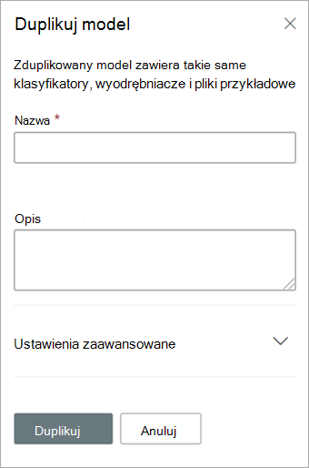

# Duplikowanie modelu w usłudze Microsoft SharePoint Syntex

Duplikowanie modelu zrozumienia dokumentów może zaoszczędzić czas i nakład pracy, jeśli trzeba utworzyć nowy model, i wiedzieć, że istniejący model jest bardzo podobny do tego, czego potrzebujesz.

Na przykład istniejący model o nazwie "Contracts" klasyfikuje te same pliki, z których musisz pracować. Nowy model wyodrębni niektóre z istniejących danych, ale będzie musiał zostać zaktualizowany w celu wyodrębnienia dodatkowych danych. Zamiast tworzyć i trenować nowy model od podstaw, można użyć funkcji zduplikowanego modelu, aby utworzyć kopię modelu Contracts, który będzie również kopiować wszystkie skojarzone elementy trenowania, takie jak przykładowe pliki i wyodrębniacze jednostek.

Po zduplikowaniu modelu po zmianie jego nazwy (na przykład na wartość "Odnowienia kontraktu") możesz wprowadzić do niego aktualizacje. Możesz na przykład usunąć niektóre z istniejących pól wyodrębnionych, które nie są potrzebne, a następnie wytrenować model w celu wyodrębnienia nowego (na przykład "Data odnowienia").

## Duplikowanie modelu

Wykonaj następujące kroki, aby zduplikować model zrozumienia dokumentu.

1. W centrum zawartości wybierz pozycję **Modele** , aby wyświetlić listę modeli.

2. Na stronie **Modele** wybierz model, który chcesz zduplikować.

3. Używając wstążki lub przycisku **Pokaż akcje** (obok nazwy modelu), wybierz pozycję **Duplikuj**. 

      

4. Na panelu **Duplikuj model** :

   a. W obszarze **Nazwa** wprowadź nową nazwę modelu, który chcesz zduplikować. 

      

   b. W obszarze **Opis** dodaj opis nowego modelu.

   c. (Opcjonalnie) W obszarze **Ustawienia zaawansowane** wybierz, czy chcesz skojarzyć istniejący [typ zawartości](/sharepoint/governance/content-type-and-workflow-planning#content-type-overview).

5. Wybierz pozycję **Duplikuj**.

## Zobacz też

[Tworzenie klasyfikatora](create-a-classifier.md)

[Zmienianie nazwy modelu](rename-a-model.md)

[Tworzenie wyodrębniacza](create-an-extractor.md)

[Omówienie usługi Document Understanding](document-understanding-overview.md)

[Typy wyjaśnień](explanation-types-overview.md)

[Stosowanie modelu](apply-a-model.md) 

[tryb ułatwień dostępu SharePoint Syntex](accessibility-mode.md)