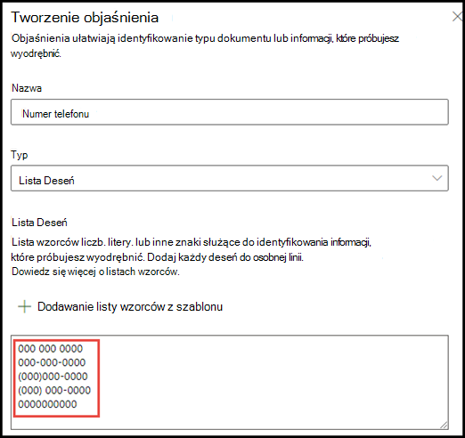
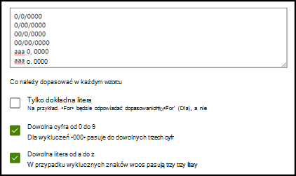
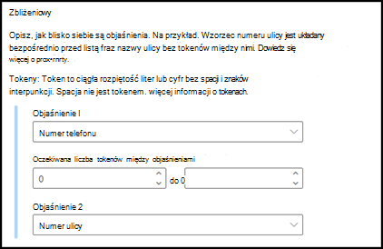
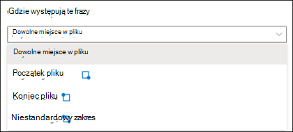
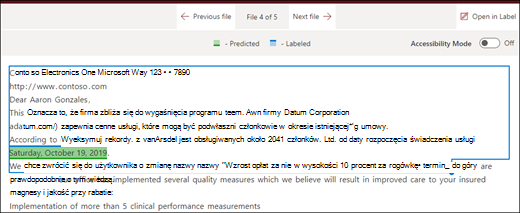

# Typy objaśnień w aplikacji Microsoft SharePoint Syntex

Objaśnienia ułatwiają definiowanie informacji, które chcesz o etykiecie i wyodrębnić, w dokumencie w celu zrozumienia modeli w aplikacji Microsoft SharePoint Syntex. Podczas tworzenia objaśnienia musisz wybrać typ objaśnienia. Ten artykuł ułatwia zrozumienie różnych typów objaśnień i sposobu ich wykorzystywanego.

Dostępne są następujące typy objaśnień:

- [**Lista fraz**](#phrase-list): lista wyrazów, fraz, liczb lub innych znaków, których można używać w wyodrębnianych informacjach lub dokumentach. Na przykład ciąg tekstowy odwołujący *się do lekarza* znajduje się we wszystkich dokumentach referencyjnych, które identyfikujesz. Lub numer *telefonu lekarskiego* we wszystkich dokumentach z poleceniem lekarskim, które identyfikujesz.

- [**Wyrażenie regularne**](#regular-expression). Używa notacji zgodnej ze wzorcem w celu znalezienia określonych wzorców znaków. Możesz na przykład użyć wyrażenia zwykłego, aby znaleźć wszystkie wystąpienia wzorca adresu e-mail  w zestawie dokumentów.

- [**Odległość**](#proximity): w tym artykule opisano, jak blisko siebie znajdują się objaśnienia. Na przykład lista fraz  numeru ulicy przebiega bezpośrednio przed listą fraz  z nazwą ulicy, bez tokenów między nimi (o tokenach dowiesz się w dalszej części tego artykułu). Korzystanie z typu odległości wymaga, aby w modelu było co najmniej dwa objaśnienia lub ta opcja zostanie wyłączona.

## Lista fraz

Typ objaśnienia listy fraz jest zazwyczaj używany do identyfikowania i klasyfikowania dokumentu za pomocą modelu. Zgodnie z *opisem w* przykładzie z etykietą lekarza jest to ciąg wyrazów, fraz, cyfr lub znaków, który jest spójnie identyfikowany w dokumentach.

Chociaż nie jest to wymagane, lepsze wyniki można osiągnąć dzięki objaśnieniu, jeśli przechwycena fraza znajduje się w spójnym miejscu w dokumencie. Na *przykład etykieta* polecania może być spójnie zlokalizowana w pierwszym akapicie dokumentu. Możesz również użyć ustawienia Zaawansowane **** konfigurowanie miejsca wystąpienia fraz w dokumencie, aby wybrać określone obszary, w których ta fraza się znajduje, szczególnie jeśli może się zdarzyć, że ta fraza może występować w wielu miejscach w dokumencie.

Jeśli przy identyfikowaniu etykiety jest wymagane określenie wielkości liter, należy użyć typu listy fraz, która umożliwia podanie jej w objaśnieniu, zaznaczając pole wyboru Tylko **dokładne** wielkości liter.

Typ frazy jest szczególnie przydatny w przypadku tworzenia objaśnienia, które identyfikuje i wyodrębnia informacje w różnych formatach, takich jak daty, numery telefonów i numery kart kredytowych. Data może być na przykład wyświetlana w wielu różnych formatach (2020-01-01, 1-1-2020, 2020-01-01, 2020-01-01 lub 1 stycznia 2020 r.). Zdefiniowanie listy fraz sprawia, że objaśnienie jest bardziej efektywne, rejestrując wszelkie możliwe odmiany danych, które próbujesz zidentyfikować i wyodrębnić.

Na przykład *numer* telefonu wyodrębnia się numer telefonu każdego lekarza polecającego ze wszystkich dokumentów polecających, które identyfikuje model. Podczas tworzenia objaśnienia wpisz różne formaty wyświetlanego numeru telefonu w dokumencie, aby móc przechwytywać możliwe odmiany.

W tym przykładzie na  liście Ustawienia zaznacz pole wyboru Dowolna cyfra z liczby **od 0 do 9**, aby rozpoznawać każdą wartość "0" używaną na liście fraz jako dowolną cyfrę od 0 do 9.

Podobnie w przypadku tworzenia listy fraz, która zawiera znaki tekstowe, zaznacz pole wyboru Dowolna litera od **a do z** , aby rozpoznać każdy znak "a" użyty na liście fraz jako dowolny znak od "a" do "z".

Jeśli na przykład utworzysz listę fraz  typu Data i chcesz mieć pewność, że format daty, taki jak 1 stycznia *2020* r., będzie rozpoznawany, musisz wykonać:

- Dodaj *aaa 0, 0000* *i aaa 00 0000* do listy fraz.
- Upewnij się, że **zaznaczono też opcję** Każda litera z a-z.

Jeśli na liście fraz są określone wymagania dotyczące określonych liter, możesz zaznaczyć pole wyboru Tylko **dokładna** data i litera. Jeśli na przykład data jest potrzebna do wymuszenia pierwszej litery miesiąca, należy:

- Dodaj *Aaa 0, 0000* i *Aaa 00 0000* do listy fraz.
- Upewnij się, że **zaznaczono również opcję Tylko dokładna** litera.

> [!NOTE]
> Zamiast ręcznie tworzyć objaśnienia listy fraz, użyj biblioteki objaśnień, aby użyć szablonów list fraz do utworzenia wspólnej listy fraz, takiej jak *data, numer* telefonu  lub *numer karty kredytowej*. 

## Wyrażenie regularne

Typ objaśnienia wyrażeń regularnych pozwala utworzyć wzorce, które ułatwiają znajdowanie i identyfikowanie określonych ciągów tekstowych w dokumentach. Wyrażenia regularne mogą umożliwiać szybkie analizowanie dużych ilości tekstu w celu:

- Znajdowanie określonych wzorców znaków.
- Sprawdź poprawność tekstu, aby upewnić się, że jest on zgodnie ze wstępnie zdefiniowanym wzorcem (na przykład adresem e-mail).
- Wyodrębnianie, edytowanie, zamienianie lub usuwanie podciągów tekstu.

Typ wyrażenia regularnego jest szczególnie przydatny w przypadku tworzenia objaśnienia, które identyfikuje i wyodrębnia informacje w podobnych formatach, takich jak adresy e-mail, numery kont bankowych lub adresy URL. Na przykład adres e-mail, na przykład megan@contoso.com, jest wyświetlany w określonym wzorcu ("megan" to pierwsza część, a ostatnia część to "com").

Wyrażenie regularne dla adresu **e-mail jest: [A-Za-z0-9._%-]+@[A-Za-z0-9.-]+". A-Za-z]{2,6}**.

To wyrażenie składa się z pięciu części w tej kolejności:

1. Dowolna liczba następujących znaków:

   a. Litery od a do z

   b. Liczby od 0 do 9

   c. Kropka, podkreślenie, procent lub kreska

2. Symbol @

3. Dowolna ilość tych samych znaków co pierwsza część adresu e-mail

4. Okres

5. Od dwóch do sześciu liter

Aby dodać typ objaśnienia wyrażenia regularnego:

1. W **panelu Tworzenie objaśnienia** w obszarze **Typ objaśnienia** wybierz pozycję **Zwykłe wyrażenie**.

   

2. Możesz wpisać wyrażenie w polu tekstowym **Wyrażenie** regularne lub wybrać pozycję **Dodaj zwykłe wyrażenie z szablonu**.

   Dodanie wyrażenia zwykłego przy użyciu szablonu powoduje automatyczne dodanie nazwy i wyrażenia zwykłego do pola tekstowego. Jeśli na przykład wybierzesz **szablon Adres** e-mail **, panel Tworzenie** objaśnienia zostanie wypełniony.

   

### Ograniczenia

W poniższej tabeli przedstawiono opcje znaków w tekście, których obecnie nie można używać w wzorcach wyrażeń regularnych.

|Opcja  |Stan  |Bieżąca funkcjonalność  |
|---------|---------|---------|
|Charakter wielkości liter | Obecnie nie jest obsługiwana. | W przypadku wszystkich wykonanych dopasowania nie jest uwzględniania liter.  |
|Kotwice linii     | Obecnie nie jest obsługiwana. | Nie można określić określonej pozycji w ciągu, na której musi wystąpić dopasowanie.   |

## Odległość

Typ objaśnienia odległości ułatwia modelowi identyfikowanie danych przez określenie, jak blisko jest inny fragment danych. Na przykład w modelu zdefiniowano dwa objaśnienia z etykietą numer telefonu i numer telefonu *klienta*.

Zwróć uwagę, że numery telefonów klientów są zawsze wyświetlane przed numerem ulicy.

Alex Wilburn 
555-555-5555 
One Microsoft Way 
Redmond, WA 98034 

Objaśnienie odległości pozwala lepiej określić numer telefonu w dokumentach.

> [!NOTE]
> Obecnie nie można używać wyrażeń regularnych z wyjaśnieniem odległości.

#### Co to są tokeny?

Aby użyć typu objaśnienia odległości, musisz zrozumieć, co to jest token. Liczba tokenów jest miarą odległości między objaśnieniami. Token to ciągły rozpiętość liter i cyfr (bez spacji i znaków interpunkcji).

W poniższej tabeli pokazano przykłady ustalania liczby tokenów w frazie.

|Fraza|Liczba tokenów|Objaśnienie|
|--|--|--|
|`Dog`|1|Jeden wyraz bez znaków interpunkcji i spacji.|
|`RMT33W`|1|Numer lokalizatora rekordów. Może zawierać cyfry i litery, ale nie ma znaków interpunkcji.|
|`425-555-5555`|5|Numer telefonu. Każdy znak interpunkcji to jeden token, `425-555-5555` więc jest to 5 tokenów: `425` `-` `555` `-` `5555` |
|`https://luis.ai`|7|`https` `:` `/` `/` `luis` `.` `ai` |

#### Konfigurowanie typu objaśnienia odległości

Na przykład skonfiguruj ustawienie odległości w celu zdefiniowania zakresu tokenów w objaśnieniu numeru telefonu z objaśnienia *numeru ulicy*. Zwróć uwagę, że minimalny zakres to "0", ponieważ między numerem telefonu a numerem adresu nie ma tokenów.

Jednak niektóre numery telefonów w przykładowych dokumentach są dołączane *(urządzenie przenośne)*.

Nestor Gdynia 
111-111-1111 (urządzenie przenośne) 
One Microsoft Way 
Redmond, WA 98034 

Istnieją trzy tokeny w *(na urządzeniu przenośnym)*:

|Fraza|Liczba tokenów|
|--|--|
|(|1|
|urządzenie przenośne|2|
|)|3|

Skonfiguruj ustawienie odległości od 0 do 3.

## Konfigurowanie miejsca wystąpienia fraz w dokumencie

Podczas tworzenia objaśnienia domyślnie cały dokument jest przeszukiwany pod celu wyszukania frazy, która ma być wyodrębniona. Można jednak użyć ustawienia zaawansowanego  Gdzie występują te frazy, aby ułatwić odizolowanie określonego miejsca w dokumencie, w którym występuje fraza. To ustawienie jest przydatne w sytuacjach, gdy podobne wystąpienia frazy mogą pojawiać się w innym miejscu dokumentu i trzeba się upewnić, że jest wybrane właściwe.

Odwołując się do przykładu dokumentu z poleceniem  lekarskim, w pierwszym akapicie dokumentu jest zawsze wzmiankowana o lekarza polecającej. Przy ustawieniu **Where these phrases occur** (Gdzie występują te frazy) w tym przykładzie możesz skonfigurować objaśnienie w celu wyszukania tej etykiety tylko w sekcji początku dokumentu lub dowolnej innej lokalizacji, w której może wystąpić.

Dla tego ustawienia możesz wybrać następujące opcje:

- Dowolne miejsce w pliku: fraza jest przeszukiwana w całym dokumencie.

- Początek pliku: Dokument jest przeszukiwany od początku do lokalizacji fraz.

   

    W przeglądarce można ręcznie dostosować pole wyboru, aby uwzględnić lokalizację, w której występuje faza. Wartość **Pozycja końcowa** zostanie zaktualizowana, aby wyświetlić liczbę tokenów uwzględnianych w wybranym obszarze. Aby dopasować zaznaczony  obszar, można także zaktualizować wartość Pozycja końcowa.

   

- Koniec pliku: Dokument jest przeszukiwany od końca do lokalizacji fraz.

   

    W przeglądarce można ręcznie dostosować pole wyboru, aby uwzględnić lokalizację, w której występuje faza. Wartość **Pozycja początkowa** zostanie zaktualizowana, aby wyświetlić liczbę tokenów uwzględnianych w wybranym obszarze. Wartość Pozycja początkowa można także zaktualizować, aby dostosować zaznaczony obszar.

   

- Zakres niestandardowy: Dokument jest przeszukiwany w określonym zakresie pod poszukiwaniu lokalizacji frazy.

   

    W przeglądarce można ręcznie dostosować pole wyboru, aby uwzględnić lokalizację, w której występuje faza. Dla tego ustawienia należy wybrać pozycję **Rozpoczęcie** i **Koniec** . Te wartości reprezentują liczbę tokenów od początku dokumentu. Chociaż można ręcznie wprowadzać te wartości, łatwiej jest ręcznie dostosować pole wyboru w przeglądarce.
    
## Zagadnienia związane z konfigurowaniem objaśnień
Podczas szkolenia klasyfikatora należy pamiętać o kilku kwestiach, które mogą przynieść bardziej przewidywalne wyniki:

- Im więcej dokumentów przeszkolisz, tym dokładniejszy będzie klasyfikator.  Jeśli to możliwe, użyj więcej niż 5 dobrych dokumentów i użyj więcej niż 1 złego dokumentu.  Jeśli biblioteki, z których pracujesz, mają kilka różnych typów dokumentów, kilka z nich pozwala uzyskać bardziej przewidywalne wyniki.
- Oznaczanie dokumentu jako ważnego w procesie szkoleniowym.  Są one używane razem z objaśnieniami w celu przeszkolinia modelu.  Podczas szkolenia klasyfikatora z dokumentami, które nie mają zbyt wiele zawartości, mogą pojawić się pewne anomalie.  Objaśnienie może nie odpowiadać niczego w dokumencie, ale ponieważ zostało oznaczone jako "dobry" dokument, podczas szkolenia może się okazać, że jest on zgodne.
- Podczas tworzenia objaśnień w połączeniu z etykietą jest używana logika OR w celu określenia, czy jest to zgodne.  Wyrażenie regularne z logiką AND może być bardziej przewidywalne.  Oto przykład wyrażenia regularnego, które będzie można używać w rzeczywistych dokumentach podczas szkoleń.  Zwróć uwagę, że tekst wyróżniony na czerwono to szukane frazy.

    <pre>(?=.*network provider)(?=.*participating providers).*</pre>
    
- Etykiety i objaśnienia współpracują ze sobą i są używane podczas szkolenia modelu.  Nie jest to szereg reguł, które można od łączyć i precyzyjnie określić ich waga lub przewidywać, które są stosowane do każdej skonfigurowanej zmiennej.  Im większa odmiana dokumentów używanych podczas szkolenia zapewnia większą dokładność w modelu.

### Zobacz też

[Używanie szablonów objaśnień w programie SharePoint Syntex](explanation-templates.md)
