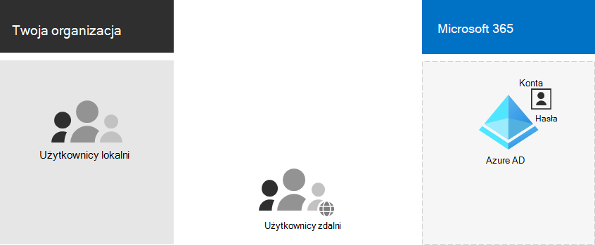
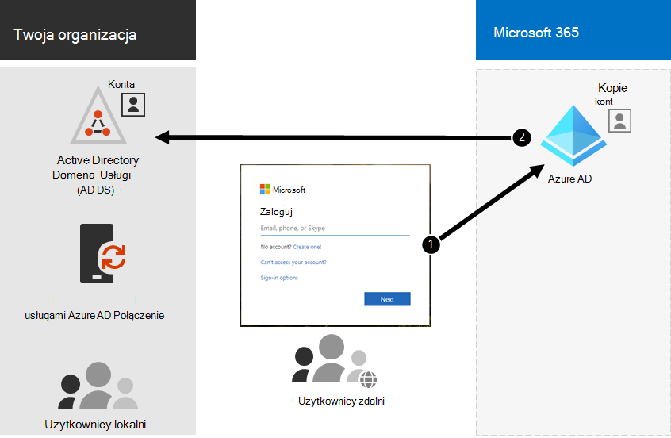

# Krok nr 1. Określanie modelu tożsamości w chmurze

Microsoft 365 usługi Azure Active Directory (Azure AD) — opartej na chmurze tożsamości użytkownika usługa uwierzytelniania i usługi usługa uwierzytelniania dołączonej do Twojej subskrypcji usługi Microsoft 365 — do zarządzania tożsamościami i uwierzytelnianiem na Microsoft 365. Poprawne skonfigurowanie infrastruktury tożsamości jest niezbędne do zarządzania Microsoft 365 dostępu użytkowników i uprawnień dla organizacji.

Przed rozpoczęciem obejrzyj ten klip wideo, aby uzyskać omówienie modeli tożsamości i uwierzytelniania dla Microsoft 365.

 

> [!VIDEO https://www.microsoft.com/videoplayer/embed/RE2Pjwu]

Pierwszym wyborem do planowania jest model tożsamości w chmurze.

## Modele tożsamości w chmurze firmy Microsoft

Aby zaplanować konta użytkowników, musisz najpierw zrozumieć dwa modele tożsamości w p Microsoft 365. Tożsamości organizacji możesz zachować tylko w chmurze lub możesz zachować lokalną tożsamości programu Usługi domenowe w usłudze Active Directory (AD DS) i używać ich do uwierzytelniania, gdy użytkownicy uzyskają dostęp do Microsoft 365 usług w chmurze.

Oto dwa typy tożsamości oraz ich najlepsze dopasowanie i zalety.

| Atrybut | Tożsamość tylko w chmurze | Tożsamość hybrydowa |
|:-------|:-----|:-----|
| **Definicja** | Konto użytkownika istnieje tylko w dzierżawie usługi Azure AD dla Twojej Microsoft 365 subskrypcji usługi Azure. | Konto użytkownika istnieje w usłudze AD DS a kopia jest również w dzierżawie usługi Azure AD dla Twojej Microsoft 365 subskrypcji usługi. Konto użytkownika w usłudze Azure AD może także zawierać skrótową wersję już AD DS hasła do konta użytkownika. |
| **Jak Microsoft 365 uwierzytelnia poświadczenia użytkownika** | Dzierżawa usługi Azure AD dla Twojej subskrypcji usługi Microsoft 365 przeprowadza uwierzytelnianie za pomocą konta tożsamości w chmurze. | Dzierżawa usługi Azure AD dla Twojej subskrypcji usługi Microsoft 365 obsługuje proces uwierzytelniania lub przekierowuje użytkownika do innego dostawcy tożsamości. |
| **Najlepsze dla** | Organizacje, które nie mają lub nie potrzebują lokalnego AD DS. | Organizacje korzystające AD DS lub innego dostawcy tożsamości. |
| **Największa korzyść** | Prosty w obsłudze. Nie są wymagane żadne dodatkowe narzędzia katalogowe ani serwery. | Użytkownicy mogą używać tych samych poświadczeń podczas uzyskiwania dostępu do zasobów lokalnych lub opartych na chmurze. |
||||

## Tożsamość tylko w chmurze

Tożsamość chmurowa używa kont użytkowników istniejących tylko w usłudze Azure AD. Tożsamość tylko w chmurze jest zwykle używana przez małe organizacje, które nie mają serwerów lokalnych lub nie używają usługi AD DS do zarządzania tożsamościami lokalnymi.

Oto podstawowe składniki tożsamości tylko w chmurze.

Użytkownicy lokalni i zdalni (online) używają swoich kont użytkowników i haseł w usłudze Azure AD, aby uzyskać Microsoft 365 usług w chmurze. Usługa Azure AD uwierzytelnia poświadczenia użytkowników na podstawie przechowywanych kont użytkowników i haseł.

### Administracja
Ponieważ konta użytkowników są przechowywane tylko w usłudze Azure AD, tożsamości w chmurze można zarządzać za pomocą narzędzi, [takich jak](/admin) centrum administracyjne platformy Microsoft 365 i [Windows PowerShell](manage-user-accounts-and-licenses-with-microsoft-365-powershell.md).

## Tożsamość hybrydowa

W tożsamości hybrydowej są używane konta, które pochodzą z lokalnego AD DS i mają kopię w dzierżawie usługi Azure AD subskrypcji usługi Microsoft 365 subskrypcji. Większość zmian, z wyjątkiem określonych [atrybutów konta](/azure/active-directory/hybrid/reference-connect-sync-attributes-synchronized), przepływa tylko w jeden sposób. Zmiany wprowadzone w kontach AD DS są synchronizowane z ich kopią w usłudze Azure AD.

Usługa Azure AD Połączenie zapewnia bieżącą synchronizację kont. Działa ona na serwerze lokalnym, sprawdza zmiany w usłudze AD DS i przesyła je dalej do usługi Azure AD. Usługa Azure AD Połączenie umożliwia filtrowanie synchronizowanych kont i określenie, czy mają być synchronizowane hasła użytkowników w wersji z hasztagiem (PHS, password hash synchronization).

Podczas wdrażania tożsamości hybrydowej lokalna AD DS jest autorytatywnym źródłem informacji o koncie. Oznacza to, że zadania administracyjne wykonuje się głównie lokalnie, które są następnie synchronizowane z usługą Azure AD.

Oto składniki tożsamości hybrydowej.

Dzierżawa usługi Azure AD ma kopię tych AD DS konta. W tej konfiguracji użytkownicy lokalni i zdalni, którzy mają dostęp do Microsoft 365 w chmurze, są uwierzytelniani w usłudze Azure AD.

> [!NOTE]
> Zawsze musisz używać usługi Azure AD Połączenie do synchronizowania kont użytkowników na potrzeby tożsamości hybrydowej. Zsynchronizowane konta użytkowników w usłudze Azure AD są potrzebne do wykonywania przypisań licencji i zarządzania grupą, konfigurowania uprawnień i innych zadań administracyjnych związanych z kontami użytkowników.

### Hybrydowa synchronizacja katalogów i tożsamości na Microsoft 365

W zależności od potrzeb biznesowych i wymagań technicznych hybrydowy model tożsamości i synchronizacja katalogów są najpopularniejszym wyborem dla klientów korporacyjnych, którzy przyjmą Microsoft 365. Synchronizacja katalogów umożliwia zarządzanie tożsamościami w usłudze Usługi domenowe w usłudze Active Directory (AD DS), a wszystkie aktualizacje kont użytkowników, grup i kontaktów są synchronizowane z dzierżawą usługi Azure Active Directory (Azure AD) subskrypcji usługi Microsoft 365.

>[!Note]
>Podczas AD DS użytkowników są synchronizowane po raz pierwszy, nie są one automatycznie przypisywane do nich licencję usługi Microsoft 365 i nie mogą uzyskać dostępu do Microsoft 365 usług, takich jak poczta e-mail. Musisz najpierw przypisać im lokalizację użytkowania. Następnie przypisz do tych kont użytkowników licencję, indywidualnie lub dynamicznie za pośrednictwem członkostwa w grupie.
>

#### Uwierzytelnianie dla tożsamości hybrydowej

Istnieją dwa typy uwierzytelniania w przypadku korzystania z modelu tożsamości hybrydowej:

- Uwierzytelnianie zarządzane

  Usługa Azure AD obsługuje proces uwierzytelniania za pomocą lokalnie przechowywanej wersji skrótu hasła lub wysyła poświadczenia do lokalnego agenta oprogramowania w celu uwierzytelnienia ich przez lokalnego AD DS.

- Uwierzytelnianie federowane

  Usługa Azure AD przekierowuje klienta żądające uwierzytelnienia do innego dostawcy tożsamości.

#### Uwierzytelnianie zarządzane

Istnieją dwa typy uwierzytelniania zarządzanego:

- Synchronizacja skrótów haseł (PHS)

  Azure AD wykonuje uwierzytelnianie.

- Uwierzytelnianie pass-through (PTA)

  Usługa Azure AD AD DS przeprowadzić uwierzytelnianie.

##### Synchronizacja skrótów haseł (PHS)

Za pomocą phS synchronizuje się konta AD DS użytkowników z Microsoft 365 zarządzanie użytkownikami lokalnymi. Skróty haseł użytkowników są synchronizowane z konta usługi AD DS z usługą Azure AD, dzięki czemu użytkownicy mają te same hasła lokalnie i w chmurze. Jest to najprostszy sposób włączenia uwierzytelniania AD DS w usłudze Azure AD. 

Gdy hasła zostaną zmienione lub zresetowane lokalnie, nowe skróty haseł są synchronizowane z usługą Azure AD, dzięki czemu użytkownicy zawsze mogą używać tego samego hasła dla zasobów chmurowych i lokalnych. Hasła użytkowników nigdy nie są wysyłane do usługi Azure AD ani przechowywane w usłudze Azure AD w wyraźnym tekście. Niektóre funkcje premium usługi Azure AD, takie jak Identity Protection, wymagają funkcji PHS niezależnie od wybranej metody uwierzytelniania.
  
Aby [dowiedzieć się więcej, zobacz Wybieranie odpowiedniej metody](/azure/active-directory/hybrid/choose-ad-authn) uwierzytelniania.
  
##### Uwierzytelnianie pass-through (PTA)

Usługa PTA zapewnia prostą weryfikację haseł dla usług uwierzytelniania usługi Azure AD przy użyciu agenta oprogramowania działającego na jednym lub kilku serwerach lokalnych w celu weryfikacji użytkowników bezpośrednio w AD DS. Za pomocą aplikacji PTA można synchronizować AD DS użytkowników z usługami Microsoft 365 zarządzać użytkownikami lokalnymi. 

Funkcja PTA umożliwia użytkownikom logowanie się zarówno do zasobów lokalnych, Microsoft 365 i aplikacji przy użyciu ich lokalnego konta i hasła. Ta konfiguracja sprawdza hasła użytkowników bezpośrednio z lokalnego konta usługi AD DS bez przechowywania skrótów haseł w usłudze Azure AD. 

PtA jest również dla organizacji, w których jest wymagane bezpieczeństwo natychmiastowe wymuszanie lokalnych stanów kont użytkowników, zasad haseł i godzin logowania. 
  
Aby [dowiedzieć się więcej, zobacz Wybieranie odpowiedniej metody](/azure/active-directory/hybrid/choose-ad-authn) uwierzytelniania.
  
##### Uwierzytelnianie federowane

Uwierzytelnianie federowane jest przeznaczone przede wszystkim dla dużych przedsiębiorstw z bardziej złożonymi wymaganiami uwierzytelniania. AD DS tożsamości są synchronizowane z usługą Microsoft 365 a kontami użytkowników są zarządzane lokalnie. W przypadku uwierzytelniania feder sądowego użytkownicy mają te same hasła w środowisku lokalnym i w chmurze oraz nie muszą logować się ponownie, aby używać Microsoft 365. 

Uwierzytelnianie federowane może obsługiwać dodatkowe wymagania uwierzytelniania, takie jak uwierzytelnianie oparte na kartach inteligentnych lub uwierzytelnianie wieloskładnikowe innych firm. Jest zazwyczaj wymagane, gdy organizacje mają wymagania uwierzytelniania, które natywnie nie są obsługiwane przez usługę Azure AD.
 
Aby [dowiedzieć się więcej, zobacz Wybieranie odpowiedniej metody](/azure/active-directory/hybrid/choose-ad-authn) uwierzytelniania.
  
W przypadku usług uwierzytelniania i tożsamości innych firm lokalne obiekty katalogu mogą być synchronizowane z usługą Microsoft 365 i dostępem do zasobów w chmurze, które są zarządzane głównie przez zewnętrznego dostawcę tożsamości (IdP). Jeśli Twoja organizacja korzysta z rozwiązania federńskiego innej firmy, możesz skonfigurować logowanie się w tym rozwiązaniu dla usługi Microsoft 365 pod warunkiem, że federowane rozwiązanie innej firmy jest zgodne z usługą Azure AD.
  
Aby dowiedzieć się więcej, zobacz [listę zgodności federacji usługi Azure AD](/azure/active-directory/connect/active-directory-aadconnect-federation-compatibility) .
  
### Administracja

Ponieważ oryginalne i autorytatywne konta użytkowników są przechowywane w lokalnym programie AD DS, możesz zarządzać tożsamościami za pomocą tych samych narzędzi, które samodzielnie AD DS.

Do zarządzania zsynchronizowanymi kontami użytkowników w usłudze Azure AD nie centrum administracyjne platformy Microsoft 365 programu PowerShell Microsoft 365 programu PowerShell.

## Następny krok

Przejdź do [kroku 2,](protect-your-global-administrator-accounts.md) aby zabezpieczyć konta administratora globalnego.
