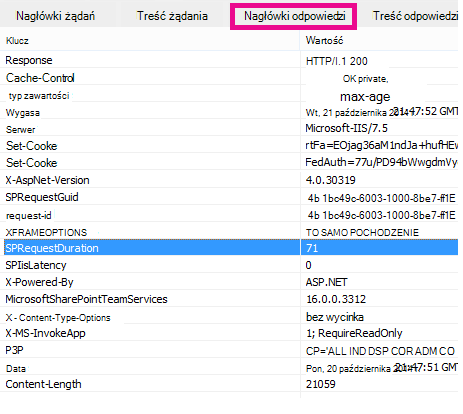

# Diagnozowanie problemów z wydajnością aplikacji SharePoint Online

W tym artykule pokazano, jak diagnozować typowe problemy z witryną usługi SharePoint Online przy użyciu narzędzi dewelopernych programu Internet Explorer.
  
Istnieją cztery różne sposoby identyfikowania, że na stronie w witrynie usługi SharePoint Online występuje problem z wydajnością z dostosowaniami.

- Diagnostyka wydajności witryny i strony
  
- Monitor sieci paska narzędzi F12

- Porównanie z planem bazowym bez dostosowano

- SharePoint nagłówka odpowiedzi online

W tym temacie opisano, jak diagnozować problemy z wydajnością przy użyciu każdej z tych metod. Gdy ustalisz przyczynę problemu, możesz powyądać nad rozwiązaniem, korzystając z artykułów na temat poprawy SharePoint wydajności, które można znaleźć na https://aka.ms/tune.  

## Korzystanie z diagnostyki wydajności witryny i strony z centrum Administracja Microsoft 365 strony

> [!NOTE]
> Jeśli jesteś administratorem i masz problemy z wydajnością w programie SharePoint, wybierz pozycję Uruchom testy poniżej, co  spowoduje wypełnienie diagnostyki wydajności witryny i strony w Centrum Administracja Microsoft 365. Te testy sprawdzają konfigurację i szybko zalecają kolejne kroki w celu zwiększenia SharePoint wydajności dzierżawy.
>> [!div class="nextstepaction"]
>> [Uruchom testy: sprawdź SharePoint wydajności](https://aka.ms/PillarSiteandPagePerf)

> [!NOTE] 
> Ta funkcja nie jest dostępna dla Microsoft 365 Government, Microsoft 365 obsługiwanej przez firmę 21Vianet ani Microsoft 365 Germany.
  
## Diagnozowanie wydajności w aplikacji SharePoint Online za pomocą paska narzędzi SharePoint F12

W tym artykule używamy programu Internet Explorer 11. Wersje narzędzi deweloperskiej F12 w innych przeglądarkach mają podobne funkcje, ale mogą wyglądać nieco inaczej. Aby uzyskać informacje na temat narzędzi deweloperskiej f12, zobacz:
  
- [Co nowego w narzędziu F12](/previous-versions/windows/internet-explorer/ie-developer/dev-guides/bg182632(v=vs.85))

- [Korzystanie z narzędzi deweloperskiej F12](/previous-versions/windows/internet-explorer/ie-developer/samples/bg182326(v=vs.85))

Aby przywrócić narzędzia deweloperskie, naciśnij **klawisz F12** , a następnie kliknij Wi-Fi narzędzia:
  

  
Na karcie **Sieć** naciśnij zielony przycisk odtwarzania, aby załadować stronę. Narzędzie zwraca wszystkie pliki, których żąda przeglądarka w celu uzyskania strony, o która prosi. Poniższy zrzut ekranu przedstawia jedną taką listę.
  

  
Po prawej stronie możesz również sprawdzić czasy pobierania plików, jak pokazano na tym zduszce.
  

  
Jest to wizualne przedstawienie tego, jak długo trwało ładowanie pliku. Zielona linia oznacza, kiedy strona jest gotowa do renderowania przez przeglądarkę. Dzięki temu możesz uzyskać szybki podgląd różnych plików, które mogą powodować wolne ładowanie stron w Twojej witrynie.
  
## Konfigurowanie planu bazowego bez dostosowawowego dla usługi SharePoint Online

Najlepszym sposobem na określenie słabych punktów wydajności Twojej witryny jest skonfigurowanie całkowicie dostępnego zbioru witryn w u SharePoint Online. Dzięki temu możesz porównać wszystkie aspekty swojej witryny z tym, co można uzyskać bez żadnych dostosowań na stronie. Strona OneDrive dla Firm jest dobrym przykładem oddzielnego zbioru witryn, w przypadku których dostosowanie jest mało prawdopodobne.
  
## Wyświetlanie SharePoint informacji nagłówka odpowiedzi

W SharePoint w trybie online można uzyskać dostęp do informacji wysyłanych z powrotem do przeglądarki w nagłówku odpowiedzi dla każdego pliku. Najbardziej przydatną wartością w przypadku diagnozowania problemów z wydajnością jest **SPRequestDuration**, która wyświetla czas przetwarzania żądania na serwerze. Dzięki temu można ustalić, czy żądanie jest bardzo obciążane i wymaga dużej ilości zasobów. Jest to najlepszy wgląd w informacje o tym, ile pracy musi pracować serwer, aby obsługiwać stronę.

### Aby wyświetlić SharePoint nagłówka odpowiedzi
  
1. Upewnij się, że masz zainstalowane narzędzia F12. Aby uzyskać więcej informacji na temat pobierania i instalowania tych narzędzi, zobacz Co nowego w narzędziach [F12](/previous-versions/windows/internet-explorer/ie-developer/dev-guides/bg182632(v=vs.85)).

2. W narzędziach F12 na karcie **Sieć** naciśnij zielony przycisk odtwarzania, aby załadować stronę.

3. Kliknij jeden z plików aspx zwróconych przez narzędzie, a następnie kliknij pozycję **SZCZEGÓŁY**.

    
  
4. Kliknij **pozycję Nagłówki odpowiedzi**.

    
  
## Co powoduje problemy z wydajnością usługi SharePoint Online?

W artykule Opcje nawigacji dla usługi [SharePoint Online](navigation-options-for-sharepoint-online.md) pokazano przykład użycia wartości SPRequestDuration w celu ustalenia, że skomplikowana nawigacja strukturalna powodowała długie przetwarzanie strony na serwerze. Dzięki ustaleniu wartości dla witryny podstawowej (bez dostosowań) można określić, czy ładowanie danego pliku trwa długo. Przykład używany w [opcjach nawigacji dla aplikacji SharePoint Online](navigation-options-for-sharepoint-online.md) to główny plik aspx. Ten plik zawiera większość kodu ASP.NET uruchamianego w celu załadowania strony. W zależności od wybranego szablonu witryny może to być plik start.aspx, home.aspx, default.aspx lub inna nazwa, jeśli strona główna jest dostosowywana. Jeśli ta liczba jest znacznie wyższa niż witryna podstawowa, oznacza to, że na stronie dzieje się coś złożonego, który powoduje problemy z wydajnością.
  
Po zidentyfikowaniu problemu specyficznego dla Twojej witryny zalecanym sposobem na zidentyfikowanie, co jest przyczyną słabej wydajności, jest wyeliminowanie wszystkich możliwych przyczyn, takich jak dostosowania strony, a następnie ich dodawanie z powrotem do witryny jeden po drugiej. Po usunięciu wystarczającej ilości dostosowań strona działa dobrze, możesz następnie dodawać po poszczególnych dostosowaniach.
  
Jeśli na przykład masz bardzo skomplikowaną nawigację, spróbuj zmienić nawigację tak, aby nie pokazywała podwiter, a następnie sprawdź w narzędziach dewelopersko, czy ma to znaczenie. Jeśli masz dużą ilość rzutowania zawartości, spróbuj usunąć je ze strony i zobacz, czy to poprawia jakość. Jeśli wyeliminuje się wszystkie możliwe przyczyny i dodaje się je ponownie, możesz łatwo określić, które funkcje są największym problemem, a następnie wrócić do rozwiązania.
