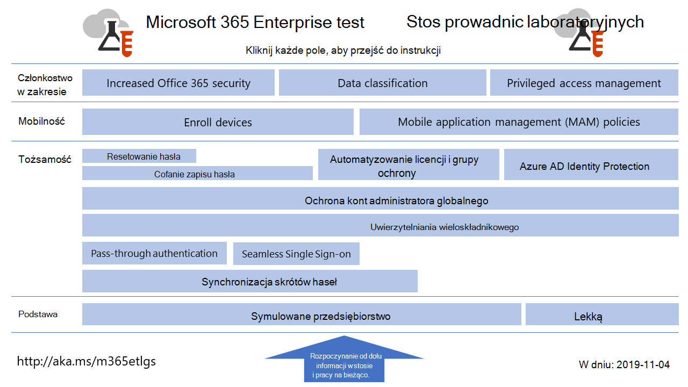

# Microsoft 365 laboratorium testowego dla przedsiębiorstw

*Dotyczy to zarówno aplikacji dla Microsoft 365 przedsiębiorstw, jak i Office 365 Enterprise.*

Przewodniki laboratorium testowego ułatwiają szybkie poznanie produktów firmy Microsoft. Zawierają one instrukcje wstępne dotyczące konfigurowania uproszczonych, ale reprezentatywnych środowisk testowych. Tych środowisk można używać do pokazu, dostosowywania lub tworzenia złożonych dowodów koncepcji dla czasu trwania wersji próbnej lub płatnej subskrypcji.

Czas wygaśnięcia są zaprojektowane tak, aby był modułowy. Tworzą wiele konfiguracji, które są dokładniej dopasowane do twoich potrzeb w zakresie nauki lub testowania konfiguracji. Doświadczenie praktyczne "Wybudowaliśmy go samodzielnie i działa" pomaga zrozumieć wymagania dotyczące wdrażania nowego produktu lub scenariusza, dzięki czemu możesz lepiej zaplanować jego hosting w środowisku produkcyjnym.

Możesz także używać UTLG, aby tworzyć środowiska reprezentowane do opracowywania i testowania aplikacji, nazywanych również środowiskami deweloperskich/testowych.
  

Aby uzyskać wizualną mapę do wszystkich artykułów w stosie przewodników laboratorium testowego Microsoft 365 dla przedsiębiorstw, rozwiń następującą grafikę lub przejdź do strony Microsoft 365 [przewodników](../downloads/Microsoft365EnterpriseTLGStack.pdf) laboratorium testowego dla przedsiębiorstw.

## Konfiguracja podstawowa

Najpierw utwórz środowisko testowe dla Microsoft 365 [przedsiębiorstwa](/microsoft-365-enterprise/). Możesz utworzyć dwa różne typy konfiguracji podstawowej:

- [Konfiguracja podstawowa](lightweight-base-configuration-microsoft-365-enterprise.md) — ta funkcja jest dostępna w sytuacji, gdy chcesz skonfigurować i pokazać Microsoft 365 z funkcjami i możliwościami przedsiębiorstwa w środowisku tylko w chmurze, które nie zawiera żadnych lokalnych składników.

- [Symulowana](simulated-ent-base-configuration-microsoft-365-enterprise.md) konfiguracja bazy przedsiębiorstwa — użyj jej, jeśli chcesz skonfigurować i pokazać usługę Microsoft 365 dla funkcji i możliwości przedsiębiorstwa w hybrydowym środowisku chmurowym, w którym używane są składniki lokalne, takie jak domena Usługi domenowe w usłudze Active Directory (AD DS).

Możesz również tworzyć środowiska testowe dla Office 365 E5, nie dodając licencji Microsoft 365 E5 do środowiska testowego wersji próbnej lub produkcyjnej.
    
## Tożsamości

Aby pokazać funkcje i możliwości związane z tożsamością, zobacz:

- [Synchronizacja skrótów haseł](password-hash-sync-m365-ent-test-environment.md)
  
   Włącz i przetestuj synchronizację katalogów opartą na skrótach haseł z AD DS domeny.

- [Uwierzytelnianie za pośrednictwem serwera](pass-through-auth-m365-ent-test-environment.md)
  
   Włącz i przetestuj uwierzytelnianie pass-through na AD DS domeny.

- [Uwierzytelnianie federowane](federated-identity-for-your-microsoft-365-dev-test-environment.md)
  
   Włącz i przetestuj uwierzytelnianie federowane na AD DS domeny.

- [Bezproblemowe logowanie pojedyncze w usłudze Azure AD](single-sign-on-m365-ent-test-environment.md)
  
   Włącz i przetestuj bezproblemowe logowanie jednokrotne w usłudze Azure AD za pomocą AD DS domeny.

- [Uwierzytelnianie wieloskładnikowe](multi-factor-authentication-microsoft-365-test-environment.md)
  
   Włącz i przetestuj uwierzytelnianie wieloskładnikowe oparte na smartfonie dla określonego konta użytkownika.

- [Ochrona kont administratora globalnego](protect-global-administrator-accounts-microsoft-365-test-environment.md)

   Blokowanie kont administratora globalnego przy użyciu zasad dostępu warunkowego.

- [Pisanie zwrotne hasła](password-writeback-m365-ent-test-environment.md)

   Użyj funkcji zapisu zwrotnego hasła, aby zmienić hasło do konta AD DS z usługi Azure AD.

- [Resetowanie hasła](password-reset-m365-ent-test-environment.md)

   Użyj funkcji samodzielnego resetowania hasła, aby zresetować hasło.

- [Automatyczne licencjonowanie i członkostwo w grupach](automate-licenses-group-membership-microsoft-365-test-environment.md)

   Administrowanie nowymi kontami jest łatwiejsze niż kiedykolwiek dzięki automatycznemu licencjonowaniu i dynamicznemu członkosstwie w grupach.

- [Azure AD Identity Protection](azure-ad-identity-protection-microsoft-365-test-environment.md)

   Skanowanie bieżących kont użytkowników w poszukiwaniu luk.

- [Tożsamość i dostęp do urządzeń](identity-device-access-m365-test-environment.md)

   Utwórz środowisko, aby przetestować zalecane konfiguracje tożsamości i dostępu do urządzenia oraz zasady dostępu warunkowego.

## Zarządzanie urządzeniami przenośnymi

Aby pokazać funkcje i możliwości związane z zarządzaniem urządzeniami przenośnymi, zobacz:

- [Zasady zgodności urządzeń](mam-policies-for-your-microsoft-365-enterprise-dev-test-environment.md)
    
   Utwórz grupę użytkowników i zasady zgodności urządzeń dla Windows 10 urządzeniach.
    
- [Rejestrowanie urządzeń z systemami iOS i Android](enroll-ios-and-android-devices-in-your-microsoft-enterprise-365-dev-test-environ.md)
   
   Zarejestruj urządzenia z systemem iOS lub Android i zarządzaj nimi zdalnie.

## Ochrona informacji

Aby pokazać funkcje i możliwości związane z ochroną informacji, zobacz:

- [Większe Microsoft 365 zabezpieczeń](increased-o365-security-microsoft-365-enterprise-dev-test-environment.md)
    
   Konfigurowanie ustawień w celu zwiększenia Microsoft 365 zabezpieczeń i badanie wbudowanych narzędzi zabezpieczeń.
  
- [Klasyfikacja danych](data-classification-microsoft-365-enterprise-dev-test-environment.md)
    
   Konfigurowanie i stosowanie etykiet do dokumentu w SharePoint zespołu w trybie online.
    
- [Zarządzanie dostępem z uprawnieniami](privileged-access-microsoft-365-enterprise-dev-test-environment.md)
    
   Skonfiguruj zarządzanie dostępem z uprawnieniami na czas, aby uzyskać dostęp do podwyższonych i uprzywilejowanych zadań w organizacji.