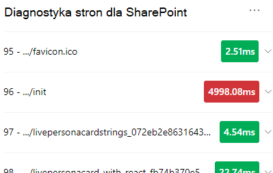
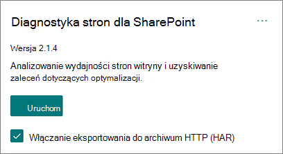
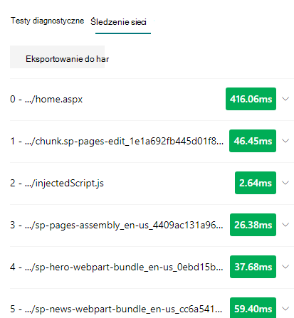

# Używanie narzędzia Diagnostyka SharePoint strony

W tym artykule opisano sposób używania **narzędzia Diagnostyka** SharePoint dla użytkowników do analizowania SharePoint nowoczesnych i klasycznych stron witryny w trybie online na podstawie wstępnie zdefiniowanego zestawu kryteriów wydajności.

Narzędzie Diagnostyka stron dla SharePoint można zainstalować dla:

- **Microsoft Edge** [(rozszerzenie Edge)](https://microsoftedge.microsoft.com/addons/detail/ocemkolpnamjcacndljdfmhlpcaoipji)
- **Chrome** [(rozszerzenie Chrome)](https://chrome.google.com/webstore/detail/inahogkhlkbkjkkaleonemeijihmfagi)

>[!TIP]
>Wersja **2.0.0** i nowsze zawierają obsługę nowoczesnych stron oprócz klasycznych stron witryny. Jeśli nie masz pewności, której wersji narzędzia używasz, możesz **wybrać link Informacje** lub wielokropek (...), aby sprawdzić wersję. **Zawsze aktualizuj program do najnowszej wersji** podczas korzystania z narzędzia.

Narzędzie Diagnostyka stron dla programu SharePoint to rozszerzenie przeglądarki dla nowych przeglądarek Microsoft Edge (https://www.microsoft.com/edge)i Chrome), które analizuje zarówno nowoczesne portal SharePoint Online, jak i klasyczne strony witryn publikowania. To narzędzie działa tylko w SharePoint Online i nie można go używać na SharePoint stronie systemu.

Narzędzie generuje dla każdej analizowanej strony raport pokazujący, jak strona wykonuje się na podstawie wstępnie zdefiniowanego zestawu reguł, i wyświetla szczegółowe informacje, gdy wyniki testu spoza wartości bazowej. SharePoint online administratorzy i projektanci mogą używać tego narzędzia do rozwiązywania problemów z wydajnością i upewnienia się, że nowe strony są zoptymalizowane przed opublikowaniem.

Narzędzie Diagnostyka stron umożliwia analizowanie tylko stron SharePoint witryny, a nie stron systemowych, takich jak *allitems.aspx* czy *sharepoint.aspx*. W przypadku próby uruchomienia narzędzia na stronie systemowej lub innej stronie innej niż witryna zostanie wyświetlony komunikat o błędzie z powiadomieniem, że nie można uruchomić narzędzia dla tego typu strony.

> [!div class="mx-imgBorder"]
> 

Nie jest to błąd narzędzia, ponieważ ocena bibliotek lub stron systemowych nie ma żadnej wartości. Przejdź do strony SharePoint witryny sieci Web, aby użyć tego narzędzia. Jeśli ten błąd występuje na stronie SharePoint, sprawdź stronę wzorcową, aby upewnić się, że SharePoint metatagów nie zostały usunięte.

Aby przekazać opinię na temat tego narzędzia, wybierz wielokropek w prawym górnym rogu narzędzia, a następnie wybierz pozycję [Opinie](https://go.microsoft.com/fwlink/?linkid=874109).

> [!div class="mx-imgBorder"]
> 
  
## Instalowanie narzędzia Diagnostyka SharePoint strony

Procedura instalacji w tej sekcji działa zarówno w przeglądarkach Chrome, jak i Microsoft Edge Chrome.

> [!IMPORTANT]
> Firma Microsoft nie odczytuje danych ani zawartości strony analizowanych przez narzędzie Diagnostyka stron dla witryny SharePoint, a my nie przechwytujemy żadnych informacji osobistych, witryn internetowych ani pobieramy informacji. Jedynymi informacjami umożliwiającymi identyfikację zarejestrowanymi w firmie Microsoft przez to narzędzie jest nazwa dzierżawy, liczba reguł, które nie powiodły się, oraz data i godzina uruchomienia narzędzia. Te informacje są używane przez firmę Microsoft do lepszego zrozumienia trendów korzystania z nowoczesnych witryn portali i publikowania oraz typowych problemów z wydajnością.

1. Zainstaluj narzędzie Diagnostyka stron dla SharePoint dla **przeglądarek Microsoft Edge** [(rozszerzenie Przeglądarki Edge)](https://microsoftedge.microsoft.com/addons/detail/ocemkolpnamjcacndljdfmhlpcaoipji) lub **Chrome** [(rozszerzenie Chrome).](https://chrome.google.com/webstore/detail/inahogkhlkbkjkkaleonemeijihmfagi) Przejrzyj zasady ochrony prywatności użytkownika podane na stronie opisu w sklepie. Podczas dodawania narzędzia do przeglądarki zobaczysz następujące powiadomienie o uprawnieniach.

    > [!div class="mx-imgBorder"]
    > 

    Jest to powiadomienie, ponieważ strona może zawierać zawartość z lokalizacji poza SharePoint w zależności od składników Web Part i dostosowań na stronie. Oznacza to, że po kliknięciu przycisku Start narzędzie będzie odczytywać żądania i odpowiedzi i tylko dla aktywnych kart SharePoint, gdzie narzędzie jest uruchomione. Te informacje są przechwytywane lokalnie przez przeglądarkę internetową i są dostępne za pośrednictwem przycisku Eksportuj do **JSON** lub Eksportuj do **HAR** na karcie _Śledzenie_ sieci tego narzędzia. Informacje nie są wysyłane ani przechwytywane przez firmę **Microsoft.** (To narzędzie szanuje zasady ochrony prywatności firmy Microsoft dostępne [tutaj](https://go.microsoft.com/fwlink/p/?linkid=857875)).

    Uprawnienia _Zarządzaj pobieraniem_ obejmują korzystanie z funkcji eksportowania do **JSON** narzędzia. Przed udostępnieniem pliku JSON poza organizacją należy postępować zgodnie z własnymi wytycznymi dotyczącymi prywatności, ponieważ wyniki zawierają adresy URL i mogą być klasyfikowane jako IDENTYFIKOWALNE DANE OSOBOWE.
1. Jeśli chcesz korzystać z narzędzia w trybie Incognito lub InPrivate, wykonaj procedurę dla przeglądarki:
    1. W Microsoft Edge do **rozszerzenia** lub wpisz _edge://extensions na pasku_ adresu URL i **wybierz szczegóły** rozszerzenia. W ustawieniach rozszerzenia zaznacz pole wyboru **zezwalania w inPrivate**.
    1. W przeglądarce Chrome przejdź do **rozszerzenia lub** wpisz _chrome://extensions_ na pasku adresu URL i wybierz **szczegóły** rozszerzenia. W ustawieniach rozszerzenia wybierz suwak **zezwalania w programie Incognito**.
1. Przejdź do SharePoint witryny w SharePoint Online, które chcesz przejrzeć. Dozwolone jest "opóźnianie ładowania" elementów na stronach; dlatego narzędzie nie zostanie automatycznie zatrzymane (jest to zaprojektowane w celu dostosowania wszystkich scenariuszy ładowania stron). Aby zatrzymać zbieranie, wybierz pozycję **Zatrzymaj**. Przed zatrzymaniem zbierania danych upewnij się, że ładowanie strony zostało ukończone, lub że przechwycisz tylko częściowe śledzenie.
1. Kliknij przycisk paska narzędzi rozszerzenia  w celu załadowania narzędzia, a zostanie otwarte następujące okno podręczne rozszerzenia:

    

Wybierz **pozycję Rozpocznij** , aby rozpocząć zbieranie danych do analizy.

## Informacje w narzędziu Diagnostyka SharePoint strony

1. Kliknij wielokropek (...) w prawym górnym rogu narzędzia, aby znaleźć następujące linki:
   1. Link **Dodatkowe zasoby** zawiera ogólne wskazówki i szczegóły dotyczące narzędzia, w tym link do tego artykułu.
   1. Link **Wyrażanie** opinii udostępnia link do witryny SharePoint _witryny i witryny współpracy ( User Voice_).
   1. Link **Informacje** zawiera obecnie zainstalowaną wersję narzędzia i bezpośredni link do informacji innej firmy.  
1. Identyfikator **korelacji, spRequestDuration, SPIISLatency****, czas** ładowania strony i szczegóły adresu **URL** mają informacje i mogą być używane do kilku celów.

    > [!div class="mx-imgBorder"]
    > 

   - **Identyfikator korelacji** to ważny element podczas współpracy z pomocą techniczną firmy Microsoft, ponieważ umożliwia zbieranie dodatkowych danych diagnostycznych dla określonej strony.
   - **SPRequestDuration** to czas przetwarzania SharePoint strony. Nawigacja strukturalna, duże obrazy i wiele wywołań interfejsu API może mieć wpływ na dłuższy czas trwania.
   - **SpiISLatency** to czas (w milisekundach), po których SharePoint online rozpocząć ładowanie strony. Ta wartość nie obejmuje czasu na odpowiedź aplikacji sieci Web.
   - **Czas ładowania strony** to całkowity czas rejestrowany przez stronę od czasu żądania do czasu otrzymania i renderowania odpowiedzi w przeglądarce. Na tę wartość mają wpływ różne czynniki, takie jak opóźnienie sieci, wydajność komputera i czas ładowania strony przez przeglądarkę.
   - Adres **URL strony** (uniform Resource Locator) to adres internetowy bieżącej strony.

1. Karta [**Testy diagnostyczne**](#how-to-use-the-diagnostic-tests-tab) wyświetla wyniki analizy w trzech kategoriach. **Nie są wymagane żadne działania**, **wymagane są działania w zakresie doskonalenia** **i uwagi**. Każdy wynik testu jest reprezentowany przez element w jednej z tych kategorii zgodnie z opisem w poniższej tabeli:

    |Kategoria  |Kolor  |Opis  |
    |---------|---------|---------|
    |**Wymagana uwaga** |Czerwony |Wynik testu nie mieści się w wartości bazowej i ma wpływ na wydajność strony. Postępuj zgodnie ze wskazówkami w zakresie rozwiązywania problemów.|
    |**Możliwości udoskonalania** |Żółty |Wynik testu nie jest wartością podstawową i może być czynnikiem współtworowym dla problemów z wydajnością. Mogą mieć zastosowanie kryteria specyficzne dla testu.|
    |**Nie jest wymagane żadne działanie** |Zielony |Wynik testu mieści się w wartości planu bazowego testu.|

    > [!div class="mx-imgBorder"]
    > 

1. Karta [**Śledzenie sieci zawiera**](#how-to-use-the-network-trace-tab-and-how-to-export-a-har-file) szczegółowe informacje o żądaniach kompilacji strony i odpowiedziach.

## Jak używać karty Testy diagnostyczne

Podczas analizowania strony nowoczesnego portalu usługi SharePoint lub strony klasycznej witryny publikowania za pomocą narzędzia Diagnostyka strony dla programu SharePoint wyniki są analizowane przy użyciu wstępnie zdefiniowanych reguł, które porównują wyniki z wartościami według planu  bazowego i są wyświetlane na karcie Testy diagnostyczne. Reguły niektórych testów mogą używać różnych wartości planu bazowego dla nowoczesnego portalu i klasycznych witryn publikowania w zależności od tego, jaka jest wydajność  różnią się między nimi.

Wyniki testów wyświetlane w kategoriach Możliwości udoskonalania lub Uwaga wymagane wskazują obszary, które należy przeglądać w porównaniu z zalecanymi praktykami i które można wybrać w celu wyświetlenia dodatkowych informacji o wyniku.  Szczegóły dotyczące każdego elementu to link _Dowiedz się więcej_ , który umożliwia bezpośredni dostęp do odpowiednich wskazówek dotyczących testu. Wyniki testów wyświetlane w kategorii Brak **wymaganego** działania wskazują zgodność z odpowiednią regułą i po wybraniu nie są wyświetlane dodatkowe szczegóły.

Informacje na karcie Testy diagnostyczne nie będą zawierać informacji o tym, jak projektować strony, ale zostaną wyróżnione czynniki, które mogą mieć wpływ na wydajność strony. Niektóre dostosowania i funkcje strony mają nieprzewidywalny wpływ na wydajność strony i należy je przeglądać w celu sprawdzenia pod uwagę w przypadku potencjalnych środków zaradczych lub pominięcia na stronie, jeśli mają one znaczny wpływ.

Wyniki w kolorze czerwonym lub żółtym mogą również wskazywać składników Web Part, które zbyt często odświeżają dane. Na przykład wiadomości firmowe nie są aktualizowane co sekundę, ale niestandardowe elementy Web Part są często tak zbudowane, aby pobierać najnowsze wiadomości co sekundę, zamiast zaimplementować elementy buforowania, które mogłyby poprawić ogólne środowisko użytkownika. Uwzględniając składników Web Part na stronie, często można zmniejszyć ich wpływ na wydajność, oceniając wartości poszczególnych dostępnych parametrów w celu upewniania się, że są one odpowiednio ustawione zgodnie z własnymi potrzebami.

>[!NOTE]
>Klasyczne witryny zespołu, w których nie włączono funkcji publikowania, nie mogą korzystać z sieci CDN. Po uruchomieniu narzędzia w tych witrynach test CDN zakończy się niepowodzeniem i można go zignorować, ale mają zastosowanie wszystkie pozostałe testy. Dodatkowe funkcje funkcji publikowania stron mogą SharePoint czasy ładowania stron, więc nie powinny być włączone tylko w celu CDN funkcji.

>[!IMPORTANT]
>Reguły testowania są regularnie dodawane i aktualizowane, dlatego należy zapoznać się z najnowszą wersją tego narzędzia, aby uzyskać szczegółowe informacje na temat bieżących reguł i konkretnych informacji zawartych w wynikach testów. Możesz zweryfikować wersję, zarządzając swoimi rozszerzeniami, a rozszerzenie poradzy Ci, czy jest dostępna aktualizacja.

## Jak korzystać z karty Śledzenie sieci i jak wyeksportować plik HAR

Karta **Śledzenie sieci** zawiera szczegółowe informacje dotyczące obu żądań tworzenia strony i odpowiedzi otrzymanych z witryny SharePoint.

1. **Odszukaj czasy ładowania elementów oflagowane jako czerwone**. Każde żądanie i odpowiedź są oznaczane kolorami, aby wskazać ich wpływ na ogólną wydajność stron przy użyciu następujących metryk opóźnień:
    - Zielony: \< 500 m
    - Żółty: 500–1000 m
    - Czerwony: \> 1000 m

    > [!div class="mx-imgBorder"]
    > 

    Na powyższym obrazie czerwony element dotyczy strony domyślnej. Zawsze będzie ona pokazywana na czerwono, chyba że strona zostanie załadowana po \< 1000 m (mniej niż 1 sekunda).

2. **Testowanie czasów ładowania elementów**. W niektórych przypadkach nie będzie czasu ani kolorowego wskaźnika, ponieważ elementy zostały już zapisane w pamięci podręcznej przez przeglądarkę. Aby sprawdzić to poprawnie, otwórz stronę, wyczyść pamięć podręczną przeglądarki, a następnie kliknij przycisk **Start** , ponieważ spowoduje to wymuś "niskie" ładowanie strony i stanowić prawdziwe odbicie początkowego obciążenia strony. Należy wówczas porównać to z "ciepłem" ładowaniem strony, ponieważ pomaga to również w określeniu elementów, które mają być buforowane na stronie.

3. **Udostępniaj odpowiednie informacje innym osobom, które mogą pomóc w zbadaniu problemów**. Aby udostępnić szczegóły lub informacje udostępniane w narzędziu deweloperom lub pomocy technicznej, zalecaną podejściem jest użycie ustawienia Włącz eksportowanie do archiwum **HTTP (HAR** ). 

   > [!div class="mx-imgBorder"]
   > 

Należy włączyć tę funkcję przed kliknięciem przycisku Start, co spowoduje włączenie trybu debugowania w przeglądarce. Zostanie wygenerowany plik archiwum HTTP (HAR), do którego dostęp można uzyskać za pośrednictwem karty "Śledzenie sieci". Kliknij przycisk "Eksportuj do HAR", aby pobrać plik na komputer i udostępnić go w ten sposób. Plik można otworzyć w różnych narzędziach do debugowania, takich jak narzędzia programowe F12 Developer Tools i Fiddler.

> [!div class="mx-imgBorder"]
> 

> [!IMPORTANT]
> Te wyniki zawierają adresy URL i mogą być klasyfikowane jako PII (Dane umożliwiające identyfikację użytkownika). Przed rozdaniem tych informacji należy postępować zgodnie z wytycznymi twojej organizacji.

## Współpraca z pomocą techniczną firmy Microsoft

Dołączona została funkcja **na poziomie pomocy technicznej firmy Microsoft** , która powinna być wykorzystywana tylko podczas pracy bezpośrednio nad sprawą pomocy technicznej. Korzystanie z tej funkcji nie zapewni Ci żadnych korzyści, gdy jest ona używana bez angażowania zespołu i może znacznie spowolnić działania strony. Podczas korzystania z tej funkcji w narzędziu nie ma żadnych dodatkowych informacji, ponieważ dodatkowe informacje są dodawane do rejestrowania w usłudze.

Żadna zmiana nie jest widoczna, tyle że zostaniesz o tym powiadomiony, że ją włączono, a wydajność strony zostanie znacznie obniżona o 2–3 razy wolniej. Będzie on odpowiedni tylko dla konkretnej strony i aktywnej sesji. Z tego powodu należy używać go oszczędnie i tylko wtedy, gdy jest aktywnie zaangażowani w pomoc techniczną.

### Aby włączyć funkcję poziomu pomocy technicznej firmy Microsoft

1. Otwórz narzędzie Diagnostyka SharePoint strony.
2. Na klawiaturze naciśnij klawisze **ALT-Shift-L**. Spowoduje to wyświetlenie pola **wyboru Włącz rejestrowanie** pomocy technicznej.
3. Zaznacz to pole wyboru, a następnie kliknij przycisk **Start** , aby ponownie załadować stronę i wygenerować pełne rejestrowanie.

   > [!div class="mx-imgBorder"]
   > 
  
    Należy zanotować identyfikator korelacji (wyświetlony w górnej części narzędzia) i podać go przedstawicielowi pomocy technicznej, aby umożliwić jej zbieranie dodatkowych informacji na temat sesji diagnostycznej.

## Tematy pokrewne

[Dostosowywanie SharePoint online](tune-sharepoint-online-performance.md)

[Dostosowywanie Office 365 wydajności](tune-microsoft-365-performance.md)

[Wydajność w nowoczesnym SharePoint klienta](/sharepoint/modern-experience-performance)

[Sieci dostarczania zawartości](content-delivery-networks.md)

[Używanie Office 365 Content Delivery Network (CDN) z usługą SharePoint Online](use-microsoft-365-cdn-with-spo.md)