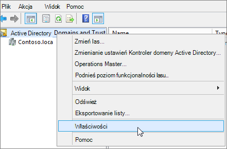

# <a name="prepare-a-non-routable-domain-for-directory-synchronization"></a>Przygotowywanie domeny nie routowalnej do synchronizacji katalogów

Podczas synchronizowania katalogu lokalnego z usługą Microsoft 365 musisz mieć zweryfikowaną domenę w usłudze Azure Active Directory (Azure AD). Synchronizowane są tylko główne nazwy użytkowników (UPN) skojarzone z lokalną domeną Usługi domenowe w usłudze Active Directory (AD DS). Jednak każda nazwa UPN zawierająca domenę nie routowaną, taką jak ".local" (na przykład: billa@contoso.local), będzie synchronizowana z domeną .onmicrosoft.com (na przykład: billa@contoso.onmicrosoft.com). 

Jeśli obecnie korzystasz z domeny ".local" dla kont użytkowników w uciekinie "AD DS", zaleca się zmianę tych domen na używanie zweryfikowanych domen, takich jak billa@contoso.com, w celu poprawnej synchronizacji z domeną Microsoft 365.
  
## <a name="what-if-i-only-have-a-local-on-premises-domain"></a>Co zrobić, jeśli mam tylko domenę lokalną ".local"?

Za pomocą usługi Azure AD Połączenie do synchronizowania AD DS z dzierżawą usługi Azure AD Microsoft 365 dzierżawy usługi. Aby uzyskać więcej informacji, zobacz [Integrowanie tożsamości lokalnych z usługą Azure AD](/azure/architecture/reference-architectures/identity/azure-ad).
  
Usługa Azure AD Połączenie synchronizuje główne nazwy użytkowników i hasła, aby użytkownicy mogą logować się za pomocą tych samych poświadczeń, co lokalnie. Jednak usługa Azure AD Połączenie synchronizuje użytkowników tylko z domenami zweryfikowanymi przez Microsoft 365. Oznacza to, że domena jest także weryfikowana przez usługę Azure AD, ponieważ tożsamościami użytkowników Microsoft 365 zarządza usługa Azure AD. Innymi słowy, domena musi być prawidłową domeną internetową (taką jak np. .com, .org, .net, .us). Jeśli Twoja AD DS korzysta tylko z domeny nie routowalnej (na przykład ".local"), być może nie będzie ona w stanie dopasować domeny zweryfikowanej do Twojej Microsoft 365 dzierżawy. Ten problem można rozwiązać, zmieniając domenę podstawową w lokalnym AD DS lub dodając co najmniej jeden sufiks głównej nazwy użytkownika.
  
### <a name="change-your-primary-domain"></a>Zmienianie domeny podstawowej

Zmień domenę podstawową na domenę zweryfikowaną w u Microsoft 365, na przykład contoso.com. Każdy użytkownik, który ma domenę contoso.local, zostanie zaktualizowany do contoso.com. Jednak jest to proces, który jest łatwiejszy, opisano w następnej sekcji.
  
### <a name="add-upn-suffixes-and-update-your-users-to-them"></a>Dodawanie sufiksów upn i aktualizowanie użytkowników do nich

Problem z domeną ".local" można rozwiązać, rejestrując nowy sufiks lub sufiksy nazw upn w programie AD DS, aby dopasować je do domeny (lub domen) zweryfikowanych w programie Microsoft 365. Po zarejestrowaniu nowego sufiksu zaktualizuj nazwy UPN użytkowników, aby na przykład zastąpić domenę ".local" nową nazwą domeny, tak aby konto użytkownika wyglądało billa@contoso.com.
  
Po zaktualizowaniu nazw UPN w celu używania zweryfikowanych domen możesz rozpocząć synchronizację lokalnych nazw AD DS z Microsoft 365.
  
#### <a name="step-1-add-the-new-upn-suffix"></a>Krok 1. Dodawanie nowego sufiksu upn**
  
1. Na AD DS domeny w Menedżerze serwera wybierz pozycję **Narzędzia** \> Domeny i relacje zaufania **usługi Active Directory**.
    
    **Jeśli nie masz jeszcze Windows Server 2012**
    
    Naciśnij **Windows klawisze +R**, aby otworzyć **okno dialogowe Uruchamianie**, wpisz Domain.msc, a następnie wybierz przycisk **OK**.
    
    
  
2. W **oknie Domeny i relacje zaufania usługi Active Directory** kliknij prawym przyciskiem myszy pozycję Domeny i relacje zaufania usługi **Active Directory**, a następnie wybierz pozycję **Właściwości**.
    
    
  
3. Na karcie **Sufiksy** główne nazwy użytkownika w polu Alternatywne sufiksy główne nazwy użytkownika wpisz nowy sufiks lub sufiksy główne nazwy użytkownika, a następnie wybierz pozycję **Dodaj** \> **zastosuj**.
    
    
  
    Po **dodaniu** sufiksów wybierz przycisk OK. 
    
 #### <a name="step-2-change-the-upn-suffix-for-existing-users"></a>Krok 2. Zmienianie sufiksu upn dla istniejących użytkowników
  
1. Na kontrolerze AD DS domeny w Menedżerze serwera wybierz pozycję **Narzędzia** \> **Użytkownicy i komputery usługi Active Directory**.
    
    **Jeśli nie masz jeszcze Windows Server 2012**
    
    Naciśnij **Windows klawisze +R**, aby otworzyć **okno dialogowe Uruchamianie**, wpisz dsa.msc, a następnie kliknij przycisk **OK.**
    
2. Wybierz użytkownika, kliknij go prawym przyciskiem myszy, a następnie wybierz polecenie **Właściwości**.
    
3. Na karcie **Konto** na liście rozwijanej sufiksów główne nazwy użytkownika wybierz nowy sufiks upn, a następnie wybierz przycisk **OK**.
    
    
  
4. Wykonaj te czynności dla każdego użytkownika.
    
   
### <a name="use-powershell-to-change-the-upn-suffix-for-all-of-your-users"></a>Zmienianie sufiksu upn dla wszystkich użytkowników za pomocą programu PowerShell

Jeśli masz wiele kont użytkowników do zaktualizowania, łatwiej korzystać z programu PowerShell. W poniższym przykładzie są używane polecenia cmdlet [Get-ADUser](/previous-versions/windows/it-pro/windows-server-2008-R2-and-2008/ee617241(v=technet.10)) i [Set-ADUser](/previous-versions/windows/it-pro/windows-server-2008-R2-and-2008/ee617215(v=technet.10)) w celu zmiany wszystkich sufiksów contoso.local na contoso.com w AD DS. 

Możesz na przykład uruchomić następujące polecenia programu PowerShell, aby zaktualizować wszystkie sufiksy contoso.local w celu contoso.com:
    
  ```powershell
  $LocalUsers = Get-ADUser -Filter "UserPrincipalName -like '*contoso.local'" -Properties userPrincipalName -ResultSetSize $null
  $LocalUsers | foreach {$newUpn = $_.UserPrincipalName.Replace("@contoso.local","@contoso.com"); $_ | Set-ADUser -UserPrincipalName $newUpn}
  ```

Zobacz [Moduł Windows PowerShell Active Directory,](/previous-versions/windows/it-pro/windows-server-2008-R2-and-2008/ee617195(v=technet.10)) aby dowiedzieć się więcej na temat Windows PowerShell w AD DS.