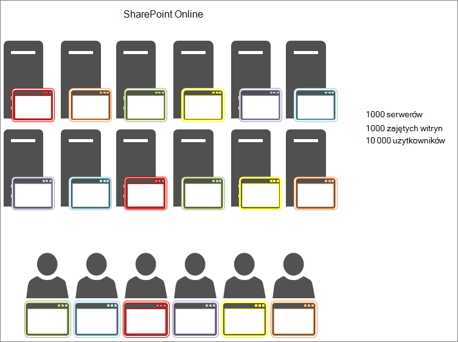

# Korzystanie z pamięci podręcznej obiektów z usługą SharePoint Online

W tym artykule wyjaśniono różnice między korzystaniem z pamięci podręcznej obiektów w lokalnym SharePoint Server 2013 a w SharePoint Online.
  
Poleganie na pamięci podręcznej obiektów w przypadku wdrożenia online ma istotne SharePoint online. Każda zależność od pamięci podręcznej obiektów SharePoint online obniża niezawodność strony. 
  
## Jak działa SharePoint online i SharePoint Server 2013

Gdy SharePoint Server 2013 jest hostowany lokalnie, klient ma prywatne serwery frontoronu sieci Web, które hostuje pamięć podręczną obiektów. Oznacza to, że pamięć podręczna jest przeznaczona tylko dla jednego klienta i jest ograniczona tylko ilości dostępnej pamięci przydzielonej do pamięci podręcznej obiektów. Ponieważ w scenariuszu lokalnym jest obsługiwany tylko jeden klient, serwery front-end sieci Web zazwyczaj wymagają od użytkowników, aby wielokrotnie składali żądania do tych samych witryn. Oznacza to, że pamięć podręczna szybko się zapełnia i pozostaje pełna wyników zapytania listy oraz SharePoint obiekty regularnie żądane przez użytkowników.
  

  
W wyniku tego czas ładowania strony jest zwiększany, gdy użytkownik odwiedza tę stronę po raz drugi. Po co najmniej czterokrotnych ładowaniach tej samej strony będzie ona buforowana na wszystkich frontonych serwerach sieci Web.
  
Z kolei w przypadku usługi SharePoint Online jest wiele innych serwerów, ale również wiele innych witryn. Każdy użytkownik może łączyć się z innym serwerem frontoronu sieci Web, dla których pamięć podręczna nie jest wypełniana. Być może pamięć podręczna jest wypełniana dla serwera, ale kolejny użytkownik tego serwera frontoronu sieci Web żąda strony z innej witryny. Nawet jeśli następny użytkownik zażąda tej samej strony, co podczas poprzedniej wizyty, jest on ładowany do innego serwera frontoronu sieci Web, który nie ma tej strony w pamięci podręcznej. W tym ostatnim przypadku buforowanie nie pomaga użytkownikom.
  
Na poniższej ilustracji każdy punkt oznacza stronę żądaną przez użytkownika i miejsce jej w pamięci podręcznej. Różne kolory reprezentują różnych klientów współużytkują infrastrukturę SaaS.
  

  
Jak widać na diagramie, szanse na to, że użytkownik nabiernie się na serwer, który ma kopię strony w pamięci podręcznej, są bardzo wąskie. Ponadto ze względu na dużą przepustowość i współużytkowanie serwerów przez wiele witryn, pamięć podręczna nie trwa długo, ponieważ miejsce dostępne dla pamięci podręcznej jest zbyt duże.
  
Ze wszystkich tych powodów uzyskiwanie przez użytkowników obiektów z pamięci podręcznej nie jest skutecznym sposobem na zapewnienie wysokiej jakości obsługi użytkownika i czasu ładowania stron w u SharePoint Online.
  
## Czego używamy, jeśli nie możemy polegać na pamięci podręcznej obiektów w celu zwiększenia wydajności SharePoint online?

Ponieważ nie należy polegać na pamięci podręcznej w u SharePoint Online, należy oceniać alternatywne metody projektowania pod SharePoint dostosowaniami, które korzystają z pamięci podręcznej obiektów. Oznacza to korzystanie z metod związanych z problemami z wydajnością, które nie opierają się na buforowaniu obiektów w celu uzyskania dobrych wyników dla użytkowników. Opisano to w niektórych innych artykułach z tej serii, m.in.:
  
- [Opcje nawigacji dla aplikacji SharePoint Online](navigation-options-for-sharepoint-online.md)
    
- [Minifikacja i tworzenie pakietów w u SharePoint Online](minification-and-bundling-in-sharepoint-online.md)
    
- [Używanie Office 365 Content Delivery Network (CDN) z usługą SharePoint Online](use-microsoft-365-cdn-with-spo.md)
    
- [Opóźnienie ładowania obrazów i kodu JavaScript w u SharePoint Online](delay-loading-images-and-javascript-in-sharepoint-online.md)
    