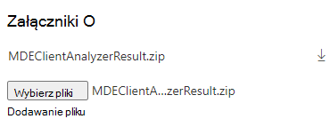

# Opis raportu w formacie HTML analizatora klienta

**Dotyczy:**
- [Microsoft Defender for Endpoint Plan 1](https://go.microsoft.com/fwlink/?linkid=2154037)
- [Microsoft Defender for Endpoint Plan 2](https://go.microsoft.com/fwlink/?linkid=2154037)

Analizator klienta tworzy raport w formacie HTML. Dowiedz się, jak przeglądać raport w celu zidentyfikowania potencjalnych problemów z czujnikami, które mogą pomóc w ich rozwiązaniu.

Opis raportu można zrozumieć w poniższym przykładzie.

 Przykładowe dane wyjściowe analizatora na komputerze, na który wdano identyfikator organizacji wygasł, i nie można uzyskać dostępu do jednego z wymaganych adresów URL punktu końcowego programu Microsoft Defender:

- Na górze do odwołania są wymienione wersja skryptu i środowisko uruchomieniowe skryptu
- Sekcja **Informacje o urządzeniu** zawiera podstawowe identyfikatory systemu operacyjnego i urządzenia w celu unikatowego zidentyfikowania urządzenia, na którym działa analizator.
- Szczegóły **zabezpieczeń punktu końcowego** zawierają ogólne informacje na temat procesów związanych z programem Microsoft Defender dla punktów końcowych, w tym Program antywirusowy Microsoft Defender i procesu czujnika. Jeśli ważne procesy nie są w trybie online zgodnie z oczekiwaniami, kolor zmieni się na czerwony.

  

-   Szczegóły **zabezpieczeń punktu końcowego** zawierają ogólne informacje na temat procesów związanych z programem Microsoft Defender dla punktów końcowych, w tym Program antywirusowy Microsoft Defender i procesu czujnika. Jeśli ważne procesy nie są w trybie online zgodnie z oczekiwaniami, kolor zmieni się na czerwony.

  

-   W **podsumowaniu Sprawdź** wyniki zobaczysz zagregowaną liczbę błędów, ostrzeżeń lub zdarzeń informacyjnych wykrytych przez analizatora.

-   W **szczegółowych wynikach** zostanie wyświetlona lista (posortowana według istotności) z wynikami i wskazówkami opartymi na obserwacjach wykonanych przez analizatora.

## Otwórz bilet pomocy technicznej do firmy Microsoft i dołącz wyniki analizatora

Aby uwzględnić pliki wyników analizatora [podczas](contact-support.md#open-a-service-request) otwierania biletu pomocy technicznej, użyj sekcji Załączniki  i uwzględnij `MDEClientAnalyzerResult.zip` plik:

> [!NOTE]
> Jeśli rozmiar pliku jest większy niż 25 MB, inżynier pomocy technicznej przydzielony do sprawy udostępni dedykowany bezpieczny obszar roboczy do przekazywania dużych plików do analizy.
