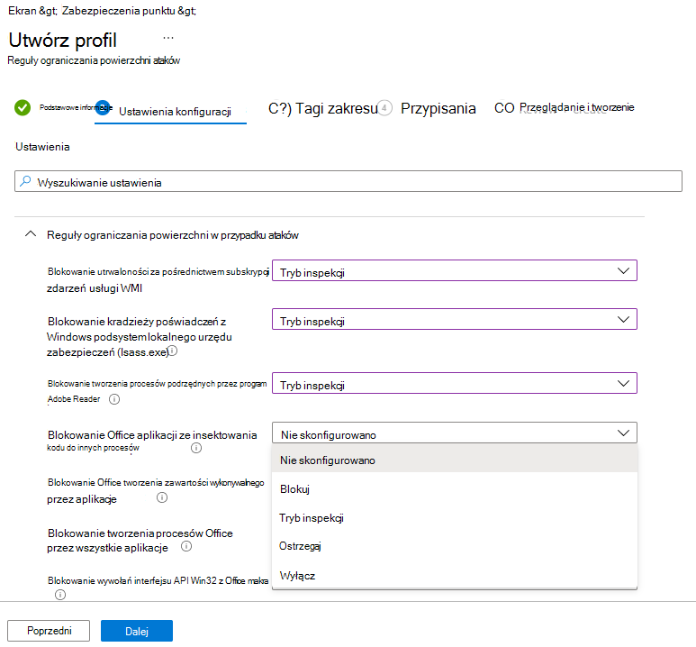
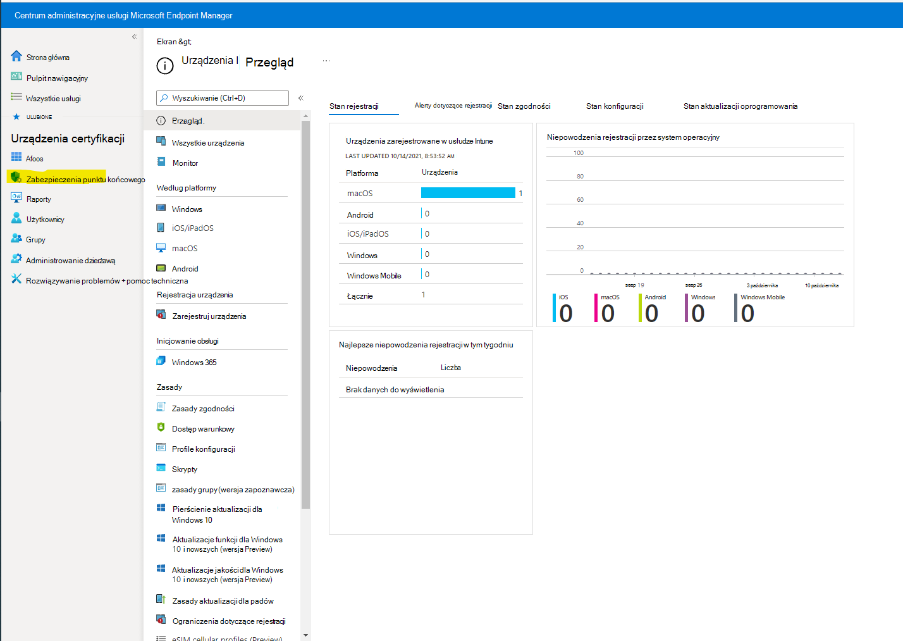

# <a name="step-2-test-asr-rules"></a>Krok 2. Testowanie reguł asr

Testowanie reguł zmniejszania powierzchni ataków (ASR, Attack Surface Reduction) pomaga w określeniu, czy reguły będą utrudniać działania biznesowe przed włączeniem jakiejkolwiek reguły. Rozpoczynając od małej, kontrolowanej grupy, możesz ograniczyć potencjalne zakłócenia w pracy w związku z rozszerzaniem wdrożenia w całej organizacji.

Zacznij wdrażanie reguł ograniczania powierzchni ataków(ASR) za pomocą pierścienia 1.

> [!div class="mx-imgBorder"]
> 

## <a name="step-1-test-asr-rules-using-audit"></a>Krok 1. Testowanie reguł asr przy użyciu inspekcji

Rozpocznij fazę testowania, włączając reguły asr z regułami ustawionymi na inspekcję, zaczynając od użytkowników lub urządzeń mistrza w pierścieniu 1. Zwykle zaleca się włączenie wszystkich reguł (w ramach inspekcji), aby określić, które reguły są wyzwalane na etapie testowania. Należy zauważyć, że reguły ustawione na wartość Inspekcja zasadniczo nie mają wpływu na działanie encji lub jednostek, do których reguła została zastosowana, ale generują rejestrowane zdarzenia na ocenę. nie ma wpływu na użytkowników końcowych.

### <a name="configure-asr-rules-using-mem"></a>Konfigurowanie reguł ASR przy użyciu MEM

Możesz użyć zabezpieczeń Microsoft Endpoint Manager punktów końcowych (MEM) w celu skonfigurowania niestandardowych reguł asr.

1. Otwieranie [Microsoft Endpoint Manager administracyjnego](https://endpoint.microsoft.com/#home)
2. Przejdź do **punktu końcowego: zmniejszenie** >  **powierzchni przy odłącz**.
3. Wybierz **pozycję Utwórz zasady**.
4. Na **platformie** wybierz pozycję **Windows 10 później** i w **profilu** wybierz pozycję **Reguły zmniejszania powierzchni ataków**.
  
    > [!div class="mx-imgBorder"]
    > 

5. Kliknij **przycisk Utwórz**.
6. Na karcie **Podstawy** okienka **Tworzenie profilu** w obszarze **Nazwa** dodaj nazwę zasad. W **polu** Opis dodaj opis zasad reguł ASR.
7. Na karcie **Ustawienia konfiguracji** w obszarze **Reguły ograniczania powierzchni** ataków ustaw dla wszystkich reguł wartość **Tryb inspekcji**.

    > [!div class="mx-imgBorder"]
    > 

    >[!Note]
    >Istnieją odmiany w niektórych trybach reguł ASR; _Zablokowane i_ _włączone_ zapewniają te same funkcje.

8. [Opcjonalnie] W **okienku Tagi zakresu** możesz dodać informacje o tagach do określonych urządzeń. Możesz również używać tagów kontroli dostępu i zakresów dostępu opartych na rolach, aby upewnić się, że właściwi administratorzy mają odpowiedni dostęp do odpowiednich obiektów usługi Intune i ich widoczność. Dowiedz się więcej: Używanie kontroli dostępu opartej na rolach [(RBAC, role based access control) i tagów zakresu dla rozpowszechniania it w usłudze Intune](/mem/intune/fundamentals/scope-tags).
9. W **okienku Zadania** możesz wdrożyć lub "przypisać" profil do użytkownika lub grup urządzeń. Dowiedz się więcej: [Przypisywanie profilów urządzeń w aplikacji Microsoft Intune](/mem/intune/configuration/device-profile-assign#exclude-groups-from-a-profile-assignment)
10. Przejrzyj ustawienia w **okienku Recenzja + utwórz** . Kliknij **przycisk Utwórz** , aby zastosować reguły.

   > [!div class="mx-imgBorder"]
   > 

Nowe zasady ograniczania powierzchni ataków dla reguł ASR są **wymienione w te | Zmniejszenie powierzchni ataków**.

   > [!div class="mx-imgBorder"]
   > 

## <a name="step-2-understand-the-attack-surface-reduction-rules-reporting-page-in-the-microsoft-365-defender-portal"></a>Krok 2. Opis strony raportowania reguł ograniczania powierzchni ataków w portalu Microsoft 365 Defender sieci Web

Strona raportowania reguł ASR znajduje się w **Microsoft 365 Defender** **PortalReportsAttack** >  >  **surface reduction rules**. Ta strona zawiera trzy karty:

- Wykrywanie
- Konfiguracja
- Dodawanie wykluczeń

### <a name="detections-tab"></a>Karta Wykrywanie

Zapewnia 30-dniową oś czasu wykrytych inspekcji i zablokowanych zdarzeń.

> [!div class="mx-imgBorder"]
> 

Okienko reguł zmniejszania powierzchni ataków zawiera przegląd wykrytych zdarzeń na podstawie  per-reguły.

>[!Note]
>W raportach reguł ASR występują pewne różnice. Firma Microsoft jest w trakcie procesu aktualizowania zachowania raportów reguł asr w celu zapewnienia spójnego działania.

> [!div class="mx-imgBorder"]
> 

Kliknij **pozycję Wyświetl wykrywanie,** aby otworzyć **kartę Wykrywanie** .

> [!div class="mx-imgBorder"]
> 

W **okienku GroupBy** **i Filter** dostępne są następujące opcje:

Funkcja **GroupBy** zwraca wyniki ustawione na następujące grupy:

- Bez grupowania
- Wykryty plik
- Inspekcja lub blokowanie
- Reguła
- Aplikacja źródłowa
- Urządzenie
- Użytkownik
- Publisher

> [!div class="mx-imgBorder"]
> 

**Filtr** powoduje otwarcie **strony Filtruj w regułach** , która umożliwia zawęgnienie wyników tylko do wybranych reguł asr:

> [!div class="mx-imgBorder"]
> 

>[!Note]
>Jeśli masz licencję Microsoft Microsoft 365 Security E5 lub A5, Windows E5 lub A5, poniższy link powoduje otwarcie karty Wykrywanie w obszarze ataków usługi Microsoft Defender 365 [> >](https://security.microsoft.com/asr?viewid=detections) Raporty dotyczące ataków.

### <a name="configuration-tab"></a>Karta Konfiguracja

Listy — na komputerach — zagregowany stan reguł asr: Wyłączone, Inspekcja, Blok.

> [!div class="mx-imgBorder"]
> 

Na karcie Konfiguracje możesz sprawdzić , w zależności od urządzenia, które reguły asr są włączone, i w którym trybie, wybierając urządzenie, dla którego chcesz przejrzeć reguły ASR.

> [!div class="mx-imgBorder"]
> 

Link **Wprowadzenie umożliwia** otwarcie centrum administracyjnego usługi Microsoft Endpoint Manager, w którym można tworzyć i modyfikować zasady ochrony punktu końcowego dla usługi powerpoint 365:

> [!div class="mx-imgBorder"]
> 

W tecie o zabezpieczeniach | Omówienie, wybierz **zmniejszenie powierzchni ataków**:

> [!div class="mx-imgBorder"]
> 

Centrum zabezpieczeń punktu | Zostanie otwarte okienko zmniejszania powierzchni ataków:

> [!div class="mx-imgBorder"]
> 

>[!Note]
>Jeśli masz licencję usługi Microsoft Defender 365 E5 (lub Windows E5?), ten link spowoduje otwarcie karty Raporty usługi Microsoft Defender 365 > Zmniejszenie powierzchni ataków > [konfiguracje](https://security.microsoft.com/asr?viewid=configuration).

### <a name="add-exclusions"></a>Dodawanie wykluczeń

Ta karta udostępnia metodę wybierania wykrytych jednostek (na przykład wyników fałszywie dodatnich) do wykluczenia. Po dodaniu wykluczeń raport zawiera podsumowanie oczekiwanego wpływu.

>[!Note]
> Program antywirusowy Microsoft Defender audio/wideo są honorowane przez reguły ASR.  Zobacz [Konfigurowanie i weryfikowanie wykluczeń na podstawie rozszerzenia, nazwy lub lokalizacji](configure-extension-file-exclusions-microsoft-defender-antivirus.md).

> [!div class="mx-imgBorder"]
> 

> [!Note]
>Jeśli masz licencję usługi Microsoft Defender 365 E5 (lub Windows E5?), ten link spowoduje otwarcie karty Raporty usługi Microsoft Defender 365 > Zmniejszenie powierzchni ataków > [Wykluczenia](https://security.microsoft.com/asr?viewid=exclusions).

### <a name="use-powershell-as-an-alternative-method-to-enable-asr-rules"></a>Używanie programu PowerShell jako metody alternatywnej w celu włączenia reguł ASR

Za pomocą programu PowerShell — alternatywy dla MEM — można włączyć reguły asr w trybie inspekcji w celu wyświetlenia rekordów aplikacji, które zostałyby zablokowane, jeśli funkcja zostałaby w pełni włączona. Można również dowiedzieć się, jak często reguły będą się odpalać podczas normalnego użytkowania.

Aby włączyć regułę zmniejszania powierzchni ataków w trybie inspekcji, użyj następującego polecenia cmdlet programu PowerShell:

```PowerShell
Add-MpPreference -AttackSurfaceReductionRules_Ids <rule ID> -AttackSurfaceReductionRules_Actions AuditMode
```

Gdzie `<rule ID>` znajduje się wartość [GUID reguły zmniejszania powierzchni ataków](attack-surface-reduction-rules-reference.md).

Aby włączyć wszystkie dodane reguły ograniczania powierzchni ataków w trybie inspekcji, użyj następującego polecenia cmdlet programu PowerShell:

```PowerShell
(Get-MpPreference).AttackSurfaceReductionRules_Ids | Foreach {Add-MpPreference -AttackSurfaceReductionRules_Ids $_ -AttackSurfaceReductionRules_Actions AuditMode}
```

> [!TIP]
> Jeśli chcesz w pełni sprawdzić, jak będą działać reguły ograniczania powierzchni ataków w Twojej organizacji, musisz użyć narzędzia do zarządzania, aby wdrożyć to ustawienie na urządzeniach w Twojej sieci.

Ustawienia można też skonfigurować zasady grupy, Intune lub dostawców usług zarządzania urządzeniami przenośnymi (MDM, Mobile Device Management). Dowiedz się więcej z głównego [artykułu o zasadach ograniczania powierzchni ataków](attack-surface-reduction.md) .

## <a name="use-windows-event-viewer-review-as-an-alternative-to-the-attack-surface-reduction-rules-reporting-page-in-the-microsoft-365-defender-portal"></a>Używanie Windows Podgląd zdarzeń jako alternatywy dla strony raportowania reguł ograniczania powierzchni ataków w portalu Microsoft 365 Defender sieci Web

Aby przejrzeć aplikacje, które zostałyby zablokowane, otwórz przeglądarkę zdarzeń i przefiltruj identyfikator zdarzenia 1121 w dzienniku Windows-Windows Defender/operacyjnym firmy Microsoft. W poniższej tabeli wymieniono wszystkie zdarzenia ochrony sieci.

Identyfikator zdarzenia | Opis
-|-
 5007 | Zdarzenie w przypadku zmiany ustawień
 1121 | Zdarzenie, gdy reguła zmniejszania powierzchni ataków jest paleniu w trybie blokowania
 1122 | Zdarzenie, gdy reguła zmniejszania powierzchni ataków jest paleniu w trybie inspekcji

## <a name="additional-topics-in-this-deployment-collection"></a>Dodatkowe tematy w tym zbiorze wdrożeń

[Wymagania wstępne wdrażania reguł asr](attack-surface-reduction-rules-deployment.md)

[Krok 1. Planowanie wdrożenia reguł ASR](attack-surface-reduction-rules-deployment-plan.md)

[Krok 3. Implementowanie reguł asr](attack-surface-reduction-rules-deployment-implement.md)

[Krok 4. Operacyjne reguły asr](attack-surface-reduction-rules-deployment-operationalize.md)
