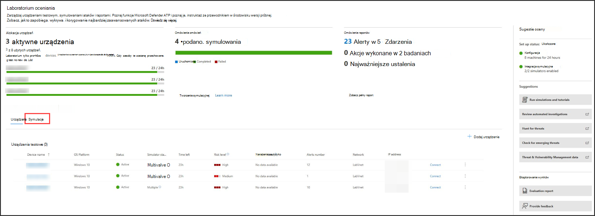
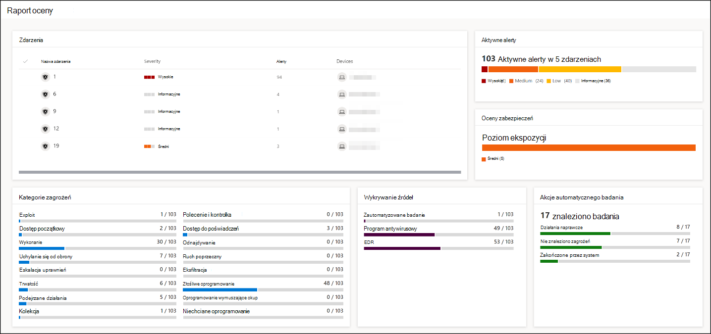

# Laboratorium oceny punktu końcowego programu Microsoft Defender

[!INCLUDE [Microsoft 365 Defender rebranding](../../includes/microsoft-defender.md)]

**Dotyczy:**
- [Microsoft Defender for Endpoint Plan 2](https://go.microsoft.com/fwlink/?linkid=2154037)
- [Microsoft 365 Defender](https://go.microsoft.com/fwlink/?linkid=2118804)

> Chcesz mieć dostęp do programu Microsoft Defender dla punktu końcowego? [Zarejestruj się, aby korzystać z bezpłatnej wersji próbnej.](https://signup.microsoft.com/create-account/signup?products=7f379fee-c4f9-4278-b0a1-e4c8c2fcdf7e&ru=https://aka.ms/MDEp2OpenTrial?ocid=docs-wdatp-enablesiem-abovefoldlink)

Przeprowadzenie kompleksowej oceny produktu zabezpieczającego może być złożonym procesem wymagającym uciążliwego środowiska i konfiguracji urządzenia przed przeprowadzeniem kompleksowej symyki ataków. Dodawanie do złożoności jest wyzwaniem śledzenia działań symulacyjnych, alertów i wyników podczas oceny.

Laboratorium oceny punktu końcowego programu Microsoft Defender ma na celu wyeliminowanie złożonych konfiguracji urządzeń i środowiska, dzięki czemu można skupić się na ocenianiu możliwości platformy, uruchomieniu symelacji i prowadzeniu funkcji zapobiegania, wykrywaniu i rozwiązywaniu problemów w działaniu.

> [!VIDEO https://www.microsoft.com/videoplayer/embed/RE4qLUM]

Uproszczona konfiguracja pozwala skupić się na prowadzeniu własnych scenariuszy testowych i wstępnie wykonanych symulowań, aby sprawdzić, jak działa program Defender dla punktu końcowego.

Będziesz mieć pełny dostęp do zaawansowanych możliwości platformy, takich jak zautomatyzowane badania, zaawansowane wyszukiwania i analiza zagrożeń, co pozwala przetestować kompleksowy stos ochrony, który oferuje program Defender for Endpoint.

Możesz dodać urządzenia Windows 10, Windows 11, Windows Server 2019, Windows Server 2016 i Linux (Ubuntu), które są wstępnie skonfigurowane do zainstalowania najnowszych wersji systemu operacyjnego i odpowiednich składników zabezpieczeń, Office 2019 Standard.

Możesz także instalować zagrożenie. Program Defender for Endpoint współpracuje z wiodącymi w branży platformami do symulowania zagrożeń, aby ułatwić testowanie funkcji programu Defender dla punktu końcowego bez konieczności opuszczania portalu.

Zainstaluj preferowaną aplikację, instaluj scenariusze w laboratorium oceny i błyskawicznie sprawdzaj, jak działa platforma — wszystko to jest łatwo dostępne bez dodatkowych kosztów. Zapewnia również wygodny dostęp do szerokiej gamy symulacyjnych, które można uzyskać do wykazu symulacyjnych i z nich korzystać.

## Przed rozpoczęciem

Aby uzyskać dostęp do laboratorium oceny, musisz spełnić wymagania licencyjne lub uzyskać dostęp do wersji próbnej programu Microsoft Defender for Endpoint.

Uprawnienia do zarządzania **ustawieniami zabezpieczeń są** wymagane do:

- Tworzenie laboratorium
- Tworzenie urządzeń
- Resetuj hasło
- Tworzenie symulacyjnych

Jeśli włączono kontrolkę dostępu opartą na rolach (RBAC, Role Based Access Control) i utworzono co najmniej jedną grupę komputerową, użytkownicy muszą mieć dostęp do wszystkich grup komputerów.

Aby uzyskać więcej informacji, zobacz [Tworzenie ról i zarządzanie nimi](user-roles.md).

Chcesz mieć dostęp do programu Microsoft Defender dla punktu końcowego? [Zarejestruj się, aby korzystać z bezpłatnej wersji próbnej.](https://signup.microsoft.com/create-account/signup?products=7f379fee-c4f9-4278-b0a1-e4c8c2fcdf7e&ru=https://aka.ms/MDEp2OpenTrial?ocid=docs-wdatp-main-abovefoldlink)

## Wprowadzenie do laboratorium

Dostęp do laboratorium możesz uzyskać z menu. W menu nawigacji wybierz pozycję **Oceny i samouczki > laboratorium oceny**.

> [!NOTE]
>
> - W zależności od wybranego typu struktury środowiska urządzenia będą dostępne przez określoną liczbę godzin od dnia aktywacji.
> - Każde środowisko jest zapewniane za pomocą ograniczonego zestawu urządzeń testowych. Gdy wszystkie urządzenia z obsługi administracyjnej zostały już użyte i usunięte, możesz zażądać kolejnych urządzeń.
> - Prośbę o zasoby laboratoryjnych możesz prosić raz w miesiącu.

Masz już laboratorium? Pamiętaj, aby włączyć nowe zagrożenia i mieć aktywne urządzenia.

## Konfigurowanie laboratorium oceny

1. W okienku nawigacji wybierz pozycję **Laboratorium & oceny** \> **, a** następnie wybierz pozycję **Laboratorium konfiguracji**.

    :::image type="content" source="../../media/evaluationtutormenu.png" alt-text="Obraz strony powitania laboratorium oceny.":::

2. W zależności od potrzeb oceny, możesz skonfigurować środowisko z mniejszą liczbą urządzeń przez dłuższy czas lub z większą liczbą urządzeń przez krótszy czas. Wybierz preferowaną konfigurację laboratorium, a następnie wybierz pozycję **Dalej**.

    

3. (Opcjonalnie) Możesz zainstalować zagrożenie w laboratorium.

    

   > [!IMPORTANT]
   > Najpierw musisz zaakceptować postanowienia dotyczące udostępniania informacji i udzielić na nie zgody.

4. Wybierz agenta symulacyjnego zagrożeń, który chcesz użyć, i wprowadź swoje dane. Możesz także zainstalować oprogramowanie zagrożeń w późniejszym czasie. Jeśli zdecydujesz się zainstalować agentów symulacyjnych zagrożeń podczas konfigurowania laboratorium, zyskasz korzyść z wygodnego instalowania ich na dodajenych urządzeniach.

    

5. Przejrzyj podsumowanie i wybierz pozycję **Laboratorium instalacyjne**.

Po zakończeniu procesu konfiguracji laboratorium można dodawać urządzenia i uruchamiać sym symulacyjne.

## Dodaj urządzenia

Po dodaniu urządzenia do środowiska program Defender for Endpoint konfiguruje prawidłowo skonfigurowane urządzenie ze szczegółami połączenia. Możesz dodać Windows 10, Windows 11, Windows Server 2019, Windows Server 2016 i Linux (Ubuntu).

Urządzenie zostanie skonfigurowane z najnowszą wersją systemu operacyjnego i programu Office 2019 Standard, a także z innymi aplikacjami, takimi jak Java, Python i SysIntenals.

Jeśli podczas konfiguracji laboratorium dodasz zagrożenie, na wszystkich urządzeniach zostanie zainstalowany agent ochrony przed zagrożeniami.

Urządzenie zostanie automatycznie dołączona do dzierżawy z włączonymi zalecanymi Windows zabezpieczeń i w trybie inspekcji — bez żadnych starań, po Twojej stronie.

Na urządzeniach testowych są wstępnie skonfigurowane następujące składniki zabezpieczeń:

- [Zmniejszenie powierzchni ataków](attack-surface-reduction.md)
- [Blokuj na pierwszy rzut oka](configure-block-at-first-sight-microsoft-defender-antivirus.md)
- [Kontrolowany dostęp do folderu](controlled-folders.md)
- [Exploit Protection](enable-exploit-protection.md)
- [Ochrona sieci](network-protection.md)
- [Potencjalnie niechciane wykrywanie aplikacji](detect-block-potentially-unwanted-apps-microsoft-defender-antivirus.md)
- [Ochrona w chmurze](cloud-protection-microsoft-defender-antivirus.md)
- [Microsoft Defender SmartScreen](/windows/security/threat-protection/microsoft-defender-smartscreen/microsoft-defender-smartscreen-overview)

> [!NOTE]
> Program antywirusowy Microsoft Defender będą w trybie inspekcji (nie będą w trybie inspekcji). Jeśli Program antywirusowy Microsoft Defender blokuje uruchamianie symulacyjnej pracy, możesz wyłączyć ochronę w czasie rzeczywistym na urządzeniu za pomocą Zabezpieczenia Windows. Aby uzyskać więcej informacji, [zobacz Konfigurowanie zawsze na czas ochrony](configure-real-time-protection-microsoft-defender-antivirus.md).

Ustawienia automatycznego badania zależą od ustawień dzierżawy. Domyślnie będzie ona skonfigurowana jako półautoma korzystająca z półautomału. Aby uzyskać więcej informacji, zobacz [Omówienie zautomatyzowanych badań](automated-investigations.md).

> [!NOTE]
> Połączenie z urządzeniami testowym odbywa się za pomocą protokołu RDP. Upewnij się, że ustawienia zapory zezwalają na połączenia RDP.

1. Na pulpicie nawigacyjnym wybierz **pozycję Dodaj urządzenie**.

2. Wybierz typ urządzenia do dodania. Możesz dodać Windows 10, Windows 11, Windows Server 2019, Windows Server 2016 i Linux (Ubuntu). 

   > [!NOTE]
   > Jeśli podczas tworzenia urządzenia coś poszło nie tak, zostaniesz o tym powiadomiony(-a) i konieczne będzie przesłanie nowego żądania. Jeśli tworzenie urządzenia zakończy się niepowodzeniem, nie będzie ono liczone względem ogólnego dozwolonego przydziału.

3. Zostaną wyświetlone szczegóły połączenia. Wybierz **pozycję Kopiuj** , aby zapisać hasło dla urządzenia.

   > [!NOTE]
   > Hasło jest wyświetlane tylko raz. Pamiętaj, aby zapisać go do późniejszego użycia.

    :::image type="content" source="../../media/add-machine-eval-lab-new.png" alt-text="Obraz urządzenia dodanego ze szczegółami połączenia.":::

4. Rozpocznie się konfigurowanie urządzenia. Może to potrwać do około 30 minut.

5. Sprawdź stan urządzeń testowych, poziomy ryzyka i ekspozycji oraz stan instalacji, wybierając **kartę** Urządzenia.

    

   > [!TIP]
   > W kolumnie **Stan** gry możesz umieścić wskaźnik myszy na ikonie informacji, aby sprawdzić stan instalacji agenta.

## Poproś o więcej urządzeń

Gdy wszystkie istniejące urządzenia są używane i usuwane, możesz zażądać większej liczby urządzeń. Prośbę o zasoby laboratoryjnych możesz prosić raz w miesiącu.

1. Na pulpicie nawigacyjnym laboratorium oceny wybierz pozycję **Poproś o więcej urządzeń**.

   

2. Wybierz konfigurację.
3. Prześlij żądanie.

Po pomyślnym przesłaniu żądania zostanie wyświetlony zielony transparent z potwierdzeniem i data ostatniego przesłania.

Stan żądania można znaleźć na karcie Akcje użytkownika, która  zostanie zatwierdzona w ciągu kilku godzin.

Po zatwierdzeniu żądane urządzenia zostaną dodane do Twojej zestawu laboratoryjnych i będzie można utworzyć więcej urządzeń.

> [!TIP]
> Aby wyelibować więcej z laboratorium, zapoznaj się z biblioteką naszych symulacji.

## Symulowanie scenariuszy ataków

Skorzystaj z urządzeń testowych, aby uruchamiać własne symulacje ataków przez połączenie się z nimi.

Scenariusze ataków można symulować przy użyciu:

- Scenariusze ataków ["Zrób to samodzielnie"](https://security.microsoft.com/tutorials/all)
- Zagrożenie

Możesz również korzystać z wyszukiwania [zaawansowanego w](advanced-hunting-overview.md) celu wyszukiwania danych i [analizy zagrożeń](threat-analytics.md) w celu wyświetlania raportów o wyłaniających się zagrożeniach.

### Scenariusze ataków samodzielnie

Jeśli szukasz wstępnie wykonanej symulacyjnej sytuacji, możesz użyć naszych [scenariuszy ataków "Zrób to samodzielnie"](https://security.microsoft.com/tutorials/all). Te skrypty są bezpieczne, udokumentowane i łatwe w użyciu. Te scenariusze będą odzwierciedlać funkcje programu Defender dla punktu końcowego i będą przechodzić przez środowisko badania.

> [!NOTE]
> Połączenie z urządzeniami testowym odbywa się za pomocą protokołu RDP. Upewnij się, że ustawienia zapory zezwalają na połączenia RDP.

1. Połączenie urządzenia i uruchomić symulację ataków, wybierając pozycję **Połączenie**.

    

2. W **Windows urządzeniach**: zapisz plik RDP i uruchom go, wybierając pozycję **Połączenie**.  
    

    Dla **urządzeń z systemem Linux**: musisz użyć lokalnego klienta SSH i podanego polecenia. 

    > [!NOTE]
    > Jeśli podczas początkowej konfiguracji nie zapisano kopii hasła, można je zresetować, wybierając z menu polecenie **Resetuj** hasło:
    >
    > 
    >
    > Urządzenie zmieni stan na "Wykonywanie resetowania hasła". Za kilka minut zostanie ci przedstawione nowe hasło.

3. Wprowadź hasło, które było wyświetlane podczas tworzenia urządzenia.

   

4. Uruchom na urządzeniu symulacje ataków samodzielnie.

### Scenariusze dotyczące zagrożeń

Jeśli podczas konfigurowania laboratorium wybrano opcję zainstalowania dowolnej z obsługiwanych zagrożeń, można uruchomić wbudowane symulacje na urządzeniach laboratoryjnych oceny.

Uruchomienie symulacyjnych zagrożeń za pomocą platform innych firm to dobry sposób na ocenę możliwości programu Microsoft Defender pod zakresie możliwości punktu końcowego w środowisku laboratoryjnym.

> [!NOTE]
>
> Przed uruchomieniem symulacyjnych upewnij się, że są spełnione następujące wymagania:
>
> - Urządzenia muszą zostać dodane do laboratorium oceny
> - Zagrożenie musi być zainstalowane w laboratorium oceny

1. W portalu wybierz pozycję **Utwórz symulację**.

2. Wybierz zagrożenie.

    

3. Wybierz symulacyjne lub przejrzyj galerię symulacyjnej, aby przejrzeć dostępne symulacyjne wyniki.

    Do galerii tych symulacyjnych można uzyskać dostęp z:
    - Główny pulpit nawigacyjny oceny na **kafelku Podglądy lub**
    - Przechodząc z okienka nawigacji Nawigowanie **po samouczkach** \> & oceny i samouczków **, a** następnie wybierz katalog **Symulacje**.

4. Wybierz urządzenia, na których chcesz uruchomić symulację.

5. Wybierz pozycję **Create simulation (Utwórz symulację**).

6. Aby wyświetlić postęp symulatora, wybierz **kartę Symulatory** . Wyświetlanie stanu symulacyjnego, aktywnych alertów i innych szczegółów.

    

Po uruchomieniu symulacji zalecamy, aby przejść przez pasek postępu laboratorium i zbadać usługę **Microsoft Defender for Endpoint**, która wyzwoliła zautomatyzowane badania i działania naprawcze. Zapoznaj się z dowodami zebranymi i przeanalizowania przez tę funkcję.

Szukanie dowodów na ataki przez zaawansowane szukanie przy użyciu zaawansowanego języka zapytań i nieprzetworzonej telemetrii oraz sprawdzanie niektórych zagrożeń na całym świecie udokumentowanych w temacie Analiza zagrożeń.

## Galeria symulacyjna

Program Microsoft Defender for Endpoint współpracuje z różnymi platformami symulacyjnych zagrożeń, aby zapewnić Ci wygodny dostęp do testowania możliwości platformy bezpośrednio z poziomu portalu.

Wyświetl wszystkie dostępne czasy symulacyjne, przechodząc do wykazu  **symulacyjne** \> i samouczki **z**  menu.

W wykazie zamieszczono listę obsługiwanych agentów symulacyjnych zagrożeń innych firm oraz informacje o konkretnych typach symulacyjnych wraz ze szczegółowymi opisami.

Każdą dostępną symululę można łatwo uruchomić bezpośrednio z wykazu.

Każda symulacyjna zawiera szczegółowy opis scenariusza ataków, a także odwołania, takie jak użyte techniki ataków MITRE i przykładowe uruchomione zaawansowane zapytania myśliwskie.

**Przykłady:**

## Raport oceny

Raporty laboratorium podsumowują wyniki symulacyjnych przeprowadzonych na urządzeniach.

W skrócie można szybko wyświetlić:

- Zdarzenia, które zostały wyzwolone
- Wygenerowane alerty
- Assessments on exposure level
- Obserwowane kategorie zagrożeń
- Wykrywanie źródeł
- Zautomatyzowane badania

## Opinie

Twoja opinia pomoże nam lepiej chronić Twoje środowisko przed zaawansowanymi atakami. Podziel się swoimi doświadczeniami i podziel się swoimi doświadczeniami z możliwościami produktu i wynikami oceny.

Daj nam znać, co o tym sądzisz, wybierając pozycję **Podaj opinię**.

