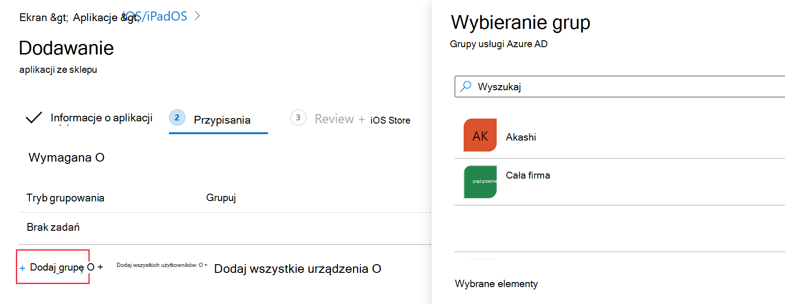
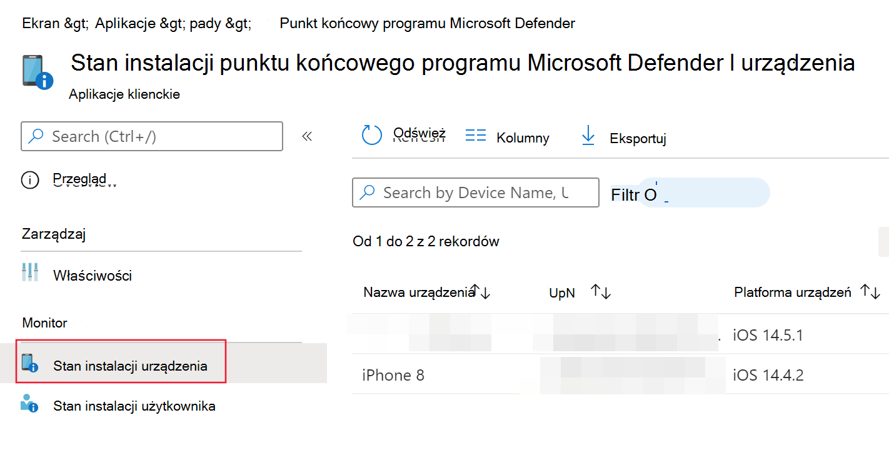
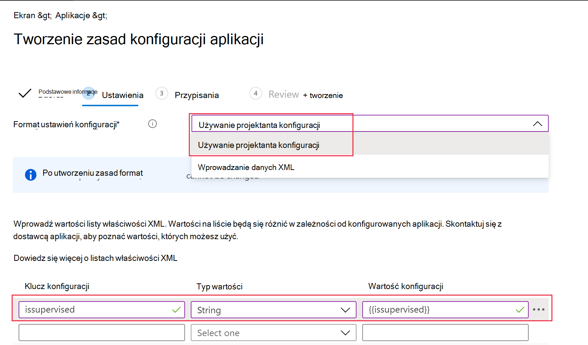

# Wdrażanie programu Microsoft Defender dla punktu końcowego w systemie iOS

[!INCLUDE [Microsoft 365 Defender rebranding](../../includes/microsoft-defender.md)]

**Dotyczy:**
- [Microsoft Defender for Endpoint Plan 1](https://go.microsoft.com/fwlink/p/?linkid=2154037)
- [Microsoft Defender for Endpoint Plan 2](https://go.microsoft.com/fwlink/p/?linkid=2154037)
- [Microsoft 365 Defender](https://go.microsoft.com/fwlink/?linkid=2118804)

> Chcesz mieć dostęp do usługi Defender dla punktu końcowego? [Zarejestruj się, aby korzystać z bezpłatnej wersji próbnej.](https://signup.microsoft.com/create-account/signup?products=7f379fee-c4f9-4278-b0a1-e4c8c2fcdf7e&ru=https://aka.ms/MDEp2OpenTrial?ocid=docs-wdatp-investigateip-abovefoldlink)

W tym temacie opisano wdrażanie usługi Defender for Endpoint w systemie iOS Intune — Portal firmy urządzeniach zarejestrowanych. Aby uzyskać więcej informacji na temat rejestrowania urządzeń w usłudze Intune, zobacz [Rejestrowanie urządzeń z systemem iOS/iPadOS w usłudze Intune](/mem/intune/enrollment/ios-enroll).

## Przed rozpoczęciem

- Upewnij się, że masz dostęp do [centrum administracyjnego programu Microsoft Endpoint Manager](https://go.microsoft.com/fwlink/?linkid=2109431).

- Upewnij się, że rejestracja w systemie iOS jest wykonywana dla użytkowników. Użytkownicy muszą mieć przypisaną licencję usługi Defender for Endpoint, aby korzystać z usługi Defender for Endpoint w systemie iOS. Aby uzyskać [instrukcje dotyczące przypisywania licencji,](/azure/active-directory/users-groups-roles/licensing-groups-assign) zobacz Przypisywanie licencji użytkownikom.

> [!NOTE]
> Program Microsoft Defender for Endpoint dla systemu iOS jest dostępny w sklepie [App Store firmy Apple](https://aka.ms/mdatpiosappstore).

## Kroki wdrażania

Wdeksuj usługę Defender dla punktu końcowego w systemie iOS za pośrednictwem Intune — Portal firmy.

### Dodaj aplikację ze sklepu iOS

1. W [centrum administracyjnym menedżera punktu końcowego firmy Microsoft](https://go.microsoft.com/fwlink/?linkid=2109431) przejdź do aplikacji sklepu **AppsiOS** -> **/iPadOSAddiOS** ->  ->  i kliknij pozycję **Wybierz**.

    > [!div class="mx-imgBorder"]
    > 

1. Na stronie **Dodawanie aplikacji** kliknij pozycję Wyszukaj w **sklepie App Store i** wpisz na pasku wyszukiwania program **Microsoft Defender for Endpoint** . W sekcji wyników wyszukiwania kliknij pozycję *Microsoft Defender for Endpoint (Punkt końcowy)* i kliknij pozycję **Select (Wybierz**).

1. Wybierz **system operacyjny iOS 11.0** . Przejrzyj pozostałe informacje o aplikacji i kliknij przycisk **Dalej**.

1. W **sekcji Zadania przejdź** do sekcji **Wymagane i wybierz** pozycję **Dodaj grupę**. Następnie możesz wybrać grupy użytkowników, do których chcesz kierować program Defender na punkt końcowy w aplikacji systemu iOS. Kliknij **pozycję Wybierz** , a następnie **przycisk Dalej**.

    > [!NOTE]
    > Wybrana grupa użytkowników powinna zawierać zarejestrowanych użytkowników usługi Intune.

    > [!div class="mx-imgBorder"]
    > 

1. W sekcji *Recenzja + Utwórz* sprawdź, czy wszystkie wprowadzone informacje są poprawne, a następnie wybierz pozycję **Utwórz**. W chwili obecnej aplikacja Defender for Endpoint powinna zostać pomyślnie utworzona, a w prawym górnym rogu strony powinno zostać wyświetlane powiadomienie.

1. Na wyświetlonej stronie z informacjami o aplikacji w sekcji **Monitor** wybierz pozycję Stan  instalacji urządzenia, aby sprawdzić, czy instalacja urządzenia została ukończona pomyślnie.

    > [!div class="mx-imgBorder"]
    > 

## Pełne wdrożenie urządzeń nadzorowanych

Program Microsoft Defender for Endpoint w aplikacji dla systemu iOS ma wyspecjalizowaną możliwość pracy na urządzeniach z systemem iOS/iPadOS nadzorowanych, w związku ze zwiększonymi możliwościami zarządzania zapewnianych przez platformę na tych typach urządzeń. Może również zapewniać ochronę sieci Web **bez konfigurowania lokalnego połączenia VPN na urządzeniu**. Zapewnia to użytkownikom konieczną ochronę przed wyłudzaniem informacji i innymi atakami internetowymi.

### Konfigurowanie trybu nadzórowanego za pośrednictwem usługi Intune

Następnie skonfiguruj tryb nadzorowany dla aplikacji Defender for Endpoint za pomocą zasad konfiguracji aplikacji.

   > [!NOTE]
   > Te zasady konfiguracji aplikacji dla urządzeń nadzorowanych mają zastosowanie tylko do urządzeń zarządzanych i powinny być kierowane do WSZYSTKICH zarządzanych urządzeń z systemem iOS jako najlepszego rozwiązania.

1. Zaloguj się do centrum [Microsoft Endpoint Manager administracyjnego aplikacji](https://go.microsoft.com/fwlink/?linkid=2109431) i przejdź do **pozycji Zasady** \> **konfiguracji aplikacji Dodaj** \> **.** Wybierz **pozycję Urządzenia zarządzane**.

    > [!div class="mx-imgBorder"]
    > 

1. Na *stronie Tworzenie zasad konfiguracji aplikacji* podaj następujące informacje:
    - Nazwa zasad
    - Platforma: wybierz pozycję iOS/iPadOS
    - Aplikacja docelowa: z listy wybierz pozycję **Microsoft Defender for Endpoint** (Punkt końcowy)

    > [!div class="mx-imgBorder"]
    > 

1. Na następnym ekranie wybierz **pozycję Użyj projektanta konfiguracji** jako formatu. Określ następującą właściwość:
    - Klucz konfiguracji: issupervised
    - Typ wartości: Ciąg
    - Wartość konfiguracji: {{issupervised}}

    > [!div class="mx-imgBorder"]
    > 

1. Wybierz **pozycję** Dalej, aby otworzyć **stronę Tagi zakresu** . Tagi zakresu są opcjonalne. Wybierz przycisk **Dalej**, aby kontynuować.

1. Na **stronie Zadania** wybierz grupy, które otrzymają ten profil. W tym scenariuszu najlepszym rozwiązaniem jest kierowanie wszystkich **urządzeń**. Aby uzyskać więcej informacji na temat przypisywania profilów, zobacz [Przypisywanie profilów użytkowników i urządzeń](/mem/intune/configuration/device-profile-assign).

   Podczas wdrażania w grupach użytkowników użytkownik musi zalogować się na urządzeniu, zanim zasady będą stosowane.

   Kliknij **Dalej**.

1. Na stronie **Przeglądanie + tworzenie** po zakończeniu wybierz pozycję **Utwórz**. Nowy profil zostanie wyświetlony na liście profilów konfiguracji.

1. Następnie należy wdrożyć profil niestandardowy na urządzeniach z systemem iOS nadzorowanych. Jest to ulepszone funkcje ochrony przed wyłudzaniem informacji. Wykonaj poniższe czynności:

    - Pobierz profil konfiguracji z [https://aka.ms/mdeiosprofilesupervised](https://aka.ms/mdeiosprofilesupervised)
    - Przejdź do **strony DevicesiOS** -> **/iPadOSKonfiguracja** ->  **profilesTworzenie profilu** -> 

    > [!div class="mx-imgBorder"]
    > 
    
    - Podaj nazwę profilu. Po wyświetleniu monitu o zaimportowanie pliku profilu konfiguracji wybierz plik pobrany z poprzedniego kroku.
    - W sekcji **Zadanie** wybierz grupę urządzeń, do której chcesz zastosować ten profil. Najlepszym rozwiązaniem jest zastosowanie tej zasady do wszystkich zarządzanych urządzeń z systemem iOS. Wybierz pozycję **Dalej**.
    - Na stronie **Przeglądanie + tworzenie** po zakończeniu wybierz pozycję **Utwórz**. Nowy profil zostanie wyświetlony na liście profilów konfiguracji.

## Automatyczne dołączanie profilu VPN (uproszczone dołączanie)

W przypadku urządzeń niewidomych sieć VPN jest używana w celu zapewnienia funkcji ochrony sieci Web. Nie jest to zwykły sieci VPN i jest to lokalny/samopętny vpn, który nie przejmuje ruchu poza urządzenie.

>[!NOTE]
>W przypadku urządzeń nadzorowanych sieć VPN nie jest potrzebna na potrzeby funkcji ochrony sieci Web i wymaga od administratorów konfigurowania profilu konfiguracji na urządzeniach nadzorowanych. Aby skonfigurować urządzenia nadzorowane, postępuj zgodnie z instrukcjami w sekcji Pełne [wdrożenie urządzeń](#complete-deployment-for-supervised-devices) nadzorowanych.

Administratorzy mogą skonfigurować automatyczną konfigurację profilu VPN. Spowoduje to automatyczną konfigurację profilu VPN programu Defender dla punktu końcowego bez konieczności korzystania z tej usługi podczas dołączania. 

Ten krok upraszcza proces dołączania przez skonfigurowanie profilu VPN. Aby uzyskać środowisko w trybie zerowego dotyku lub dyskretnego dołączania, zobacz następną sekcję: [Tablica](#zero-touch-onboarding-of-microsoft-defender-for-endpoint-preview) bez dotyku.

1. W [centrum administracyjnym menedżera punktu końcowego firmy Microsoft](https://go.microsoft.com/fwlink/?linkid=2109431) przejdź do **strony** **DevicesConfiguration** ->  **ProfilesTworzenie** ->  profilu.
1. Wybierz **platformę w** systemie **iOS/iPadOS** i **wybierz typ profilu jako** **VPN**. Kliknij **przycisk Utwórz**.
1. Wpisz nazwę profilu i kliknij przycisk **Dalej**.
1. Wybierz **pozycję Niestandardowy vpn** dla typu połączenia i w sekcji **Base VPN** (Bazowy interfejs VPN) wprowadź następujące informacje:
    - Connection Name = Microsoft Defender for Endpoint
    - Adres serwera VPN = 127.0.0.1
    - Metoda uwierzytelniania = "Nazwa użytkownika i hasło"
    - Rozdzielanie rozdzielane = Wyłącz
    - Identyfikator VPN = com.microsoft.scmx
    - W parach klucz-wartość wprowadź klucz **Autoonboard** i ustaw wartość **Prawda**.
    - Typ automatycznego połączenia VPN = VPN na żądanie
    - Kliknij **pozycję Dodaj** **reguły na żądanie** i wybierz pozycję Chcę wykonać następujące **czynności = Ustanawianie sieci VPN**, chcę **ograniczyć do = Wszystkie domeny**.

    

1. Kliknij przycisk Dalej i przypisz profil do użytkowników docelowych.
1. W sekcji *Recenzja + Utwórz* sprawdź, czy wszystkie wprowadzone informacje są poprawne, a następnie wybierz pozycję **Utwórz**.

## Dołączanie zerowym dotykem programu Microsoft Defender dla punktu końcowego (wersja Preview)

> [!IMPORTANT]
> Niektóre informacje odnoszą się do wstępnie wypuszczonych produktów, które mogą zostać znacząco zmodyfikowane przed jego komercyjną premierą. Firma Microsoft nie udziela żadnych gwarancji, wyraźnych ani dorozumianych, w odniesieniu do podanych tutaj informacji.

> [!NOTE]
> Na urządzeniach z systemem iOS, które zostały zarejestrowane bez chętnych użytkowników (urządzeń o mniejszej obsługi lub urządzeń współużytkonych), nie można skonfigurować obsługi zerowej obsługi dotykowej.

Administratorzy mogą skonfigurować usługę Microsoft Defender for Endpoint w celu dyskretnego wdrażania i aktywowania. W tym przepływie administrator tworzy profil wdrożenia, a użytkownik jest po prostu powiadamiany o instalacji. Program Defender for Endpoint jest instalowany automatycznie bez konieczności otwierania aplikacji przez użytkownika. Wykonaj poniższe czynności, aby skonfigurować zerowe dotykowe lub dyskretne wdrażanie usługi Defender dla punktu końcowego na zarejestrowanych urządzeniach z systemem iOS:

1. W [centrum administracyjnym menedżera punktu końcowego firmy Microsoft](https://go.microsoft.com/fwlink/?linkid=2109431) przejdź do **strony** **DevicesConfiguration** >  **ProfilesTworzenie** >  profilu.
1. Wybierz **platformę w** systemie **iOS/iPadOS** i **wybierz typ profilu jako** **VPN**. Wybierz pozycję **Utwórz**.
1. Wpisz nazwę profilu i wybierz pozycję **Dalej**.
1. Wybierz **pozycję Niestandardowy vpn** dla typu połączenia i w sekcji **Base VPN** (Bazowy interfejs VPN) wprowadź następujące informacje:
    - Connection Name = Microsoft Defender for Endpoint
    - Adres serwera VPN = 127.0.0.1
    - Metoda uwierzytelniania = "Nazwa użytkownika i hasło"
    - Rozdzielanie rozdzielane = Wyłącz
    - Identyfikator VPN = com.microsoft.scmx
    - W parach klucz-wartość wprowadź klucz **SilentOnboard** i ustaw wartość **Prawda**.
    - Typ automatycznego połączenia VPN = VPN na żądanie
    - Wybierz **pozycję Dodaj** reguły **na żądanie** i wybierz pozycję Chcę wykonać następujące **czynności = Ustanawianie połączenia VPN**, chcę **ograniczyć do = Wszystkie domeny**.

    

1. Wybierz **pozycję Dalej** i przypisz profil do użytkowników docelowych.
1. W sekcji *Recenzja + Utwórz* sprawdź, czy wszystkie wprowadzone informacje są poprawne, a następnie wybierz pozycję **Utwórz**.

Po zakończeniu powyższej konfiguracji i zsynchronizowaniu jej z urządzeniem na docelowych urządzeniach z systemem iOS są wykonywane następujące akcje:
    - Program Microsoft Defender for Endpoint zostanie wdrożony i w trybie dyskretnym wnosszony, a urządzenie będzie widoczne w portalu usługi Defender for Endpoint.
    - Do urządzenia użytkownika zostanie wysłane powiadomienie z powiadomieniem.
    - Zostanie aktywowana ochrona sieci Web i inne funkcje.

   > [!NOTE]
   > W przypadku urządzeń nadzorowanych, chociaż profil VPN nie jest wymagany, administratorzy nadal mogą skonfigurować dołączanie zerowym dotykem, konfigurując profil VPN programu Defender dla punktów końcowych za pośrednictwem usługi Intune. Profil VPN zostanie wdrożony na urządzeniu, ale będzie prezentowany tylko na urządzeniu jako profil przechodnia i można go usunąć po początkowym dodaniu.

## Zakończenie dołączania i sprawdzanie stanu

1. Gdy program Defender for Endpoint w systemie iOS zostanie zainstalowany na urządzeniu, zobaczysz ikonę aplikacji.

    

2. Naciśnij ikonę aplikacji Defender for Endpoint (MSDefender) i postępuj zgodnie z wyświetlanymi na ekranie instrukcjami, aby ukończyć procedurę dołączania. Szczegóły obejmują akceptowanie przez użytkownika końcowego uprawnień systemu iOS wymaganych przez program Defender dla punktu końcowego w systemie iOS.

3. Po pomyślnym rozpoczęciu dołączania urządzenie zacznie być wyświetlane na liście Urządzenia w Microsoft 365 Defender sieci.

    > [!div class="mx-imgBorder"]
    > 

## Następne kroki

- [Konfigurowanie zasad ochrony aplikacji tak, aby uwzględniały usługę Defender dla sygnałów ryzyka punktu końcowego (MAM)](ios-install-unmanaged.md)
- [Konfigurowanie usługi Defender dla punktu końcowego w funkcjach systemu iOS](ios-configure-features.md)
