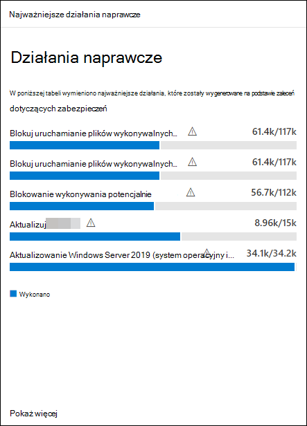

# Rozwiązywanie problemów z lukami w zabezpieczeniach Zarządzanie zagrożeniami i lukami

[!INCLUDE [Microsoft 365 Defender rebranding](../../includes/microsoft-defender.md)]

**Dotyczy:**
- [Microsoft Defender for Endpoint Plan 2](https://go.microsoft.com/fwlink/?linkid=2154037)
- [Zagrożenia i zarządzanie lukami w zabezpieczeniach](next-gen-threat-and-vuln-mgt.md)
- [Microsoft 365 Defender](https://go.microsoft.com/fwlink/?linkid=2118804)

> Chcesz mieć dostęp do programu Microsoft Defender dla punktu końcowego? [Zarejestruj się, aby korzystać z bezpłatnej wersji próbnej.](https://signup.microsoft.com/create-account/signup?products=7f379fee-c4f9-4278-b0a1-e4c8c2fcdf7e&ru=https://aka.ms/MDEp2OpenTrial?ocid=docs-wdatp-portaloverview-abovefoldlink)

## Żądanie środków zaradczych

Funkcja Zarządzanie zagrożeniami i lukami w programie Microsoft Defender dla punktu końcowego zasypuje przerwy między zabezpieczeniami a administratorami IT za pośrednictwem przepływu pracy żądania naprawy. Administratorzy zabezpieczeń, na przykład ty, mogą poprosić administratora IT o naprawienie luki w  zabezpieczeniach stron zaleceń dotyczących zabezpieczeń w usłudze Intune.

### Włączanie Microsoft Intune sieciowej

Aby korzystać z tej funkcji, włącz połączenia Microsoft Intune sieci. W portalu Microsoft 365 Defender przejdź **do Ustawienia** \> **Zaawansowane funkcje** \> **ogólne**. Przewiń w dół i poszukaj **Microsoft Intune połączenia.** Przełącznik jest domyślnie wyłączony. Włącz **Microsoft Intune** **połączenia sieciowego**.

**Uwaga**: Jeśli masz włączone połączenie usługi Intune, podczas tworzenia żądania zaradczego jest dostępna opcja utworzenia zadania zabezpieczeń usługi Intune. Ta opcja nie jest wyświetlana, jeśli nie ustawiono połączenia.

Aby [uzyskać szczegółowe informacje, zobacz Rozwiązywanie problemów zidentyfikowanych przez program Microsoft Defender for Endpoint](/intune/atp-manage-vulnerabilities) za pomocą usługi Intune.

### Kroki żądania rozwiązywania problemów

1. Przejdź do menu nawigacji zarządzania zagrożeniami i **lukami** w zabezpieczeniach w portalu Microsoft 365 Defender i wybierz zalecenia dotyczące  Rekomendacje [**zabezpieczeń**](tvm-security-recommendation.md).

2. Wybierz zalecenie zabezpieczeń, dla których chcesz zażądać środków zaradczych, a następnie wybierz pozycję **Opcje rozwiązywania problemów**.

3. Wypełnij formularz z uwzględnieniem informacji dotyczących działań naprawczych, obowiązujących grup urządzeń, priorytetu, daty zakończenia i opcjonalnych notatek.
    1. Jeśli wybierzesz opcję rozwiązywania problemów "wymagana uwaga", wybranie terminu terminu nie będzie dostępne, ponieważ nie ma konkretnych działań.

4. Wybierz **pozycję Prześlij wniosek**. Przesłanie żądania rozwiązania zaradczego powoduje utworzenie w obrębie Zarządzanie zagrożeniami i lukami działania naprawczego, który może być używany do monitorowania postępu rozwiązywania problemów w przypadku tego zalecenia. Nie spowoduje to wyzwolenia działań naprawczych ani nie zastosuje żadnych zmian do urządzeń.

5. Powiadom administratora IT o nowym zrzucie wniosku i poproś go, aby zalogował się do usługi Intune, aby zatwierdził lub odrzucił żądanie i rozpocząć wdrażanie pakietu.

6. Przejdź na stronę [**Działania naprawcze**](tvm-remediation.md) , aby wyświetlić stan żądania naprawy.

Jeśli chcesz sprawdzić, jak bilet pojawia się w usłudze Intune, zobacz Rozwiązywanie problemów zidentyfikowanych przez usługę [Microsoft Defender for Endpoint](/intune/atp-manage-vulnerabilities) za pomocą usługi Intune, aby uzyskać szczegółowe informacje.

> [!NOTE]
> Jeśli Twoje żądanie obejmuje naprawienie ponad 10 000 urządzeń, możemy wysłać do usługi Intune tylko 10 000 urządzeń w celu ich rozwiązania.

Po zidentyfikowaniu braków w organizacji i zamapowanie ich na zalecenia dotyczące [zabezpieczeń z](tvm-security-recommendation.md) akcjami zacznij tworzyć zadania związane z zabezpieczeniami. Zadania można tworzyć na podstawie integracji Microsoft Intune miejsca tworzenia biletów zaradczych.

Obniż poziom ochrony organizacji przed luki w zabezpieczeniach i zwiększ konfigurację zabezpieczeń, reastywując zalecenia dotyczące zabezpieczeń.

## Wyświetlanie działań naprawczych

Gdy przesyłasz żądanie zaradcze ze strony Zalecenia dotyczące zabezpieczeń, jest ono rozpoczynane działanie naprawcze. Utworzono zadanie zabezpieczeń, które można śledzić na stronie działania Zarządzanie zagrożeniami i lukami działania naprawcze, a  w programie Microsoft Intune jest tworzone zgłoszenie do rozwiązania Microsoft Intune.

Jeśli wybrano opcję rozwiązywania problemów "wymagana uwaga", nie będzie paska postępu, stanu biletu ani daty zakończenia, ponieważ nie ma żadnych rzeczywistych działań, które możemy monitorować.

Na stronie Działania naprawcze wybierz działania naprawcze, które chcesz wyświetlić. Możesz wykonać kroki rozwiązywania problemów, śledzić postęp, wyświetlać pokrewne zalecenia, eksportować do pliku CSV lub oznaczać jako ukończone.

:::image type="content" source="../../media/remediation-flyouteolswnew.png" lightbox="../../media/remediation-flyouteolswnew.png" alt-text="Przykład strony Działania naprawcze z wybranym działaniem naprawczym i wysuwaną  aktywnością z opisem, narzędziami do zarządzania usługami IT i urządzeniami oraz działaniami naprawczymi dla urządzeń":::

> [!NOTE]
> Ukończone działania naprawcze mają 180-dniowy okres przechowywania. W celu zapewnienia optymalnej wydajności strony rozwiązywania problemów działania naprawcze zostaną usunięte 6 miesięcy po jej ukończeniu.

### Wykonane według kolumny

Śledź, kto zamknął działania naprawcze, za pomocą kolumny "Wykonane przez" na stronie Działania naprawcze.

- **Adres e-mail**: wiadomość e-mail osoby, która ręcznie ukończyła zadanie
- **Potwierdzenie systemu**: Zadanie zostało wykonane automatycznie (wszystkie urządzenia zostały rozwiązane)
- **Nie dotyczy**: Informacje są niedostępne, ponieważ nie wiemy, jak zostało ukończone to starsze zadanie

:::image type="content" alt-text="Utworzone przez i uzupełnione przez kolumny z dwoma wierszami. Jeden wiersz do ukończenia przez ma przykładową wiadomość e-mail, drugi wiersz to potwierdzenie systemowe." source="images/tvm-completed-by.png":::

### Najważniejsze działania naprawcze na pulpicie nawigacyjnym

Wyświetlanie **najlepszych działań naprawczych na** [pulpicie nawigacyjnym zarządzania zagrożeniami **i lukami w zabezpieczeniach**](tvm-dashboard-insights.md). Wybierz dowolny z wpisów, aby przejść do strony **Działania naprawcze** . Po zakończeniu działania naprawczego przez zespół administratorów IT możesz oznaczyć działania naprawcze.

## Artykuły pokrewne

- [Omówienie zagrożeń i zarządzanie lukami w zabezpieczeniach wiadomości](next-gen-threat-and-vuln-mgt.md)
- [Pulpit nawigacyjny](tvm-dashboard-insights.md)
- [Zalecenia dotyczące zabezpieczeń](tvm-security-recommendation.md)